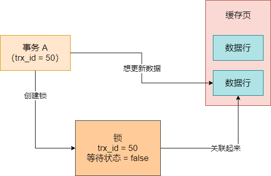
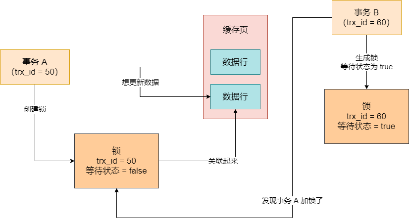
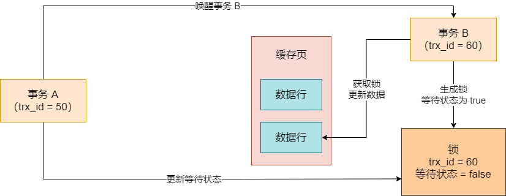

之前说过，脏写是绝对不允许的，那么这个脏写是靠什么防止的呢？其实就是靠**锁机制**，依靠锁机制让多个事务更新一行数据的时候串行化，避免同时更新一行数据。


在 MySQL 里，假设有一行数据摆在那不动，此时有一个事务来了要更新这行数据，这个时候它会先看看这行数据此时有没有人加锁？如果没有，此时这个事务就会创建一个锁，里面包含了自己的 `trx_id` 和等待状态，然后把锁跟这行数据关联在一起。


因为更新一行数据必须把它所在的数据页从磁盘文件里读取到缓存页里来才能更新，所以，此时这行数据和关联的锁数据结构，都是在内存里的。大家要明确这一点，如图：




如上图，因为事务 A 给那行数据加了锁，所以此时就可以说那行数据已经被加锁了。既然被加锁了，此时就不能再让别人访问了。现在有另外一个事务 B 过来，这个事务 B 也想更新那个数据，此时就会检查一下，当前这行数据有没有人加锁


此时事务 B 会发现这行数据已被加锁，此时事务 B 也会生成一个锁数据结构，里面有它的 `trx_id`，还有自己的等待状态。因为它是在排队等待，所以它的等待状态就是 true 了。




接着事务 A 更新完数据，就会把自己的锁给释放掉。锁一旦释放了，它就会去找，此时还有没有别人也对这行数据加锁了呢？它会发现事务 B 也加锁了。于是，它会把事务 B 的锁里的等待状态改为 false，然后唤醒事务 B 继续执行，此时事务 B 就获取到锁了。




## 共享锁和独占锁

多个事务同时更新一行数据，此时都会加锁，然后都会排队等待，必须一个事务执行完毕了，提交了，释放了锁，才能唤醒别的事务继续执行。那么在多个事务运行的时候，它们加的是什么锁呢？


其实是 X 锁，也就是 Exclude 独占锁。当有一个事务加了独占锁之后，此时其它事务要再更新这行数据，都是要加独占锁的，但是只能生成独占锁在后面等待。那么，当有人在更新数据的时候，其它的事务可以读取这行数据吗？默认情况下需要加锁吗？


答案是：不用。默认情况下，有人在更新数据，然后你要去读取这行数据，直接默认就是开启 MVCC 机制的。即，此时对一行数据的读和写两个操作默认是不会加锁互斥的，因为 MySQL 设计 MVCC 机制就是为了解决这个问题，避免频繁加锁互斥


此时你读取数据，可以根据你的 ReadView，在 undo log 版本链条里找一个你能读取的版本，完全不用顾虑别人在更新。而且就算你等它更新完了还提交了，基于 MVCC 机制你也读不到它更新的值，因为 ReadView 机制是不允许的，所以你默认情况下的读，完全不需要加锁，不需要去 care 其他事务的更新加锁问题，直接基于 MVCC 机制读某个快照就可以了


如果你在执行查询操作的时候，就是想要加锁呢？那也是可以的，MySQL 首先支持一种共享锁，就是 S 锁。这个共享锁的语法如下：`SELECT * FROM table LOCK IN SHARE MODE`，你在一个查询语句后面加上 `LOCK IN SHARE MODE`，意思就是查询的时候对一行数据加共享锁


如果此时有别的事务在更新这行数据，已经加了独占锁，此时你的共享锁能加吗？当然不行了，共享锁和独占锁是互斥的，此时你这个查询只能等着了


如果你先加了共享锁，然后别人来更新要加独占锁行吗？这也不行，此时锁是互斥的，它只能等待


如果你在加共享锁的时候，别人也加共享锁呢？此时也是可以的，你们两都是可以加共享锁的，共享锁和共享锁是不会互斥的


所以这里可以先看出一个规律，就是更新数据的时候必要要加独占锁，独占锁和独占锁是互斥的，此时别人不能更新；但是此时你要查询，默认是不加锁的，走 MVCC 机制读快照版本，但是你查询时可以手动加共享锁的，共享锁和独占锁是互斥的，但是共享锁和共享锁是不互斥的。


| 锁类型 | 独占锁 | 共享锁 |
| ------ | ------ | ------ |
| 独占锁 | 互斥   | 互斥   |
| 共享锁 | 互斥   | 不互斥 |


不过，一般开发业务系统的时候，其实你查询主动加共享锁的情况是比较少见的。数据库的行锁是实用功能，但是一般不会在数据库层面做复杂的手动加锁操作，反而会用基于 Redis / ZooKeeper 的分布式锁来控制业务系统的锁逻辑


另外，查询操作还能加互斥锁，它的方法时：`SELECT * FROM table FOR UPDATE`。这个意思是，我查出来数据以后还要更新，此时我加独占锁，其它闲杂人等，都不要更新这个数据了。一旦你查询的时候加了独占锁，此时在你事务提交之前，任何人都不能更新数据了，只能你在本事务里更新数据，等你提交了，别人再更新数据


## 表锁

上面已经讲解了数据库里的行锁的概念。在多个事务并发更新数据的时候，都是要在行级别加独占锁的，这就是行锁。独占锁都是互斥的，所以不可能发生脏写问题，一个事务提交了才会释放掉自己的独占锁，唤醒下一个事务执行。


如果你此时去读取别的事务在更新的数据，有两种可能：

- 第一种可能是基于 MVCC 机制进行事务隔离，读取快照版本，这是比较常见的


- 第二种可能是查询的同时基于特殊语法去加独占锁或者共享锁


如果你查询的时候加独占锁，那么跟其他更新数据的事务加的独占锁都是互斥的；如果你查询的时候加共享锁，那么跟其它查询加的共享锁是不互斥的。


当然，一般不是太建议在数据库粒度去通过行锁实现复杂的业务锁机制，而更加建议通过 Redis、ZooKeeper 来用分布式锁实现复杂业务下的锁机制。因为如果你把分布式业务里的复杂业务的一些锁机制依托数据查询的时候，在 SQL 语句里加共享锁或者独占锁，会导致这个加锁逻辑隐藏在 SQL 语句里，在你的 Java 业务系统层面其实是非常不好维护的。


比较正常的情况下，其实还是多个事务并发运行更新一条数据，默认加独占锁，同时其它事务读取基于 MVCC 机制进行快照版本读，实现事务隔离。


接着我们讲一个新的概念，就是表级锁。


在数据库里，你不光可以通过查询中的特殊语法加行锁，例如 `lock in share mode`、`for update` 等等，还可以通过一些方法在表级别去加锁


有人可能会以为当你执行增删改的时候默认加行锁，然后执行 DDL 语句的时候，比如 `alter table` 之类的语句，会默认在表级别加表锁。这么说也不太正确，但是也有一定的道理，因为确实你执行 DDL 的时候，会阻塞所有增删改操作，执行增删改的时候，会阻塞 DDL 操作。


但这是通过 MySQL 通用的元数据锁实现的，也就是 `Metadata Locks`，但这还不是表锁的概念，因为表锁其实是 InnoDB 存储引擎的概念，InnoDB 存储引擎提供了自己的表级锁，跟这里 DDL 语句用的元数据锁还不是一个概念


只不过 DDL 语句和增删改操作，确实是互斥的，大家要知道这一点


## 表锁和行锁互相之间的关系

那么 MySQL 里是如何加表锁的？这个 MySQL 的表锁，其实是一个极为鸡肋的东西，几乎很少会用到。表锁分为两种，一种就是表锁，一种就是表级的意向锁。


首先说表锁，这个表锁，可以用如下语法来加：

```
LOCK TABLES xxx READ	// 这是加表级共享锁
LOCK TABLES xxx WRITE	// 这是加表级独占锁
```


其实，几乎没人会用着两个语法去加表锁，这不是纯属没事找事么，所以才说表锁特别的鸡肋。


还有就是有另外两个情况会加表级锁。如果有事务在表里执行增删改操作，那在行级会加独占锁，此时其实同时会在表级加一个意向独占锁；如果有事务在表里执行查询操作，那么会在表级加一个意向共享锁


其实平时我们操作数据库，比较常见的两种表锁，反而是更新和查询操作假的意向独占锁和意向共享锁，但是这个意向独占锁和意向共享锁，大家暂时可以当它是透明的，因为两种意向锁根本不会互斥


为啥呢？假设有一个事务要在表里更新 id = 10 的一行数据，在表上加了一个意向独占锁，此时另一个事务要在表里更新 id = 20 的一行数据，也会在表上加一个意向独占锁，你觉得这两把锁应该互斥吗？明显不应该，因为它俩更新的都是表里不同的数据，你让它俩在表上加的意向独占锁互斥干什么呢？所以意向锁之间是不会互斥的


同理，假设一个事务要更新表里的数据，在表级加了一个意向独占锁，另外一个事务要在表里读取数据，在表级加了一个意向共享锁，此时表级的意向独占锁和意向共享锁应该互斥吗？当然也不应该，一个要更新数据，一个要读取数据，两人在表上加的意向锁，为什么要互斥？


所以，这个所谓的表级的意向独占锁和意向共享锁，有点多此一举了。


但是！！！手动加表级共享锁和独占锁，以及更新和查询的时候自动在表级加的意向共享锁和意向独占锁，它们之间反而是有一定的互斥关系，关系如下所示：


| 锁类型     | 独占锁 | 意向独占锁 | 共享锁 | 意向共享锁 |
| ---------- | ------ | ---------- | ------ | ---------- |
| 独占锁     | 互斥   | 互斥       | 互斥   | 互斥       |
| 意向独占锁 | 互斥   | 不互斥     | 互斥   | 不互斥     |
| 共享锁     | 互斥   | 互斥       | 不互斥 | 不互斥     |
| 意向共享锁 | 互斥   | 不互斥     | 不互斥 | 不互斥     |


仔细看上面的表，上面说的是在表上面手动加的独占锁和共享锁，以及更新数据和查询数据默认自动加的意向独占锁和意向共享锁，它们互相之间的互斥关系，一看就明白


其实更新数据自动加的表级意向独占锁，会跟你用 `LOCK TABLES xxx WRITE` 手动加的表级独占锁是互斥的，所以，假设你手动加了表级独占锁，此时任何人都不能执行更新操作了


或者你用 `LOCK TABLES xxx READ` 手动加了表级共享锁，此时任何人也不能执行更新操作了，因为更新就要加意向独占锁，此时跟你手动加的表级共享锁，是互斥的


但是说实话，这也就是跟你讲明白这个表级锁如何加的，如何互斥的，但就一般而言，根本不会手动加表级锁，所以一般来说读写操作自动加的表级意向锁，互相之间绝对不会互斥


一般来说，但是对同一行数据的更新操作的行级独占锁是互斥的，跟读操作都是不互斥的，读操作默认都是走 MVCC 机制读快照版本的

