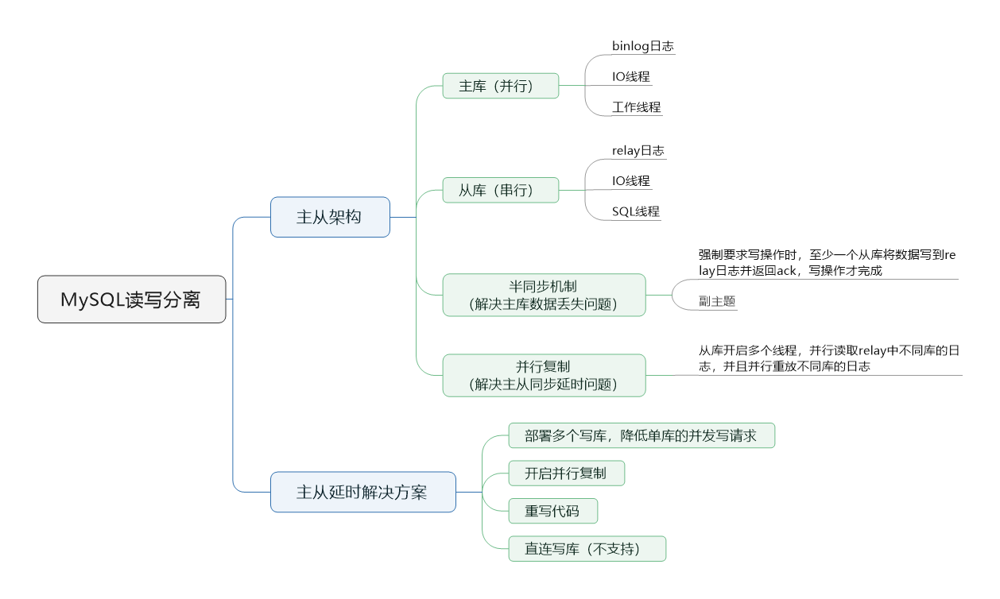
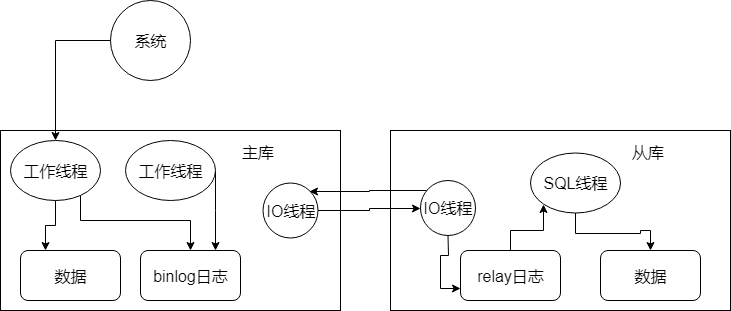

> 本节思维导图

​		当并发量到达一定程度后，一般都是要做读写分离的。因为大部分情况下都是读多写少。所以针对这个情况，都是写一个主库，但是主库挂多个从库，然后从多个从库读数据，就可以支撑更高的读并发压力了。

## 如何实现MySQL的读写分离

​		基于主从架构。简单来说就是搞一个主库，挂多个从库，然后我们就单单只是写主库，然后主库会自动把数据给同步到从库上去。

## MySQL主从复制的原理

​		主库将变更写入binlog日志，然后从库连接到主库之后，从库会有一个IO线程，将主库的binlog日志拷贝到自己本地，写入一个relay中继日志。接着从库中有一个SQL线程会从中继日志读取binlog，然后执行binlog日志中的内容，也就是在自己本地在执行一遍SQL，这样就可以保证自己跟主库的数据是一样的。

​		这里需要特别注意的是，从库同步主库数据的过程是串行化的，即主库上并行的操作，在从库会串行执行。所以这是一个非常重要的点，由于从库从主库拷贝日志以及串行执行SQL的特点，在高并发场景下，从库的数据一定会比主库慢一些，是**有延时**的。所以经常出现，刚写入主库的数据可能是读取不到的，要过几十毫秒，甚至于几百毫秒才能读到。

​		而且如果主库突然宕机，然后恰好数据还没同步到从库，那么有些数据可能在从库上时没有的，有些数据就可能丢失了。

​		所以MySQL实际上这一块有两个机制，一个是**半同步复制**，用来解决主库数据丢失问题；一个是**并行复制**，用来解决主从同步延时问题。

​		**半同步复制**，也叫`semi-sync`复制，指的就是主库写入binlog日志之后，就会**强制**此时立即将数据同步到从库，从库将日志写入本地的relay log之后，接着会返回一个ack给主库，主库接到至少一个从库的ack之后才会认为写操作完成。

​		**并行复制**，指的是从库开启多个线程，并行读取relay log中不同库的日志，然后**并行重放不同库的日志**，这是库级别的并行。

## MySQL主从同步延时问题

​		假设这么一个场景，一段代码逻辑是这样的：先插入一条数据，再把他查出来，然后更新这条数据。在生产高峰期，写并发达到2000/s，这个时候主从复制的延时大概是在小几十毫秒。线上会发现，每天总有一些数据，我们期望更新的一些重要数据的状态，在高峰期时却没有更新。

​		可以通过MySQL命令`show status`查看`Second_Behind_Master`，可以看到从库复制主库的数据落到了多少ms。

​		一般来说，如果主从延迟比较严重，有以下解决方案：

- 分库，将一个主库拆分为多个从库，每个主库的写并发就减少了几倍，此时主从延时可以忽略不计
- 打开MySQL支持的并行复制，多个库并行复制。但如果某个库的写入并发特别高，单库写并发达到了2000/s，并行复制还是没有意义
- 重写代码。写代码是要考虑插入数据时立马查询数据有可能查询不到
- 如果确实是存在必须先插入，立马要求立刻查询到，然后再执行一些操作，**对这个查询设置直连主库**，**不推荐**这种方法。这么处理，读写分离的意义就丧失了。