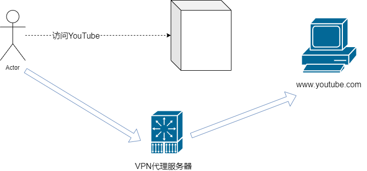
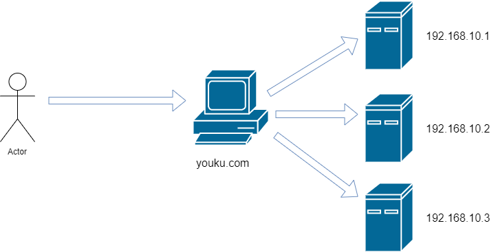
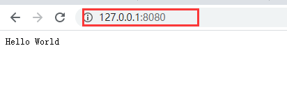

## Nginx 简介

​		Nginx是一个免费、开源、高性能、轻量级的HTTP和反向代理服务器，也是一个电子邮件（IMAP/POP3）代理服务器，其特点是占有内存少，并发能力强。

​		Nginx由内核和一系列模块组成，内核提供Web服务的基本功能，如启用网络协议，创建运行环境，接收和分配客户端请求，处理模块之间的交互。

​		Nginx的各种功能和操作都由模块来实现。Nginx的模块从结构上分为：

- **核心模块**：HTTP模块、EVENT模块和MAIL模块。

- **基础模块**：HTTP Access模块、HTTP FastCGI模块、HTTP Proxy模块和HTTP Rewrite模块。

- **第三方模块**：HTTP Upstream Request Hash模块、Notice模块和HTTP Access Key模块及用户自己开发的模块。

​		这样的设计使Nginx方便开发和扩展，也因此才使得Nginx功能如此强大。Nginx的模块默认编译进Nginx中，如果需要增加或删除模块，需要重新编译Nginx，这一点不如Apache的动态加载模块方便。如果有需要动态加载模块，可以使用由淘宝网发起的Web服务器Tengine，在Nginx的基础上增加了很多高特定，完全兼容Nginx，已被国内很多网站采用。Nginx有很多扩展版本：

- 开源版nginx.org


- 商业版NGINX Plus


- 淘宝网发起的Web服务器Tengine


- 基于Nginx和Lua的Web平台OpenResty


## Nginx 作为 Web 服务器

​		Web服务器也称为WWW（World Wide Web）服务器，主要功能是提供网上信息浏览服务，**常常以B/S（Browser/Server）方式提供服务**：

- 应用层使用HTTP协议


- HTML文档格式


- 浏览器统一资源定位器（URL）


​		Nginx可以作为静态页面的Web服务器，同时还支持CGI协议的动态语言，比如Perl、PHP等，但是不支持Java。Java程序一般都是通过与Tomcat配合完成，让我们看看Nginx和Tomcat的区别。

​		Nginx、Apache和Tomcat：

- **Nginx**：由俄罗斯程序员lgor Sysoev所开发的轻量级，高并发HTTP服务器。

- **Apache HTTP Server Project**：一个Apache基金会下的HTTP服务项目，和Nginx功能类似。

- **Apache Tomcat**：是Apache基金会下的另外一个项目，是一个Application Server。更准确地说是一个Servlet应用容器，与Apache HTTP Server和Nginx相比，Tomcat能够动态生成资源并且返回到客户端。

​		Apache HTTP Server和Nginx本身不支持生成动态页面，但它们可以通过其他模块来支持（例如通过Shell、PHP、Python脚本程序来动态生成内容）。

​		一个HTTP Server关心的是HTTP协议层面的传输和访问控制，所以在Apache/Nginx上你可以看到代理、负载均衡等功能。客户端通过HTTP Server访问服务器上存储的资源（HTML文件、图片文件等待）。通过CGI技术，也可以将处理过的内容通过HTTP Server分发，但是一个HTTP Server始终只是把服务器上的文件如实地通过HTTP协议传输给客户端。

​		而应用服务器，则是一个应用执行的容器。它首先需要支持开发语言的运行（对于Tomcat来说，就是Java），保证应用能够在应用服务器上正常运行。其次，需要支持应用相关的规范，例如类库、安全方面的特性。对于Tomcat来说，就是需要提供JSP/Servlet运行需要的标准库。Interface等。

​		为了方便，应用服务器往往也会集成HTTP Server的功能，但是不如专业的HTTP Server那么强大。所以应用服务器往往是运行在HTTP Server的背后，执行应用，将动态的内容转化为静态的内容之后，通过HTTP Server分发到客户端。

## 正向代理

正向代理：如果把局域网外的Internet想象成一个巨大的资源库，则局域网中的客户端要访问Internet，则需要通过代理服务器来访问，这种代理服务就称为正向代理。


正向代理“代理”的是客户端。例如你想去YouTube看个动作片，可国内不允许啊，就需要找翻墙代理，这个就是所谓的“正向代理”。



## 反向代理与负载均衡

反向代理与正向代理相反，反向代理是指以代理服务器来接收Internet上的连接请求，然后将请求转发到内部网络上的服务器，并将服务器上得到的结果返回给客户端。此时代理服务器对外表现就是一个服务器，客户端对代理是无感知的。反向代理“代理”的是服务端。


再比如，你想在“优酷”上看个综艺，youku.com 会把你的请求分发到存放视频的那台机器上，这就是所谓的“反向代理”。



为什么使用反向代理，原因如下：

- 保护和隐藏原始资源服务器

- 加密和SSL加速

- 通过缓存静态资源，加速Web请求

- 实现负载均衡

**地址重定向**：Nginx的Rewrite主要的功能就是实现URL重写，比如输入360.com跳转到360.cn。

## 动静分离

为了加快网站的解析速度，可以把动态页面和静态页面由不同的服务器来解析，加快解析速度，降低原来单个服务器额的压力。


这里指的就是让动态程序（Java、PHP）去访问应用服务器，让缓存、图片、JS、CSS等去访问Nginx。

## Nginx 安装

​		1、下载nginx

```shell
wget http://nginx.org/download/nginx-1.16.1.tar.gz 
```

2、安装需要编译的插件

- 用于编译C、C++代码的GCC


- 用C语言编写的正则表达式函数库Pcre（使用Rewrite模块）


- 用于数据压缩的函数库Zlib


- 安全套接字层密码库OpenSSL（启用SSL支持）


```shell
yum install gcc c++                                          
yum install -y pcre pcre-devel                          
yum install -y zlib zlib-devel                           
yum install -y openssl openssl-devel  
```

3、解压、配置（nginx支持各种配置选项）。编译、安装Nginx

```shell
tar -zxvf nginx-1.15.tar.gz cd nginx-1.16.1
cd nginx-1.16.1
./configure
make && sudo make install
```

4、启动、重启、关闭

```shell
cd /usr/local/nginx/ 
cd sbin
./nginx
#关闭命令 
./nginx -s stop
#重启，热部署
./nginx -s reload
#修改配置文件后也别嘚瑟，反正我会动不动就写错，检查修改的nginx.conf配置是否正确
./nginx -t
```

5、验证（浏览器输入IP）


## 配置文件

nginx.conf配置文件主要分为三部分：

- **全局块**

- **Events 块**

- **HTTPS 块**

​		Nginx配置语法：

- 配置文件由指令和指令块构成

- 每条指令以分号（;）结尾，指令和参数间以空格符分隔

- 指令块以大括号{}将多条指令组织在一起

- include 语句允许组合多个配置文件以提高可维护性

- 使用#添加注释

- 使用$定义变量

- 部分指令的参数支持正则表达式

## 全局块

全局配置部分用来配置对整个Server都有效的参数。主要会设置一些影响 Nginx 的服务器整体运行的配置指令，包括配置运行Nginx服务器的用户（组）、允许生成的 Work Process 数，进程 PID 存放路径、日志存放路径和类型以及配置文件的引入等。示例如下：

```nginx
user nobody;
worker_processes 4;
error_log /data/nginx/logs/error.log notice;
```

## Events 块

Events块涉及的指令主要影响Nginx服务器与用户的网络连接，常用的设置包括是否开启对多 Work Process 下的网络连接进行序列化，是否允许同时接收多个网络连接，选取哪种事件驱动模型来处理连接请求，每个 Work Process 可以同时支持的最大连接数等。

```nginx
events {
	#每个 work process 支持的最大连接数为 1024
	work_connections 1024;
}
```

## HTTP 块

这算是Nginx服务器配置中最频繁的部分。代理、缓存和日志定义等绝大多数功能和第三方模块的配置都在这里。需要注意的是：HTTP 块也可以包括 HTTP 全局快、Server 块。

### HTTP 全局块

HTTP 全局块配置的指令包括文件引入、MIME-TYPE 定义、日志自定义、连接超时时间、单链接请求上限等。

```nginx
http {
	include mime.types;
	default_type application/octet-stream
	sendfile on;
	keepalive_timeout 65;
}
```

### Server 块

这块和虚拟主机有密切关系，虚拟主机从用户角度看，和一台独立的硬件主机是完全一样的，该技术的产生是为了节省互联网服务器硬件成本。


每个 HTTP 块可以包括多个 Server 块，而每个 Server 块就相当于一个虚拟主机。而每个 Server 块也分为全局 Server 块，以及可以同时包含多个 Location 块。


**全局 Server 块**：也被叫做“ 虚拟服务器 ”部分，它描述的是一组根据不同 server_name 指令逻辑分割的资源，这些虚拟服务器响应 HTTP 请求，因此都包含在 HTTP 部分。最常见的配置是本虚拟机主机的监听配置和本虚拟主机的名称或 IP 配置。

```nginx
server {
	listen 80;
	#server_name 也支持通配符，*.example.com、www.example.*、.example.com
	server_name localhost;
}
```

**Location 块**：一个 Server 块可以配置多个 Location 块。


这块的主要作用是基于 Nginx 服务器接收到的请求字符串（例如 server_name/uri-string），对虚拟主机名称（也可以是IP别名）之外的字符串（例如前面的 /uri-string）进行匹配，对特定的请求进行处理。地址定向、数据缓存和应答控制等功能，还有许多第三方模块的配置也在这里进行。


**Location 指令说明**：该指令用于匹配 URL。语法如下：location [ = | ~ | ~* | ^~ ] uri {}

- **=**：该修饰符使用精确匹配并且终止搜索。

- **~**：该修饰符使用区分大小写的正则表达式匹配。

- **~***：该修饰符使用不区分大小写的正则表达式匹配。

- **^~**：用于不含正则表达式的 URI 前，要求 Nginx 服务器找到表示 URI 和请求字符串匹配度最高的 Location 后，立即使用此 Location 处理请求，而不再使用 Location 块中的正则 URI 和请求字符串做匹配。


注意，如果 URI 包含正则表达式，则必须要有 ~ 或者 ~* 标识。


当一个请求进入时，URI 将会被检测匹配一个最佳的 Location：

- 没有正则表达式的 Location 被作为最佳的匹配，独立于含有正则表达式的 Location 顺序。

- 在配置文件中按照查找顺序进行正则表达式匹配。在查找到第一个正则表达式匹配之后结束查找。由这个最佳的 Location 提供请求处理。

```nginx
location / {
	root html;
	index index.html index.htm;
}
```


nginx.conf 详细配置如下：

```nginx
#定义Nginx运行的用户和用户组
uesr www www;

#nginx进程数，通常设置成和cpu的数量相等
work_processes 4;

#全局错误日志定义类型，[debug | info | notice | warn | error | crit]
#error_log /data/nginx/logs/error.log;
#error_log /data/nginx/logs/error.log notice;

#日志文件存放路径 access_log path [format [buffer=size | off]]
access_log /data/nginx/logs/lazyegg.com/web/access/log combinedio;

#进程pid文件
#pid logs/nginx.pid;

#指定进程可以打开的最大描述符：数目
#工作模式与连接上限
#这个指令是指当一个nginx进程打开的最多文件描述符数目，理论值应该是最多打开文件数（ulimit - n）
#与nginx进程数相除，但是nginx分配请求并不是那么均匀，所以最好与ulimit - n的值保持一致。这是因
#为nginx调度时分配请求到进程并不是那么的均衡，所以假如填写10240，总并发量达到3-4万时就有进程可
#能超过10240了，这时会返回502错误
worker_rlimit_nofile 65535;

#################################  events  ###############################
events {
	#参考事件模型，use [ kqueue | rtsig | epoll | /dev/poll | select | poll]; epoll模型
	use epoll
	
	#单个进程最大连接数（最大连接数 = 连接数 + 进程数）
	worker_connections 1024;
	
	#keepalive 超时时间
	keepalive_timeout 60;
	
	#客户端请求头部的缓冲区大小
	client_header_buffer_size 4k;
	
	#这个将为打开文件指定缓存，默认是没有启用的，max指定缓存数量，建议和打开文件数一致，
	#inactive是指经过多少时间文件没被请求后删除缓存
	open_file_cache max=65535 inactive=60s;
	
	#这个指多长时间检查一次缓存的有效信息
	open_file_cache_valid 80s;
	
	#open_file_cache指令中的inactive参数时间内文件的最少使用次数，如果超过这个数字，文件描述
	#符一直是在缓存中打开的。如上例，如果有一个文件在inactive时间内一次没被使用，它将被移除
	open_file_cache_min_uses 1;
	
	#语法：open_file_chche_errors on | off 默认值：open_file_cache_errors off 使用
	#字段：http，server，location 这个指令指定是否在搜索一个文件是否记录cache错误
	open_file_cache_errors on;
}
##############################   http    ##################################
#设定http服务器，利用它的反向代理功能提供负载均衡支持
http {
	#文件扩展名与文件类型映射表
	include mime.types;
	
	#默认文件类型
	default_type application/octet-stream;
	
	#默认编码
	charset utf-8;
	
	#服务器名字的hash表大小
	server_names_hash_bucket_size 128;
	
	#客户端请求头部的缓冲区大小
	client_header_buffer_size 32k;
	
	#客户请求头缓冲大小
	large_client_header_buffers 4 64k;
	
	#允许客户端请求的最大单个文件字节数
	client_max_body_size 8m;
	
	#开启高效文件传输模式，sendfile指令指定nginx是否调用sendfile函数来输出文件，对于普通应用
	#应该设置为on，如果用来进行下载等应用磁盘IO重负载应用，可设置为off，以平衡磁盘与网络I/O处理
	#速度，降低系统的负载。注意：如果图片显示不正常把这个改成off
	sendfile on;
	
	#开启目录列表访问，适合下载服务器，默认关闭
	autoindex on;
	
	#此选项允许或禁止使用socket的TCP_CORK的选项，此选项仅在使用sendfile的时候使用
	tcp_nopush on;
	
	tcp_nodelay on;
	
	#长连接超时时间，单位是秒
	keepalive_timeout 120;
	
	#FastCGI相关参数是为了改善网站的性能：减少资源占用，提高访问速度。下面参数看字面意思都能理解
	fastcgi_connect_timeout 300;
	fastcgi_send_timeout 300;
	fastcgi_read_timeout 300;
	fastcgi_buffer_size 64k;
	fastcgi_buffers 4 64k;
	fastcgi_busy_buffers_size 128k;
	fastcgi_temp_file_write_size 128k;
	
	#gzip模块设置
	gzip on; #开启gzip压缩输出
	gzip_min_length 1k; #最小压缩文件大小
	gzip_buffers 4 16k; #压缩缓冲区
	gzip_http_version 1.0; #压缩版本（默认1.1，前端如果是squid2.5请使用1.0）
	gzip_comp_level 2;
	#压缩类型，默认就已经包含了textml，所以下面就不用再写了，写了也不会有问题，但是会有一个warn
	gzip_types text/plain application/x-javascript text/css application/xml;
	gzip_vary on;
	
	#开启限制IP连接数的时候需要使用
	#limit_zone crawler $binary_remote_addr 10m;
	
	#负载均衡配置
	upstream lazyegg.net {
		#upstream的负载均衡，weight是权重，可以根据机器配置定义权重。weight参数表示权值，权
		#值越高被分配的几率越大
		server 192.168.80.121:80 weigth=3;
		server 192.168.80.122:80 weigth=2;
		server 192.168.80.123:80 weigth=3;
		
		#nginx的upstream目前支持4种方式的分配
		#1、轮询（默认）
		#每个请求按照时间顺序逐一分配到不同的后端服务器，如果后端服务器down掉，能自动剔除。
		#2、weight
		#指定轮询几率，weight和访问比率成正比，用于后端服务器性能不均的情况
		#例如：
        #upstream bakend {
        #    server 192.168.0.14 weight=10;
        #    server 192.168.0.15 weight=10;
        #}
        #3、ip_hash
        #每个请求按访问ip的hash结果分配，这样每个访客固定访问一个后端服务器，可以解决session问题
         #例如：
        #upstream bakend {
        #    ip_hash;
        #    server 192.168.0.14:88;
        #    server 192.168.0.15:80;
        #}
        #4、fair（第三方）
        #按后端服务器的相应时间来分配请求，相应时间短的优先分配
        #upstream backend {
        #	server server1;
        #	server server2;
        #	fair;
        #}
        #5、uil_hash（第三方）
        #按访问URL的hash结果来分配请求，使每个url定向到同一个后端服务器，后端服务器为缓存时比较有效
        #例：在upstream中加入hash语句，server语句中不能写入weight等其他参数，hash_method
        #是使用的hash算法
         #upstream backend {
        #    server squid1:3128;
        #    server squid2:3128;
        #    hash $request_uri;
        #    hash_method crc32;
        #}
        
        #tips:
        #upstream bakend{#定义负载均衡设备的Ip及设备状态}{
        #    ip_hash;
        #    server 127.0.0.1:9090 down;
        #    server 127.0.0.1:8080 weight=2;
        #    server 127.0.0.1:6060;
        #    server 127.0.0.1:7070 backup;
        #}
        #在需要使用负载均衡的server中增加 proxy_pass http://bakend/;
        
        #每个设备的状态设置为：
        #1、down表示单前的server暂时不参与负载
        #2、weight为weight越大，负载的权重就越大
        #3、max_fails：允许请求失败的次数，默认为1。当超过最大次数时，返回proxy_next_upstream模块定义的错误
        #4、fail_timeout：max_fails次失败后，暂停的时间。
        #5、backup：其它所有的非backup机器down或者忙的时候，请求backup机器。所以这台机器压力最轻
        
        #nginx支持同时设置多组的负载均衡，用来给不同的server使用
        #client_body_in_file_only 设置为 on，可以将client post过来的数据记录到文件中用来做debug
        #client_body_temp_path 设置记录文件的目录，可以设置最多3层目录
        #location对URL进行匹配，可以进行重定向或者进行新的代理，负载均衡
	}
	
	#虚拟主机的配置
	server {
		#监听端口
		listen 80;
		
		#域名可以有多个，用空格隔开
		server_name lazyegg.net;
		
		#默认入口文件名称
		index index.html index.htm index.php;
		root /data/www/lazyegg;
		
		#对******进行复制均衡
		location ~ .*.(php|php5)?$
		{
			fastcgi_pass 127.0.0.1:9000;
			fastcgi_index index.php;
			include fastcgi.conf;
		}
		
		#图片缓存时间设置
		location ~ .*.(gif|jpg|jpeg|png|bmp|swf)$
		{
			expires 10d;
		}
		
		#JS和CSS缓存时间设置
		location ~ .*.(js|css)?$
		{
			expires 1h;
		}
		
		#日志格式设定
		#$remote_addr与$http_x_forwarded_for用以记录客户端的ip地址
		#$remote_user：用来记录客户端用户名称
		#$time_local：用来记录访问时间与时区
		#$request：用来记录请求的url与http协议
		#$status：用来记录请求状态，成功是200
		#$body_bytes_sent：记录发送给客户端文件主体内容大小
		#$http_referer：用来记录从哪个页面链接访问过来的
		#$http_user_agent：记录客户浏览器的相关信息
		#通常web服务器放在反向代理的后面，这样就不能获取到客户的IP地址了，通过$remote_addr拿
		#到的IP地址是反向代理服务器的ip地址。范子昂代理服务器在转发请求的http头信息中，可以增加
		#x_forwarded_for信息，用以记录原有客户端的IP地址和原来客户端的请求的服务器地址
		log_format access '$remote_addr - $remote_user [$time_local] "$request" '
        '$status $body_bytes_sent "$http_referer" '
        '"$http_user_agent" $http_x_forwarded_for';
        
        #定义本虚拟主机的访问日志
        access_log /usr/local/nginx/logs/host.access.log main;
        access_log /usr/local/nginx/logs/host.access.404.log log404;
        
        #对 "/connect-controller"启用反向代理
        location /connect_controller {
        	proxy_pass http://127.0.0.1:88 #此处端口号不能与虚拟主机监听的端口号一样
        	proxy_redirect off;
        	proxy_set_header X_Real_IP $remote_addr;
        	
        	#后端的Web服务器可以通过X-Forwarded-For获取用户真实IP
        	proxy_set_header X-Forwarded-For $proxy_add_x_forwarded-for;
        	
        	#以下是一些反向代理的配置，可选
        	proxy_set_header Host $host;
        	
        	#允许客户端请求的最大单文件字节数
        	client_max_body_size 10m;
        	
        	#缓冲区代理缓冲用户端请求的最大字节数
        	#如果把它设置为比较大的数值，例如256k，那么，无论使用Firefox还是IE浏览器，来提交
        	#任意小于256k的图片，都很正常。如果注释该指令，使用默认的client_body_buffer_size
        	#设置，也就是操作系统页面大小的两倍，8k或者16k，问题就出现了
        	#无论使用Firefox4.0还是IE8.0，提交一个比较大，200k左右的图片，都返回500 Internal Server Error错误
        	client_body_buffer_size 128k;
        	
        	#表示使nginx阻止HTTP应答代码为400或者更高的应答
        	proxy_intercept_errors on;
        	
        	#后端服务器连接的超时时间_发起握手等候相应超时时间
        	#nginx跟后端服务器连接超时时间（代理连接超时）
        	proxy_connect_timeout 90;
        	
        	#后端服务器数据回传时间（代理发送超时）
        	#后端服务器数据回传时间，就是在规定时间之内后端服务器必须传完所有的数据
        	proxy_send_timeout 90;
        	
        	#连接成功后，后端服务器响应时间（代理接收超时）
        	#连接成功后，等待后端服务器相应时间，其实已经进入后端的排队之中等候处理（也可以说是后端服务器处理请求的时间）
        	proxy_read_timeout 90;
        	
        	#proxy_buffer缓冲区，网页平均在32k一下的设置
        	#设置用于读取应答（来自被代理服务器）的缓冲区数目和大小，默认情况也认为页大小，根据操作系统的不同可能是4K或者是8K
        	proxy_buffers 4 32k;
        	
        	#高负荷下缓冲大小（proxy_buffers*2）
        	proxy_busy_buffers_size 64k;
        	
        	#设置在写入proxy_temp_path时数据的大小，预防一个工作进程在传递文件是阻塞太长
        	#设定缓存文件夹大小，大于这个值，将从upstream服务器传
        	proxy_temp_file_write_size 64k;    	      	
        }
        
        #本地动静分离反向代理配置
        #所有jsp页面均交由Tomcat或resin处理
        location ~ .(jsp|jspx|do)?$ {
        	proxy_set_header Host $host;
        	proxy_set_header X_Real_IP $remote_addr;
        	proxy_set_header X-Forwarded_For $proxy_add_x_forwarded_for;
        	proxy_pass http://127.0.0.1:8080;
        }
	}	
}
```

## Nginx 配置实例

### 反向代理 Demo 1

实现效果：使用 nginx 反向代理，访问 `www.12345.com` 直接跳转到自己的机器 127.0.0.1:8080。


1、创建一个SpringBoot项目，写一个简单的Controller。

```java
@RestController
public class TestController {

    @RequestMapping(method = {RequestMethod.POST, RequestMethod.GET})
    public String helloWorld() {
        return "Hello World";
    }
}
```

启动项目后，在浏览器访问 `127.0.0.1:8080`，出现如下界面：



2、通过修改本地Host文件（ C:\Windows\System32\drivers\etc ），添加 127.0.0.1 www.12345.com 将 `www.12345.com` 映射到自己的机器IP上。


3、配置完成之后，我们便可以通过 www.12345.com:8080 访问到第一步出现的界面。


那么如何主需要输入 `www.12345.com` 便可以跳转到初始界面呢？这是就可以用到 nginx 的反向代理


4、修改 nginx.conf 配置文件，增加如下配置 proxy_pass:

```nginx
server {
        listen       80;
        server_name  localhost;
        #charset koi8-r;
        #access_log  logs/host.access.log  main;
        location / {
               proxy_pass http://127.0.0.1:8080;
        }
```

5、如上配置，我们监听 80 端口，访问域名为 www.12345.com，不加端口号时默认为 80 端口，故访问该域名时会跳转到 127.0.0.1:8080 路径上。


在浏览器输入 www.12345.com 结果如下：


### 反向代理 Demo 2

实现效果：使用 Nginx 反向代理，根据访问的路径跳转到不同端口的服务中：


