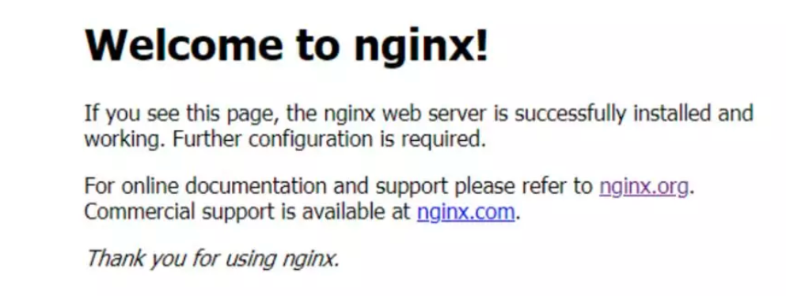

## Nginx简介

​		Nginx是一个免费、开源、高性能、轻量级的HTTP和反向代理服务器，也是一个电子邮件（IMAP/POP3）代理服务器，其特点是占有内存少，并发能力强。

​		Nginx由内核和一系列模块组成，内核提供Web服务的基本功能，如启用网络协议，创建运行环境，接收和分配客户端请求，处理模块之间的交互。

​		Nginx的各种功能和操作都由模块来实现。Nginx的模块从结构上分为：

- **核心模块**：HTTP模块、EVENT模块和MAIL模块。

- **基础模块**：HTTP Access模块、HTTP FastCGI模块、HTTP Proxy模块和HTTP Rewrite模块。

- **第三方模块**：HTTP Upstream Request Hash模块、Notice模块和HTTP Access Key模块及用户自己开发的模块。

​		这样的设计使Nginx方便开发和扩展，也因此才使得Nginx功能如此强大。Nginx的模块默认编译进Nginx中，如果需要增加或删除模块，需要重新编译Nginx，这一点不如Apache的动态加载模块方便。如果有需要动态加载模块，可以使用由淘宝网发起的Web服务器Tengine，在Nginx的基础上增加了很多高特定，完全兼容Nginx，已被国内很多网站采用。Nginx有很多扩展版本：

- 开源版nginx.org


- 商业版NGINX Plus


- 淘宝网发起的Web服务器Tengine


- 基于Nginx和Lua的Web平台OpenResty


## Nginx作为Web服务器

​		Web服务器也称为WWW（World Wide Web）服务器，主要功能是提供网上信息浏览服务，**常常以B/S（Browser/Server）方式提供服务**：

- 应用层使用HTTP协议


- HTML文档格式


- 浏览器统一资源定位器（URL）


​		Nginx可以作为静态页面的Web服务器，同时还支持CGI协议的动态语言，比如Perl、PHP等，但是不支持Java。Java程序一般都是通过与Tomcat配合完成，让我们看看Nginx和Tomcat的区别。

​		Nginx、Apache和Tomcat：

- **Nginx**：由俄罗斯程序员lgor Sysoev所开发的轻量级，高并发HTTP服务器。

- **Apache HTTP Server Project**：一个Apache基金会下的HTTP服务项目，和Nginx功能类似。

- **Apache Tomcat**：是Apache基金会下的另外一个项目，是一个Application Server。更准确地说是一个Servlet应用容器，与Apache HTTP Server和Nginx相比，Tomcat能够动态生成资源并且返回到客户端。

​		Apache HTTP Server和Nginx本身不支持生成动态页面，但它们可以通过其他模块来支持（例如通过Shell、PHP、Python脚本程序来动态生成内容）。

​		一个HTTP Server关心的是HTTP协议层面的传输和访问控制，所以在Apache/Nginx上你可以看到代理、负载均衡等功能。客户端通过HTTP Server访问服务器上存储的资源（HTML文件、图片文件等待）。通过CGI技术，也可以将处理过的内容通过HTTP Server分发，但是一个HTTP Server始终只是把服务器上的文件如实地通过HTTP协议传输给客户端。

​		而应用服务器，则是一个应用执行的容器。它首先需要支持开发语言的运行（对于Tomcat来说，就是Java），保证应用能够在应用服务器上正常运行。其次，需要支持应用相关的规范，例如类库、安全方面的特性。对于Tomcat来说，就是需要提供JSP/Servlet运行需要的标准库。Interface等。

​		为了方便，应用服务器往往也会集成HTTP Server的功能，但是不如专业的HTTP Server那么强大。所以应用服务器往往是运行在HTTP Server的背后，执行应用，将动态的内容转化为静态的内容之后，通过HTTP Server分发到客户端。

## 正向代理

​		正向代理：如果把局域网外的Internet想象成一个巨大的资源库，则局域网中的客户端要访问Internet，则需要通过代理服务器来访问，这种代理服务就称为正向代理。

​		正向代理“代理”的是客户端。例如你想去YouTube看个动作片，可国内不允许啊，就需要找翻墙代理，这个就是所谓的“正向代理”。


## 反向代理与负载均衡

​		反向代理与正向代理相反，反向代理是指以代理服务器来接收Internet上的连接请求，然后将请求转发到内部网络上的服务器，并将服务器上得到的结果返回给客户端。此时代理服务器对外表现就是一个服务器，客户端对代理是无感知的。反向代理“代理”的是服务端。

​		再比如，你想在“优酷”上看个综艺，youku.com会把你的请求分发到存放视频的那台机器上，这就是所谓的“反向代理”。


​		为什么使用反向代理，原因如下：

- 保护和隐藏原始资源服务器

- 加密和SSL加速

- 通过缓存静态资源，加速Web请求

- 实现负载均衡

**地址重定向**：Nginx的Rewrite主要的功能就是实现URL重写，比如输入360.com跳转到360.cn。

## 动静分离

​		为了加快网站的解析速度，可以把动态页面和静态页面由不同的服务器来解析，加快解析速度，降低原来单个服务器额的压力。

​		这里指的就是让动态程序（Java、PHP）去访问应用服务器，让缓存、图片、JS、CSS等去访问Nginx。

## Nginx安装

​		1、下载nginx

```shell
wget http://nginx.org/download/nginx-1.16.1.tar.gz 
```

​		2、安装需要编译的插件

用于编译C、C++代码的GCC

用C语言编写的正则表达式函数库Pcre（使用Rewrite模块）

用于数据压缩的函数库Zlib

安全套接字层密码库OpenSSL（启用SSL支持）

```shell
yum install gcc c++                                          
yum install -y pcre pcre-devel                          
yum install -y zlib zlib-devel                           
yum install -y openssl openssl-devel  
```

​		3、解压、配置（nginx支持各种配置选项）。编译、安装Nginx

```shell
tar -zxvf nginx-1.15.tar.gz cd nginx-1.16.1
cd nginx-1.16.1
./configure
make && sudo make install
```

​		4、启动、重启、关闭

```shell
cd /usr/local/nginx/ 
cd sbin
./nginx
#关闭命令 
./nginx -s stop
#重启，热部署
./nginx -s reload
#修改配置文件后也别嘚瑟，反正我会动不动就写错，检查修改的nginx.conf配置是否正确
./nginx -t
```

​		5、验证（浏览器输入IP）



## 配置文件

​		nginx.conf配置文件主要分为三部分：

- 全局块

- Events块

- HTTPS块

​		Nginx配置语法：

- 配置文件由指令和指令块构成

- 每条指令以分号（;）结尾，指令和参数间以空格符分隔

- 指令块以大括号{}将多条指令组织在一起

- include语句允许组合多个配置文件以提高可维护性

- 使用#添加注释

- 使用$定义变量

- 部分指令的参数支持正则表达式

## 全局块

​		全局配置


