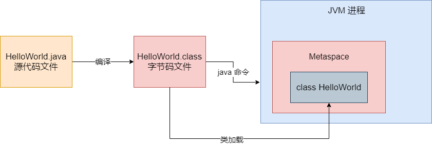
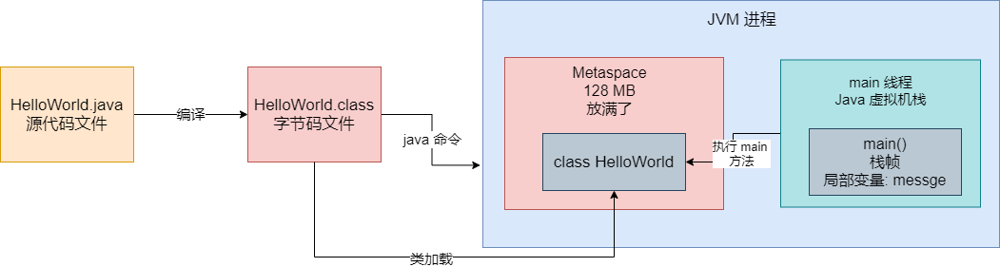
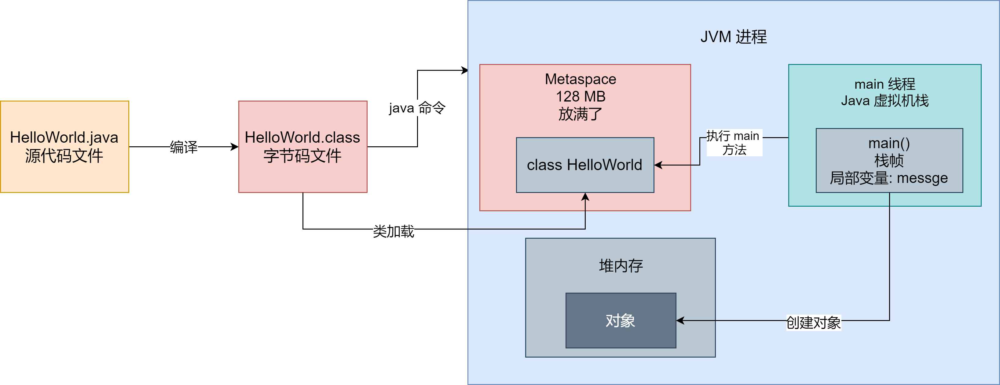

## 系统 OOM

作为 Java 程序员而言，先不考虑自己系统外部依赖的缓存、消息队列、数据库等服务挂掉。就我们本身系统而言，最常见挂掉的原因是什么？就是系统 OOM，也就是所谓的内存溢出。那什么是内存溢出？简单说就是你的 JVM 内存就这么点，结果你拼命往里面塞东西，结果内存塞不下了，就直接溢出了。


那有哪些情况会导致系统发生 OOM 内存溢出？我们从 JVM 的核心原理出发，给大家讲讲哪些地方可能会发生内存溢出。


### 运行一个 Java 系统

首先我们要明白一个事情，就是我们平时启动一个 Java 系统，本质上就是启动一个 JVM 进程。我们用最基本的情况来演示一下，比如下面的代码：

```java
public class HelloWorld {
	
	public static void main(String[] args) {
		String message = "Hello World";
		System.out.println(message);
	}
}
```


当我们在 Eclipse 或者 Intelij IDEA 中写好这个代码，然后通过 IDE 来运行这个代码时，会发生哪些事情？


首先，我们写好的代码都是后缀为 ".java" 的源代码，这个代码时不能运行的。所以第一步就是将这份 ".java" 源代码文件编译成一个 ".class" 字节码文件，这个字节码才是可以运行的。


对于这种编译好的字节码文件，比如 HelloWorld.class，如果里面包含了 main 方法。接下来我们就可以用 "java 命令" 来执行这个字节码文件了。实际上一旦你执行 "java 命令"，相当于就会启动一个 JVM 进程，这个 JVM 进程就会负责执行你写好的那些代码。


所以要知道一点，运行一个 Java 系统，本质上就是启动一个 JVM 进程，这个 JVM 进程负责来执行你写好的一大堆代码。只要你的 Java 系统中包含一个 main 方法，JVM 进程就会从你指定的这个 main 方法入手，开始执行你写的代码。


### JVM 加载你写的类

接下来，JVM 进程怎么执行你写的那些代码？Java 是一个面向对象的语言，所以最基本的代码组成单元就是一个一个的类，平时我们写的 Java 代码，不就是写一个一个的类吗？然后再类里我们会定义各种变量、方法、数据结构，通过 if else 之类的语法，写出各种各样的系统业务逻辑，这就是所谓的编程了。


所以 JVM 要执行你的代码，首先要把你写好的代码加载到内存里来。在 JVM 的内存区域里，有一块内存区域叫做永久代，当然 JDK 1.8 以后都叫做 Metaspace 了，这块内存就是用来存放你系统里的各种类的信息，包括 JDK 自身内置的一些类的信息，都在这块区域里。


JVM 有类加载器和一套类加载的机制，包括 加载、验证、准备、解析、初始化、使用、卸载这几个阶段，详细内容可以查看这篇文章，这里不再赘述。他会负责把我们写好的类从编译好的 ".class" 字节码文件里加载到内存里来。如图：




既然有这么一块 Metaspace 区域是用来存放类信息的，**那就有可能在这个 Metaspace 区域里发生 OOM。**


### Java 虚拟机栈：让线程执行各种方法

一般情况下，我们写好的那些 Java 代码虽然是一个一个的类，但是核心的代码逻辑一般是封装在类里面的各种方法中的。比如 JVM 已经加装了我们写好的 HelloWorld 类到内存里，接着要怎么执行它里面的代码呢？


Java 语言中的一个通用规则，就是一个 JVM 进程总是从 main 方法开始执行的，所以我们既然在 HelloWorld 中写了一个 mian() 方法，那么就得执行这个方法中的代码了。


那谁去执行 main() 方法的代码？其实我们所有的方法执行，都依赖于 JVM 进程中的某个线程去执行，你可以理解为线程才是执行我们写的代码的核心主体。JVM 进程启动之后默认就会有一个 main 线程，这个 main 线程就是专门负责执行 main() 方法的。


还有一个问题，在 main() 方法中定义了一个局部变量 `message`，一般情况下，这些方法里的局部可能会有很多，那么这些局部变量放在哪里呢？其实，每个线程都有一个自己的虚拟机栈，就是所谓的**栈内存**。然后这个线程只要执行一个方法，就会为方法创建一个栈帧，将栈帧放入自己的虚拟机栈里，然后这个栈帧放入方法中定义的各种局部变量。如图：




我们可以通过一个 JVM 参数来设置每个线程中的虚拟机栈的内存大小，一般是设置为 1 MB。那么既然每个线程的虚拟机栈的内存大小是固定的，那么**第二块可能发生 OOM 的区域，就是每个线程的虚拟机栈内存**。


### 堆内存：存放我们创建的各种对象

最后，在我们写好的代码里，特别在一些方法中，可能会频繁地创建各种各样的对象，这些对象都是放在堆内存里的。如图：




而且，通常我们在 JVM 中分配给堆内存的空间其实是固定的。既然如此，我们还不停在堆内存里创建对象，**那堆内存也是有可能会发生内存溢出**。


## Metaspace 区域因类太多而发生内存溢出

