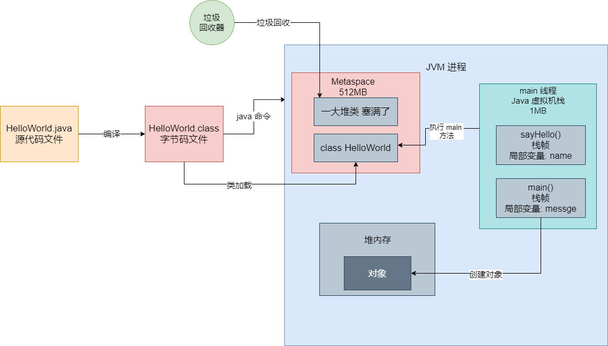
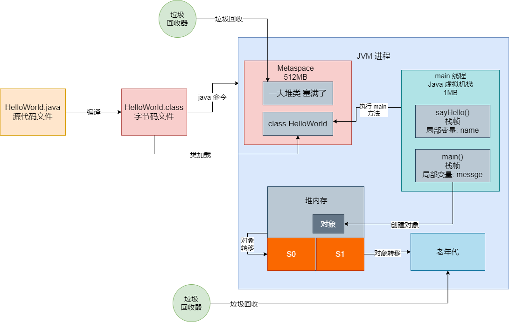

## 系统 OOM

作为 Java 程序员而言，先不考虑自己系统外部依赖的缓存、消息队列、数据库等服务挂掉。就我们本身系统而言，最常见挂掉的原因是什么？就是系统 OOM，也就是所谓的内存溢出。那什么是内存溢出？简单说就是你的 JVM 内存就这么点，结果你拼命往里面塞东西，结果内存塞不下了，就直接溢出了。


那有哪些情况会导致系统发生 OOM 内存溢出？我们从 JVM 的核心原理出发，给大家讲讲哪些地方可能会发生内存溢出。


### 运行一个 Java 系统

首先我们要明白一个事情，就是我们平时启动一个 Java 系统，本质上就是启动一个 JVM 进程。我们用最基本的情况来演示一下，比如下面的代码：

```java
public class HelloWorld {
	
	public static void main(String[] args) {
		String message = "Hello World";
		System.out.println(message);
	}
}
```


当我们在 Eclipse 或者 Intelij IDEA 中写好这个代码，然后通过 IDE 来运行这个代码时，会发生哪些事情？


首先，我们写好的代码都是后缀为 ".java" 的源代码，这个代码时不能运行的。所以第一步就是将这份 ".java" 源代码文件编译成一个 ".class" 字节码文件，这个字节码才是可以运行的。


对于这种编译好的字节码文件，比如 HelloWorld.class，如果里面包含了 main 方法。接下来我们就可以用 "java 命令" 来执行这个字节码文件了。实际上一旦你执行 "java 命令"，相当于就会启动一个 JVM 进程，这个 JVM 进程就会负责执行你写好的那些代码。


所以要知道一点，运行一个 Java 系统，本质上就是启动一个 JVM 进程，这个 JVM 进程负责来执行你写好的一大堆代码。只要你的 Java 系统中包含一个 main 方法，JVM 进程就会从你指定的这个 main 方法入手，开始执行你写的代码。


### JVM 加载你写的类

接下来，JVM 进程怎么执行你写的那些代码？Java 是一个面向对象的语言，所以最基本的代码组成单元就是一个一个的类，平时我们写的 Java 代码，不就是写一个一个的类吗？然后再类里我们会定义各种变量、方法、数据结构，通过 if else 之类的语法，写出各种各样的系统业务逻辑，这就是所谓的编程了。


所以 JVM 要执行你的代码，首先要把你写好的代码加载到内存里来。在 JVM 的内存区域里，有一块内存区域叫做永久代，当然 JDK 1.8 以后都叫做 Metaspace 了，这块内存就是用来存放你系统里的各种类的信息，包括 JDK 自身内置的一些类的信息，都在这块区域里。


JVM 有类加载器和一套类加载的机制，包括 加载、验证、准备、解析、初始化、使用、卸载这几个阶段，详细内容可以查看这篇文章，这里不再赘述。他会负责把我们写好的类从编译好的 ".class" 字节码文件里加载到内存里来。如图：


既然有这么一块 Metaspace 区域是用来存放类信息的，**那就有可能在这个 Metaspace 区域里发生 OOM。**


### Java 虚拟机栈：让线程执行各种方法

一般情况下，我们写好的那些 Java 代码虽然是一个一个的类，但是核心的代码逻辑一般是封装在类里面的各种方法中的。比如 JVM 已经加装了我们写好的 HelloWorld 类到内存里，接着要怎么执行它里面的代码呢？


Java 语言中的一个通用规则，就是一个 JVM 进程总是从 main 方法开始执行的，所以我们既然在 HelloWorld 中写了一个 mian() 方法，那么就得执行这个方法中的代码了。


那谁去执行 main() 方法的代码？其实我们所有的方法执行，都依赖于 JVM 进程中的某个线程去执行，你可以理解为线程才是执行我们写的代码的核心主体。JVM 进程启动之后默认就会有一个 main 线程，这个 main 线程就是专门负责执行 main() 方法的。


还有一个问题，在 main() 方法中定义了一个局部变量 `message`，一般情况下，这些方法里的局部可能会有很多，那么这些局部变量放在哪里呢？其实，每个线程都有一个自己的虚拟机栈，就是所谓的**栈内存**。然后这个线程只要执行一个方法，就会为方法创建一个栈帧，将栈帧放入自己的虚拟机栈里，然后这个栈帧放入方法中定义的各种局部变量。如图：


我们可以通过一个 JVM 参数来设置每个线程中的虚拟机栈的内存大小，一般是设置为 1 MB。那么既然每个线程的虚拟机栈的内存大小是固定的，那么**第二块可能发生 OOM 的区域，就是每个线程的虚拟机栈内存**。


### 堆内存：存放我们创建的各种对象

最后，在我们写好的代码里，特别在一些方法中，可能会频繁地创建各种各样的对象，这些对象都是放在堆内存里的。如图：


而且，通常我们在 JVM 中分配给堆内存的空间其实是固定的。既然如此，我们还不停在堆内存里创建对象，**那堆内存也是有可能会发生内存溢出**。


## Metaspace 区域因类太多而发生内存溢出

在启用一个 JVM 时可以设置很多参数，其中一些参数是专门用来设置 Metaspace 区域的内存大小的。就是 `-XX:MetaspaceSize=512m` `-XX:MaxMetaspaceSize=512m` 这两个。所以实际上来说，在一个 JVM 中，Metaspace 区域的大小是固定的，比如 512MB。


那么一旦 JVM 不停地加载类，加载了很多的类，然后 Metaspace 区域放满了，就会触发 Full GC。Full GC 会回收老年代和年轻代，当然也会尝试着回收 Metaspace 区域中的类。


那什么样的类才可以被回收呢？这个条件是相当苛刻的，包括不限于以下一些：比如这个类的类加载器先要被回收，比如这个类的所有对象实例都要被回收等等。所以一旦你的 Metaspace 区域满了，未必能回收掉里面很多的类。


那么一旦回收不了多少类，此时 JVM 还在拼命地加载类放到 Metaspace 里去，一旦塞满 Metaspace 区域，就会引发内存溢出的问题，因为此时 Metaspace 区域的内存空间不够了。


### 什么情况会发生 Metaspace 内存溢出

一般情况，Metaspace 这块区域一般很少发生内存溢出，如果发送内存溢出一般都是因为这两个原因：

- 第一种原因，很多工程师不懂 JVM 的运行原理，在上线时对 Metaspace 区域直接用默认的参数，即根本不设置其大小。这会导致默认的 Metaspace 区域可能才几十 MB 而已，此时对于稍微大型一点的系统，因为它自己有很多类，还依赖了很多外部的 jar 包的类，几十 MB 的Metaspace 很容易就不够了。

- 第二种原因，很多人写系统的时候会用 cglib 之类的技术动态生成一些类，一旦代码没有控制好，导致你生成的类过于多的时候，就很容易把 Metaspace 给塞满，进而引发内存溢出。


对于第一种问题，只要在系统上线的时候设置好对应的 Metaspace 大小就可以了。推荐 512MB


第二种情况，稍微我们会用模拟代码给大家演示那种不停的生成大量的类的情况。


## 无限制地调用方法让线程的栈内存溢出

我们先看下面的代码：

```java
public class HelloWorld {
	public static void main(String[] args) {
		String message = "Hello World";
		System.out.println(message);
		sayHello("ckin");
	}
	
	public static void sayHello(String name) {
		System.out.println("你好，" + name);
	}
}
```


按照之前说的，JVM 启动之后，HelloWorld 类被加载到了内存里来，然后会通过 main 线程执 main() 方法。此时在 main 线程的虚拟机栈里，就会压入 main() 方法对应的栈帧，里面就会放入 main() 方法中的局部变量。


而且，我们是可以手动设置每个线程的虚拟机栈的内存大小的，一般来说现在默认都是给 1MB。所以 main 线程的虚拟机栈内存大小一般也是固定的。现在看上面的代码，代码中的 main() 方法中又继续调用一个 sayHello() 方法，而且 sayHello() 方法中也有自己的局部变量，所以此时会继续将 sayHello() 方法的栈帧压入到 main 线程的虚拟机栈中去，如图：




接着 sayHello() 方法如果运行完毕之后，就不需要为这个方法在内存中保存它的一些局部变量之类的东西了，此时就会将 sayHello() 方法对应的栈帧从 main 线程的虚拟机栈里出栈，再接着，一旦 main() 方法自己本身也运行完毕，自然会将 main() 方法对应的栈帧也从 main 线程的虚拟机栈里出栈。这个我们就不在图里表示了。


### 一个重要的概念：每次方法调用的栈帧都是占用内存的

在这里要跟大家说一个概念，就是每个线程的虚拟机栈的大小是固定的，比如就 1MB，然后每次这个线程调用一个方法，都会将方法调用的栈帧压入虚拟机栈里，这个栈帧是有方法的局部变量的。


虽然一些变量和其他的一些数据占用不了太大的内存，但是要注意，每次方法调用的栈帧实际上也是会占用内存的。这是非常关键的一点，哪怕一个方法调用的栈帧就占用几百个字节的内存，那也是内存占用。


### 什么情况会导致 JVM 中的栈内存溢出

既然明确了上述前提之后，那到底什么情况下 JVM 中的栈内存会溢出呢？既然一个线程的虚拟机内存大小是有限的，比如 1MB，那么假设你不停地让这个线程去调用各种方法，然后不停地把方法调用的栈帧压入栈中，此时终有一个时刻，大量的栈帧就会消耗完毕这个 1MB 的线程栈内存，最终就会导致出现栈内存溢出的情况。


通常而言，哪怕你的线程的虚拟机栈内存就 128KB，或者 256KB，通常都是足够进行一定深度的方法调用的，但是如果你要是走一个递归方法调用，那就不一定了，例如下面代码：

```java
public static void sayHello(String name) {
	sayHello(name);
}
```


一旦出现上述代码，一个线程就会不停地调用同一个方法，即使是同一个方法，每次方法调用也会产生一个栈帧压入栈里，例如对 sayHello() 进行 100 次调用，那么就会有 100 个栈帧压入栈中。所以如果疯狂地运行上述代码，就会不停地将 sayHello() 方法的栈帧压入栈里，最终一定会消耗掉线程的栈内存，引发内存溢出。


所以一般来说，引发栈内存溢出，往往都是代码里写了些 bug 才会导致的，正常情况下发生的比较少。


## 对象太多导致的堆内存溢出

如果要把大量的对象是如何导致堆内存溢出的说清楚，那就要从系统运行，在 Eden 区创建对象开始讲起。之前我们说过，平时系统运行的时候一直不停地创建对象，然后大量的对象会填满 Eden 区，一旦 Eden 区满之后，就会触发一次 Young GC，然后存活对象进入 S 区。


### 高并发场景下导致 ygc 后存活对象太多

当然因为各种各样的情况，一旦出现了高并发场景，导致 ygc 后很多请求还没处理完毕，存活对象太多，可能就在 Survivor 区域放不下了，此时只能进入到老年代里去了，老年代很快会填满。一旦老年代放满了就会触发 Full GC，如图所示：




我们假设 ygc 过后有一批存活对象，Survivor 放不下，此时就等着要进入老年代里，然后老年代也满了，就等着老年代进行 CMS GC，必须回收掉一批对象，才能让年轻代里存活下来的一批对象。但是，如果 Full GC 之后还是存活了很多的对象，如果这时候年轻代还有一批对象等着放进老年代，人家 GC 过后空间还是不足，就只能内存溢出了。


### 什么时候会发生堆内存的溢出

发生堆内存溢出的原因总结下来就是，有限的内存中存放了过多的对象，而且大多数都是存活的，此时即使 GC 过后还是大部分都存活吗，所以要继续放入更多对象已经不可能了，此时只能引发内存溢出问题。


所以一般来说发生内存溢出有两种情况：

- 系统承载高并发请求，因为请求量过大，导致大量对象都是存活的，所以要继续放入新的对象实在是不行了，此时就会引发 OOM 系统崩溃。

- 系统有内存泄露问题，就是莫名其妙弄了很多的对象，结果对象都是存活的，没有及时取消对他们的引用，导致触发 GC 还是无法回收，此时只能引发内存溢出。


因此总结起来，一般引发 OOM，一是系统负载过高，二是有内存泄露问题。这个 OOM 问题，一旦你的代码写的不太好，或者设计有缺陷，还是比较容易引发的。