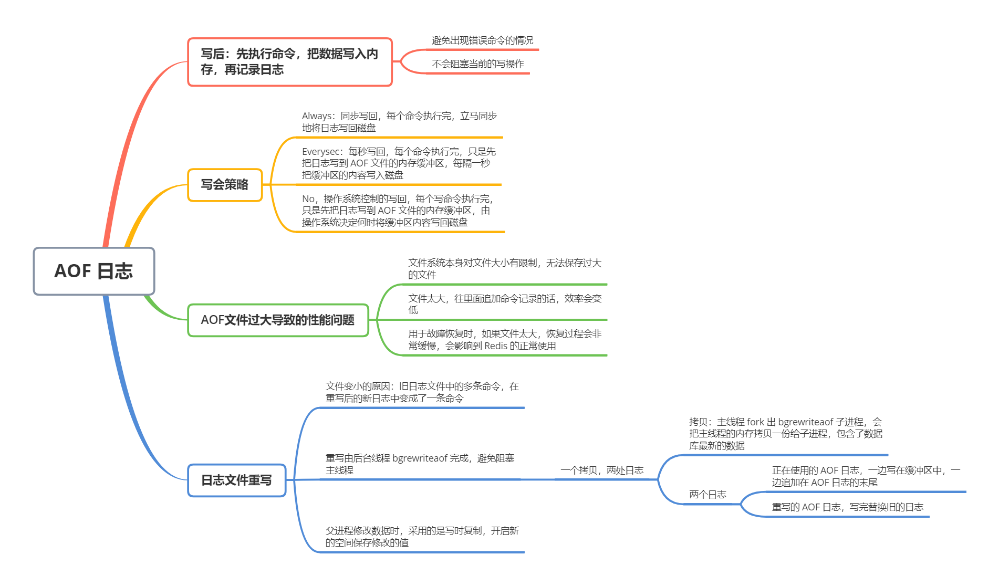

目前，Redis 的持久化主要有两大机制：AOF 日志和 RDB 快照。我们先看一下 AOF 日志

### AOF 日志是怎么实现的

说到日志，我们比较熟悉的是数据库的写前日志（Write Ahead Log，WAL），即，在实际写日志前，先把修改的数据记到日志文件中，以便故障时进行恢复。不过，AOF 日志正好相反，它是写后日志。「写后」的意思是 Redis 先执行命令，把数据写入内存，然后才记录日志。如下：

为什么 AOF 是这么个顺序呢？首先，我们也好知道 AOF 里记录了什么内容

传统数据库的日志，例如 redo log（重做日志），记录的是修改后的数据，而 AOF 里记录的是 Redis 收到的每一条命令，这些命令是以文本形式保存的

以 Redis 收到「set testkey testvalue」命令后记录的日志为例，看看 AOF 日志的内容。其中，「*3」表示当前命令有三个部分，每个部分都是由「$ + 数字」开头，后面紧跟着具体的命令、键或值。这里，「数字」表示这部分中的命令、键或值一共有多少字节。例如，「$3 set」表示这部分有 3 个字节，也就是「set」命令

但是，为了避免额外的检查开销，Redis 在向 AOF 里面记录日志的时候，并不会先对这些命令进行语法检查。所以，如果先记日志再执行命令的话，日志中就有可能记录了错误的命令，Redis 在使用日志恢复数据时，就可能会出错

而写后日志这种方式，就是先让系统执行命令，只有命令能执行成功，才会被记录到日志中，否则，系统就会直接向客户端报错。所以，Redis 使用写后日志的一个好处是，可以**避免出现记录错误命令的情况**

另外，AOF 还有一个好处：它是在命令执行后才记录日志，所以**不会阻塞当前的写操作**

不过，AOF 也有两个潜在风险

首先，如果刚执行完一个命令，还没来得及记录日志就宕机了，那么这个命令就和相应的数据就有丢失的风险。

其次，AOF 虽然避免了对当前命令的阻塞，但是会给下一个操作带来阻塞风险。这是因为，AOF 日志也是在主线程中执行的，如果在把日志文件写入磁盘时，磁盘压力过大，就会导致写盘很慢，进而导致后续的操作也无法执行了

其实，这两个风险都是和 AOF 写回磁盘的时机相关的。这意味着，如果我们能够控制一个写命令执行完后 AOF 日志写回磁盘的时机，这两个风险就接触了

### 三种写回策略

其实，AOF 机制给我们提供了三个选择，也就是 AOF 配置项 `appendfsync` 的三个可选值

- **Always**，同步写回：每个命令执行完，立马同步地将日志写回磁盘

- **Everysec**，每秒写回：每个命令执行完，只是先把日志写到 AOF 文件的内存缓冲区，每隔一秒把缓冲区的内容写入磁盘

- **No**，操作系统控制的写回：每个写命令执行完，只是先把日志写到 AOF 文件的内存缓冲区，由操作系统决定何时将缓冲区内容写回磁盘

针对避免主线程阻塞和减少数据丢失问题，这三种写回策略都无法做到两全其美。原因如下：

- 「同步写回」可以做到基本不丢数据，但是它在每一个写命令后都有一个慢速的罗盘操作，不可避免地会影响主线程性能
- 虽然「操作系统控制的写回」在写完缓冲区后，就可以继续执行后续的命令，但是落盘的时机已经不在 Redis 手中了，只要 AOF 记录没有写回磁盘，一旦宕机对应的数据就丢失了
- 「每秒写回」采用一秒写回一次的频率，避免了「同步写回」的性能开销，虽然减少了对系统性能的影响，但是如果发生宕机，上一秒内未落盘的命令操作仍然会丢失

三种策略的写回时机，优缺点如下：

| 配置项   | 写回时机           | 优点                     | 缺点                             |
| -------- | ------------------ | ------------------------ | -------------------------------- |
| Always   | 同步写回           | 可靠性高，数据基本不丢失 | 每个写命令都要落盘，性能影响较大 |
| Everysec | 每秒写回           | 性能适中                 | 宕机时丢失 1 秒内的数据          |
| No       | 操作系统控制的写回 | 性能好                   | 宕机时丢失数据较多               |

但是，按照系统的性能需求选定了写回策略，并不是就没问题了。毕竟，AOF 是以文件的形式在记录收到的所有写命令。随着接收的写命令越来越多，AOF 文件会越来越大。这就意味着，我们要小心 AOF 文件过大带来的性能问题

性能问题主要包括三个方面：一是，文件系统本身对文件大小有限制，无法保存过大的文件；二是，如果文件太大，之后往里面追加命令记录的话，效率会变低；三是，如果发生宕机，AOF 中记录的命令要一个个被重新执行，用于故障恢复，如果日志文件太大，整个恢复过程就会非常缓慢，就会影响到 Redis 的正常使用

这个时候，**AOF 重写机制**就登场了

### AOF 重写机制

AOF 重写机制就是在重写时，Redis 根据数据库的现状创建一个新的 AOF 文件，也就是说，读取数据库中的所有键值对，然后对每一个键值对用一条命令记录它的写入。比如说，当读取了键值对「"testkey" : "testvalue"」之后，重写机制会记录「set testkey testvalue」这条命令。这样，当需要恢复时，就可以重新执行该命令，实现「"testkey" : "testvalue"」的写入

为什么重写机制可以把日志文件变小呢？实际上，重写机制具有「多变一」功能。所谓的「多变一」，即旧日志文件中的多条命令，在重写后的新日志中变成了一条命令

我们知道，AOF 文件是以追加的方式，逐一记录收到的写命令。当一个键值对被多条写命令反复修改时，AOF 文件会记录想赢的多条命令。但是，在重写的时候，是根据这个键值对当前的最新状态，为它生成对应的写入命令。这样一来，一个键值对在重写日志中只用了一条命令就行。而且，在日志恢复时，只用执行这条命令，就可以直接完成这个键值对的写入了。如下图

当我们对一个列表先后做了 6 次修改操作后，列表最后的状态是「"D", "C", "N"」，此时，只用 `LPUSH u:list "N", "C", "D"` 这一条命令就能实现该数据的恢复，这就节省了五条命令的空间。对于被修改过成百上千次的键值对来说，重写能节省的空间就更大了

不过，虽然 AOF 重写后，日志文件会缩小，但是，要把整个数据库的最新数据的操作日志都写回磁盘，仍然是一个非常耗时的操作。那么，重写会不会阻塞主线程

### AOF 重写会阻塞吗

和 AOF 日志由主线程写回不同，重写过程是有后台线程 `bgrewriteaof` 完成的，也是为了避免阻塞主线程，导致数据库性能下降

这里把重写的过程总结为「**一个拷贝，两处日志**」

「一个拷贝」是指，每次执行重写时，主线程 fork 出后台的 bgrewriteaof 子进程。此时，fork 会把主进程的内存拷贝一份给 bgrewriteaof 子进程，这里面就包含了数据库的最新数据。然后，bgrewriteaof 子进程就可以在不影响主线程的情况下，逐一把拷贝的数据写成操作，记入重写日志

「两处日志」是什么呢？

因为主线程未阻塞，仍然可以处理新来的操作。此时，如果有写操作，第一处日志就是指正在使用的 AOF 日志，Redis 会把这个操作写到它的缓冲区。这样一来，即使宕机了，这个 AOF 日志的操作仍然是齐全的，可以用于恢复

而第二处日志，就是指新的 AOF 重写日志。这个操作也会被写到重写日志的缓冲区。这样，重写日志也不会丢失最新的操作。等到拷贝数据的所有操作记录重写完成后，重写日志记录的这些最新操作也会写入新的 AOF 文件，以保证数据库的最新状态的记录。此时，我们就可以用新的 AOF 文件替代旧文件了

总结来说，每次 AOF重写时，Redis 会先执行一个内存拷贝，用于重写；然后，使用两个日志保证在重写过程中，新写入的数据不会丢失。而且，因为 Redis 采用额外的线程进行数据重写，所以，这个过程不会阻塞主线程

### 补充

AOF 日志重写的时候，是由 bgrewriteaof 子进程来完成的，不用主线程参与，我们今天说的非阻塞也是指子进程的执行不阻塞主线程。但是，你觉得，这个重写过程有没有其他潜在的阻塞风险呢？如果有的话，会在哪里阻塞？

Redis 采用 fork 子进程重写 AOF 文件时，潜在的阻塞风险包括：fork 子进程 和 AOF 重写过程中父进程产生写入的场景，下面依次介绍

- fork 子进程，fork 这个瞬间一定是会阻塞主线程的（注意，fork 时并不会一次性拷贝所有内存数据给子进程，上面文章写的是拷贝所有内存数据给子进程，是有歧义的），fork 采用操作系统提供的写时复制（Copy On Write）机制，就是为了避免一次性拷贝大量内存数据给子进程造成的长时间阻塞问题，但 fork 子进程需要拷贝进程必要的数据结构，其中有一项就是拷贝**内存页表**（虚拟内存和物理内存的映射索引表），这个拷贝过程会消耗大量 CPU 资源，拷贝完成之前整个进程是会阻塞的，阻塞时间取决于整个实例的内存大小，实例越大，内存页表越大，fork 阻塞时间越久。拷贝内存页表完成后，子进程与父进程指向相同的内存地址空间，也就是说此时虽然产生了子进程，但是并没有申请与父进程相同的内存大小。那什么时候父子进程才会真正内存分离呢？「写时复制」顾名思义，就是在写发生时，才真正拷贝内存真正的数据，这个过程中，父进程也可能会产生阻塞的风险，就是下面介绍的场景

- fork 出的子进程指向与父进程相同的内存地址空间，此时子进程就可以执行 AOF 重写，把内存中的所有数据写入到 AOF 文件中。但是此时父进程依旧是会有流量写入的，如果父进程操作的是一个已经存在的 key，那么这个时候父进程就会真正拷贝这个 key 对应的内存数据，**申请新的内存空间**，这样逐渐地，父子进程内存数据开始分离，父子进程逐渐拥有各自独立的内存空间。因为内存分配是以页为单位进行分配的，默认 4k，如果父进程此时操作的是一个 bigkey，重新申请大块内存耗时会变长，可能会产阻塞风险。另外，如果操作系统开启了内存大页机制（Huge Page，页面大小2M），那么父进程申请内存时阻塞的概率将会大大提高，所以在Redis机器上需要关闭 Huge Page 机制。Redis 每次 fork 生成 RDB 或 AOF 重写完成后，都可以在 Redis log 中看到父进程重新申请了多大的内存空间

AOF 重写也有一个重写日志，为什么它不共享使用 AOF 本身的日志呢？

AOF 重写不复用 AOF 本身的日志，一个原因是父子进程写同一个文件必然会产生竞争问题，控制竞争就意味着会影响父进程的性能。二是如果 AOF 重写过程中失败了，那么原本的 AOF 文件相当于被污染了，无法做恢复使用。所以 Redis AOF 重写一个新文件，重写失败的话，直接删除这个文件就好了，不会对原先的 AOF 文件产生影响。等重写完成之后，直接替换旧文件即可。