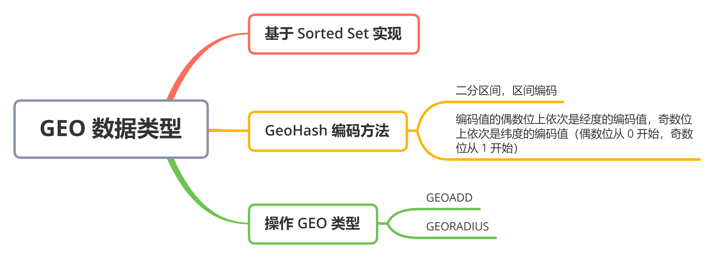
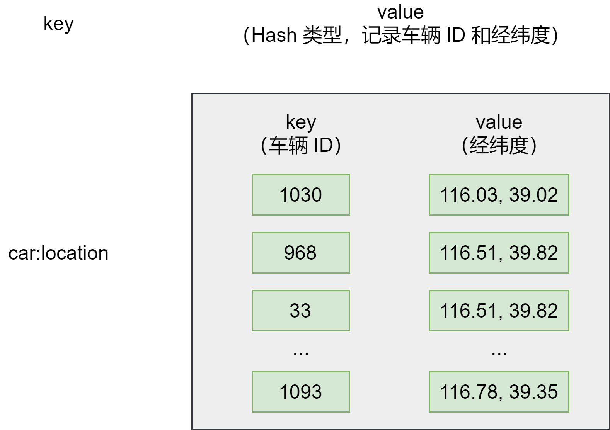
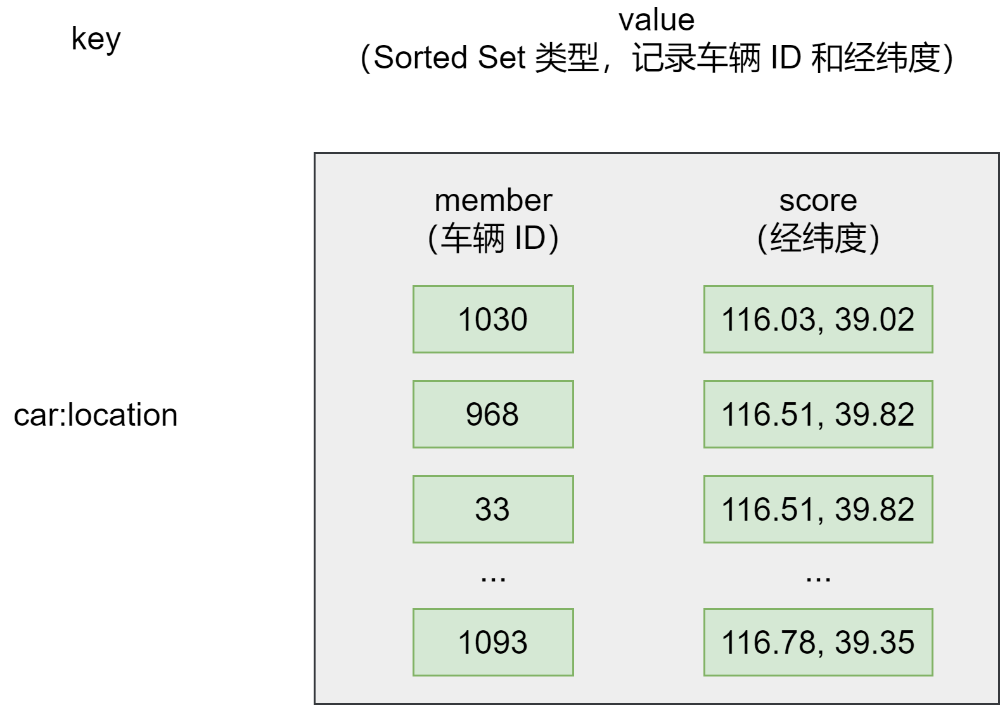
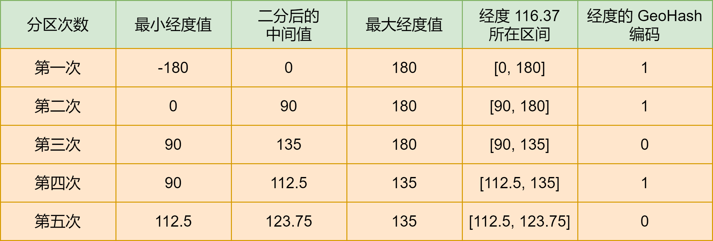
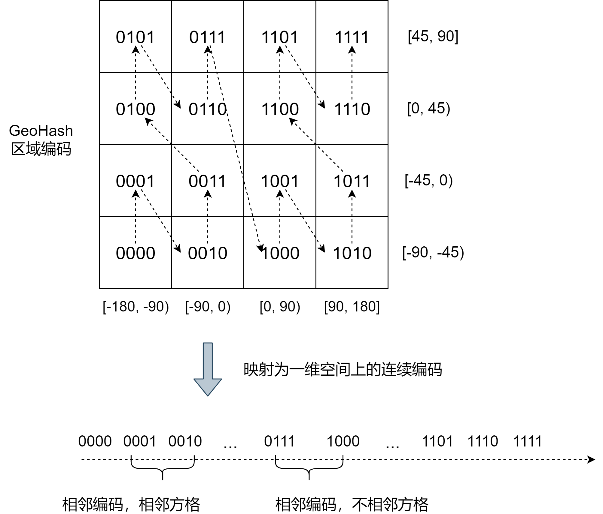

### 面向 LBS 应用的 GEO 数据类型


日常生活中，搜索附近的人，打车软件上叫车，这些都离不开基于位置信息服务（Location-Based Service，LBS）的应用。LBS 应用访问的数据是和人或无关联的一组经纬度信息，而且要能查询相邻的经纬度范围，GEO 就非常适合应用在 LBS 服务的场景中


### GEO 的底层结构


我们以叫车服务为例，分析下 LBS 应用中经纬度的存取特点


1. 每一辆网约车都有一个编号（例如 33），网约车需要将自己的经度信息（例如 116.034579）和纬度信息（例如 39.000452）发给叫车应用
2. 用户在叫车的时候，叫车应用会根据用户的经纬度位置（例如经度 116.054579，纬度 39.030452），查找用户的附近车辆，并进行匹配
3. 等把位置相近的用户和车辆匹配上以后，叫车应用就会根据车辆的编号，获取车辆的信息，并返回给用户


可以看到，一辆车（或一个用户）对应一组经纬度，并且随着车（或用户）的位置移动，相应的经纬度也会变化


这种数据记录模式属于一个 key（例如车 ID）对应一个 value（一组经纬度）。当有很多车辆信息要保存时，就需要有一个集合来保存一系列的 key 和 value。Hash 集合类型可以快速存取一系列的 key 和 value，正好可以用来记录一系列车辆 ID 和经纬度的对应关系。所以，我们可以把不同车辆的 ID 和它们对应的经纬度信息存在 Hash 集合中，如下：





同时，Hash 类型的 HSET 操作命令，会根据 key 来设置相应的 value 值，所以，我们可以用它来快速地更新车辆变化的经纬度信息


但是，对于一个 LBS 应用来说，除了记录经纬度消息，还需要根据用户的经纬度信息在车辆的 Hash 集合中进行范围查询。一旦涉及到范围查询，就意味着集合中的元素需要有序，但 Hash 类型的元素是无序的，显然不能满足需求


接着我们看 **Sorted Set 类型**是否合适。Sorted Set 也支持一个 key 对应一个 value 的记录模式，其中，key 就是 Sorted Set 中的元素，value 则是元素的权重分数。更重要的是，Sorted Set 可以根据元素的权重分数排序，支持范围查询。这就能满足 LBS 服务中查找相邻位置的需求了


用 Sorted Set 来保存车辆的经纬度信息时，Sorted Set 的元素是车辆 ID，元素的权重分数是经纬度信息，如下：





其实，GEO 类型的底层数据结构就是用 Sorted Set 来实现的。但是 Sorted Set 元素的权重分数是一个浮点数（float 类型），而一组经纬度包含的是经度和纬度两个值，是没法直接保存为一个浮点数的，那要怎么保存？


这就要用到 GEO 类型的 GeoHash 编码了


### GeoHash 的编码方法


为了高效地对经纬度进行比较，Redis 采用了业务广泛使用的 GeoHash 编码方法，这个方法的基本原理就是「**二分区间，区间编码**」


当我们要对一组经纬度进行 GeoHash 编码时，我们先要对经度和纬度分别编码，然后再把经纬度各自的编码合成一个最终编码


首先，我们看经度和纬度的单独编码过程


对于一个地理位置信息来说，它的经度范围是 [-180, 180]。GeoHash 编码会把一个经度值编码成一个 N 位的二进制值，我们来对经度范围  [-180, 180] 做 N 次的二分区操作，其中 N 可以自定义


在进行第一次二分区时，经度范围  [-180, 180] 会被分成两个子区间： [-180, 0) 和  [0, 180]（称之为左、右分区）。此时，我们可以查看一下要编码的经度值落在了左分区还是右分区。如果落在左分区，就用 0 表示；如果在右分区，就用 1 表示。这样一来，每做完一次二分区，我们就可以得到 1 位编码值


然后，我们再对经度值所属的分区再做一次二分区，同时再次查看经度值落在了二分区后的左分区还是右分区，按照刚才的规则再做 1 位编码。当做完 N 次的二分区后，经度值就可以用一个 N bit 的数来表示了


举个例子，我们要编码的经度值是 116.37，我们用 5 位编码值（即 N = 5，做 5 次分区）


我们先做第一次二分区操作，把经度区间  [-180, 180] 分成了左分区  [-180, 0) 和 右分区 [0, 180]。此时，经度值 116.37 是属于右分区 [0, 180]。所以，我们用 1 表示第一次二分区后的编码值


接下来，我们做第二次二分区，把经度值 116.37 所属的 [0, 180]，分成 [0, 90) 和 [90, 180]。此时，经度值 116.37 还是属于右分区 [90, 180]。所以，第二次分区后的编码值仍然为 1


按照这种方法，做完 5 次分区后，我们把经度值 116.37 定位在 [112.5, 123.75] 这个区间，并且得到了经度值的 5 位编码值，即 11010。编码过程如下：





对纬度的编码方式也是一样，只是纬度的范围是 [-90, 90]，下图显示了对纬度值 39.86 的编码过程


当一组经纬度值都编完码后，再把它们的各自编码值组合在一起，组合的规则是：最终编码值的偶数位上依次是经度的编码值，奇数位上依次是纬度的编码值。其中，偶数位从 0 开始，奇数位从 1 开始


刚刚计算的经纬度（116.37, 39.86）的各自编码值是 11010 和 10111，按照上面的规则，就能得到最终编码值 1110011101，如下：


用了 GeoHash 编码后，原来无法用一个权重分数表示的一组经纬度（116.37, 39.86）就可以了用 1110011101 这一个值来表示了，就可以保存为 Sorted Set 的权重分数了


当然，使用 GeoHash 编码后，我们相当于把这个地理空间划分成了一个个方格，每个方格对应了 GeoHash 中的一个分区


例如，我们把经度区间 [-180, 180] 做一次二分区，把纬度区间 [-90, 90] 做一次二分区，就会得到 4 个分区。它们的经度和纬度范围以及对应的 GeoHash 组合编码如下：


- 分区一：[-180, 0) 和 [-90, 0)，编码 00
- 分区二：[-180, 0) 和 [0, 90]，编码 01
- 分区三：[0, 180] 和 [-90, 0)，编码 10
- 分区四：[0, 180] 和 [0, 90]，编码 11


这 4 个分区对应了 4 个方格，每个方格覆盖了一定范围内的经纬度值，分区越多，每个方格能覆盖到的地理空间就越小，也就越精准。我们把所有方格的编码值映射到一维空间时，相邻方格的 GeoHash 编码值基本也是接近的，如下：


所以，我们使用 Sorted Set 范围查询得到的相近编码值，在实际的地理空间上，也是相邻的方格，这就可以实现 LBS 应用「搜索附近的人或物」的功能了


不过，有的编码值虽然在大小上接近，但实际对应的方格却距离比较远。例如，我们用 4 位来做 GeoHash 编码，把经度区间 [-180, 180] 和纬度区间 [-90, 90] 各分成了 4 个分区，一共 16 个分区，对应了 16 个方格。编码值为 0111 和 1000 的两个方格就离得比较远，如下：





所以，为了避免查询不准确问题，我们可以同时查询给定经纬度所在的方格周围的 4 个或 8 个方格


### 如何操作 GEO 类型


在使用 GEO 类型时，我们经常会用到两个命令，分别是 `GEOADD` 和 `GEORADIUS`


- GEOADD 命令：用于把一组经纬度信息和相对应的一个 ID 记录到 GEO 类型集合中
- GEORADIUS 命令：会根据输入的经纬度位置，查找以这个经纬度为中心的一定范围内的其他元素。当然，我们可以自己定义这个范围


举个例子。假设车辆 ID 是 33，经纬度位置是 (116.034579, 39.030452)，我们可以用一个 GEO 集合保存所有车辆的经纬度，集合 key 是 cars:locations。执行下面的命令，就可以把 ID 号为 33 的车辆的当前经纬度位置存入 GEO 集合中


```lua
GEOADD cars:locations 116.034579 39.030452 33
```


当用户想要寻找自己附近的网约车时，LBS 应用就可以使用 GEORADIUS 命令


例如，执行下面命令时，Redis 会根据输入的用户的经纬度信息 (116.034579, 39.030452)，查找以这个经纬度为中心的 5 公里内的车辆信息。当然，你可以修改 "5" 这个参数，来返回更大或更小范围内的车辆信息


```lua
GEORADIUS cars:locations 116.034579 39.030452 5 km ASC COUNT 10
```


上面命令中，使用 `ASC` 选项，让返回的车辆信息按照距离这个中心位置从近到远的方式来排序，以方便选择最近的车辆；还可以使用 `COUNT` 选项，指定返回的车辆信息的数量


