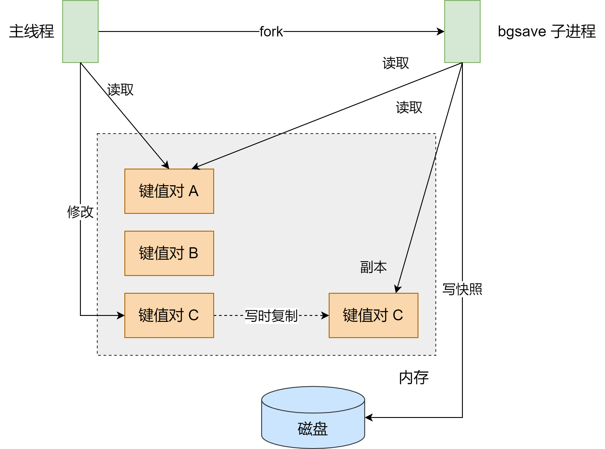
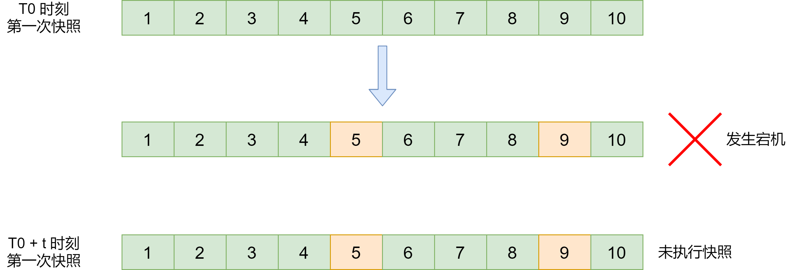
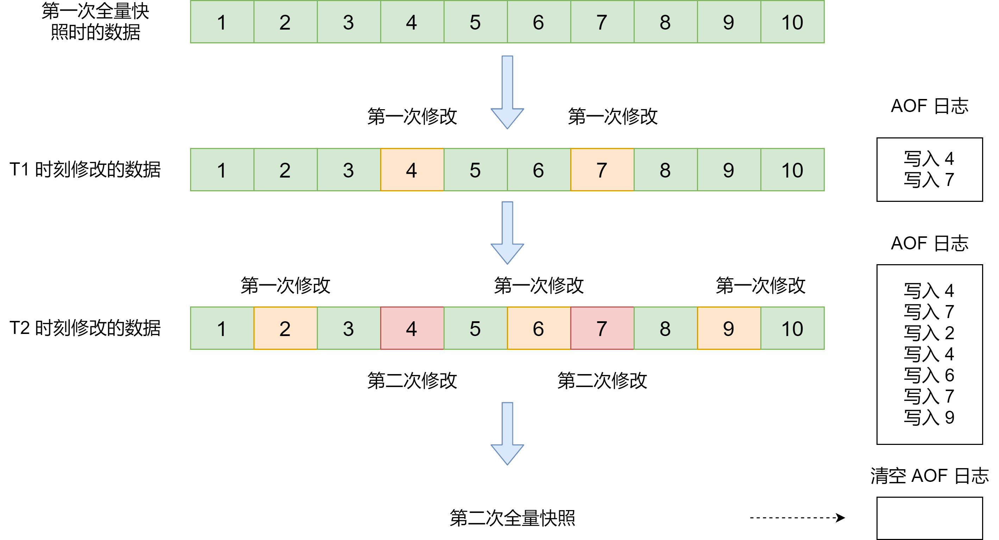

Redis 持久化除了 AOF 之外，还有另外一种方式：**内存快照**。对 Redis 来说，它实现类似于照片记录效果的方式，就是把某一时刻的状态以文件的形式写到磁盘上，也就是快照。这样一来，即使宕机，快照文件也不会丢失，数据的可靠性也就得到了保证。这个快照文件被称为 RDB 文件。其中，RDB 就是 Redis DataBase  的缩写

和 AOF 相比，RDB 记录的是某一时刻的记录，并不是操作，所以，在做数据恢复时，我们可以直接把 RDB 文件读入内存，很快地完成恢复

### 给哪些内存数据做快照

Redis 的数据都在内存中，为了提供所有数据的可靠性保证，它执行的是**全量快照**，也就是把内存中的所有记录都记录到磁盘中。这样的好处是，一次性记录了所有数据，一个都不少

对于 Redis 而言。它的单线程模型就决定了，我们要尽量避免所有会阻塞主线程的操作，所以，RDB 文件的生成是否会阻塞主线程，这关系到是否会降低 Redis 的性能

Redis 提供了两个命令来生成 RDB 文件，分别是 `save` 和 `bgsave`

- **save**：在主线程中执行，会导致阻塞
- **bgsave**：创建一个子线程，专门用于写入 RDB 文件，避免了主线程的阻塞，这也是 Redis RDB 文件生成的默认配置

这个时候，我们就可以通过 `bgsave` 命令来执行全量快照，这既提供了数据的可靠性保证，也避免了对 Redis 的性能影响

### 快照时数据能修改吗

例如，我们在时刻 t 给内存做快照，假设内存数据量是 4GB，磁盘的写入带宽是 0.2 GB/s，即至少需要 20S（4 / 0.2 = 20）才能做完。如果在 t + 5s 时，一个还没有被写入磁盘的内存数据 A，被修改成了 A'，那么就会破坏快照的完整性

但是，如果快照执行期间数据不能被修改，是会有潜在问题的。在做快照的 20s 的时间里，如果这 4GB 的数据都不能被修改，Redis 就不能处理这些数据的写操作，那无疑会给业务造成巨大的影响

为了快照而暂停写操作，肯定是不能接受的。所以，Redis 会借助操作系统提供的**写时复制技术**，在执行快照的同时，正常处理写操作

简单来说，bgsave 子进程是由主线程 fork 生成的，可以共享主线程的所有内存数据。bgsave 子进程运行后，开始读取主线程的内存数据，并把它们写入 RDB 文件

此时，如果主线程对这些数据也都是读操作（例如图中的键值对 A），那么，主线程和 bgsave 子进程互不影响。但是，如果主线程要修改一块数据（例如图中的键值对 C），那么，这块数据就会被复制一份，生成该数据的副本。然后，bgsave 子进程会把这个副本数据写入 RDB 文件，而这个过程中，主线程仍然可以直接修改原来的数

这既保证了快照的完整性，也允许主线程同时对数据进行修改，避免了对正常业务的影响

### 可以每秒做一次快照吗

如下图，我们先在 T0 时刻做了一次快照，然后有在T0 + t 时刻做了一次快照，在这期间，数据块 5 和 9 被修改了。如果在 t 这段时间内，机器宕机了，那么，只能按照 T0 时刻的快照进行恢复。此时，数据块 5 和 9 的修改值因为没有快照记录，就无法恢复

所以，要想尽可能恢复数据，t 值就要尽可能小。那么，t 值可以小到什么程度呢？例如每秒一次？毕竟每次快照都是有 bgsave 子进程在后台执行，也不会阻塞主线程

这种想法其实是错误的。虽然 bgsave 执行时不阻塞主线程，但是，**如果频繁地执行全量快照，也会带来两方面的开销**

一方面，频繁将全量数据写入磁盘，会给磁盘带来很大压力，多个快照竞争有限的磁盘宽带，前一个快照还没有做完，后一个又开始做了，容易造成恶性循环

另一方面，bgsave 子进程需要通过 fork 操作从主线程创建出来。虽然，子进程在创建后不会再阻塞主线程，但是，fork 这个创建过程本身会阻塞主线程，而且主线程的内存越大，阻塞时间越长。如果频繁 fork 出 bgsave 子进程，这就会频繁阻塞主线程了

那么，有什么其他好方法吗？

Redis 4.0 中提出了一个**混合使用 AOF 日志和内存快照**的方法。简单说，内存快照以一定的频率执行，在两次快照之间，使用 AOF 日志记录这期间的所有命令操作

这样一来，快照不用很频率地执行，这就避免了频繁 fork 对主线程的影响。而且，AOF 日志也只用记录两次快照间的操作，即不需要记录所有操作了，因此，就不会出现文件过大的情况，也可以避免重写开销

如下，T1 和 T2 时刻的修改，用 AOF 日志记录，等到第二次做全量快照时，就可以清空 AOF 日志，因为此时的修改都已经记录到快照中了，恢复时就不用再用日志了

