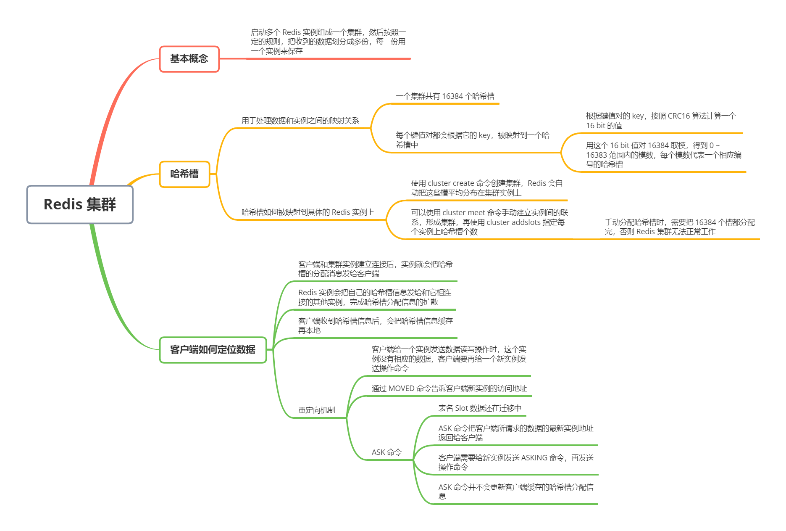
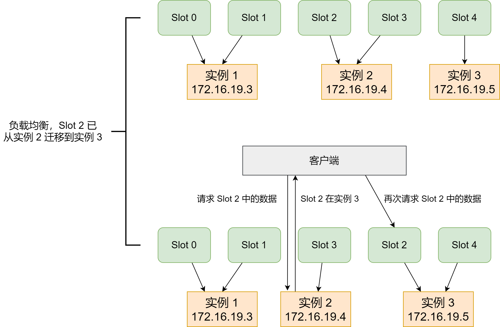
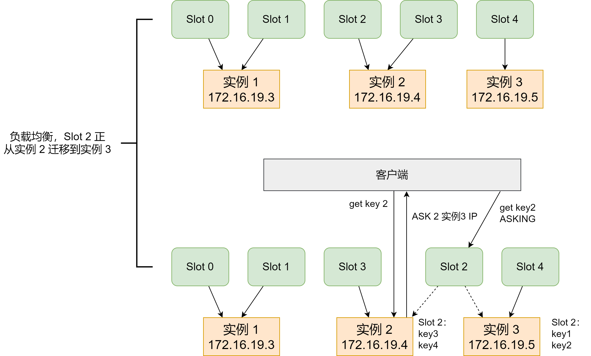

切片集群，也叫分片集群，就是指启动多个 Redis 实例组成一个集群，然后按照一定的规则，把收到的数据分成多份，每一份用一个实例来保存。在实际应用 Redis 时，随着用户或业务规模的扩展，保存大量数据的情况通常是无法避免的。而切片集群，就是一个非常好的解决方案


### 数据切片和实例的对应分布关系


在切片集群中，数据需要分布在不同实例上，那么，数据和实例之间如何对应呢？这就和 Redis Cluster 方案有关了


实际上，切片集群是一种保存大量数据的通用方案，这个机制可以有不同的实现方案。从 Redis 3.0 开始，官方提供了一个名为 Redis Cluster 的方案，用于实现切片集群。Redis Cluster 方案中就规定了数据和实例的对应规则


Redis Cluster 方案采用哈希槽（Hash Slot）来处理数据和实例之间的关系。在 Redis Cluster 方案中，一个**切片集群有 16384 个哈希槽**，这些哈希槽类似于数据分区，每个键值对都会根据它的 key，被映射到一个哈希槽中


具体的映射过程分为两大步：首先根据键值对的 key，按照 CRC16 算法计算一个 16 bit 的值；然后，用这个 16 bit 值对 16384 取模，得到 0 ~ 16383 范围内的模数，每个模数代表一个相应编号的哈希槽


那么，这些哈希槽又是如何被映射到具体的 Redis 实例上的呢？


在不熟 Redis Cluster 方案时，可以使用 `cluster create` 命令创建集群，此时，Redis 会自动把这些槽平均分布在集群实例上。例如，如果集群上有 N 个实例，那么每个实例上的槽的个数为 16384 / N 个


当然，我们也可以使用 `cluster meet` 命令手动建立实例间的连接，形成集群，再使用 `cluster addslots` 命令，指定每个实例上的哈希槽个数


假设集群中一共有 3 个实例，同时有 5 个哈希槽，我们可以通过下面的命令手动分配哈希槽


```shell
redis-cli -h 172.16.19.3 -p 6379 cluster addslots 0,1
redis-cli -h 172.16.19.4 -p 6379 cluster addslots 2,3
redis-cli -h 172.16.19.5 -p 6379 cluster addslots 4
```


另外，在手动分配哈希槽时，需要把 16384 个槽都分配完，否则 Redis 集群无法正常工作


### 客户端如何定位数据


在定位键值对数据时，它所处的哈希槽时可以通过计算得到的，这个计算可以在客户端发送请求时来执行。但是，要进一步定位到实例，还需要知道哈希槽分布在哪个实例上


一般来说，客户端和集群实例建立连接后，实例就会把哈希槽的分配信息发给客户端。但是，在集群刚刚创建的时候，每个实例只知道自己被分配了哪些哈希槽，是不知道其他实例拥有的哈希槽信息的


那么，客户端为什么可以在访问一个实例时，能获得所有的哈希槽信息呢？这是因为，Redis 实例会把自己的哈希槽信息发给和它相连接的其他实例，来完成哈希槽分配信息的扩散。当实例之间相互连接后，每个实例就有所有哈希槽的映射关系了


客户端收到哈希槽信息后，会把哈希槽信息缓存在本地。当客户端请求键值对时，会先计算键值对所对应的哈希槽，然后就可以给相应的实例发送请求了


但是，在集群中，实例和哈希槽的对应关系并不是一成不变的，最常见的变化有两个：


- 在集群中，实例有新增或删除，Redis 需要重新分配哈希槽
- 为了负载均衡，Redis 需要把哈希槽在所有实例上重新分布一遍


此时，实例之间还可以通过相互传递信息，获得最新的哈希槽分配信息。但是，客户端是无法主动去感知这些变化的。这就会导致，它缓存的分配信息和最新的分配就不一致了，怎么办呢？


Redis Cluster 方案提供了 一种**重定向机制**。指客户端给一个实例发送数据读写操作时，这个实例上并没有相应的数据，客户端要再给一个新实例发送操作命令


当客户端把一个键值对的操作请求发送给一个实例时，如果这个实例上并没有这个键值对映射的哈希槽，那么，这个实例就会给客户端返回下面的 `MOVED` 命令响应结果，这个结果中就包含了新实例的访问地址


```shell
GET hello:key
(error) MOVED 13320 172.16.19.5:6379
```


其中 MOVED 命令表示，客户端请求的键值对所在的哈希槽 13320，实际是在 172.16.19.5 这个实例上。通过返回 MOVED 命令，把新实例的信息告诉给客户端了。这样一来，客户端就可以直接和 172.16.19.5 连接，并发送操作请求了


如下，由于负载均衡，Slot 2 中的数据已经从实例 2 迁移到实例 3，但是，客户端缓存仍然记录着「Slot 2 在实例 2」的信息，所以会给实例 2 发送命令。


实例 2 给客户端返回一条 MOVED 命令，把 Slot 2 的最新位置（也就是在实例 3上），返回给客户端，客户端就会再次向实例 3 发送请求，同时还会更新本地缓存，把 Slot 2 与实例的对应关系更新过来





需要注意的是，上图中，当客户端给实例 2 发送命令时，Slot 2 中的数据已经全部迁移到了实例 3。在实际应用中，如果 Slot 2 中的数据比较多，就可以会出现一种情况：客户端向实例 2 发送请求，但此时，Slot 2 中的数据只有一部分迁移到了实例 3，还有部分数据没有迁移。在这种迁移部分完成的情况下，客户端就会收到一条 `ASK` 报错信息，如下：


```shell
GET hello:key
(error) ASK 13320 172.16.19.5:6379
```


这个结果中的 `ASK` 命令就表示，客户端请求的键值对所在的哈希槽 13320，在 172.16.19.5 这个实例上，但是这个哈希槽正在迁移。此时，客户端需要先给 172.16.19.5 这个实例发送一个 `ASKING`  命令。这个命令的意思是，让这个实例允许执行客户端接下来发送的命令。然后，客户端再向这个实例发送 GET 命令，去读取数据


如下图，Slot 2 正在从实例 2 往实例 3 迁移，key 1 和 key 2 已经迁移过去，key 3 和 key 4 还在实例 2。客户端向实例 2 请求 key 2 后，就会收到实例 2 返回的 ASK 命令


ASK 命令表示两层含义：第一，表名 Slot 数据还在迁移中；第二，ASK 命令把客户端所请求数据的最新实例地址返回给客户端，此时，客户端需要给实例 3 发送 ASKING 命令，然后再发送操作命令





和 MOVED 命令不同，**ASK 命令并不会更新客户端缓存的哈希槽分配信息**。所以，上图中，如果客户端再次请求 Slot 2 中的数据，它还是会给实例 2 发送请求。即，ASK 命令的作用只是让客户端能给新实例发送一次请求，而不像 MOVED 命令那样，会更改本地缓存，让后续所有命令都发往新实例