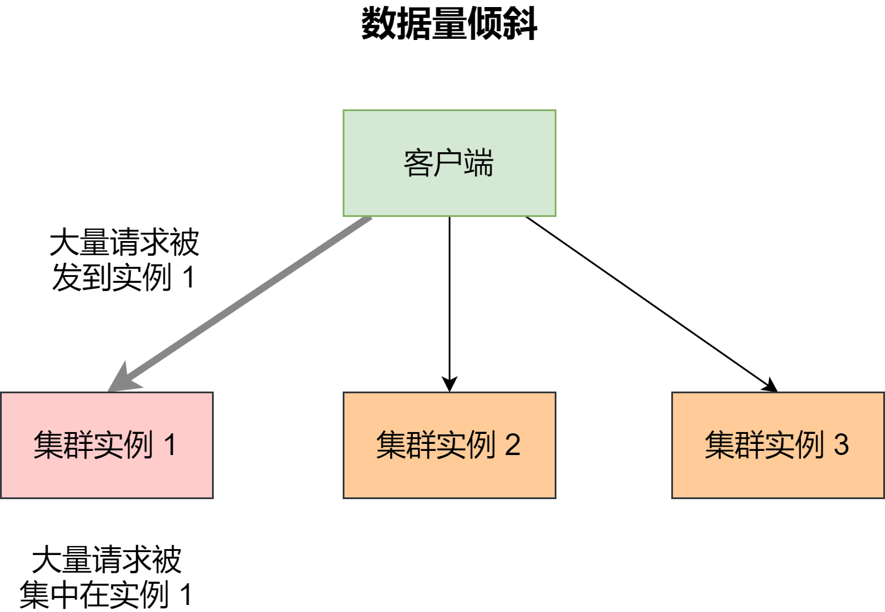

在切片集群中，数据会按照一定的分布规则分散到不同的实例上保存。比如，使用 Redis Cluster 时，数据都会先按照 CRC 算法的计算值对 Slot（逻辑槽）取模，同时，所有的 Slot 又会由运维管理员分配到不同的额实例上。这样，数据就被保存到相应的实例上了


虽然这种实现方法很简单，但是容易导致一个问题：数据倾斜


数据倾斜有两类：


- **数据量倾斜**：在某些情况下，实例上的数据分布不平衡，某个实例上的数据特别多
- **数据访问倾斜**：虽然每个集群实例上的数据量相差不大，但是某个实例上的数据是热点数据，被访问得非常频繁


如果发生了数据倾斜，那么保存了大量数据，或者是保存了热点数据的实例的处理压力就会增大，速度变慢，甚至还可能引起这个实例的内存资源耗尽，从而崩溃。这是我们在应用切片集群时要避免的


### 数据量倾斜的成因和应对方法


当数据量倾斜发生时，数据在切片集群的多个实例上分布不均衡，大量数据集中到了一个或几个实例上。如下：





数据量倾斜主要有三个原因：分别是某个实例上保存了 bigkey、Slot 分配不均衡以及 Hash Tag


#### bigkey 导致倾斜


第一个原因是，某个实例上保存了 bigkey。bigkey 的 value 值很大（String 类型），或者是 bigkey 保存了大量集合元素（集合类型），会导致这个实例的数据量增加，内存资源消耗也相应增加


而且，bigkey 的操作一般都会造成实例 IO 线程阻塞，如果 bigkey 的访问量比较大，就会影响到这个实例上的其他请求被处理的速度


为了避免 bigkey 造成的数据倾斜，根本的对应方法是：**我们在业务层生成数据时，要尽量避免把过多的数据保存在同一个键值对中**


此外，**如果 bigkey 正好是集合类型，可以把 bigkey 拆分成很多个小的集合类型数据，分散保存在不同实例上**


例如，假设 Hash 类型集合 user:info 保存了 100 万个用户的信息，是一个 bigkey。那么，我们可以按照用户 ID 的范围，把这个集合拆分为 10 个小集合，每个小集合只保存 10 万个用户的信息。这样，我们就可以把一个 bigkey 分散保存了，避免了 bigkey 给单个切片实例带来的访问压力


### Slot 分配不均衡导致倾斜


如果集群运维人员没有均衡地分配 Slot，就会有大量的数据被分配同一个 Slot 中，而同一个 Slot 只会在一个实例上分布，这就会导致，大量数据被集中到一个实例上，造成数据倾斜


以 Redis Cluster 为例，介绍下 Slot 分配不均衡的情况


Redis Cluster 一共有 16384 个 Slot，假设集群一共有 5 个实例，其中，实例 1 的硬件配置较高，运维人员在给实例分配 Slot 时，就可能会给实例 1 多分配些 Slot，把实例 1 的资源充分利用起来


但是，我们并不知道数据和 Slot 的对应关系，这种做法就可能会导致大量数据正好被映射到实例 1 上的 Slot，造成数据倾斜，给实例 1 带来访问压力


为了应对这个问题，可以通过运维规范，在分配之前，就要避免把过多的 Slot 分配到同一个实例。如果是已经分配好 Slot 的集群，可以先看 Slot 和实例的具体分配关系，从而判断是否有过多的 Slot 集中到了同一个实例。如果有的话，就将部分 Slot 迁移到其他实例，从而避免数据倾斜


我们执行 `CLUSTER SLOTS` 命令查看 Slot 分配情况。命令返回结果显示，Slot 0 到 Slot 4095 被分配到了实例 192.168.10.3 上，而 Slot 12288 到 Slot 16383 被分配到了实例 192.168.10.5 上


```sh
127.0.0.1:6379> cluster slots
1) 1) (integer) 0
   2) (integer) 4095
   3) 1) "192.168.10.3"
      2) (integer) 6379
2) 1) (integer) 12288
   2) (integer) 16383
   3) 1) "192.168.10.5"
      2) (integer) 6379
```


如果某一个实例上有太多的 Slot，我们就可以使用迁移命令把这些 Slot 迁移到其他实例上。在 Redis Cluster 中，我们可以使用 3 个命令完成 Slot 迁移


1. CLUSTER SETSLOT：使用不同的选项进行三种设置，分别是设置 Slot 要迁入的目标实例，Slot 要迁出的源实例，以及 Slot 所属的实例
2. CLUSTER GETKEYSINSLOT：获取某个 Slot 中一定数量的 key
3. MIGRATE：把一个 key 从源实例实际迁移到目标实例


假设我们要把 Slot 300 从源实例（ID 为 3）迁移到目标实例（ID 为 5），可以分为 5 步


第一步，先在目标实例 5 上执行下面的命令，将 Slot 300 的源实例设置为实例 3，表示要从实例 3 上迁入 Slot 300


```sh
CLUSTER SETSLOT 300 IMPORTING 3
```


第二步，在源实例 3 上，我们把 Slot 300 的目标实例设置为 5，表示 Slot 300 要迁出到实例 5 上


```sh
CLUSTER SETSLOT 300 MIGRATING 5
```


第三步，从 Slot 300 中获取 100 个 key，因为 Slot 中的 key 数量可能很多，所以我们需要在客户端上多次执行下面的这条命令，分批次获得并迁移 key


```sh
CLUSTER GETKEYSINSLOT 300 100
```


第四步，把刚才获取的 100 个 key 中的 key1 迁移到目标实例 5 上（IP 为 192.168.10.5），同时把要迁入的数据库设置为 0 好数据库，把迁移的超时时间设置为 timeout。重复执行 MIGRATE 命令，把 100 个 key 都迁移完


```sh
MIGRATE 192.168.10.5 6379 key1 0 timeout
```


最后，重复执行第三步和第四步，知道 Slot 中的所有 key 都迁移完成


从 Redis 3.0.6 开始，可以使用 KEYS 选项，一次迁移多个 key，这样可以提升迁移效率


```sh
MIGRATE 192.168.10.5 6379 "" 0 timeout KEYS key1 key2 key3
```


### Hash Tag 导致倾斜


Hash Tag 是指加在键值对 key 中的一对花括号 {}。这对花括号会把 key 的一部分括起来，客户单在计算 key 的 CRC16 值时，只对 Hash Tag 话括号中的 key 内容进行计算。如果没用 Hash Tag 的话，客户端计算整个 key 的 CRC16 的值


例如，假设 key 是 user:profile:3231，我们把其中的 3231 作为 Hash Tag，此时，key 就变成了 user:profile:{3231}。当客户端计算这个 key 的 CRC16 值时，就只会计算 3231 的 CRC16 值。否则，客户端会计算整个 user:profile:3231 的 CRC16 值


使用 Hash Tag 的好处是，如果不同 key 的 Hash Tag 内容是一样的，那么，这些 key 对应的数据会被映射到同一个 Slot 中，同时会被分配同一个实例上


下面就显示了使用 Hash Tag 后，数据被映射到相同 Slot 的情况


那么，Hash Tag 一般用在什么场景呢？它主要是用在 Redis Cluster 中，支持事务操作和范围查询。因为 Redis Cluster 并不支持跨实例的事务操作和范围操作，当业务应用有这些需求时，就只能先把这些数据读取到业务层进行事务处理，或者是逐个查询每个实例，得到范围查询的结果


这样操作起来非常麻烦，所以，我们可以使用 Hash Tag 把要执行事务操作或者范围查询的数据映射到同一个实例上，这样就能实现事务或范围查询了


但是，使用 Hash Tag 的潜在问题，就是大量的数据可能被集中到一个实例上，导致数据倾斜，集群中的负载不均衡。这是时候，我们就需要进行取舍了


我们建议，如果使用 Hash Tag 进行切片的数据会带来较大的访问压力，就优先避免考虑数据倾斜，最好不要使用 Hash Tag 进行数据切片。因为事务和范围查询还可以放在客户端来执行，而数据倾斜会导致实例不稳定，造成服务不可用


### 数据访问倾斜的成因和应对方法


发生数据访问倾斜的根本原因，就是实例上存在热点数据。一旦热点数据被存在了某个实例上，这个实例的请求访问量就会远高于其他实例，面临巨大的访问压力，如下：


和数据量倾斜不同，热点数据通常是一个或几个数据，所以，直接重新分配 Slot 并不能解决热点数据问题


通常来说，热点数据以服务读操作为主，在这种情况下，我们可以采用**热点数据多副本**的方法来应对


这个方法的具体做法是，我们把热点数据复制多份，在每一个数据副本的 key 中增加一个随机前缀，让它和其他副本数据不会被映射到同一个 Slot 中。这样，热点数据既有多个副本可以同时服务请求，同时，这些副本数据的 key 又不一样，会被映射到不同的 Slot 中。在给这些 Slot 分配实例时，我们也要注意把他们分配到不同的实例上，那么，热点数据的访问压力就被分散到不同的实例上了


注意，热点数据多副本方法只能针对只读的热点数据。如果热点数据是有读有写的话，就不适合采用多副本方法了，因为要保证多副本间的数据一致性，会带来额外的开销


对于有读有写的热点数据，就需要给实例本身增加资源了，例如使用配置更高的机器，来应对大量的访问压力


