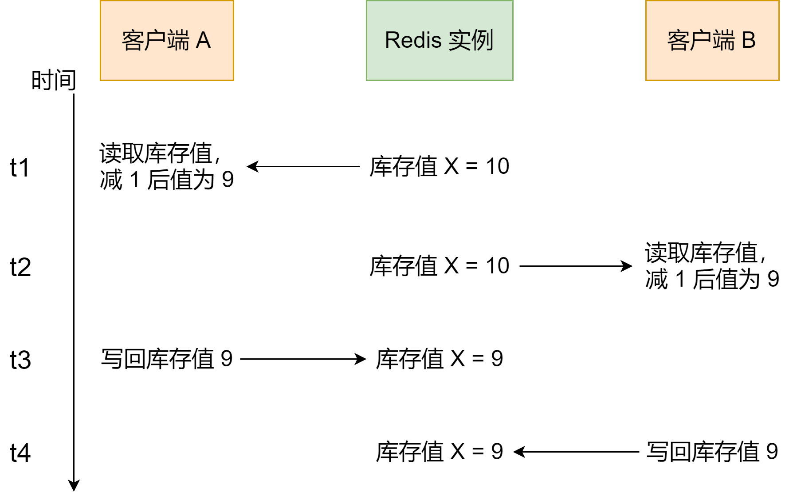

为了保证并发访问的正确性，Redis 提供了两种方法，分别是加锁和原子操作


加锁是一种常用的方法，在读取数据前，客户端需要先获得锁，否则就无法进行操作。当一个客户端获得锁后，就会一直持有这把锁，知道客户端完成数据更新，才释放这把锁


加锁会有两个问题，一个是，如果加锁操作多，会降低系统的并发访问性能；第二个是，Redis 客户单要加锁时，需要用到分布式锁，而分布式锁实现复杂，需要用额外的存储系统来提供加解锁操作


**原子操作是另一种提供并发访问控制的方法**。原子操作是指执行过程中保持原子性的操作，而且原子操作执行时并不需要加锁，实现了无锁操作。这样一来，既能保证并发控制，还能减少对系统并发性能的影响


### 并发访问中需要对什么进行控制


我们说的并发访问控制，是指多个客户端访问操作同一份数的过程进行控制，以保证任何一个客户端发送的操作在 Redis 实例上执行时具有互斥性。例如，客户端 A 的访问操作在执行时，客户端 B 的操作不能执行，需要等到 A 的操作结束后，才能执行


并发访问控制对应的操作主要是数据修改操作。当客户端需要修改数据时，基本流程分成两步：


1. 客户端先把数据读取到本地，在本地进行修改
2. 客户端修改完数据后，再写回 Redis


我们把这个流程叫做「读取 - 修改 - 写回」操作（Read - Modify - Write，简称为 RMW 操作）。当有多个客户端对同一份数据执行 RMW 操作的话，我们就需要让 RMW 操作涉及的代码以原子性方式执行。访问同一份数据的 RMW 操作代码，就叫做临界区代码


不过，当有多个客户端并发执行临界区代码时，就会存在一些潜在问题。我们用一个多客户端更新商品库存的例子来解释一下


我们先看临界区代码。假设客户端要对商品库存执行扣减 1 的操作，伪代码如下：


```java
current = GET(id)
current--
SET(id, current)
```


如果我们对临界区代码的执行没有控制机制，就会出现数据更新的操作。假设现在有两个客户端 A 和 B，同时执行刚才的临界区代码，就会出现错误，如下





可以看到，客户端 A 在 t1 时读取库存值 10 并扣减 1，在 t2 时，客户端 A 还没有把扣减后的库存值 9 写回 Redis，而在此时，客户端 B  读到库存值 10，也扣减了 1，B 记录的库存值也为 9 了。等到 t3 时，A 往 Redis 写回了库存值 9，而到 t4 时，B 也写回了库存值 9


如果按正确的逻辑处理，客户单 A 和 B 对库存值各做了一次扣减，库存值应该为 8。所以，这里的库存值明显更新错了


出现了这个的原因是，临界区的代码中的客户端读取数据、更新数据、再写回数据涉及了三个操作，而这三个操作在执行时并不具有互斥性，多个客户端基于相同的初始值进行修改，而不是基于前一个客户端修改后的值再修改


为了保证数据并发修改的正确性，我们可以用锁把并行操作变成串行操作，串行操作就是具有互斥性。一个客户端持有锁后，其他客户端只能等到锁释放，才能拿到锁再进行修改。如下伪代码


```java
LOCK()
current = GET(id)
current--
SET(id, current)
UNLOCK()
```


虽然加锁保证了互斥性，但是**加锁也会导致系统并发性能降低**


和加锁类似，原子操作也能实现并发控制，但是原子操作对系统并发性能影响较小，接着我们看看 Redis 中的原子操作


### Redis 的两种原子操作方法


为了实现并发控制要求的临界区代码互斥执行，Redis 的原子操作采用了两种方法：


1. 把多个操作在 Redis 中实现成一个操作，也就是单命令操作
2. 把多个操作写到一个 Lua 脚本中，以原子性方式执行单个 Lua 脚本


我们先看下 Redis 本身的单命令操作


Redis 是使用单线程来串行处理客户端的请求操作命令的，所以，当 Redis 执行某个命令操作时，其他命令是无法执行的，这相当于命令操作是互斥执行的。当然，Redis 的快照生成、AOF 重写这些操作，可以使用后台线程或者是子进程执行，也就是和主线程的操作并行执行。不过这些只是读取数据，不会修改数据，所以，我们并不需要对它们做并发控制


虽然 Redis 的单个命令可以原子性地执行，但是数据修改时，可能包含多个动作，至少包括读数据、数据增减、写回数据三个操作，这显然不是单个命令操作了


别担心，Redis 提供了 INCR / DECR 命令，把这三个操作转变为一个原子操作了。INCR / DECR 命令可以对数据进行**增值 / 减值**操作，而且它们本身就是单个命令操作，Redis 在执行它们时，本身就具有互斥性


所以，如果我们执行的 RMW 操作是对数据进行增减值的话，Redis 提供的原子操作 INCR 和 DECR 可以直接帮助我们进行并发控制


但是，如果我们要执行的操作不是简单地增减数据，而是有更加复杂的判断逻辑或者是其他操作，那么，Redis 的单命令操作已经无法保证多个操作的互斥执行了。这个时候，我们修使用第二个方法，也就是 Lua 脚本


Redis 会把整个 Lua 脚本作为一个整体执行，在执行的过程中不会被其他命令打断，从而保证了 Lua 脚本中操作的原子性。如果我们有多个操作要执行，但是又无法用 INCR / DECR 这种命令操作来实现，就可以把这些要执行的操作编写到一个 Lua 脚本中。然后，我们可以使用 Redis 的 EVAL 命令来执行脚本，这样，这些操作在执行时就具有了互斥性


举个例子，当一个业务应用的访问用户增加时，我们需要限制某个客户端在一定时间范围内的访问次数，比如爆款商品的购买限流，社交网络中的每分钟点赞次数限制等


怎么限制呢？我们可以把客户端 IP 作为 key，把客户端的访问次数作为 value，保存到 Redis 中。客户端没访问一次，我们就用 INCR 增加访问次数


不过，这种场景下，客户端限流其实同时包含了对访问次数和时间范围的限制，例如每分钟的访问次数不能超过 20。所以，我们可以在客户端第一次访问时，给对应键值设置过期时间，例如设置为 60s 后过期。同时，在客户端每次访问时，我们读取客户端当前的访问次数，如果次数超过了阈值，就报错，限制客户端再次访问。如下


```lua
// 获取IP对应的访问次数
current = GET(ip)
// 如果访问次数超过 20 次，报错
IF current != NULL AND current > 20 THEN
	ERROR "exceed 20 accesses per second"
ELSE
	// 如果访问次数不足 20 次，增加一次访问计数
	value = INCR(ip)
	// 如果是第一次访问，将键值对的过期时间设置为 60s 后
	IF value == 1 THEN
		EXPIRE(ip, 60)
	END
	// 执行其他操作
	DO THINGS
END
```


这个例子中，我们使用了 INCR 来原子性地增加计数。但是，客户端限流的逻辑不只有计数，还包括**访问次数判断和过期时间设置**


对于这些操作，我们同样需要保证它们的原子性。所以，这个例子中的操作无法用 Redis 单个命令来实现，此时，我们就可以使用 Lua 脚本来保证并发控制。我们可以把访问次数加 1、判断访问次数是否为 1，以及设置过期时间这三个操作写入一个 Lua 脚本，如下：


```lua
local current
current = redis.call("incr", KEYS[1])
if tonumber(current) == 1 then
	redis.call("expire", KEYS[1], 60)
end
```


假设我们编写的脚本名称为 lua.script，我们就可以使用 Redis 客户单，带上 eval 选项，来执行该脚本。脚本所需的参数将通过以下命令中的 keys 和 args 进行传递


```shell
redis-cli --eval lua.script keys, args
```


这样一来，访问次数加 1、判断访问此时是否为 1，以及设置过期时间这三个操作就可以原子性地执行了。即使客户端有多个线程同时执行这个脚本，Redis 也会依次串行执行脚本代码，避免了并发操作带来的数据错误