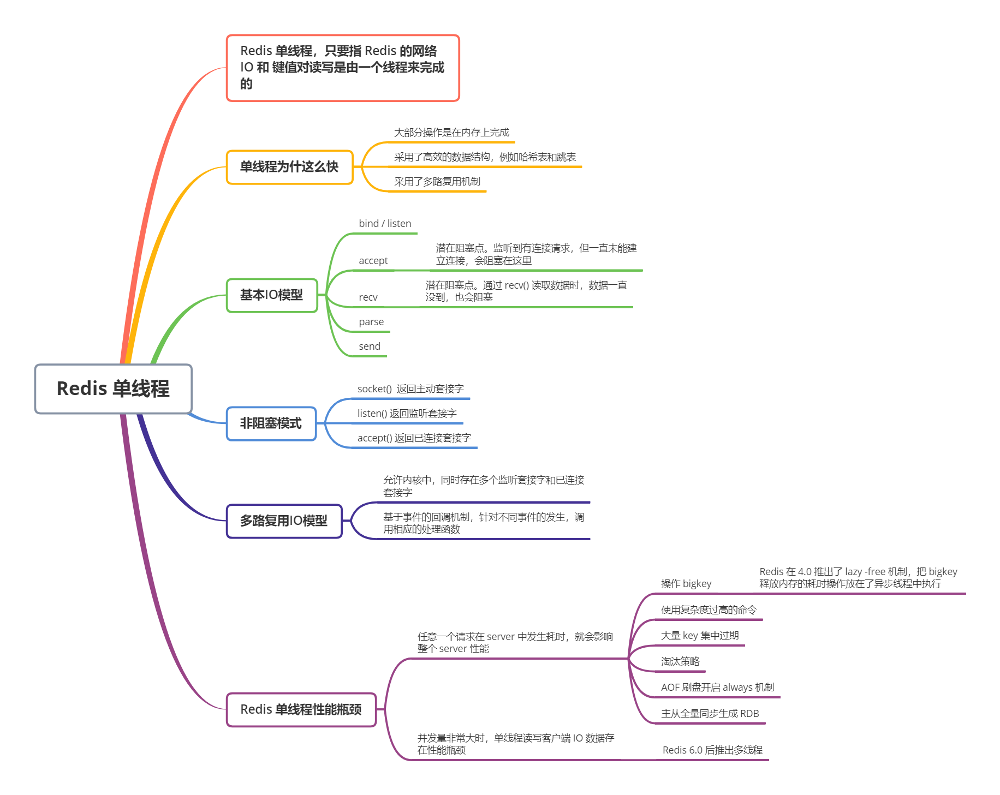

我们通常说，**Redis 是单线程，主要是值 Redis 的网络 IO 和键值对读写是由一个线程来完成的，这也是 Redis 对外提供键值存储服务的主要流程**。但 Redis 的其他功能，比如持久化、异步删除、集群数据同步等，是由额外的线程执行的

### 多线程的开销

在我们平时使用的系统中，会存在被多线程同时访问的共享资源，比如一个共享的数据结构。当有多个线程要修改这个共享资源时，为了保证共享资源的正确性，就需要有额外的机制进行保证，而这个额外的机制，就会带来额外的开销

并发访问控制一直是多线程开发中的一个难点问题，如果没有精细的设计，例如只是简单地采用一个粗粒度互斥锁，就会出现不理想的结果；即使增加了线程，大部分线程也在等待获取访问共享资源的互斥锁，并行变串行，系统吞吐率并没有随着线程的增加而增加

而且，采用多线程开发一般会引入同步原语来保护共享资源的并发访问，这也会降低系统代码的易调试性和可维护性。为了避免这些问题，Redis 直接采用了单线程模式

## 单线程 Redis 为什么那么快？

单线程的处理能力要比多线程差很多，但是 Redis 却能使用单线程模型达到每秒数十万级别的处理能力，这是为什么？其实，这是 Redis 多方面设计选择的一个综合结果

一方面，Redis 的大部分操作在内存上完成，再加上它采用了高效的数据结构，例如哈希表和跳表，这是它实现高性能的一个重要原因。另一方面，就是 Redis 采用了多路复用机制，使其在网络 IO 操作中能并发处理大量的客户端请求，实现高吞吐率

首先，我们要弄明白网络操作的基本 IO 模型和潜在的阻塞点

### 基本 IO 模型和阻塞点

假设 Redis 要处理一个 Get 请求，如果是基本的 IO 模型，一般流程是这样子的。先监听客户端请求（bind / listen），和客户端建立连接（accept），从 socket 中读取请求（recv），解析客户端发送请求（parse），根据请求类型读取键值数据（get），最后给客户端返回结果，即向 socket 中写回数据（send）

如下图，其中，bind / listen、accept、recv、parse 和 send 属于网络 IO 处理，而 get 属于键值数据操作。既然 Redis 是单线程，那么，最基本的一种实现就是在一个线程中依次执行上面的这些操作

但是，这里的网络 IO 模型中，有潜在的阻塞点，分别是 accept() 和 recv()。当 Redis 监听到一个客户端有连接请求，但一直未能成功建立起连接时，会阻塞在 accept 函数这里，导致气他客户端无法和 Redis 建立连接。类似的，当 Redis 通过 recv() 从一个客户端读取数据时，如果数据未到达，Redis 也会一直阻塞在 recv()

这就导致了 Redis 整个线程阻塞，无法处理其它客户端请求，效率很低

### 非阻塞模型

Socket 网络模型的非阻塞模式设置，主要体现在三个关键的函数调用上

在 socket 模型中，不同操作调用后会返回不同的套接字类型。socket() 方法会返回主动套接字，然后调用 listen() 方法，将主动套接字转化为监听套接字，此时，可以监听来自客户端的连接请求。最后，调用 accept() 方法接收到达的客户端连接，并返回已连接套接字

| 调用方法 | 返回套接字类型 | 非阻塞模式 | 效果                   |
| -------- | -------------- | ---------- | ---------------------- |
| socket() | 主动套接字     |            |                        |
| listen() | 监听套接字     | 可设置     | accept() 非阻塞        |
| accept() | 已连接套接字   | 可设置     | send() / recv() 非阻塞 |

针对监听套接字，我们可以设置非阻塞模式：当 Redis 调用 accept() 但一直未有连接请求到达时，Redis 线程可以返回处理其它操作，而不用一直等待。但是，需要注意的是，调用 accept() 时，已经存在监听套接字了

虽然 Redis 线程可以不用继续等待了，但是总得有机制继续在监听套接字上等待后续连接请求，并在有请求时通知 Redis。recv() 也是类似

这样才能保证 Redis 线程，既不会像基本 IO模型中一直在阻塞点等待，也不会导致 Redis 无法处理实际到达的连接请求或数据

### 基于多路复用的高性能 I/O 模型

Linux 中的 IO 多路复用机制是指一个线程处理多个 IO 流，就是我们经常听到的 select / epoll 机制。简单说，在 Redis 只运行单线程的情况下，**该机制允许内核中，同时存在多个监听套接字和已连接套接字**。内核会一直监听这些套接字上的连接请求或数据请求，一旦有请求到达，就会交给 Redis 线程处理，这就实现了一个 Redis 线程处理多个 IO 流的效果

下图就是基于多路复用的 Redis IO 模型。图中的多个 FD 就是刚才所说的多个套接字。Redis 网络框架调用 epoll 机制，**让内核监听这些套接字**。此时，Redis 线程不会阻塞在某一个特定的监听或已连接套接字上，即，不会阻塞在某一个特定的客户端请求处理上。因此，Redis 可以同时和多个客户端连接并处理请求，从而提升并发性

为了在请求到达时能通知到 Redis 线程，select / epoll 提供了**基于事件的回调机制，即针对不同事件的发生，调用相应的处理函数**

那么，回调机制是怎么工作的呢？其实，select / epoll 一旦监测到 FD 上有请求到达时，就会触发相应的事件

这些事件会被放进一个事件队列，Redis 单线程对该事件队列不断进行处理。这样一来。Redis 无需一直轮询是否有请求实际发生，这就可以避免造成 CPU 浪费资源。同时，Redis 在对事件队列中的事件进行处理时，会调用相应的处理函数，这就实现了基于事件的回调。因为 Redis 一直在对事件队列进行处理，所以能及时相应客户端请求，提升 Redis 的响应性能

例如，有两个请求分别对应 Accept 事件和 Read 事件，Redis 分别对这两个事件注册 accept 和 get 回调函数。当 Linux 内核监听到有连接或读数据请求时，就会触发 Accept 事件和 Read 事件，此时，内核就会回调 Redis 相应的 accept 和 get 函数进行处理

### 补充

Redis 单线程处理 IO 请求性能瓶颈主要包括两个方面：

1. 任意一个请求在 server 中一旦发生耗时时，都会影响整个 server 的性能，也就是说后面的请求都要等前面这个耗时请求处理完成，自己才能被处理到。耗时的操作包括以下几种：
   - **操作 bigkey**：写入一个 bigkey 在分配内存时需要耗费更多的时间。同样，删除 bigkey 释放内存同样会产生耗时
   - **使用复杂度过高的命令**：例如 SORT / SUNION / ZUNIONSTORE，或者 O(N) 命令，但是 N 很大，例如 lrange key 0 -1 一次查询全量数据
   - **大量 key 集中过期**：Redis 的过期机制也是在主线程中执行的，大量 key 集中过期会导致处理一个请求时，耗时都在删除过期 key，耗时变长
   - **淘汰策略**：淘汰策略也是在主线程执行的，当内存超过 Redis 内存上限后，每次写入到需要淘汰一些 key，也会造成耗时变成
   - **AOF 刷盘开启 always 机制**：每次写入都需要把这个操作刷到磁盘，写磁盘的速度比写内存慢，会拖慢 Redis 的性能
   - **主从全量同步生成 RDB**：虽然采用 fork 子进程生成数据快照，但 fork 这一瞬间也是会阻塞整个线程的。实例越大，阻塞时间越久
2. 并发量非常大时，单线程读写客户端 IO 数据存在性能瓶颈，虽然采用 IO 多路复用机制，但是读写客户端数据依旧是同步 IO，只能单线程一次读取客户端的数据，无法利用到 CPU 的多核

针对问题 1，一方面需要业务人员去规避，一方面 Redis 在 4.0 推出了 lazy-free 机制，把 bigkey 释放内存的耗时操作放在了异步线程中执行，降低对主线程的影响

针对问题2，Redis 在 6.0 推出了多线程，可以在高并发场景下利用 CPU 多核多线程读写客户端数据，进一步提升 server 性能，当然，只是针对客户端的读写是并行的，每个命令的真正操作依旧是单线程的。

