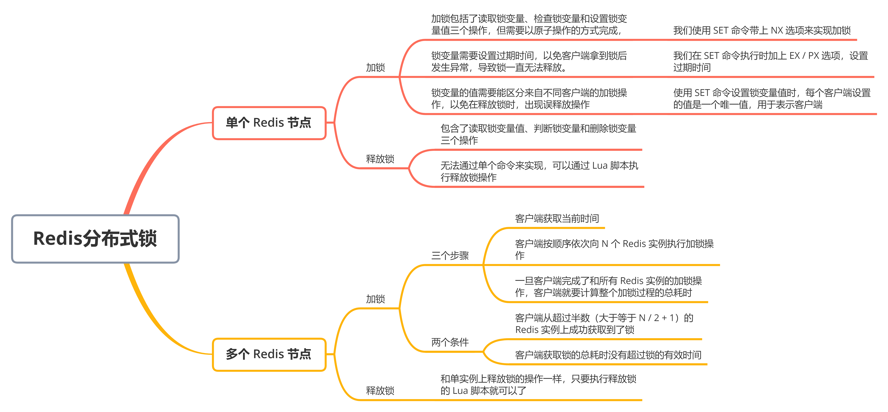

### 单机上的锁和分布式锁的联系与区别


对于在单机上运行的多线程程序来说，锁本身可以用一个变量来表示：


- 变量值为 0 时，表示没有线程获取锁
- 变量值为 1 时，表示已经没有线程获取到锁了


一个线程调用加锁操作，其实就是检查锁变量是否为 0。如果为 0，就把锁的变量值设置为 1，表示获取到锁，如果不是 0，就返回错误信息，表示加锁失败，已经有别的线程获取到锁了。而一个线程调用释放锁操作，其实就是将锁变量的值置为 0，以便其他线程可以来获取锁


用一段伪代码表示加锁和释放锁，其中，lock 为锁变量，如下：


```java
acquire_lock() {
	if lock == 0
		lock = 1
		return 1
	else
		return 0
}

release_lock() {
	lock = 0
	return 1
}
```


和单机上的锁类似，分布式锁同样可以**用一个变量来实现**。客户端加锁和释放锁的操作逻辑，也和单机上的加锁和释放锁操作逻辑一致：**加锁时同样需要判断锁变量的值，根据锁变量值来判断是否加锁成功；释放锁时需要把锁变量值设置为 0，表明客户端不再持有锁**


但是，和线程在单机上操作锁不同的是，在分布式场景下，**锁变量需要由一个共享存储系统来维护**，只有这样，多个客户端才可以通过访问共享存储系统来访问锁变量。相应的，**加锁和释放锁的操作就变成了读取、判断和设置共享存储系统中的锁变量值**


这样，我们就可以得出实现分布式锁的两个要求：


- 要求一：分布式锁的加锁和释放锁的过程，涉及多个操作。所以，在实现分布式锁时，我们需要保证这些锁操作的原子性
- 要求二：共享存储系统保存了锁变量，如果共享存储系统发生故障，那么客户端也就无法进行锁操作了。在实现分布式锁时，我们需要考虑保证共享存储系统的可靠性，进而保证锁的可靠性


实际上，我们可以基于单个 Redis 节点来实现，也可以使用多个 Redis 节点实现。这两种情况下，锁的可靠性是不一样的。我们先看基于单个 Redis 节点的实现方法


### 基于单个 Redis 节点实现分布式锁


作为分布式锁实现过程中的共享存储系统，Redis 可以使用键值对来保存锁变量，再接收和处理不同客户端发送的加锁和释放锁的操作请求。那么，键值对的键和值具体是怎么定的呢？


我们要赋予锁变量一个变量名，把这个变量名作为键值对的键，而锁变量的值，则是键值对的值，这样一来，Redis 就能保存锁变量了，客户端也就可以通过 Redis 的命令操作来实现锁操作


因为加锁包含了三个操作（读取锁变量、判断锁变量以及把锁变量值设置为 1），而这三个操作在执行时需要保证原子性，那怎么保证原子性？


要想保证操作的原子性，有两种通用的方法，分别是使用 Redis 的单命令操作和使用 Lua 脚本。那么，在分布式加锁场景下，该怎么应用这两个方法呢


那么，Redis 有哪些单命令操作实现加锁操作呢


首先是 `SETNX` 命令，它用于设置键值对的值。这个命令**在执行时会判断键值对是否存在，如果不存在，就设置键值对的值，如果存在，就不做任何修改**


例如，执行下面的命令，key 不存在，那么 key 会被创建，并且值会被设置为 value；如果 key 已经存在，SETNX 不做任何赋值操作


```lua
SETNX key value
```


对于释放锁操作来说，我们可以在执行完业务逻辑后，使用 `DEL` 命令删除锁变量。不过，你不用担心锁变量被删除后，其他客户端无法请求加锁了。因为 SETNX 命令在执行时，如果要设置键值对（也就是锁变量）不存在，SETNX 命令会先去创建键值对，然后设置它的值。所以，释放锁之后，再有客户端请求加锁时，SETNX 命令会创建保存锁变量的键值对，并设置锁变量的值，完成加锁


总结来说，我们可以用 SETNX 和 DEL 命令组合来实现加锁和释放锁操作。如下


```java
// 加锁
SETNX lock_key 1

// 业务逻辑
DO THINGS

// 释放锁
DEL lock_key
```


不过，使用 SETNX 和 DEL 命令组合实现分布锁，存在两个潜在的风险


第一个风险是，客户端在执行了 SETNX 命令、加锁之后，紧接着却在操作共享数据时发生了异常，结果一直没有执行最后的 DEL 命令释放锁。因此，锁就一直被这个客户端持有，其他客户端无法拿到锁，也无法访问共享数据和执行后续操作，这会给业务应用带来影响


针对这个问题，一个有效的解决方式是，**给锁变量设置一个过期时间**。这样一来，即使持有锁的客户端发生了异常，无法主动地释放锁，Redis 也会根据锁变量的过期时间，在锁变量过期后，把它删除。其他客户端在锁变量过期后，就可以重新请求加锁，这就不会出现无法加锁的问题了


然后是第二个风险。如果客户端 A 执行了 SETNX 命令加锁后，假设客户端 B 执行了 DEL 命令释放锁，此时，客户端 A 的锁就被释放了。如果客户端 C 正好也在申请加锁，就可以成功获得锁，进而开始操作共享数据。这样一来，客户端 A 和 C 同时在对共享数据进行操作，数据就会被修改错误，这也是业务层不能接受的


因此，我们需要**能区分来自不同客户端的锁操作**，具体咋做？我们可以在锁变量的值上想想办法


在使用 SETNX 命令进行加锁的方法中，我们通过把锁变量设置为 1 或 0，表示是否加锁成功。1 和 0 只有两种状态，无法表示究竟是哪个客户端进行的锁操作。所以，我们在加锁操作时，可以让每个客户端给锁变量设置一个唯一值，这里的唯一值就可以用来标识当前操作的客户端。在释放锁操作时，客户端需要判断，当前锁变量的值是否和自己的唯一标识相等，只有在相等的情况下，才能释放锁。这样一来，就不会出现误释放锁的问题了


那么该如何实现呢？可以通过 Redis 的 `SET` 命令


SETNX 命令是，对于不存在的键值对，它会先创建再设置（也就是「不存在即设置」），为了能达到和 SETNX 命令一样的效果，Redis 给 SET 命令提供了类似的选项 NX，用来实现「不存在即设置」。如果使用了 NX 选项，SET 命令只有在键值对不存在时，才会进行设置，否则不做复制操作。此外，SET 命令在执行时还可以带上 EX 或 PX 选项，用来设置键值对的过期时间


如下命令，只有 key 不存在时，SET 才会创建 key，并对 key 进行赋值。另外，**key 的存活时间由 seconds 或者 milliseconds 选项值来决定**


```sh
SET key value [EX seconds | PX milliseconds] [NX]
```


有了 SET 命令的 NX 和 EX / PX 选项后，我们就可以用下面的命令来实现加锁操作了


```
// 加锁，unique_value 作为客户端唯一性的标识
SET lock_key unique_value NX PX 10000
```


其中，unique_value 是客户端的唯一标识，可以用一个随机生成的字符串来表示，PX 10000 则表示 lock_key 会在 10s 后过期，以免客户端在这期间发生异常而无法释放锁


因为在加锁操作中，每个客户端都使用了一个唯一标识，所有在释放锁操作时，我们需要判断锁变量的值，是否等于释放锁操作的客户端的唯一标识，如下：


```lua
// 释放锁，比较 unique_value 是否相等，避免误释放
if redis.call("get", KEYS[1]) == ARGV[1] then
	return redis.call("del", KEYS[1])
else
	return 0
end
```


这是使用 Lua 脚本（unlock.script）实现的释放锁操作的伪代码，其中，KEYS[1] 表示 lock_key，ARGV[1] 是当前客户端的唯一标识，这两个值都是我们在执行 Lua 脚本作为参数传入的


最后，我们执行下面的命令，就可以完成释放锁操作了


```sh
redis-cli --eval unlock.script lock_key, unique_value
```


在释放锁的过程中，我们使用了 Lua 脚本。这是因为，释放锁操作的逻辑也包含了读取锁变量、判断值、删除锁变量的多个操作，而在 Redis 在执行 Lua 脚本时，可以以原子性的方式执行，从而保证了锁释放操作的原子性


至此，我们了解了如何使用 SET 命令和 Lua 脚本在 Reds 单节点上实现分布式锁。但是，我们现在只用了一个 Redis 实例来保存锁变量，如果这个 Redis 实例发生故障宕机了，那么锁变量就没有了。此时，客户端也无法进行锁操作了，这就会影响到业务的正常执行。所以，我们在实现分布式锁时，还需要保证锁的可靠性，怎么提高呢？这就要提到基于多个 Redis 节点实现分布式锁的方式了


### 基于多个 Redis 节点实现高可靠的分布式锁


当我们要实现高可靠的分布式锁时，就不能只依赖单个的命令操作了，我们需要按照一定的步骤和规则进行加解锁操作，否则，就可能会出现锁无法工作的情况。「一定的步骤和规则」说的就是分布式锁的算法


为了避免 Redis 实例故障而导致的锁无法工作的问题，Redis 的开发者提出了分布式锁算法 Redlock


Redlock 算法的基本思路，**是让客户端和多个独立的 Redis 实例依次请求加锁，如果客户端能够和半数以上的实例成功地完成加锁操作，那么就认为客户端成功地获得分布式锁了，否则加锁失败**。这样一来，即使有单个 Redis 实例发生故障，因为锁变量在其他实例上也有保存，所以，客户端仍然可以正常地进行锁操作，锁变量并不会丢失


我们看 Redlock 算法的执行步骤。Redlock 算法的实现需要有 N 个独立的 Redis 实例，我们可以分成 3 步来完成加锁操作


**第一步是，客户端获取当前时间**


**第二步是，客户端按顺序依次向 N 个 Redis 实例执行加锁操作**


这里的加锁操作和在单实例上执行的加锁操作一样，使用 SET 命令，带上 NX，EX / PX 选项，以及带上客户端的唯一标识。当然，如果某个 Redis 实例发生故障了，为了保证在这种情况下，Redlock 算法能够继续运行，我们需要给加锁操作设置一个超时时间


如果客户端在和一个 Redis 实例请求加锁时，一直到超时都没有成功，那么此时，客户端会和下一个 Redis 实例继续请求加锁。加锁操作的超时时间需要远远地小于锁的有效时间，一般也就是设置为几十毫秒


**第三步是，一旦客户端完成了和所有 Redis 实例的加锁操作，客户端就要计算整个加锁过程的总耗时**


客户端只有在满足下面的两个条件时，才能认为是加锁成功


- 条件一：客户端从超过半数（大于等于 N / 2 + 1）的 Redis 实例上成功获取到了锁
- 条件二：客户端获取锁的总耗时没有超过锁的有效时间


在满足了这两个条件以后，我们需要重新计算这把锁的有效时间，计算的结果是锁的最初有效时间减去客户端为获取锁的总耗时。如果锁的有效时间已经来不及完成共享数据的操作了，我们可以释放锁，以免出现还没完成数据操作，锁就过期了的情况


如果客户端在和所有实例执行完加锁操作后，没能同时满足这两个条件，那么，客户端向所有 Redis 节点发起释放锁的操作


在 Redlock 算法中，释放锁的操作和在单实例上释放锁的操作一样，只要执行释放锁的 Lua 脚本就可以了。这样一来，只要 N 个 Redis 实例中的半数以上实例能正常工作，就能保证分布式锁的正常工作了


所以，在实际的业务应用中，如果想提升分布式锁的可靠性，可以通过 Redlock 算法来实现


