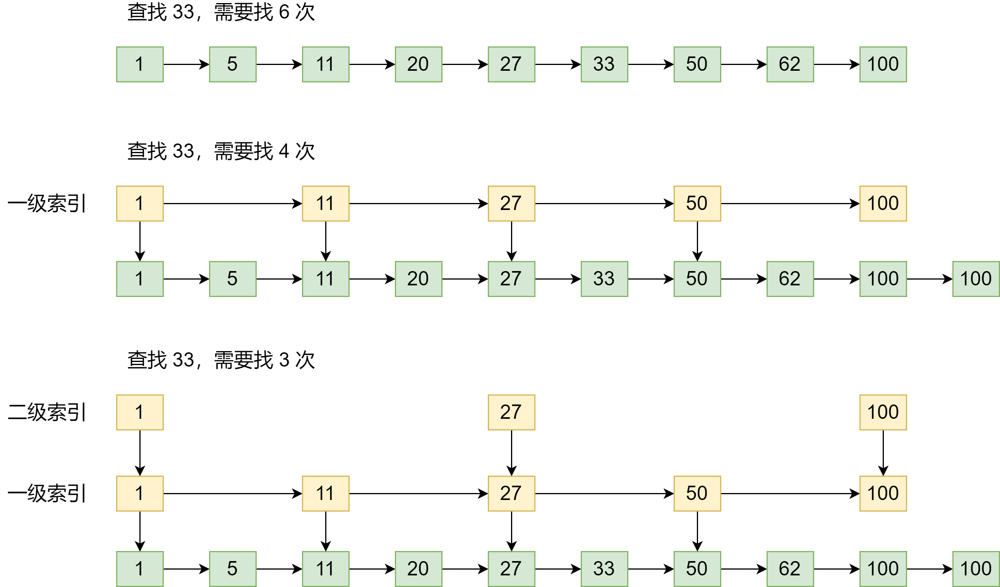

Redis 为什么能那么快？一方面是因为它是内存数据库，所有操作都在内存上完成，内存的访问速度本身就很快。另一方面，这要归功于它的数据结构。这是因为，键值对是按一定的数据结构来组织的，操作键值对最终就是对数据结构进行增删改查操作，所以高效的数据结构是 Redis 快速处理数据的基础

Redis 的数据结构有哪些呢？你可能会说，是 String、List、Hash、Set 和 Sorted Set 吗？其实，这些知识 Redis 键值对中值的数据类型，也就是数据的保存形式。而这里，我们说的数据结构，是要去看看它们的底层实现

简单来说，底层数据结构一共有 6 种，分别是**简单动态字符串、双向链表、压缩链表、哈希表、跳表和整数数组**。它们和数据类型的对应关系如下：

可以看到，String 类型的底层实现只有一种数据结构，也就是简单动态字符串。而 List、Hash、Set 和 Sorted Set 这四种数据类型，都有两种底层实现结构。通常情况下，我们会把这四种类型称为集合类型，它们的特点是**一个键对应了一个集合的数据**

### 键和值用什么结构组织

为了实现从键到值的快速访问，Redis 使用了一个哈希表来保存所有键值对

一个哈希表，其实就是一个数组，数组的每个元素成为一个哈希桶。所以，一个哈希表由多个哈希桶组成，每个哈希桶中保存了键值对数据

如果值是集合类型的话，作为数组元素的哈希桶怎么来保存呢？其实，哈希桶中的元素保存的并不是值本身，而是指向具体值的指针。即，不管值是 String，还是集合类型，哈希桶中的元素都是指向它们的指针

下图中，哈希桶中的 entry 元素中保存了 *key 和 *value 指针，分别指向了实际的键和值，这样一来，即使值是一个集合，也可以通过 *value 指针查找到

因为这个哈希表保存了所有的键值对，所以，我也把它成为**全局哈希表**。哈希表的最大好处，就是让我们可以用 O(1) 的时间复杂度来快速查找到键值对。我们只要计算键的哈希值，就可以知道它所对应的哈希桶位置，然后就可以访问相应的 entry 元素

虽然我们知道了哈希表的 O(1) 复杂度和快速查找特性，那么，你往 Redis 中写入大量数据后，就可能发现操作有时候会突然变慢了。这其实是因为你忽略了一个潜在的风险点，那就是**哈希表的冲突问题和 rehash 可能带来的操作阻塞**

### 为什么哈希表操作变慢了？

当你往哈希表中写入更多数据时，哈希冲突是不可避免的问题。这里的哈希冲突，是指两个 key 的哈希值和哈希桶计算对应关系时，正好落在了同一个哈希桶中

Redis 解决哈希冲突的方式，就是链式哈希。链式哈希，是指**同一个哈希桶中的多个元素用一个链表来保存，它们之间依次用指针连接**

但是，这里依然存在一个问题，哈希冲突链上的元素只能通过指针逐一查找再操作。如果哈希表里写入的数据越来越多，哈希冲突可能也会越来越多，这就会导致某些哈希冲突链过长，进而导致这个链上的元素查找耗时长，效率变低

所以，Redis 会对哈希表做 rehash 操作。rehash 也就是增加现有的哈希桶数量，让主键增多的 entry 元素能在更多的桶之间分散保存，减少单个桶中的元素数量，从而减少单个桶中的冲突。具体怎么做呢？

其实，为了 rehash 操作更高效，Redis 默认使用了两个全局哈希表：哈希表 1 和哈希表 2.一开始，当你刚插入数据时，默认使用哈希表 1，此时的哈希表 2 并没有被分配空间。随着数据逐步增多，Redis 开始执行 rehash，这个过程分为三步：

1. 给哈希表 2 分配更大的空间，例如是当前哈希表 1 大小的两倍
2. 把哈希表 1 中的数据重新映射并拷贝到哈希表 2 中
3. 释放哈希表 1 的空间

到此，我们就可以从哈希表 1 切换到哈希表 2，用增大的哈希表 2 保存更多数据，而原来的哈希表 1 留作下一次 rehash 扩容备用

这个过程看似简单，但是第二次涉及大量的数据拷贝，如果一次性把哈希表 1 中的数据都迁移完，会造成 Redis 线程阻塞，无法服务其他请求。此时，Redis 就无法快速访问数据了

为了解决这个问题，Redis 采用了**渐进式 rehash**

简单说就是在第二步拷贝数据时，Redis 仍然正常处理客户端请求，每处理一个请求时，从哈希表 1 中的第一个索引位置开始，顺带着将这个索引位置上的所有 entries 拷贝到哈希表 2 中；等处理下一个请求时，再顺带拷贝哈希表 1 中的下一个索引位置的 entries。如图：

这样就巧妙地把一次性大量拷贝的开销，分摊到了多次处理请求的过程中，避免了耗时操作，保证了数据的快速访问

### 集合数据操作效率

和 String 类型不同，一个集合类型的值，第一步是通过全局哈希表找到对应的哈希桶位置，第二步是在集合中再增删改查。那么，集合的操作效率和哪些因素相关呢？

首先，与集合的底层数据结构有关。例如，使用哈希表实现的集合，要比使用链表实现的集合访问效率更高。其次，操作效率和这些操作本身的执行特定有关，比如读写一个元素的操作要比读写所有元素的效率高

### 有哪些底层数据结构

上面说过，集合类型的底层数据结构主要有 5 种：整数数组、双向链表、哈希表、压缩列表和跳表

其中，哈希表的操作特点上面已经说过了；整数数组和双向链表也很常见，它们的操作特征都是顺序读写，也就是通过数组下标或者链表的指针逐个元素访问，操作复杂度基本是 O(N)，操作效率比较低；压缩列表和跳表我们平时接触得不多，但他们也是 Redis 重要的数据结构

压缩列表类似于一个数组，数组中的每一个元素都对用保存一个数据。和数组不同的是，压缩列表在表头有三个字段：`zlbytes`、`zltail` 和 `zllen`，分别表示列表长度、列表尾的偏移量和列表中的 entry 个数；压缩列表在表尾还有一个 `zlend`，表示列表结束

在压缩列表中，如果我们要查找定位第一个元素和最后一个元素，可以通过表头三个字段的长度直接定位，复杂度是 O(1)。而查找其他元素时，就没有那么高效了，只能逐个查找，此时的复杂度就是 O(N) 了

接着看看跳表

有序链表只能逐一查找元素，导致操作起来非常缓慢，于是就出现了跳表。具体来说，跳表在链表的基础上，**增加了多级索引，通过索引位置的几个跳转，实现数据的快速定位**。如下：

如果我们要在链表查找 33 这个元素，只能从头开始遍历链表，查找 6 次，直到找到 33 为止。此时，复杂度是 O(N)，查找效率很低

为了提高查找速度，我们增加了多级索引。可以看到，这个查找过程就是在多级索引上跳来跳去，最后定位到元素。当数据量很大时，跳表的复杂度就是 O(logN)

我们总结一下各个数据结构的时间复杂度

### 不同操作的复杂度

集合类型的操作类型很多，有读写单个集合元素的，例如 HGET、HSET，也有操作多个元素的，比如 SADD，还有对整个集合进行遍历操作的，例如 SMEMBERS。这么多操作，它们的复杂度也各不相同。而复杂度高低又是我们选择集合类型的重要依据

这里有一个口诀：

- 单元素操作是基础
- 范围操作非常耗时
- 统计操作通常高效
- 例外情况只有几个

第一，**单元素操作，是指每一种集合类型对单个数据实现的增删改查操作**。例如，Hash 类型的 HGET、HSET 和 HDEL，Set 类型的 SADD、SREM、SRANDMEMBER 等。这些操作的复杂度由集合采用的数据结构决定。

例如，HGET、HSET 和 HDEL 是对哈希表做操作，所以他们的复杂度都是 O(1)；Set 类型用哈希表作为底层数据结构时，它的 SADD、SREM、SRANDMEMBER 复杂度也是 O(1)

第二，**范围操作，是指集合类型中的遍历操作，可以返回集合中的所有数据**，比如 Hash 类型的 HGETALL 和 Set 类的 SMEMBERS，或者返回一个范围内的部分数据，比如 List 类型的 LRANGE 和 ZSet 类型的 ZRANGE。**这类操作的复杂度一般是 O(N)，比较耗时，我们应该尽量避免**

不过，Redis 从 2.8 版本开始提供了 SCAN 系统操作（包含 HSCAN，SSCAN 和 ZSCAN），这类操作实现了渐进式遍历，每次只返回有限数量的数据。这样一来，相比于 HGETALL、SMEMBERS 这类操作来说，就避免了一次性返回所有元素而导致的 Redis 阻塞

第三，统计操作，是指**集合类型对集合中所有元素个数的记录**。例如 LLEN 和 SCARD。这类操作复杂度只有 O(1)，这是因为当集合类型采用压缩列表、双向链表、整数数组这些数据结构时，这些结构中专门记录了元素的个数统计，因此可以高效地完成相关操作

第四，例外情况，是指某些数据结构的特殊记录，例如**压缩列表和双向链表都会记录表头和表尾的偏移量**。这样一来，对于 List 类型的 LPOP、RPOP、LPUSH、RPUSH 这四个操作来说，它们是在列表的头尾增删元素，这就可以通过偏移量直接定位，所以它们的复杂度也只有 O(1)，可以实现快速操作

