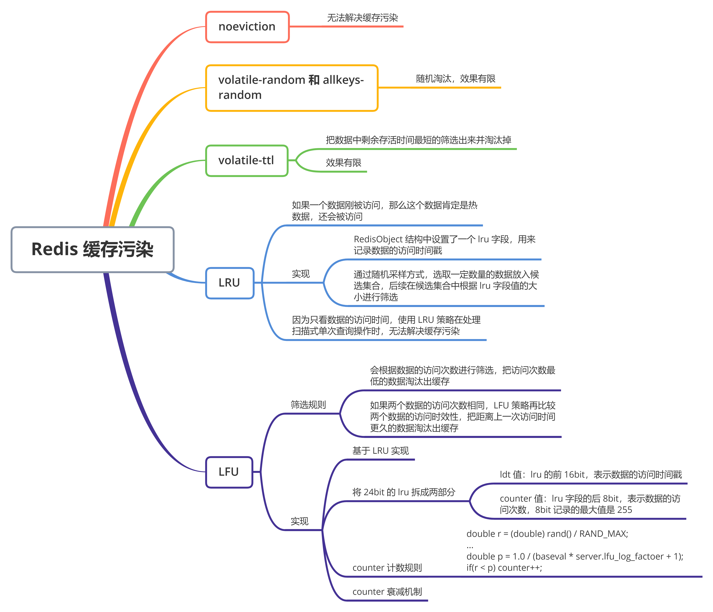
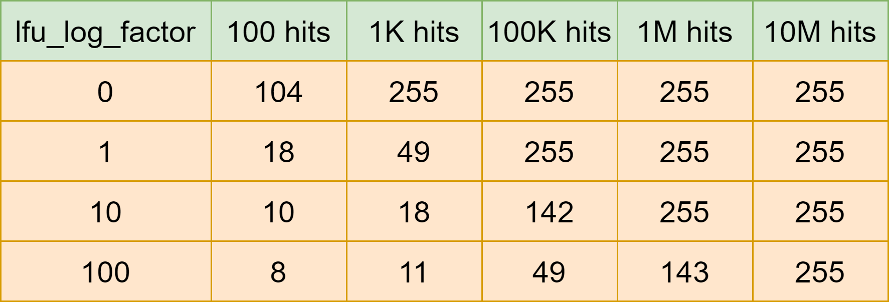

什么是缓存污染？在一些场景下，有些数据被访问的次数非常少，甚至只会被访问一次。当这些数据服务完访问请求后，如果还继续留存在缓存中，就只会白白占用缓存空间。这就是缓存污染


### 解决缓存污染


要解决缓存污染，就要把不会再被访问的数据筛选出来并淘汰掉。这样就不用等到缓存被写满以后，再逐一淘汰旧数据之后，才能写入新数据。而哪些数据能留存在缓存中，是由缓存的淘汰策略决定的


Redis 一共有 8 中数据淘汰策略。分别是 noeviction、volatile-random、volatile-ttl、volatile-lru、volatile-lfu、allkeys-lru、allkeys-random 和 allkeys-lfu 策略


其中，noeviction 策略是不会进行数据淘汰的，所以它不能用来解决缓存污染问题。而 volatile-random 和 allkeys-random 这两种策略，都是采用随机挑选数据的方式，来筛选即将被淘汰的数据


既然是随机挑选，那么 Redis 就不会根据数据的访问情况来筛选数据。如果淘汰的数据又被访问了，就会发生缓存缺失。即，应用需要到后端数据库访问这些数据，降低了应用的请求响应速度。所以，volatile-random 和 allkeys-random 在避免缓存污染的问题上效果非常有限


而 volatile-ttl 针对是是设置了过期时间的数据，把这些数据中剩余存活时间最短的筛选出来并淘汰掉。虽然 volatile-ttl 策略不再是随机淘汰数据了，但是剩余存活时间并不能直接反映数据再次访问的情况。所以，按照 volatile-ttl 策略淘汰数据，也可能出现数据被淘汰后，被再次访问导致的缓存缺失问题


### LRU 缓存策略


LRU 策略的核心思想：如果一个数据刚刚被访问，那么这个数据肯定是热数据，还会被再次访问


按照这个核心思想，Redis 中的 LRU 策略，会在每个数据对应的 RedisObject 结构体中设置一个 lru 字段，用来记录数据的访问时间戳。在进行数据淘汰时，LRU 策略会在候选数据集中淘汰掉 lru 字段值最小的数据（也就是访问时间最久的数据）


所以，在数据被频繁访问的业务场景中，LRU 策略的确能有效留存访问时间最近的数据。而且，因为留存的这些数据还会被再次访问，所以可以提升业务应用的访问速度


但是，也正是**因为只看数据的访问时间，使用 LRU 策略在处理扫描式单次查询操作时，无法解决缓存污染**。所谓的扫描式查询操作，就是指应用对大量的数据进行一次全体读取，每个数据都会被读取，而且只会被读取一次。此时，因为这些被查询的数据刚刚被访问过，所以 lru 字段值都很大


在使用 LRU 策略淘汰数据时，这些数据会留存在缓存中很长一段时间，造成缓存污染。如果查询的数据量很大，这些数据占满了缓存空间，却有不会服务新的缓存请求，此时，再有新数据要写入缓存的话，还是需要先把这些旧数据替换出缓存才行，这会影响缓存的性能


所以，对于采用了 LRU 策略的 Redis 缓存来说，扫描式单词查询会造成换粗污染。为了应对这类缓存污染问题，Redis 从 4.0 版本开始增加了 LFU 淘汰策略


与 LRU 策略相比，LFU 策略中会从两个维度来筛选并淘汰数据：一是，数据访问的时效性；二是，数据的被访问次数


### LFU 缓存策略的优化


LFU 缓存策略是在 LRU 策略基础上，为每个数据增加了一个计数器，来统计这个数据的访问次数。当使用 LFU 策略筛选淘汰数据时，**首先会根据数据的访问次数进行筛选，把访问次数最低的数据淘汰出缓存。如果两个数据的访问次数相同，LFU 策略再比较这两个数据的访问时效性，把距离上一次访问时间更久的数据淘汰出缓存**


和那些被频繁访问的数据相比，扫描式单次查询的数据因为不会被再次访问，所以它们的访问次数不会再增加。因此，LFU 策略会优先把这些访问次数低的数据淘汰出来缓存。这样，LFU 策略就可以避免这些数据对缓存造成污染了


那么，LFU 策略具体是如何实现的呢？既然 LFU 策略是在 LRU 策略上做的优化，那它们的实现必然有些关系。我们先看看 LRU 策略的实现


为了避免操作链表的开销，Redis 在实现 LRU 策略时使用了两个近似方法：


- Redis 是用 RedisObject 结构来保存数据的，RedisObject 结构中设置了一个 lru 字段，用来记录数据的访问时间戳
- Redis 并没有为所有的数据都维护一个全局链表，而是通过随机采样方式，选取一定数量（例如 10 个）的数据放入候选集合，后续在候选集合中根据 lru 字段值的大小进行筛选


在此基础上，**Redis 在实现 LFU 策略的时候，只是把原来 24bit 大小的 lru 字段，又进一步拆分成了两部分**：


1. ldt 值：lru 字段的前 16bit，表示数据的访问时间戳
2. counter 值：lru 字段的后 8bit，表示数据的访问次数


总结一下：当 LFU 策略筛选数据时，Redis 会在候选集合中，根据数据 lru 字段的后 8bit 选择访问次数最少的数据进行淘汰。当访问次数相同时，再根据 lru 字段的前 16bit 值大小，选择访问时间最久远的数据进行淘汰


但是，**Redis 只使用了 8bit 记录数据的访问次数，而 8bit 记录的最大值是 255**，这可以吗？在实际应用中，一个数据可能会被访问成千上万次，如果每被访问一次，counter 值就加 1 的话，那么，只要访问次数超过了 255，数据的 counter 值就一样了。在进行数据淘汰时，LFU 策略就无法很好地区分并筛选这些数据，反而还可能把不怎么访问的数据留存在缓存中


所以，在实现 LFU 策略时，**Redis 并没有采用数据每被访问一次，就给对应的 counter 值加 1 的计数规则，而是采用了更优化的计数规则**


LFU 策略实现的计数规则是：每当数据被访问一次时，首先，用计数器当前的值乘以配置项 `lfu_log_factor` 再加 1，在取其倒数，得到一个 p 值；然后，把这个 p 值和一个取值范围在 (0, 1) 间的随机数 r 值比大小，只有 p 值大于 r 值时，计数器再加 1


如下，显示了 LFU 策略增加计数器值的计算逻辑。其中，baseval 是计数器当前的值。计数器的初始值默认是 5（由代码中的 LFU_INIT_VAL 常量设置），而不是 0，这样可以避免数据刚被写入缓存，就因为访问次数太少而被立即淘汰


```java
double r = (double) rand() / RAND_MAX;
...
double p = 1.0 / (baseval * server.lfu_log_factoer + 1);
if(r < p) counter++;
```


使用了这种计算规则后，我们可以通过设置不同的 `lfu_log_factor` 配置项，来控制计数器增加的速度，避免 counter 值很快就到 255 了


为了更进一步说明 LFU 策略计数器递增的效果，可以看下面这张表，这是 Redis 官网提供的一张表，记录了当 lfu_log_factor 取不同值时，在不同的实际访问次数情况下，计数器的值是如何变化的





因为使用了非线性递增的计数器方法，即使缓存数据的访问次数成千上万，LFU 策略也可以有效地区分不同的访问次数，从而进行合理的筛选。上图中可以看到，当 lfu_log_factor 取值为 10 时，百、千、十万级别的访问次数对应的 counter 值已经有明显的区分了，所以，我们在应用 LFU 策略时，一般可以将 lfu_log_factor 取值为 10


在一些场景下，有些数据在短时间内被大量访问后就不会再被访问了。那么再按照访问次数来筛选的话，这些数据会被留存在缓存中，但不会提升缓存命中率。为此，Redis 在实现 LFU 策略时，还设计了一个 counter 值的衰减机制


简单来说，LFU 策略使用衰减因子配置项 `lfu_decay_time` 来控制访问次数的衰减。LFU 策略会计算当前时间和数据最近一次访问时间的差值，并把这个差值换算成以分钟为单位。然后，LFU 策略再把这个差值除以 lfu_decay_time 值，得到的结果就是数据 counter 要衰减的值


例如，假设 lfu_decay_time 取值为 1，如果数据在 N 分钟内没有被访问，那么它的访问次数就要减 N。如果 lfu_decay_time 取值更大，那么相应的衰减值会变小，衰减效果也会减弱。所以，如果业务应用中有短时高频访问的数据的话，建议把 lfu_decay_time 值设置为 1，这样一来，LFU 策略在它们不再被访问后，会较快地衰减它们的访问次数，尽早把它们从缓存中淘汰出去，避免缓存污染