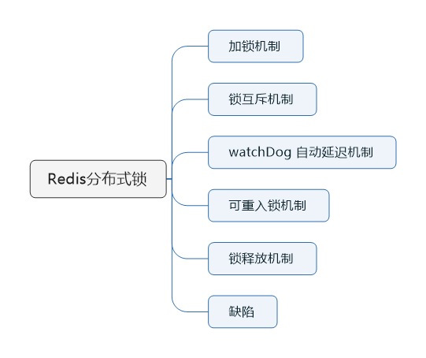
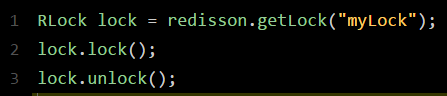
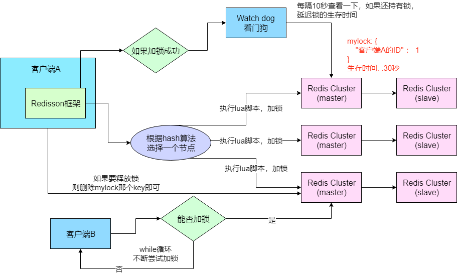
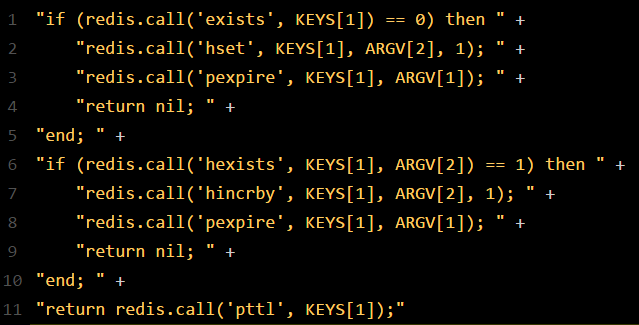
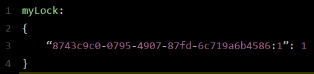
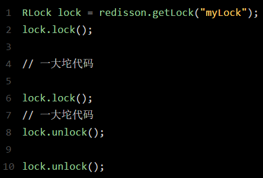
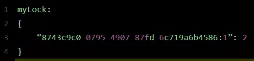

> 本节思维导图

​		目前基于Redis实现的分布式锁常用的框架是**Redisson**,它的使用比较简单，在项目中引入Redisson的依赖，然后基于Redis实现分布式锁的加锁与释放锁，如下所示：

​		接下来我们就说一下Redisson这个框架对于Redis分布式锁的实现原理。

## Redis分布式锁的底层原理

​		Redisson这个框架对Redis分布式锁的实现原理图如下：

### 加锁机制

​		某个客户端要加锁。如果该客户端面对的是一个Redis Cluster集群，它首先会根据hash节点选择一台机器，这里注意，仅仅只是选择一台机器。紧接着就会发送一段lua脚本到redis上，lua脚本如下所示：

​		使用lua脚本，可以把一大堆业务逻辑通过封装在lua脚本发送给redis，保证这段赋值业务逻辑执行的**原子性**。在这段脚本中，这里**KEYS[1]**代表的是你加锁的那个key，比如说：RLock lock = redisson.getLock("myLock");这里你自己设置了加锁的那个锁key就是“myLock”。

​		**ARGV[1]**代表的就是锁key的默认生存时间，默认30秒。**ARGV[2]**代表的是加锁的客户端的ID，类似于下面这样：8743c9c0-0795-4907-87fd-6c719a6b4586:1。

​		脚本的意思大概是：第一段if判断语句，就是用“**exists myLock**”命令判断一下，如果你要加锁的那个key不存在，就可以进行加锁。加锁就是用“**hset myLock 8743c9c0-0795-4907-87fd-6c719a6b4586:1 1**”命令。通过这个命令设置一个hash数据结构，这个命令执行后，会出现一个类似下面的数据结构：

​		上述就代表“8743c9c0-0795-4907-87fd-6c719a6b4586:1”这个客户端对“myLock”这个锁key完成了加锁。接着会执行“**pexpire myLock 30000**”命令，设置myLock这个锁key的**生存时间是30秒**。好了，到此为止，ok，加锁完成了。

### 锁互斥机制

​		如果这个时候客户端B来尝试加锁，执行了同样的一段lua脚本。第一个if判断会执行“exists myLock”，发现myLock这个锁key已经存在。接着第二个if判断，判断myLock锁key的hash数据结构中，是否包含客户端B的ID，但明显没有，那么客户端B会获取到**pttl myLock**返回的一个数字，代表myLock这个锁key的**剩余生存时间**。此时客户端B会进入一个while循环，不听的尝试加锁。

### watch dog自动延期机制

​		客户端A加锁的锁key默认生存时间只有30秒，如果超过了30秒，客户端A还想一直持有这把锁，怎么办？其实只要客户端A一旦加锁成功，就会启动一个watch dog看门狗，**它是一个后台线程，会每隔10秒检查一下**，如果客户端A还持有锁key，那么就会不断的延长锁key的生存时间。

### 可重入加锁机制

​		客户端A已经持有锁了，然后可重入加锁，如下代码所示：

​		这个时候lua脚本是这样执行的：**第一个if判断不成立**，“exists myLock”会显示锁key已经存在了。**第二个if判断会成立**，因为myLock的hash数据结构中包含的那个ID，就是客户端A的ID，此时就会执行可重入加锁的逻辑，它会用“incrby myLock 8743c9c0-0795-4907-87fd-6c71a6b4586:1 1  ”这个命令对客户端A的加锁次数，累加1，此时myLock的数据结构变成下面这样：

​		即myLock的hash数据结构中的那个客户端ID，就对应着加锁的次数。

### 释放锁机制

​		执行lock.unlock()，就可以释放分布式锁。释放逻辑是：每次对myLock数据结构中的那个加锁次数减1，如果加锁次数为0了，说明客户端已经不再持有锁了，此时就会用“**del MyLock**”命令，从redis里删除了这个key。然后另外的客户端B就可以尝试完成加锁了。

### 上述Redis分布式锁的缺点

​		上面方案的最大问题，就是如果你对某个redis master实例，写入了myLock这种锁key的value，此时会异步复制给对应的master slave实例，但是这个过程中如果发送redis master宕机，主备切换，redis slave变为了redis master。

​		这就会导致客户端B来尝试加锁的时候，在新的redis master上完成了加锁，而客户端A也以为自己成功加了锁，此时就会导致多个客户端对一个分布式锁完成了加锁。这时就会导致各种脏数据的产生。

​		所以这个就是redis cluster，或者是redis master-slave架构的主从异步复制导致的redis分布式锁的最大缺陷：**在redis master实例宕机的时候，可能导致多个客户端同时完成加锁**。