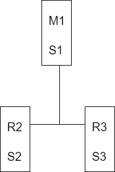

## 哨兵的介绍

​		sentinel，也叫哨兵。哨兵是Redis集群机构中非常重要的一个组件，有以下功能：

- 集群监控：负责监控redis master和slave进程是否正常工作。
- 消息通知：如果某个redis实例有故障，那么哨兵负责发送消息作为报警通知给管理员。
- 故障转移：如果master node挂掉了，会自动转移到slave node上。
- 配置中心：如果故障转移发生了，通知client客户端新的master地址。

​        哨兵用于实现Redis集群的高可用，本身也是分布式的，作为一个哨兵集群去运行，互相协同工作。

- 故障转移时，判断一个master node是否宕机了，需要大部分的哨兵都同意才行，涉及到了分布式选举的问题。
- 即使部分哨兵节点挂掉了，哨兵集群还是能正常工作。

## 哨兵的核心知识

### sdown和odown转换机制

- sdown是主观宕机，就一个哨兵如果自己觉得一个master宕机了，那么就是主观宕机。
- odown是客观宕机，如果quorum数量的哨兵都觉得一个master宕机了，那么就是客观宕机。

sdown达成的条件比较简单，如果一个哨兵ping一个master，超过了`is-master-down-after-milliseconds`指定的毫秒数之后，就主观认为master宕机了；如果一个哨兵在指定的时间内，收到了quorum数量的其他哨兵也认为那个master是sdown，那么就认为是odown。

### quorum（法定人数）和majority

​		每次一个哨兵要做主备切换，首先需要quorum数量的哨兵认为odown，然后选举出一个哨兵来做切换，这个哨兵还需要得到majority哨兵的授权，才能正式执行切换。

​		如果quorum < majority，比如5个哨兵，majority就是3， quorum设置为2，那么就需要3个哨兵授权就可以执行切换。

​		如果quorum >= majority，那么必须quorum数量的哨兵都授权，比如5个哨兵，quorum是5，那么必须5个哨兵都同意授权，才能执行切换。

### 核心知识

- 哨兵至少需要3个实例，来保证自己的健壮性。
- 哨兵 + Redis主从的部署架构，是**不保证数据零丢失**的，只能保证redis集群的高可用性。
- 对于哨兵 + redis主从这种复制的部署架构，尽量在测试环境和生产环境，都进行充足的测试和演练。

   哨兵集群必须部署2个以上节点，如果哨兵集群仅仅部署了2个哨兵实例，quorum = 1。

​	配置`quorum = 1`，如果master宕机，两个哨兵只要有1个哨兵认为master宕机了，就可以进行切换，同时会选举出一个哨兵来执行故障转移，但是同时这个时候，需要majority个哨兵，也就是大多数哨兵是运行的。	

```
2 个哨兵，majority=2
3 个哨兵，majority=2
4 个哨兵，majority=2
5 个哨兵，majority=3
...
```

​	如果此时只是Master宕机，哨兵1正常运行，那么故障转移时OK的，如果是Master和哨兵1运行的机器宕机了，那么哨兵只有一个，此时就没有majority数量个哨兵来执行故障转移，虽然另外一台机器上还有一个哨兵，但是故障转移不会执行。

​	经典的3节点哨兵集群是这样的：



​	配置`quorum = 2`，如果M1所在机器宕机了，那么三个哨兵还剩下2个，S2和S3可以一致认为master宕机了，然后选举一个来执行故障转移，同时3个哨兵的majority是2，所以还剩下2个哨兵运行着，就可以允许执行故障转移。

## Redis哨兵主备切换的数据丢失问题

### 异步复制导致的数据丢失

​		因为master -> slave的复制是异步的，所以可能有部分数据还没复制到slave，master就宕机了，此时这部分数据就丢失了。

### 脑裂导致的数据丢失

​		脑裂，即某个master所在机器突然**脱离了正常的网络**，跟其他slave机器不能连接，但是实际上master还运行着，此时哨兵可能就会认为master宕机了，然后开启选举，将其他slave切换成了master。这个时候，集群里就会有两个master，这就是所谓的**脑裂**。

​		此时虽然某个slave被切换成了master，但是可能client还没来得及切换到新的master，还继续向旧的master写数据。因此旧master再次恢复的时候，会被作为一个master挂到新的master上去，自己的数据会清空，重新从新的master复制数据，而新的master并没有后来client写入的数据，因此这部分数据也就丢失了。

### 数据丢失问题的解决方案

可行进行如下配置：

```
min-slaves-to-write 1
min-slaves-max-lag 10
```

表示，要求至少有1个slave，数据复制和同步的延迟不能超过10秒。

- 减少异步复制数据的丢失

​        有了`min-slaves-max-lag`这个配置，就可以确保说，一旦slave复制数据和ack延时太长，就认为可能master宕机后损失的数据太多了，那么就拒绝写请求，这样可以把master宕机时由于部分数据未同步到slave导致的数据丢失降低到可控范围内。

- 减少脑裂的数据丢失

​        如果一个master出现了脑裂，跟其他slave丢了连接，那么上面两个配置可以确保说，如果不能继续给指定的slave发送数据，而且slave超过了10秒没有给自己（master）ack消息，那么就直接拒绝客户端的写请求，因此在脑裂的情况下，最多就丢失10秒的数据。

## 哨兵集群的自动发现机制

​		哨兵互相之间的发现，是通过redis的`pub/sub`系统实现的，每个哨兵都会往`_sentine__:hello`这个channel里发送一个消息，这时候所有其他哨兵都可以消费到这个消息，并感知其他哨兵的存在。

​		每隔两秒钟，每个哨兵都会往自己监控的某个maser + slave对应的`_sentinel__:hello`channel里发送一个消息，内容是自己的Host、ip和runid还有对这个master的监控配置。

​		每个哨兵也会去**监听**自己监控的每个 master+slaves 对应的 `__sentinel__:hello` channel，然后去感知到同样在监听这个 master+slaves 的其他哨兵的存在。

​		每个哨兵还会跟其他哨兵交换对 `master` 的监控配置，互相进行监控配置的同步。

## slave配置的自动纠正

​		哨兵回负责自动纠正slave的一些配置，比如slave如果要成为潜在的master候选人，哨兵会确保复制现有的master数据；如果slave连接到了一个错误的master上。比如故障转移后，那么哨兵会确保它们连接到正确的master上。

## slave -> master选举算法

​		如果一个master被认为odown，而且majority数量的哨兵都允许主备切换，那么某个哨兵就会执行住别切换操作，此时需要选举一个slave来当master，会考虑slave的一些信息：

- 跟master断开连接的时长

- slave优先级

- 复制offset

- run id

​        如果一个slave跟master断开连接的时间已经超过了`down-after-milliseconds`的10倍，外加master的宕机的时长，那么slave就被认为不适合选举为master

```
(down-after-milliseconds * 10) + milliseconds_since_master_is_in_SDOWN_state
```

​		接下来会对slave进行排序：

- 按照slave优先级进行排序，slave priority越低，优先级越高。
- 如果slave priority相同，那么看replica offset，哪个slave复制了越多的数据，offset越靠后，优先级就越高。
- 如果上面两个条件都相同，那么选一个run id比较小的那个。

## configuration epoch

​		哨兵会对一套redis master + slaves进行监控，有相应的监控配置。

​		执行切换的那个哨兵，会从要切换到新的master（slave -> master）那里得到一个configuration epoch，这就是一个version号，每次切换的version号都必须是唯一。

​		如果第一个选举出的哨兵切换失败，那么其他哨兵，就会等待`failover-timeout`时间，然后接替继续执行切换，此时会重新获取一个新的configuration epoch，作为新的version号。

## configuration传播

​		哨兵完成切换之后，会在自己本地更新生成最新的master配置，然后同步给其他的哨兵，就是通过之前说的`pub/sub`消息机制。

​		这里之前的version号就很重要了，以为各种消息都是通过一个channel去发布和监听的，所以一个哨兵完成一次新的切换之后，新的master配置是跟着新的version号的。其他的哨兵都是根据版本号的大小来跟新自己的master配置的。