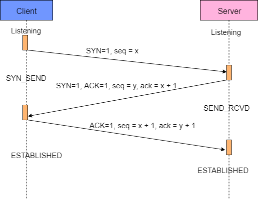

## fork耗时操作导致高并发请求延时

​		Redis在开启RDB和AOF持久化机制的时候，会有生成RDB快照，AOF rewrite等耗费磁盘IO的操作，此时主进程会fork子进程去执行。fork的时候，子进程需要拷贝父进程的空间内存页表的，这个也会耗费一定的时间。一般来说，如果父进程内存有1个G的数据，那么fork可能会耗费20ms左右，如果是 10G ~ 30G，那么就会耗费 200 ~ 600ms，也就是几百毫秒的时间。可以在redis中执行`info stats`，其中的latest_fork_usec，可以看到最近一次form的时长。

​		如果redis单机QPS是几万，fork可能一下子就会拖慢几万条操作的请求时长。

### 优化思路

​		fork耗时跟redis主进程的内存有关系，一般控制redis的内存在10GB以内。

## AOF的阻塞问题

​		redis将数据写入AOF缓冲区，然后会每秒做一次fsync。**但是redis主线程会检查两次fsync的时间，如果距离上次fsync时间超过了2秒，那么写请求就会阻塞**。这样可以保证redis最多丢失2秒的数据，但一旦fsync超过2秒的延时，整个redis就会被拖慢。

### 优化思路

​		优化硬盘写入速度，建议采用SSD，不要用普通的机械硬盘。

## 主从复制延迟问题

​		主从复制可能会超时严重，这个时候需要良好的监控和报警机制，在redis中执行`info replication`，可以见到master和slave复制的offset，做一个差值就可以看到对应的延迟量，如果延迟过多，那么就进行报警。

## 主从复制风暴问题

​		如果一下子让多个slave从master去执行全量复制，一份大的RDB同时发送到多个slave，会导致网络带宽被严重占用。如果一个master需要挂载很多个slave，那么尽量用树状结构，不要用星型结构。

## Linux系统内核的优化

​		不同版本的Linux系统设置可能不一样，以下的内容只是提供一个思路，具体命令请根据不同的版本号自行百度。

### vm.overcommit_memory

​		执行`cat /proc/sys/vm/overcommit_memory`，默认情况会返回0。这些数字代表的意义如下：

- 0：检查有没有足够内存，没有的话申请内存失败
- 1：允许使用内存直到用完为止
- 2：内存地址空间不能超过swap + 50%

​        如果是0的话，可能导致类似fork等操作执行失败，申请不到足够的内存空间。可以将该参数设置为1。可以先后执行`echo "vm.overcommit_memory=1" >> /etc/sysctl.conf`和`sysctl vm.overcommit_memory=1`。

### swapiness

​		执行`cat /proc/version`，查看系统内核版本。

​		如果Linux内核版本<3.5，那么swapiness设置为0，这样系统宁愿swap也不会oom killer（杀掉进程）

​		如果Linux内核版本>=3.5，那么swapiness设置为1，这样系统宁愿swap也不会oom killer。

​		这样可以保证redis不会被杀掉。

```shell
echo 0 > /proc/sys/vm/swappiness
echo vm.swapiness=0 >> /etc/sysctl.conf
```

### 最大打开文件句柄

​		`ulimit -n 10032 10032`

### tcp backlog

​		开始之前我们先回忆一下TCP建立连接的三次握手：

- Client发出一个数据包并将SYN置1，表示希望建立连接。这个包中的序列号假设是x。并将状态修改为SYN_SENT。
- Server抽到Client发过来的数据包后，通过SYN得知这是一个建立连接的请求。于是发送一个响应包并将SYN和ACK都置1。假设这个包中的序列号是y，而确认序列号必须是x+1，表示收到了A发过来的SYN。并将自己的状态修改为SYN_RCVD，并把该请求放到syns queue队里中。
- Client收到Server的响应包后进行确认，确认包中将ACK置1，并将确认序列号设置为y+1，表示收到了B的SYN。此时将状态修改为ESTABLISHED
- Server收到ACK后，将状态修改为ESTABLISHED，并把该请求从syns queue中放到accept queue。



​		在Linux系统内核中维护了两个队列：sync queue和accept queue。

- sync queue：用于保存半连接状态的请求，其大小通过/proc/sys/net/ipv4/tcp_max_syn_backlog指定，一般默认值是512，不过这个设置有效的前提是系统的syncookies功能被禁用。互联网常见的TCP SYN FLOOD恶意DOS攻击方式就是建立大量的半连接状态的请求，然后丢弃，导致syns queue不能保存其它正常的请求。

- accept queue：用于保存全连接状态的请求，其大小通过/proc/sys/net/core/somaxconn指定，在使用listen函数时，内核会根据传入的backlog参数与系统参数somaxconn，取二者的较小值。

  如果accpet queue队列满了，server将发送一个ECONNREFUSED错误信息Connection refused到client。

​         这个方案就是调大accept queue的大小，其默认值是128，我们可以将其设置为511.

```shell
cat /proc/sys/net/core/somaxconn
echo 511 > /proc/sys/net/core/somaxconn
```

