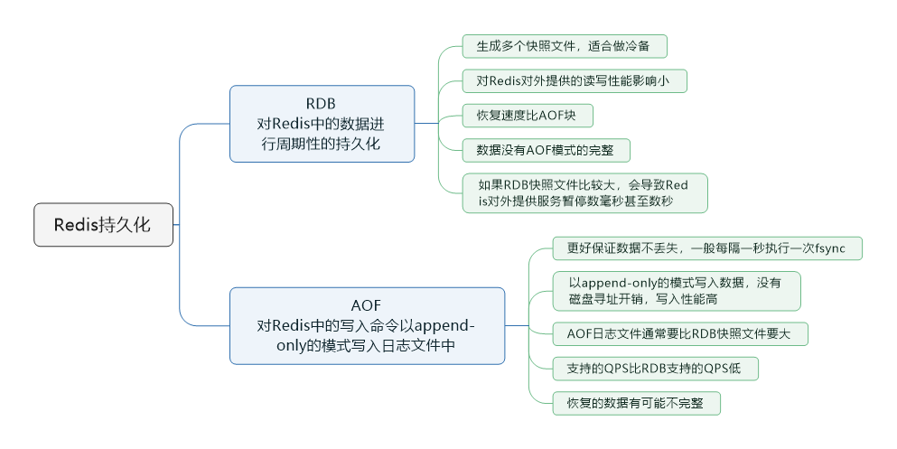

> 本节思维导图

​		Redis如果仅仅只是将数据缓存在内存里面，如果Redis宕机了再重启，内存里的数据就全部弄丢了。所以得用Redis的持久化机制，将数据写入内存的同时，异步的慢慢的将数据写入磁盘文件里，进行持久化。如果Redis宕机重启，自动从磁盘上加载之前持久化的一些数据即可，也许会丢失少许数据，但是至少不会将所有数据都弄丢。

## Redis持久化的两种方式

- RDB：RDB持久化机制，是对Redis中的数据进行**周期性**的持久化。
- AOF：AOF机制对每条写入命令作为日志，以`append-only`的模式写入一个日志文件中，在Redis重启的时候，可以通过**回放**AOF日志中的写入指令来重新构建整个数据集。

​        通过RDB或AOF，都可以将Redis内存中的数据持久化到磁盘上面来，然后可以将这些数据备份到别的地方去，比如阿里云等云服务等。

​		如果同时使用RDB和AOF两种持久化机制，那么redis重启的时候，会使用**AOF**来重构新数据，因为**AOF中的数据更加完整**。

### RDB优缺点

- RDB会生成多个数据文件，每个数据文件都代表某一个时刻中redis的数据，这种多个数据文件的方式，**非常适合做冷备**，可以将这种完备的数据文件发送到一些远程的安全存储上去，比如国内的阿里云的ODPS分布式存储上，以预定好的备份策略来定期备份redis中的数据。
- RDB对redis对外提供的读写服务，影响非常小，可以让redis保持高性能，因为redis主进程只需要fork一个子进程，让子进程执行磁盘IO操作来进行RDB持久化即可。
- 相对于AOF持久化机制来说，直接基于RDB数据文件来重启和恢复redis进程，更加快速。
- 如果想要在redis故障时，尽可能少的丢失数据，那么RDB没有AOF好。一般来说，RDB数据快照文件，一般都是每隔5分钟，或者更长时间生成一次，这个时候就得接受一旦redis进程宕机，那么会丢失最近5分钟的数据。
- RDB每次在fork子进程来执行RDB快照数据文件生成的时候，如果数据文件特别大，可能会导致对客户端提供的服务暂停数毫秒，或者甚至数秒。

### AOF优缺点

- AOF可以更好的保护数据不丢失，一般AOF会每隔1秒，通过一个后台线程执行一次`fsync`操作，最多丢失1秒钟的数据。
- AOF日志文件以`append-only`模式写入，所以没有任何磁盘寻址的开销，写入性能非常高，而且文件不容易破损，即使尾部破损，也很容易修复。
- AOF日志文件即使过大的时候，出现后台重写操作，也不会影响客户端的读写。因为在`rewrite`log的时候，会对其中的指令进行压缩，创建出一份需要恢复数据的最小日志出来。在创建新日志文件的时候，老的日志文件还是照常写入。当新的merge后日志文件ready的时候，再交换新老日志文件即可。
- AOF日志文件的命令通过非常可读的方式进行记录，这个特定非常适合做灾难性的误删除的紧急操作。比如某人不小心用`flushall`命令清空了所有数据，只要这个时候后台`rewrite`还没有发生，那么就可以立即拷贝AOF文件，将最后一条`flushall`命令给删了，然后再将该AOF文件放回去，就可以通过恢复机制，自动恢复所有数据。
- 对于同一份数据来说，AOF日志文件通常比RDB数据快照文件更大。
- AOF开启后，支持的QPS会比RDB支持的写QPS低，因为AOF一般会配置成每秒`fsync`一次日志文件，当然每秒一次`fsync`性能也还是很高的。但如果实时写入，那么QPS会大降，redis性能会大大降低。
- 以前AOF发生过bug，就是通过AOF记录的日志，进行数据恢复的时候，没有恢复一模一样的数据。因此，类似AOF这种较为复杂的基于命令/merge/回放的方式，比基于RDB每次持久化一份完整的数据快照的方式，更加脆弱一些，容易有bug。不过AOF就是为了rewrite过程导致的bug，因此每次rewrite并不是基于旧的指令日志进行merge，而是**基于当时内存中的数据进行指令的重新构建**，这样健壮性好很多。

**补充**：rewrite类似于普通数据库管理系统日志恢复点，当AOF文件随着写命令的运行膨胀时，当文件大小触碰到临界时，rewrite会被运行。
        rewrite会像replication一样，fork出一个子进程，创建一个临时文件，遍历数据库，将每个key、value对输出到临时文件。输出格式就是Redis的命令，但是为了减小文件大小，会将多个key、value对集合起来用一条命令表达。在rewrite期间的写操作会保存在内存的rewrite buffer中，rewrite成功后这些操作也会复制到临时文件中，在最后临时文件会代替AOF文件。

## RDB和AOF到底该如何选择

- 不要仅仅使用RDB，因为那样会导致你丢失很多数据。
- 也不要仅仅使用AOF，因为那样有两个问题：第一，通过AOF做冷备，没有RDB做冷备来得恢复速度更快；第二，RDB每次简单粗暴生成数据快照，更加健壮，可以避免AOF这种复杂的备份和恢复机制的bug；
- redis支持同时开启两种持久化方式，我们可以综合使用AOF和RDB两种持久化机制，用AOF来保证数据不丢失，作为数据恢复的第一选择，用RDB来做不同程度的冷备，在AOF文件都丢失或损坏不可用的时候，还可以使用RDB来进行快速的数据恢复。

