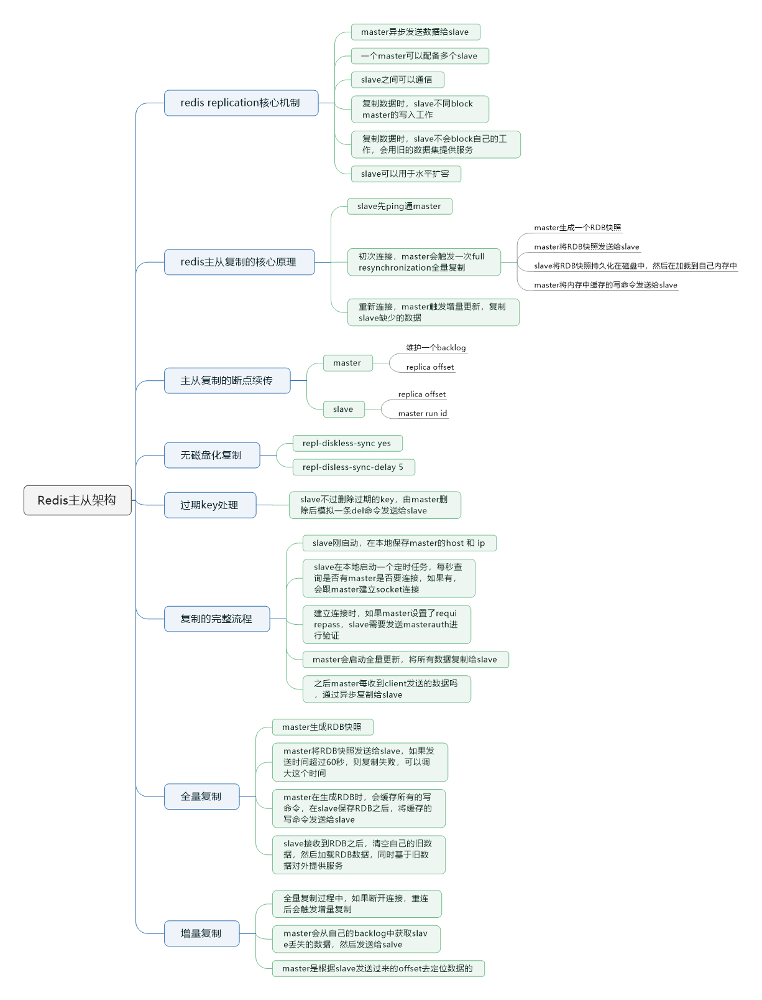
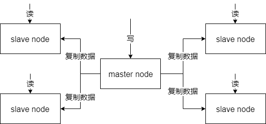
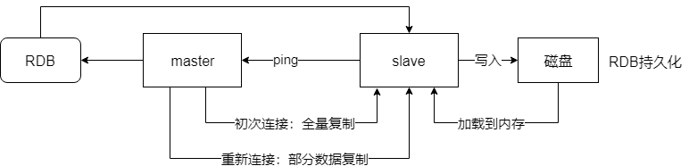
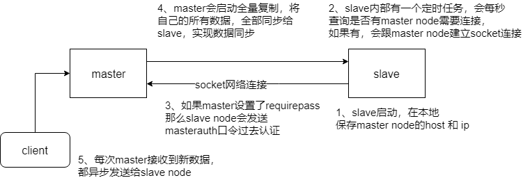

> 本节思维导图
>
> 

## Redis主从架构

​		单机的Redis，能够承载的QPS大概在上万到几万不等。对于缓存来说，一般都是用来支撑**读高并发**的。因此架构设计成主从（master-slave）架构，一主多从，主负责写，并且将数据复制到其他的slave节点，从节点复制读。所有的**读请求全部走从节点**。这样也可以轻松实现水平扩容，**支撑读高并发**。



​		redis replication -> 主从架构 -> 读写分离 -> 水平扩容支撑读高并发

### redis replication的核心机制

- redis采用异步方式复制数据到slave节点，不过redis2.8开始，slave node会周期性地确认自己每次复制的数据量
- 一个master node是可以配置多个slave node的
- slave node也可以连接其他的slave node
- slave node做复制的时候，不会block master node的正常工作
- slave node做复制的时候，也不会block对自己的查询操作，它会用旧的数据集来提供服务；但是复制完成的时候，需要删除旧数据集，加载新数据集，这个时候会暂停对外服务了
- slave node主要用来进行横向扩容，做读写分离，扩容的slave node可以提高读的吞吐量

​        如果采用了主从架构，那么建议必须开启master nod的**持久化**，不建议用slave node作为master node的数据热备，因为那样的话，你关掉了master的持久化，可能在master宕机重启的时候数据是空的，然后可能一经过复制，slave node的数据也丢了。

​		另外，master的各种备份方案 也需要做。如果本地的所有文件丢弃，从备份中挑选一份rdb去恢复master，这样才能**确保启动的时候，是有数据的**。即使采用了高可用机制，slave node可以自动接管master node，但也可能哨兵（sentinel）还没检测到masterfailure，master node自动重启了，还是可能导致上面的slave node数据被清空。

### redis主从复制的核心原理

​		当启动一个slave node的时候，它会发送一个`PSYNC`命令给master node。

​		如果是slave node初次连接到master node，那么会触发一次`full resynchronization`全量复制。此时master会启动一个后台线程，开始生成一份`RDB`快照文件，同时还会将从客户端新收到的所有命令缓存在内存中。`RDB`文件生产完毕后，master会将这个`RDB`发送给slave，slave会先**写入本地磁盘，然后再从本地磁盘加载到内存**中，接着master会将内存中缓存的命令发送给slave，slave也会同步这些数据。slave node如果跟master node有网络故障，断开了连接，会自动重连，连接之后master node仅会复制给slave部分缺失的数据。



### 主从复制的断点续传

​		从redis2.8开始，就支持主从复制的断点续传，如果主从复制过程中，网络连接断掉了，那么就可以接着上次复制的地方，继续复制下去，而不是从头开始复制一份。

​		master node会在内存中维护一个backlog，master和slave都会保存一个replica offset，还有一个master run id，offset就是保存在backlog中的。如果master和slave网络连接断掉了，slave会让master从上次的replica offset开始继续复制，如果没有找到对应的offset，就会执行一次`resynchronization`。

​		使用master run id，是为了定位到上次传输数据的master。如果是根据host + ip定位master node，是不靠谱的，如果master node重启或者数据出现了变化，那么slave node应该根据不同的run id区分。

### 无磁盘化复制

​		master在内存中直接创建`RDB`，然后发送给slave，不会在本地落地磁盘。要想开启这个功能，只需要在配置文件中国开启`repl-diskless-syc yes`即可。

```yaml
repl-diskless-sync yes

# 等待 5s 后再开始复制，因为要等更多 slave 重新连接过来
repl-diskless-sync-delay 5
```

### 过期key处理

​		slave不会过期key，只会等待master过期key。如果master过期了一个key，或者通过LRU淘汰了一个key，那么会模拟一条`del`命令发送给slave。

### 复制的完整流程

​		slave node启动时，会在自己本地保存master node的信息，包括master node的`host`和`ip`，但是复制流程没开始。

​		slave node内部有个定时任务，每秒检查是否有新的master node要连接和复制，如果发现，就跟master node建立socket网络连接。然后master node发送`ping`命令给master node。如果master设置了requirepass，那么slave node必须发送masterauth的口令过去进行认证。master node**第一次执行全量复制**，将所有数据发送给slave node，而在后续，master node持续将写命令，异步复制给slave node。



### 全量复制

- master执行bgsave，在本地生成一份RDB快照文件

- master node将RDB快照文件发送给slave node，如果RDB复制时间超过60秒（repl-timeout），那么slave node就会认为复制失败，可以适当调大这个参数。

- master node在生成RDB时，会将所有新的写命令缓存在内存中，在slave node保存了RDB之后，再将新的写命令复制给slave node

- 如果在复制期间，内存缓冲区持续消耗超过64MB，会在一次性超过256MB，那么停止复制，复制失败。

  ```yaml
  client-output-buffer-limit slave 256MB 64MB 60
  ```

- slave node接收到RDB之后，清空自己的旧数据，然后重新加载RDB到自己内存中，同时**基于旧的数据版本**对外提供服务。

- 如果slave node开启了AOF，那么会立即执行BGREWAITEAOF，重写AOF

### 增量复制

- 如果全量复制过程中，master-slave网络连接断掉了，那么slave重新连接master时，会触发增量复制
- master会直接从自己的backlog中获取部分丢失的数据，发送给slave node，默认backlog就是1MB
- master就是根据slave发送的psync中的offset来从backlog中获取数据的。

### heartbeat

​		主从节点互相都会发送heartbeat信息

​		master默认每隔10秒发送一次heartbeat，slave node每隔1秒发送一个heartbeat。

### 异步复制

​		master每次接收到写命令之后，现在内部写入数据，然后异步发送给slave node

### redis如何才能做到高可用

​		一个slave故障了，并不会影响可用性，还有其他的slave在提供服务。但master node死掉了，会导致无法写数据。没有master可以写数据，slave也就没用了，系统就不可用了。

​		redis的高可用架构，叫做`failover`**故障转移**，也可以叫做主备切换。

​		master node在故障时，自动检测，并且将某个slave node自动切换为master node的过程，叫做主备切换。这个过程就实现了redis的主从架构下的高可用。