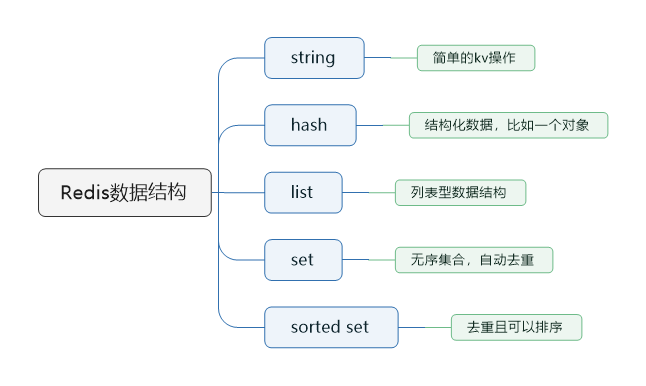

> 本节思维导图



redis主要有以下几种数据类型：

- string
- hash
- list
- set
- sorted set

### string

这是最简单的类型，就是普通的set和get，做简单的KV缓存

```sqlite
set college gpnu
```

### hash

这个是类似map的一种结构，一般是可以将结构化的数据，比如一个对象（前提是**这个对象没嵌套其他对象**）给缓存在redis里，然后每次读写缓存的时候，就可以操作hash里的**某个字段**。

```
hset person name bingo
hset person age 20
hset person id 1
hget person name
```

```json
person = {
    "name": "bingo",
    "age": 20,
    "id": 1
}
```

### list

list是有序列表。可以通过list存储一些列表型的数据结构，类似粉丝列表、文章的评论列表之类的。

还可以通过lrange命令，读取某个闭区间内的元素，可以基于list实现分页查询，基于redis实现简单的高性能分页，可以做类似微博那种下拉不断分页的东西，性能高，就一页一页走

```
# 0开始位置，-1结束位置，结束位置为-1时，表示列表的最后一个位置，即查看所有。
lrange mylist 0 -1
```

```
lpush mylist 1
lpush mylist 2
lpush mylist 3 4 5

# 1
rpop mylist
```

### set

set是无序集合，自动去重。

直接基于set将系统里需要去重的数据扔进去，自动就去去重了。如果你需要对一些数据进行快速的全局去重，如果是单机系统就可以基于Java的HashSet进行去重，如果你的某个系统部署在多台机器上，就可以基于redis进行全局的set去重。

可以基于set玩交集、并集、差集的操作。比如交集，可以把两个人的粉丝列表整一个交集，看看两人的共同好友是谁。或者把两个大V的粉丝放在两个set中，对两个set做交集。

```
#-------操作一个set-------
# 添加元素
sadd mySet 1

# 查看全部元素
smembers mySet

# 判断是否包含某个值
sismember mySet 3

# 删除某个/些元素
srem mySet 1
srem mySet 2 4

# 查看元素个数
scard mySet

# 随机删除一个元素
spop mySet

#-------操作多个set-------
# 将一个set的元素移动到另外一个set
smove yourSet mySet 2

# 求两set的交集
sinter yourSet mySet

# 求两set的并集
sunion yourSet mySet

# 求在yourSet中而不在mySet中的元素
sdiff yourSet mySet
```

### sorted set

sorted set是排序的set，去重但可以排序，写进去的时候给一个分数，自动根据分数排序

```
zadd board 85 zhangsan
zadd board 72 lisi
zadd board 96 wangwu
zadd board 63 zhaoliu

# 获取排名前三的用户（默认是升序，所以需要 rev 改为降序）
zrevrange board 0 3

# 获取某用户的排名
zrank board zhaoliu
```

