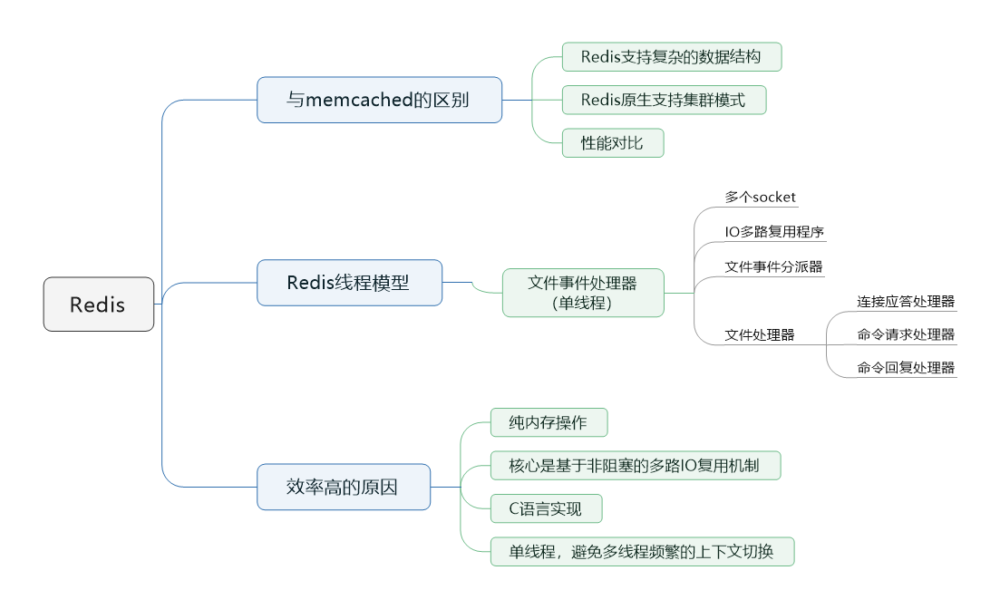
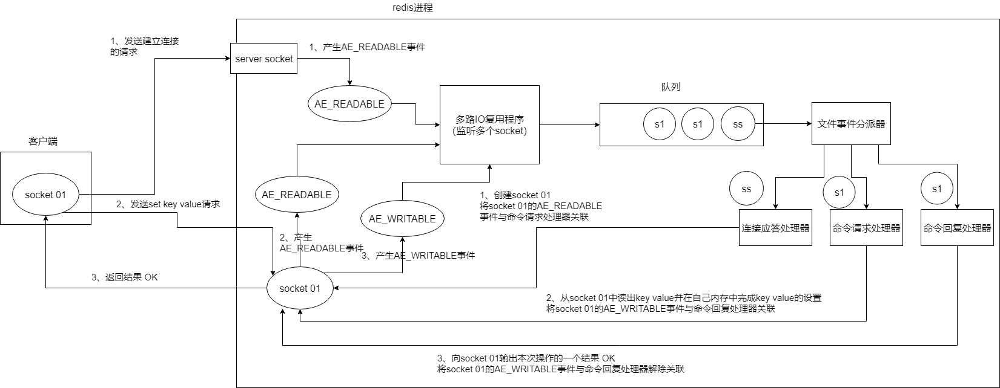

> 本节思维导图

## Redis和Memcached的区别

### Redis支持复杂的数据结构

​		redis相比于memcached来说，拥有更多的数据结构，能支持更丰富的数据操作。如果需要缓存能够支持更复杂的结构和操作，redis相对来说比较好。

### Redis原生支持集群模式

​		redis 3.X便能支持cluster模式，而memcached没有原生的集群模式，需要依靠客户端来实现往集群中分片写入数据。

### 性能对比

​		由于redis只使用单核，而memcached可以使用多核，所以平均每一个核上redis存储小数据时比memcached性能更高。而在100K以上的数据中，memcached性能要高于redis。

## Redis的线程模型

​		redis内部使用文件事件处理器**file event handler**，这个文件事件处理器是单线程的，所以redis才叫做单线程的模型。它采用IO多路复用机制同时监听多个socket，将产生事件的socket压入内存队列中，事件分派器根据socket上的事件类型来选择对应的事件处理器进行处理。

​		文件事件处理器的结构包含4个部分：

- 多个socket
- IO多路复用程序
- 文件事件分派器
- 事件处理器（连接应答处理器、命令请求处理器、命令回复处理器）

客户端与redis的一次通信过程如下：

		首先，redis服务端进程初始化的时候，会将server socket的**AE_READABLE**事件与连接应答处理器关联。

​		客户端socket01向redis进程的server socket请求建立连接，此时server socket会产生一个**AE_READABLE**事件，IO多路复用程序监听到server socket产生的事件后，将该socket压入队列中。文件事件分派器从队列中获取socket，交给**连接应答处理器**。连接应答处理器会创建一个能与客户端通信的socket01，并将该socket01的`AE_READABLE`事件与命令请求处理器关联。

​		假设客户端发送了一个`set key value`请求，此时redis中的socket01会产生`AE_READABLE`事件，IO多路复用程序将socket01压入队列，此时事件分派器从队列中获取到socket01产生的`AE_READABLE`事件，由于前面的socket01的`AE_READABLE`事件已经与命令请求处理器关联，因此事件分派器将事件交给命令请求处理器来处理。命令请求处理器读取socket01的`key value`并在自己内存中完成`key value`的设置，操作完成后，它会将socket01的`AE_WRITABLE`事件与命令回复处理器关联。

​		如果此时客户端准备好接受返回结果了，那么redis中的socket01会产生一个`AE_WRITABLE`事件，同样压入队列，事件分派器找到相关联的命令回复处理器，由命令回复处理器对socket01输入本次操作的一个结果，之后解除socket01的`AE_WRITABLE`事件与命令回复处理器的关联。

### Redis单线程效率高的原因

- 纯内存操作
- 核心是基于非阻塞的IO多路复用机制
- C语言实现，一般来说，C语言实现的程序更接近操作系统，执行速度相对会快
- 单线程反而避免了多线程的频繁上下文切换，预防了多线程可能产生的竞争问题