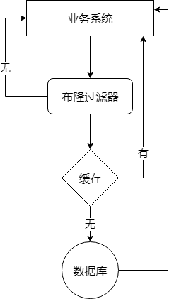

​		在我们的平常的项目中多多少少都会使用到缓存，因为一些数据我们没有必要每次查询的时候都去查询到数据库。特别是高 QPS 的系统，每次都去查询数据库，对于你的数据库来说将是灾难。但缓存使用不当，也会引起灾难。

## 缓存穿透

### 什么是缓存穿透

​		正常情况下，我们去查询的数据都是存在。但如果请求去查询一条数据库根本就不存在的数据，也就是缓存和数据库都查询不到这条数据，但是请求每次都会打到数据库上面去。这种查询不存在数据的现象称为**缓存穿透**。

### 缓存穿透带来的问题

​		如果有黑客对你的系统进行攻击，拿一个不存在的id 去查询数据，会产生大量的请求到数据库中，可能会导致你的数据库由于压力太大而宕机。

### 解决方案

#### 1、缓存空值

​		之所以会穿透，是因为缓存中没有存储这些空数据的key，从而导致每次查询都到数据库去了。因此我们可以为这些key对应的值设置null丢到缓存里面去，后面再出现查询这个key的请求的时候，就直接返回null。不过要**设置过期时间**。

#### 2、布隆过滤器

​		这种方式在大数据场景应用比较多，比如Hbase中使用它去判断数据是否在磁盘上，还有在爬虫场景判断URL是否已经被爬取。

​		这种方案可以加在第一种方案中，在缓存之前再加一层布隆过滤器，在查询的时候先去布隆过滤器查询key是否存在，如果不存在就直接返回，存在再走查缓存和数据库。

#### 3、用户鉴权

​		这种情况有可能是黑客进行恶意攻击，因此我们可以在系统中增加用户鉴权校验或者在接口层增加校验，直接拦截不正常的请求。

### 方案选择

​		对于一些恶意攻击，攻击带过来的大量的key是不存在的，那么我们采用第一种方案就会缓存大量不存在key的数据，此时第一种方案就不合适了，我们可以先使用第二种方案过滤掉这些key。即针对这种key异常多、请求重复率比较低的数据，我们没有必要进行缓存，使用第二种方案直接过滤掉。

## 缓存击穿

### 什么是缓存击穿

​		在平常高并发的系统中，大量的请求同时查询一个key时，此时这个key刚好失效了，就会导致大量的请求打到数据库上面去，这种现象我们成为**缓存击穿**。

### 缓存击穿带来的问题

​		会造成某一时刻数据库请求里过大，压力剧增。

### 解决方案

#### 1、设置热点数据永不过期

#### 2、加互斥锁

​		多个线程同时去查询数据库的这条数据时，我们可以在第一个查询数据的请求上使用一个互斥锁来锁住它，其他线程走到这一步拿不到锁就等着，等第一个线程查询到了数据，然后做缓存。后面的线程进来了，就可以直接走缓存了。

## 缓存雪崩

### 什么是缓存雪崩

​		缓存雪崩的情况是，在某一时刻发生大规模的缓存失效的情况，比如你的缓存服务宕机了，会有大量的请求进来直接打到DB上。结果就是DB撑不住宕机了。

### 解决方案

#### 1、事前，使用集群缓存，保证缓存服务的高可用

​		这种方案是在发生雪崩前对缓存集群实现高可用，如果是使用Redis，可以使用 主从+哨兵或者Redis Cluster来避免Redis全盘崩溃的情况。

#### 2、事中：ehcache本地缓存 + Hystrix限流&降级，避免数据库被打死

​		使用ehcache本地缓存的目的也是考虑在Redis Cluster完全不可用的时候，ehcache本地缓存可以支撑一阵。

​		使用Hystrix进行限流&降级，例如一秒来了3000个请求，我们可以设置只能有一秒1000个请求能通过这个组件，那么其他剩余的2000请求就会走限流逻辑。然后去调用我们自己开发的降级组件，比如设置一些默认值之类的，以此来保护数据库不会被大量的请求给打死。

#### 3、事后：开启Redis持久化机制，尽快恢复缓存集群

​		一旦重启，就能从磁盘上自动加载数据恢复内存中的数据。

## 解决热点数据集中失效问题

### 什么是热点数据集中失效

​		我们在设置缓存的时候，一般会给缓存设置一个失效时间，过了这个时间，缓存就失效。对于一些热点的数据来说，当缓存失效以后会存在大量的请求过来，然后打到数据库中去，从而可能导致数据库崩溃的情况。

### 解决方案

#### 1、设置不同的过期时间

​		为了避免这些热点数据集中失效，那么我们在设置缓存过期时间的时候，尽量让他们失效的时间错开。例如在一个基础的时间上加上或减去一个范围内的随机值。

#### 2、互斥锁

​		结合上面击穿的情况，在第一个请求去查询数据库的时候加一个互斥锁，其余的查询都会被阻塞住，知道锁释放，从而保护数据库。

​		但是因为它会阻塞其他线程，此时系统吞吐量会下降，需要结合实际的业务去考虑是否要这么做。

## 参考资料

https://juejin.im/post/5c9a67ac6fb9a070cb24bf34

