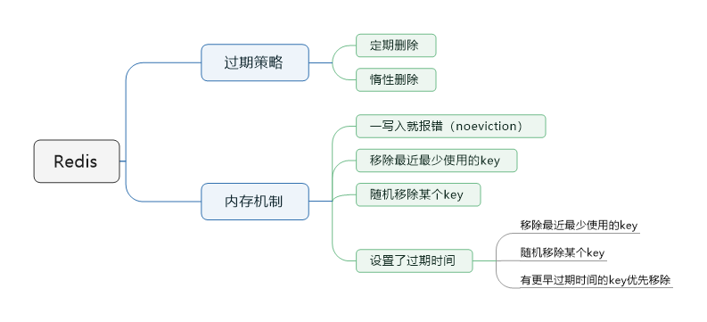

> 本节思维导图



​		redis主要是基于内存来进行高性能、高并发的读写操作的。但既然内存是有限的，例如redis就只能使用10G，你写入了20G。这个时候就需要清理掉10G数据，保留10G数据。那应该保留哪些数据，清除哪些数据，为什么有些数据明明过期了，怎么还占用着内存？这都是由redis的**过期策略**来决定的。

## redis过期策略

​		redis的过期策略就是：**定期删除 + 惰性删除**。

​		定期删除，指的是redis默认是每隔100ms就**随机抽取一些**设置了过期时间的key，检查是否过期，如果过期就删除。

​		假设redis里放了10W个key，都设置了过期时间，你每隔几百毫秒就检查全部的key，那redis很有可能就挂了，CPU负载会很高，都消耗在检查过期的key上。注意，这里不是每隔100ms就遍历所有设置过期时间的key，那样就是一场性能灾难。实际上redis是每隔100ms就**随机抽取**一些key来检查和删除的。

​		定期删除可能会导致很多过期的key到了时间并没有被删除掉。这个时候就可以用到惰性删除了。惰性删除是指在你获取某个key的时候，redis会检查一下，这个key如果设置了过期时间并且已经过期了，此时就会删除，不会给你返回任何东西。

​		但即使是这样，依旧有问题。如果定期删除漏掉了很多过期的key，然后你也没及时去查，也就没走惰性删除。此时依旧有可能大量过期的key堆积在内存里，导致内存耗尽。

​	这个时候就需要**内存淘汰机制**了。

## 内存淘汰机制

​		redis内存淘汰机制有以下几个：

- **noeviction**：当内存不足以容纳新写入数据时，新写入操作会报错。这个一般很少用。
- **allkeys-lru**：当内存不足以容纳新写入数据时，在**键空间**中，移除最近最少使用的key，这个是最常用的。
- **allkeys-random**：当内存不足以容纳新写入数据时，在**键空间**中，随机移除某个key。
- **volatile-lru**：当内存不足以容纳新写入数据时，在**设置了过期时间的键空间**中，移除最近最少使用的key。
- **volatile-random**：当内存不足以容纳新写入数据时，在**设置了过期时间的键空间**中，随机移除某个key。
- **volatile-ttl**：当内存不足以容纳新写入数据时，在**设置了过期时间的键空间**中，有更早过期时间的key优先移除。

## LRU算法

​		上面的内存淘汰机制中，用到的是LRU算法。什么是LRU算法？LRU算法其实就是上面说的最近最少使用策略。实现LRU算法，大概的思路如下：

​		维护一个有序单链表，越靠近链表尾部的节点是越早之前访问的。当有一个新的数据被访问时，我们从链表头开始顺序遍历链表：

1. 如果此数据之前已经被缓存在链表中了，我们遍历得到这个数据对应的节点，并将其从原来的位置删除，然后再插入到链表的头部。
2. 如果此数据没有在缓存链表中，又可以分为两种情况：
   - 如果此时缓存未满，则将此节点直接插入到链表的头部；
   - 如果此时缓存已满，则链表尾节点删除，将新的数据节点插入链表的头部。

​    这就就实现了LRU算法。

​	当然我们也可以基于Java现有的数据结构**LinkedHashMap**手撸一个。LinkHashMap本质上是一个Map与双向链表的结合，比起上述的单链表，效率更高。代码如下：

```java
class LRUCache<K, V> extends LinkedHashMap<K, V> {
    private final int CACHE_SIZE;

    /**
     * 传递进来最多能缓存多少数据
     *
     * @param cacheSize 缓存大小
     */
    public LRUCache(int cacheSize) {
        // true 表示让 linkedHashMap 按照访问顺序来进行排序，最近访问的放在头部，最老访问的放在尾部。
        super((int) Math.ceil(cacheSize / 0.75) + 1, 0.75f, true);
        CACHE_SIZE = cacheSize;
    }

    @Override
    protected boolean removeEldestEntry(Map.Entry<K, V> eldest) {
        // 当 map中的数据量大于指定的缓存个数的时候，就自动删除最老的数据。
        return size() > CACHE_SIZE;
    }
}
```

