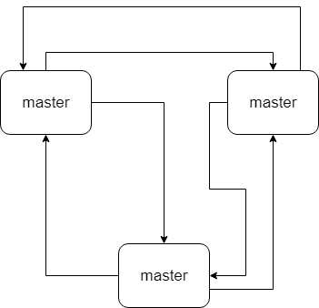

​		Redis cluster，主要是针对海量数据 + 高并发 + 高可用的场景。Redis cluster支撑N个redis master node，每个master node都可以挂载多个slave node。这样整个redis就可以横向扩容了。如果要支撑更大数据量的缓存，那就横向扩容更多的master节点。

## Redis cluster介绍

- 自动将数据进行分片，每个master上放一部分数据
- 提供内置的高可用支持，部分master不可用时，还是可以继续工作的

​        在redis cluster架构下，每个redis要开放两个端口号，比如一个是6379，另一个就是加1W的端口号，比如16379.

​		16379端口号是用来进行节点间通信的，也就是cluster bus的东西。cluster bus的通信，用来进行故障检测、配置更新、故障转移授权。cluster bus使用一种二进制的协议，`gossip`协议，用于节点间进行高效的数据交换，占用更少的网络带宽和处理时间。

## 节点间的内部通信机制

### 基本通信原理

​		集群元数据的维护有两种方式：集中式。Gossip协议。redis cluster节点间采用gossip协议进行通信。

​		**集中式**是将集群元数据（节点信息、故障等等）几种存储在某个节点上。集中式元数据集中存储的一个典型代表，就是大数据领域的`storm`。它是分布式的大数据实时计算引擎，是集中式的元数据存储的结构，底层基于ZooKeeper（分布式协调的中间件）对所有元数据进行存储维护。


​		redis维护集群元数据采用另一个方式，`gossip`协议，所有节点都持有一份元数据，不同节点如果出现了元数据的变更，就不断将元数据发送给其他的节点，让其他节点也进行元数据的并更。



​		**集中式**的好处在于，元数据的读取和更新，时效性非常好，一旦元数据出现了变更，就立即更新到集中式的存储中，其他节点读取的时候就可以感知到；**不好**在于，所有的元数据的更新压力全部集中在一个地方，可能会导致元数据的存储有压力。

​		gossip好处在于，元数据的更新比较分散，不是集中在一个地方，更新请求会陆续打到所有节点上去更新，降低了压力；缺点是元数据的更新有延时，可能导致集群中的一些操作会有一些滞后。

- 1000端口：每个节点都有一个专门用于节点间通信的端口，就是自己提供服务的端口号+ 10000。每个节点每隔一段时间都会往另外几个节点发送`ping`消息，同时其他几个节点接收到`ping`之后返回`pong`。
- 交换的信息：信息包括故障信息，节点的增加和删除，hash slot信息等等。

### gossip协议

​		gossip协议包含多种消息，包含`ping`、`pong`、`meet`、`fail`等等。

- meet：某个节点发送meet给新加入的节点，让新节点加入集群中，然后新节点就会开始与其他节点进行通信。

```
redis-trib.rb add-node
```

其实内部就是发送了一个gossip meet消息给新加入的节点，通知那个节点去加入我们的集群。

- ping：每个节点都会频繁给其它节点发送ping，其中包含自己的状态还有自己维护的集群元数据，互相通过ping交换元数据。
- pong：返回ping和meet，包含自己的状态和其它信息，也用于消息广播和更新。
- fail：某个节点判断另一个节点fail之后，就发送fail给其它节点，通知其它节点某个节点宕机了。

### ping消息深入

​		ping时要携带一些元数据，如果很频繁，可能会加重网络负担。

​		每个节点每秒会执行10次ping，每次会选择5个最久没有通信的其它节点。当然如果发现某个节点通信延时达到了`cluster_node_timeout / 2`，那么立即发送ping，避免数据交换延时过长，落后的时间过长。例如，两个节点之间都10分钟没有交换数据了，那么整个集群处于严重的元数据不一致的情况，就会有问题。所以`cluster_node_timeout`可以调节，如果调的比较大，那么会降低ping的频率。

​		每次ping，都会带上自己节点的信息，还有就是带上1/10其它节点的信息，发送出去，进行交换。至少包含**3**个其它节点的信息，最多包含**总结点减2**个其它节点的信息。

## 分布式寻址算法

- hash算法
- 一致性hash算法（自动缓存迁移） + 虚拟节点（自动负载均衡）
- redis cluster的hash slot算法

### hash算法

​		来了一个key，首先计算hash值，然后对节点数取模。然后打在不同的master节点上，一旦某一个master节点宕机，所有请求过来，都会基于最新的master节点数去取模，尝试去取数据。这会**导致大部分的请求过来，全部无法拿到有效的缓存，导致大量的流量涌入数据库**。


### 一致性hash算法

​		一致性hash算法将整个hash值空间组织成一个虚拟的圆环，整个空间按顺时针方向组织。下一步将各个master节点（使用服务器的ip或主机名）进行hash。这样就能确定每个节点在其哈希环上的位置。

​		来了一个key，首先计算hash值，并确定此数据在环上的位置，从此位置沿环**顺时针“行走”**，遇到的第一个master节点就是可以所在位置。

​		在一致性哈希算法中，如果一个节点挂了，受影响的数据仅仅是此节点到环空间前一个节点（沿着逆时针方向行走遇到的第一个节点）之间的数据，其他不收影响，增加一个节点也同理。

​		但是如果一致性哈希算法在节点太少是，容易因为节点分布不均匀而造成**缓存热点**的问题。为了解决这种热点问题，一致性hash算法引入了虚拟节点机制，即对每一个节点计算多个hash，每个计算结果位置都放置一个虚拟节点。这样就实现了数据的均匀分布，负载均衡。


### redis cluster的hash slot算法

​		redis cluster有固定的`16384`个hash slot，对每个key计算`CRC16`值，然后对16384取模，可以获取key对应的hash slot。

​		redis cluster中每个master都会持有部分slot，比如有3个master，那么可能每个master持有5000多个hash slot。hash slot让node的增加和移除都很简单，增加一个master，就将其他master的hash slot移动部分过去，减少一个master，就将它的hash slot移动到其他master上去。移动hash slot的成本是非常低的。客户端的API，可以对指定的数据，让他们走同一个hash slot，同时`hash tag`来实现。

​		任何一台机器宕机，redis的寻址都不受影响。因为key找的是hash slot，不是机器。

