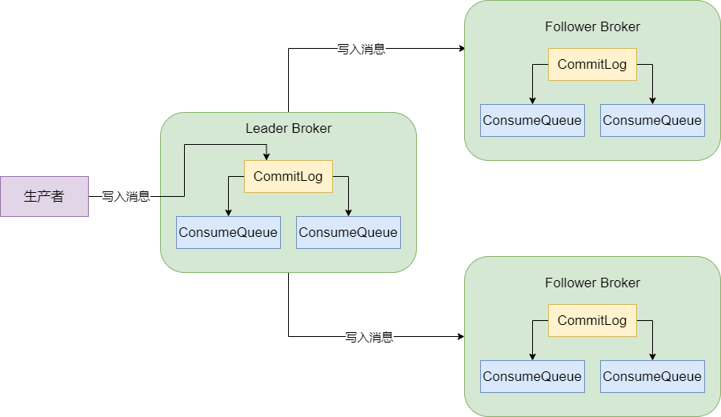
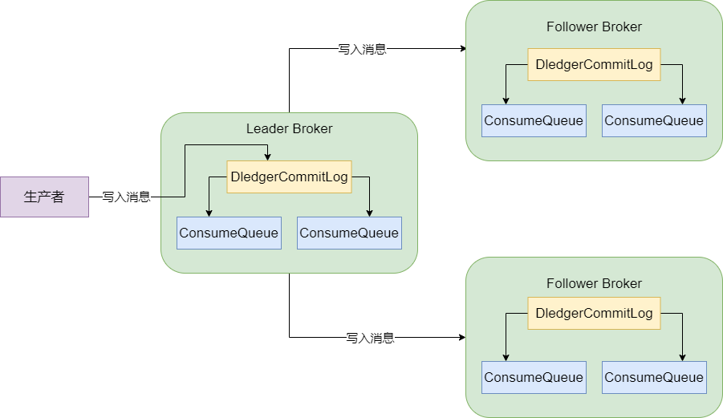
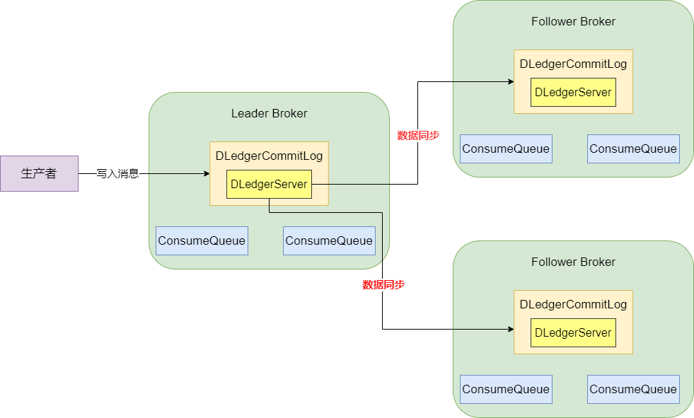
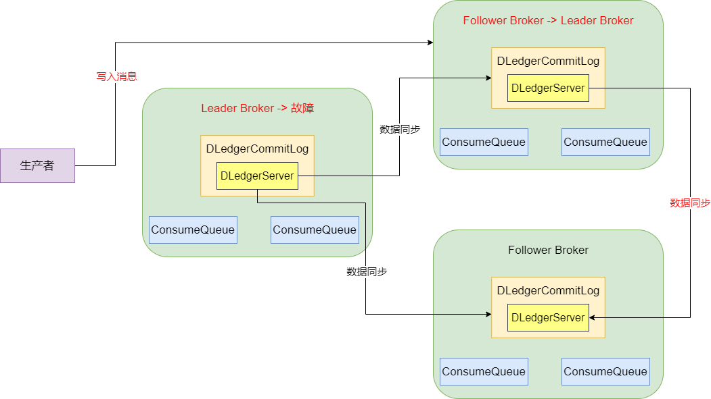

之前有跟大家说过 Broker 的数据存储原理，接下来我们就说说 Broker 接收到数据写入之后，是如何同步给其他的 Broker 做多副本冗余的。这里就会牵扯到 `DLedger` 是个什么东西，因为我们是基于 `DLedger` 实现 Broker 多副本高可用的。

首先，我们回顾一下，producer 写入消息到 broker 之后，broker 会将消息写入本地 CommitLog 磁盘文件中，然后还有一些 ConsumeQueue 会存储 Topic 下各个 MessageQueue 的消息的物理位置。而且，要让 Broker 实现高可用，那么必须有一个 Broker 组，里面有一个是 Leader Broker 可以写入数据，然后让 Leader Broker 接收到数据之后，直接把数据同步给其他的 Follower Broker。如图：

这样的话，一条数据就会在三个 Broker 上有三份副本，此时如果 Leader Broker 宕机，那么就直接让其它的 Follower Broker 自动切换为新的 Leader Broker，继续接收客户端的额数据写入就可以了。

## 基于 DLedger 技术替换 Broker 的 CommitLog

首先，Broker 上述高可用架构就是基于 Dledger 技术来实现的，所以，我们要先知道 DLedger 技术可以干什么。

DLedger 技术实际上它自己就有一个 CommitLog 机制，你把数据交给它，它会写入 CommitLog 磁盘文件里去，这是它干的第一件事。如图，如果基于 DLedger 技术来实现 Broker 高可用架构，实际上就是用 DLedger 先替换原来 Broker 自己管理的 CommitLog，由 DLedger 来管理 CommitLog。

所以第一步，我们需要使用 DLedger 来管理 CommitLog，然后 Broker 还是可以基于 DLedger 管理的  CommitLog 去构建机器上的各个 ConsumeQueue 磁盘文件。

## DLedger 基于 Raft 协议选举 Leader Broker

我们知道首先基于 Dledger 替换各个 Broker 上的 CommitLog 管理组件了，那么就是每个 Broker 上都有一个 Dledger 组件了。接着我们思考一下，如果我们配置了一组 Broker，比如有 3 台机器，Dledger 是如何从 3 台机器里选举出一个 Leader 的？

实际上 Dledger 是**基于 Raft 协议来进行 Leader Broker 选举的**，那么 Raft 协议中是如何进行多台机器的 Leader 选举的？

这需要发起一轮一轮的投票，通过三台机器互相投票选出来一个人作为 Leader。简单来说，三台 Broker 机器启动的时候，他们会投票自己作为 Leader，然后把这个投票发送给其他 Broker。例如，Broker01 是投票给自己的，Broker02 是投给自己的，Broker03 是投给自己的，他们把自己的投票发送给了别人。

此时在第一轮的选举中，Broker01 会收到别人的投票，它发现自己是投给自己的，其他人也是投给自己的，所以第一轮选举是失败的。因为大家都投票给自己，是选举不出一个 Leader 的。

接着每个 Broker 会进入一个随机的休眠，比如 Broker01 休眠 3 秒，Broker02 休眠 5 秒，Broker03 休眠 4 秒。此时 Broker01 必然是先苏醒过来，它苏醒之后，会继续尝试投票给自己，并且发送自己的选票给别人。

接着 Broker03 休眠 4 秒过后苏醒，它发现 Broker01 已经发送来了一个选票是投给 Broker01 自己的，此时它因为自己没投票，随意会尊重别人的选择，直接把票投给 Broker01了，同时把自己的投票发送给别人。

接着 Broker02 苏醒了，它收到了 Broker01 投票给 Broker01 自己，Broker03 也投票给了 Broker01，此时它自己因为没投票，也会尊重别人的选择，直接把票投给 Broker01 了，并且把自己的投票发送给别人。

此时所有 Broker 都会收到三张投票，都是投给 Broker01 的，那么 Broker01 就会当选为 Leader。气质只要有 （3 台机器 / 2）+ 1 个人投票给某人，就会选举它当 Leader，这个 （机器数量 / 2）+ 1 就是大多数的意思。

这就是 Raft 协议中选举 Leader 算法的简单描述，简单来说，**它确保有人可以成为 Leader 的核心机制就是一轮选举不出来 Leader 的话，就让大家随机休眠一下，先苏醒过来的人会投票给自己，其他人苏醒过后发现自己收到选票了，就会直接投票给那个人**。依靠这个随机休眠的机制，基本上几轮投票过后，一般都是可以快速选举出来一个 Leader。

因此，在三台 Broker 机器刚刚启动的时候，就是靠这个 Dledger 基于 Raft 协议实现的 Leader 选举机制，互相投票选举出一个 Leader，其他人就是 Follower，然后**只有 Leader 可以接收数据写入，Follower 只能接收 Leader 同步过来的数据**。

## Dledger 是如何基于 Raft 协议进行多副本同步的

接下来，Leader Broker 收到消息之后，是怎么基于 DLedger 把数据同步给其他 Broker 的。Dledger 在进行同步的时候是采用 Raft 协议进行多副本同步的，我们接下来就说说 Raft 协议中的多副本同步机制。

简单来说，**数据同步会分为两个阶段，一个 uncommitted 阶段，一个是 committed 阶段**。

首先 Leader Broker 上的 DLedger 收到一条数据之后，会标记为 `uncommitted` 状态，然后它会通过自己的 DLedgerServer 组件把这个 `uncommitted` 数据发送给 Follower Broker 的 DLedgerServer。如图：

接着 Follower Broker 的 DLedgerServer 收到 uncommitted 消息之后，必须返回一个 `ack` 给 Leader Broker 的 DLedgerServer，然后如果 Leader Broker 收到超过半数的 Follower Broker 返回 ack之后，就会将消息标记为 committed 状态。然后 Leader Broker 上的 DLedgerServer 就会发送 committed 消息给 Follower Broker 机器的 DLedgerServer，让它们也把消息标记为 committed 状态。

这个就是基于 Raft 协议实现的两阶段完成的数据同步机制。

## Leader Broker 崩溃了怎么办

通过上面分析我们知道，对于高可用 Broker 架构而言，无论是 CommitLog 写入，还是多副本同步，都是基于 DLedger 来实现的。那么，如果 Leader Broker 挂了怎么办。

如果 Leader Broker 挂了，此时剩下的两个 Follower Broker 就会重新发起选举，它们会基于 DLedger 采用 Raft 协议的算法，去选举一个新的 Leader Broker 继续对外提供服务，而且会对没有完成的数据同步进行一些恢复性的操作，保证数据不会丢失。

如下图就是示意 Leader Broker 挂了之后，Follower Broker 称为了新的 Leader Broker，然后生产者吸入新的 Leader Broker 的一个过程。新选举出来的 Leader 会把数据通过 DLedger 同步给剩下的一个 Follower Broker。

## 总结

今天我们讲了基于 DLedger 技术的高可用 Broker 集群是如何运行的，包含了一下的一些内容：

- Broker 高可用架构原理回滚：多副本同步 + Leader 自动切换

- 基于 DLedger 基础管理 CommitLog

- Broker 集群启动时，基于 DLedger 技术和 Raft 协议完成 Leader 选举

- Leader Broker 写入之后，基于 DLedger 技术和 Raft 协议同步给 Follower Broker

- 如果 Leader Broker 崩溃，则基于 DLedger 和 Raft 协议重新选举 Leader