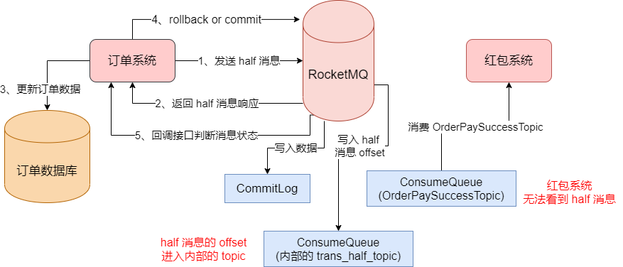
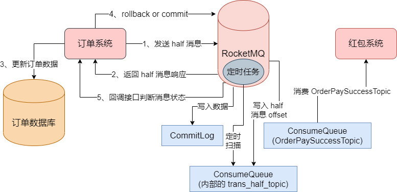
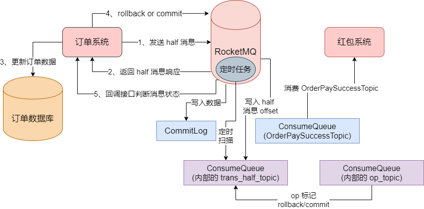
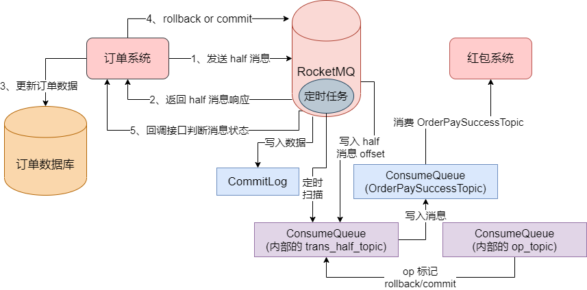
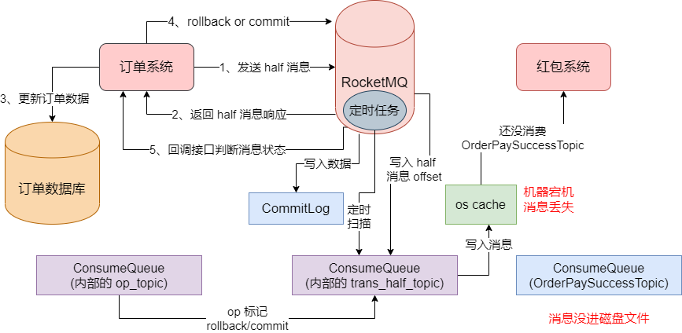
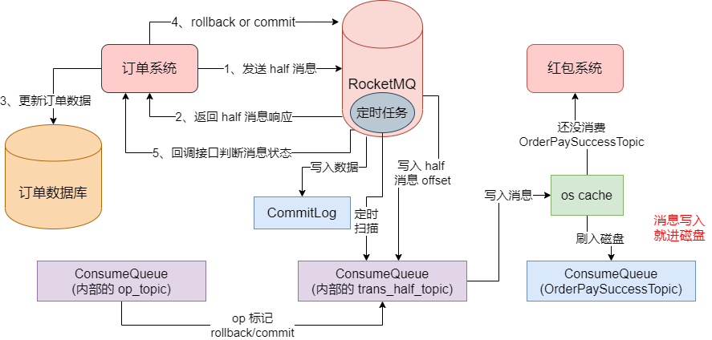
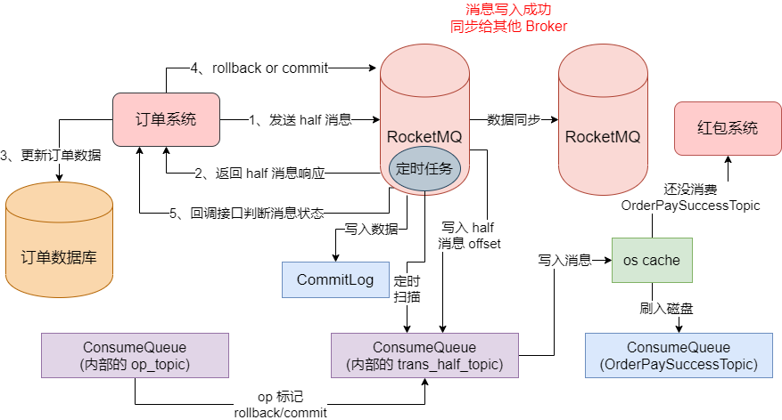
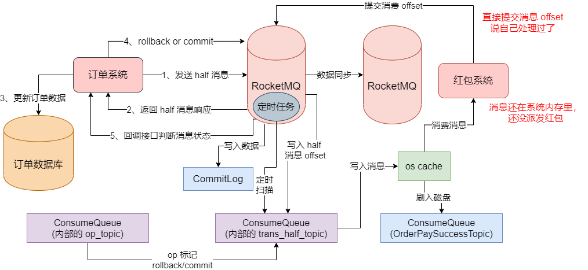

## half 消息的实现

我们之前已经说过了 RocketMQ 事务消息的全流程。在这个流程中，第一步就是要由订单系统去支付一个 half 消息给 MQ。当时我们说过，对于这个 half 消息，红包系统这个时候是看不到它的，没法消费这条消息去处理，那这个 half 消息是如何做到的？


其实 RocketMQ 底层采取了一个巧妙的设计。举个例子，订单系统发送了一个 half 状态的订单支付消息到 "OrderPaySuccessTopic" 里去，这是一个 Topic。然后，红包系统也是订阅了这个 "OrderPaySuccessTopic" 从里面获取消息的。


之前我们有讲过，写入一个 Topic，最终是定位到这个 Topic 的某个 MessageQueue，然后定位到一台 Broker 机器上去，然后写入的是 Broker 上的 CommitLog 文件，同时将消费索引写入 MessageQueue 对应的 ConsumeQueue 文件。所以你写入一条 half 消息到 "OrderPaySuccessTopic" 里去，会定位到这个 Topic 的一个 MessageQueue，然后定位到 RocketMQ 的一台机器上去，按理说，消息会写入 CommitLog。


同时消息的 offset 会写入 MessageQueue 对应的 ConsumeQueue，这个 ConsumeQueue 是属于 OrderPaySuccessTopic 的，然后红包系统按理说会从这个 ConsumeQueue 里获取到你写入的这个 half 消息。但是实际上红包系统却没法看到这条消息，原因就是 **RocketMQ 一旦发现你发送的是一个 half 消息，它不会把这个 half 消息的 offset 写入 OrderPaySuccessTopic 的 ConsumeQueue 里去**。


**它会把这条 half 消息写入到自己内部的 "RMQ_SYS_TRANS_HALF_TOPIC" 这个 Topic 对应的一个 ConsumeQueue 里去。**如图：




真相大白了，所以对于事务消息机制之下的 half 消息，RocketMQ 是写入内部的 Topic 的 ConsumeQueue 的，不是写入你指定的 OrderPaySuccessTopic 的 ConsumeQueue 的。


### 什么情况下订单系统会收到 half 消息成功的响应

接着，在什么情况下订单系统会收到 half 消息成功的响应呢？结合上面的内容，可以判断出，必须要 half 消息进入到 RocketMQ 内部的 RMQ_SYS_TRANS_HALF_TOPIC 的 ConsumeQueue 文件了，此时就会认为 half 消息写入成功了，然后就会返回响应给订单系统。


所以这个时候，一旦你的订单系统收到这个 half 消息写入成功的响应，就知道这个 half 消息已经在 RocketMQ 内部了。


### 没有执行 rollback 或者 commit 会怎样

接着，如果因为网络故障，订单系统没有收到 half 消息的响应，或者说自己发送的 rollback/commit 请求失败了，那么 RocketMQ 会干什么？其实这个时候它会在后台有定时任务，定时任务会去扫描 `RMQ_SYS_TRANS_HALF_TOPIC` 中的 half 消息，如果你超过一定时间还是 half 消息，它会回调订单系统的接口，让你判断这个 half 消息是要 rollback 还是 commit。如图：




### 执行 rollback，如何标记消息回滚

假设我们的订单系统执行了 rollback 请求，那么此时就需要对消息进行回滚。之前我们说过，RocketMQ 会把这个 half 消息给删除，但是大家觉得删除消息是真的会在磁盘文件里删除吗？


显然不是的，因为 RocketMQ 都是顺序把消息写入磁盘文件的，所以在这里如果你执行 rollback，它的本质就是用一个 OP 操作来标记 half 消息的状态。RocketMQ 内部有一个 `OP_TOPIC`，此时你可以写一条 rollback OP 记录到这个 topic 里，标记某个 half 消息是 rollback 了。如图：




另外，假设你一直没有执行 commit/rollback，RocketMQ 会回调订单系统的接口去判断 half 消息的状态，但是它最多就是回调 15 次，如果 15 次之后你没法告知它 half 消息的状态，就自动把消息标记为 rollback。


### 执行 commit 操作，如何让消息对系统可见

最后，如果订单系统执行了 commit 操作，如何让消息对这个红包系统可见？其实也简单，你执行 commit 之后，RocketMQ 就会在 `OP_TOPIC` 里写入一条记录，标记 half 消息已经是 commit 状态了。接着需要把放在 `RMQ_SYS_TRANS_HALF_TOPIC` 中的 half 消息写入到 OrderPaySuccessTopic 的 ConsumeQueue 里去，然后我们的红包系统就可以看到这条消息进行消费了。




### 总结

看到这里，大家对事务消息机制的底层原理应该比较了解了。其实它的本质都是基于 CommitLog、ConsumeQueue 这套存储机制来做的，只不过中间有一些 Topic 的变换，half 消息可能就是写入内部 Topic 的。


## Broker 消息零丢失方案：同步刷盘 + Raft 协议主从同步

如果我们在生产消息的时候用了事务消息之后，就可以保证数据不会丢失吗？假设我们现在订单系统已经通过事务消息的机制，通过 half 消息 + commit 的方式，把消息在 MQ 里提交了。也就是说，现在对于 MQ 而言，那条消息已经进入它的存储层了，可以被红包系统看到了。


但是，你的这条消息在 commit 之后，会从 half topic 里进入 OrderPaySuccessTopic 中，但是此时仅仅是消息进入了这个你预定的 Topic 而已，仅仅是可以被红包系统看到而已，此时可能你的红包系统还没来得及去获取这条消息。


然后恰巧这个时候，你的这条消息仅仅停留在 os cache 中，还没有进入到 ConsumeQueue 磁盘文件里，然后此时这台机器突然宕机了，os cache 中的数据全部丢失了，此时会导致你的消息丢失，红包系统再没机会读到这条消息了。




接着，就算我们运气好，消息已经进入 OrderPaySuccessTopic 的 ConsumeQueue 磁盘文件了，不是停留在 os cache 里，此时消息就一定不会丢失吗？这也未必，即使消息已经进入磁盘文件了，但是这个时候红包系统还没来得及消费这条消息，然后此时这台机器的磁盘突然坏了，就会一样导致消息丢失，而且可能消息再也找不回来了，同样丢失数据。


### 保证消息写入 MQ 不代表不丢失

所以，我们要明确一个前提，哪怕我们确保消息已经写入 MQ 成功了，此时也未必消息就不会丢失了。因为即使你写入 MQ 成功了，这条消息也大概率是仅仅停留在 MQ 机器的 os cache 中，一旦机器宕机内存里的数据都会丢失。即使消息已经写入了 MQ 机器的磁盘文件里，但是磁盘一旦坏了，消息也会丢失。


### 异步刷盘 VS 同步刷盘

到底怎么去确保消息写入 MQ 之后，MQ 自己不要随便丢失数据呢？解决这个问题的第一个关键点，就是将**异步刷盘调整为同步刷盘**。所谓的异步刷盘，即使之前我们一直说的那种模式，即，你的消息即使成功写入了 MQ，它也就在机器的 os cache 中，没有进入磁盘里，要过一会等操作系统自己把 os cache 里的数据实际刷入磁盘文件中。


所以在异步刷盘的模式下，我们的写入消息的吞吐量肯定是极高的，毕竟消息只要进入 os cache 这个内存就可以了，写消息的性能就是写内存的性能，那每秒钟可以写入的消息数量肯定更多了，但是这个情况下，可能会导致数据的丢失。


所以如果一定要保证数据零丢失的话，可以调整 MQ 的刷盘策略，我们需要调整 Broker 的配置文件，将其中的 `flushDiskType` 配置设置为 `SYNC_FLUSH`，默认它的值是 `ASYNC_FLUSH`，即默认是异步刷盘的。


如果调整为同步刷盘之后，只要 MQ 返回响应式 half 消息发送成功了，那么就说明消息已经进入磁盘文件了，不会停留在 os cache 里。如图：




### 通过主从架构模式避免磁盘故障导致的数据丢失

接着，如何避免磁盘故障导致的数据丢失？其实道理也很简单，我们必须要对 Broker 使用主从架构模式。也就是说，必须让一个 Master Broker 有一个 Slave Broker 去同步它的数据，而且你一条消息写入成功，必须是让 Slave Broker 也写入成功，保证数据有多个副本的冗余。如图：




这样一来，你一条消息写入成功，此时主从两个 Broker 上都有这条数据了，此时如果你的 Master Broker 的磁盘坏了，但是 Slave Broker 上至少还是有数据的，数据不会因为磁盘故障而丢失的。


对于主从架构，如果你是基于 Dledger 技术和 Raft 协议的主从同步架构，对于你所有的消息写入，只要它写入成功，那就一定会通过 Raft 协议同步给其他的 Broker 机器。


## Consumer 消息零丢失方案：手动提交 offset + 自动故障转移

通过上面，我们知道了如果确保订单系统发送出去的消息一定会到达 MQ 中，而且也能确保了如果消息到达了 MQ，如果确保一定不会丢失。现在的问题在于，即使红包系统拿到了这条消息，就一定可以成功的派发红包吗？


答案是未必。如果红包系统已经拿到了这条消息，但是消息目前还在它的内存里，还没执行派发红包的逻辑，此时它就直接提交了这条消息的 offset 到 Broker 去说自己已经处理过了。如图：




接着红包系统在上图这个状态的时候就直接崩溃了，内存里的消息就没了，红包也没派发出去。结果 Broker 已经收到它提交的消息 offset 了，以为它 处理完这个消息了。等红包系统重启的时候，就不会再次消费这条消息了。


所以，即使保证发送消息到 MQ 的时候绝不会丢失，而且 MQ 收到消息之后一定不会把消息搞丢，但是你的红包系统在获取到消息之后还是可能会搞丢。


### RocketMQ 消费者的处理方式

我们看一下下面的 RocketMQ 消费者的代码，如下：

```java
public class RocketMQConsumer {

    public static void start() {

        new Thread() {
            @SneakyThrows
            @Override
            public void run() {

                // 这是 RocketMQ 消费者实例对象
                // "credit_group" 之类的就是消费者分组
                // 一般来说比如积分系统就用 "credit_consumer_group"
                // 比如营销系统就用 "marketing_consumer_group"
                // 以此类推，不同的系统给自己取不同的消费者名字
                DefaultMQPushConsumer consumer = new DefaultMQPushConsumer("credit_group");

                // 这是给消费者设置 NameServer 的地址
                // 这样就可以拉取到路由信息，知道 Topic 的数据在哪些 Broker 上
                // 然后可以从对应的 Broker 上拉取数据
                consumer.setNamesrvAddr("localhost:9876");

                // 选择订阅 "TopicOrderPaySuccess" 的消息
                // 这样就会从这个 Topic 的 Broker 机器上拉取订单消息过来
                consumer.subscribe("TopicOrderPaySuccess", "tags");

                // 注册消息监听器来处理拉取到的订单消息
                // 如果 consumer 拉取到了订单消息，就会回到这个方法交给处理
                consumer.registerMessageListener(new MessageListenerConcurrently() {
                    @Override
                    public ConsumeConcurrentlyStatus consumeMessage(List<MessageExt> msgs, ConsumeConcurrentlyContext context) {
                        // 在这里对获取到的 msgs 订单消息进入处理
                        // 比如增加积分、发送优惠券、通知发货等等
                        return ConsumeConcurrentlyStatus.CONSUME_SUCCESS;
                    }
                });

                // 启动消费者实例
                consumer.start();

                System.out.println("Consumer Stratd. %n");

                while (true) {  // 别让线程退出，就让创建好的 consumer 不停消费数据
                    Thread.sleep(1000);
                }
            }
        }.start();
    }
}
```


其中我们重点看下面这段代码：

```java
consumer.registerMessageListener(new MessageListenerConcurrently() {
                    @Override
                    public ConsumeConcurrentlyStatus consumeMessage(List<MessageExt> msgs, ConsumeConcurrentlyContext context) {
                        // 在这里对获取到的 msgs 订单消息进入处理
                        // 比如增加积分、发送优惠券、通知发货等等
                        return ConsumeConcurrentlyStatus.CONSUME_SUCCESS;
                    }
                });
```


RocketMQ 的消费者中会注册一个监听器，就是上面小块代码中的 MessageListen而Concurrently 这个东西，当你的消费者获取到一批消息之后，就会回调你的这个监听器函数，让你来处理一批消息。当你处理完毕之后，你才会返回 `ConsumeConcurrentlyStatus.CONSUME_SUCCESS` 作为消费成功的示意，告诉 RocketMQ，这批消息我已经处理完毕了。


所以对于 RocketMQ 而言，其实只要你的红包系统是在这个监听器的函数中先处理一批消息，基于这批消息都派发完了红包，然后返回了这个消费成功的状态，接着才会去提交这批消息的 offset 到 Broker 去。所以这这个情况下，如果你对一批消息都处理完毕了，然后再提交消息的 offset 给 Broker，接着红包系统崩溃了，此时是不会丢失消息的。


如果是红包系统获取到一批消息之后，还没处理完，也没返回 ConsumeConcurrentlyStatus.CONSUME_SUCCESS 这个状态，自然没提交这批消息的 offset 给 Broker，此时红包系统突然挂了，会怎么样？


其实在这种情况下，你对一批消息都没提交它的 offset 给 Broker 的话，Broker 不会认为你已经处理完了这批消息，此时你突然红包系统的一台机器宕机了，它其实会感知到你的红包系统的一台机器作为一个 Consume 挂了。接着它会把还没处理完的那批消息交给红包系统的其他机器去进行处理。所以这种情况下，消息也是不会丢失的。


### 需要警惕的地方：不能异步消费消息

在默认的 Consumer 的消费模式之下，必须是你处理完一批消息之后，才会返回 ConsumeConcurrentlyStatus.CONSUME_SUCCESS 这个状态标识消息都处理结束了，才提交 offset 到 Broker 去。在这种情况下，正常来说是不会丢失消息的，即使你一个 Consumer 宕机了，它会把你还没处理完的消息交给其他 Consumer 去处理。


但是我们要警惕一点，就是我们**不能再代码中对消息进行异步的处理**。如下错误的示范，我们开启了一个子线程去处理这笔消息，然后启动线程之后，就直接返回 ConsumeConcurrentlyStatus.CONSUME_SUCCESS 状态了。

```java
consumer.registerMessageListener(new MessageListenerConcurrently() {
                    @Override
                    public ConsumeConcurrentlyStatus consumeMessage(List<MessageExt> msgs, ConsumeConcurrentlyContext context) {
                        // 开启一个子线程处理这批数据
                        new Thread() {
                            @Override
                            public void run() {
                                // 处理消息
                            }
                        }.start();
                        return ConsumeConcurrentlyStatus.CONSUME_SUCCESS;
                    }
                });
```


如果要是用这种方式来处理消息的话，那可能就会出现你开启的子线程还没处理完消息，你就已经返回 ConsumeConcurrentlyStatus.CONSUME_SUCCESS 状态了，就可能提交这批消息的 offset 给 Broker 了，认为已经处理结束了。然后此时你红包系统突然宕机，就会导致你的消息丢失了。


因此在 RocketMQ 的场景下，如果要保证消费数据的时候别丢失，你就老老实实在回调函数里处理消息，处理完了你再返回 ConsumeConcurrentlyStatus.COMSUME_SUCCESS 状态表明你处理完毕了。