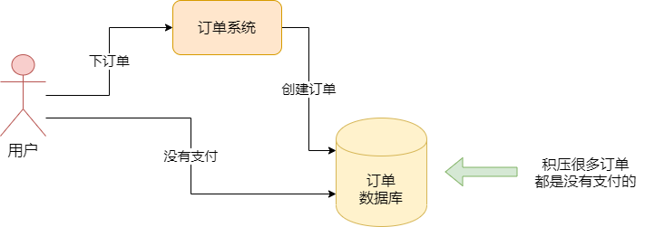
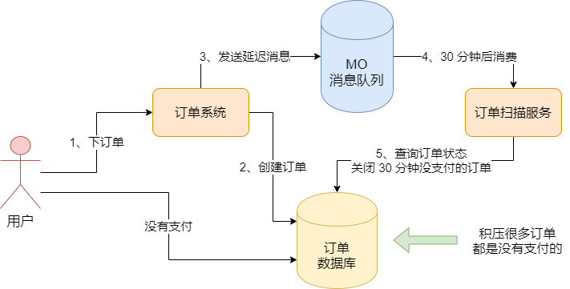

我们来看一个订单退款扫描的问题。一个正常的电商购物流程，一般来说我们现在作为用户在一个电商 APP 上都会选择一些商品加入购物车，然后对购物车里选择的一些商品统一下一个订单，此时后台的订单系统会在订单数据库中创建一个订单。


但是我们下了一个订单之后，虽然订单数据库里会有一个订单，订单的状态却是 “待支付” 状态，因此此时你还没有支付这个订单，我们的订单系统其实也在等待用户完成这个订单的支付


这里就有两种可能了，一种可能是用户下单之后立马就支付掉了，那么接着订单系统可以走后续的流程，比如通过 MQ 发送消息通知优惠券系统给用户发优惠券，通知仓储系统进行调度发货等等。另外一种可能就是用户下单之后，没有支付订单。在实际情况中，APP 的大量用户每天会下很多订单，但是不少订单可能是一直没有进行支付的，可能它下单之后犹豫了，也可能是忘记支付了。




所以一般订单系统都必须设置一个规则，当一个订单下单之后，超过一定时间，比如 30 分钟没有支付，那么久必须订单系统自动关闭这个订单，后续你如果要购买这个订单里的商品，就得重新下单。


可能你的订单系统就需要有一个后台线程，不停地扫描订单数据库里所有的未支付状态的订单，如果它超过 30 分钟还没支付，那么就必须自动把订单状态更新为 “已关闭”


但是这里就出现了一个问题，就是订单系统的后台线程必须要不停地扫描各种未支付的订单，这种实现方式并不是很好。一个原因是未支付订单状态的订单可能是比较多的，然后你需要不停地扫描它们，可能每个未支付状态的订单要被扫描 N 多遍，才会发现它已经超过 30 分钟没支付了。


另一个是很难去分布式并行扫描你的订单。因为假设你的订单数据特别多，然后你打算用多台机器部署订单扫描服务，但是每天机器扫描哪些订单？怎么扫描？什么时候扫描？都是一系列的麻烦问题


因此针对这种场景，MQ 里的延迟消息就登场了。它特别适合在这种场景里使用，而且再实际项目中，MQ 的延迟消息使用的往往是很多的。


所谓的延迟消息，意思是我们订单系统在创建了一个订单之后，可以发送一条消息到 MQ 里去，我们指定这条消息是延迟消息，比如要等到 30 分钟之后，才能被订单扫描服务给消费到。


这样当订单扫描服务在 30 分钟后消费到了一条消息之后，就可以针对这条消息的信息，去订单数据库里查询这个订单，看看它在创建过后都过了 30 分钟了，此时它是否还是未支付状态？如果此时订单还是未支付状态，那么就可以关闭它，否则订单如果已经支付了，就什么都不用做了。如图：




这种方式就比你用后台线程扫描订单的方式要好得多，一个是对每个订单你只会在它创建 30 分钟后查询它一次而已，不会反复扫描订单多次。另外就是如果你的订单数量很多，你完全可以让订单扫描服务多部署几台机器，然后对 MQ 中的 Topic 可以多指定一个 Mess阿甘Q，这样每个订单扫描服务的机器作为一个 Consumer 都会处理一部分订单的查询任务。


所以 MQ 的延迟消息，是非常常用并且实用的一个功能。


## RocketMQ 的延迟消息的代码实现

接下来我们看一下 RocketMQ 中对延迟消息的代码实现。其实 RocketMQ 对延迟消息的支持是很好的，实现起来也非常容易，我们先看发送延迟消息的代码示例：

```java
public class ScheduledMessageProducer {

	public static void main(String[] args) throws Exception {
		
		// 这是订单系统的生产者
		DefaultMQProducer producer = 
			new DefaultMQProducer("OrderSystemProducerGroup");\
		
		// 启动生产者
		producer.start();
		
		Message message = new Message(
			"CreateOrderInformTopic",	// 这是创建订单通知 Topic
			orderInfoJSON.getBytes()	// 这是订单信息的 json 串
		);
		
		// 这里设置了消息为延迟消息，延迟级别为 3
		message.setDelayTimeLevel(3);
		
		// 发送消息
		producer.send(message);
	}
}
```


大家看上面的代码，其实发送延迟消息的核心，就是设置消息的 delayTimeLevel，也就是延迟级别。


RocketMQ 默认支持一些延迟级别如下：


1s 5s 10s 30s 1m 2m 3m 4m 5m 6m 7m 8m 9m 10m 20m 30m 1h 2h


所以上面代码中设置延迟级别为 3，意思就是延迟 10s，你发送出去的消息，会过 10s 被消费者获取到。那么如果是订单延迟扫描场景，可以设置级别为 16，也就是对应上面的 30 分钟


接着我们看看一个消费者，比如订单扫描服务，正常它会对每个订单创建的消息，在 30 分钟以后才获取到，然后去查询订单状态，判断是否是未支付的订单，就自动关闭这个订单。

```java
public class ScheduledMessageConsumer {

	public static void main(String[] args) throws Exception {
		
		// 这里扫描服务的消费者
		DefaultMQPushConsumer consumer = 
			new DefaultMQPushConsumer("OrderScanServiceConsumer");
			
		// 订阅订单创建通知 Topic
		consumer.subscribe("CreateOrderInformTopic", "*");
		
		// 注册消息监听者
		consumer.registerMessageListener(new MessageListenerConcurrently() {
		
			@Override
			public ConsumeConcurrentlyStatus consumeMessage(
				List<MessageExt> messages, ConsumeConcurrentlyContext context) {
			
            	for(MessageExt message : messages) {
            		// 这里打印一下消息的存储时间到消费时间的差值
            		// 大概就是我们设置的延迟级别的时间
            		System.out.println("Receive message[msgId" +
            							message.getMsgId() + "]" + 
            		(System.currentTimeMills() - message.getStoreTimestamp()) +
            		"ms later");
            	}
            	return ConsumeConcurrentlyStatus.CONSUME_SUCCESS;
			}
		});
		
		// 启动消费者
		consumer.start();
	}
}
```


把延迟消息的使用搞明白之后，大家以后再自己的系统中就可以使用延迟消息去支持一些特殊的业务场景了。