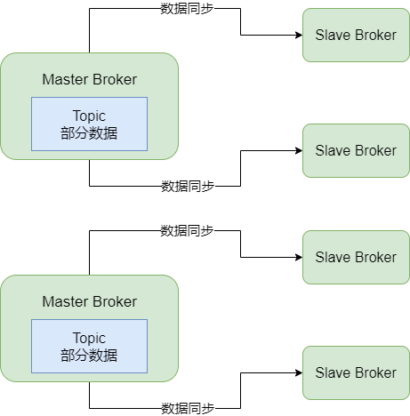
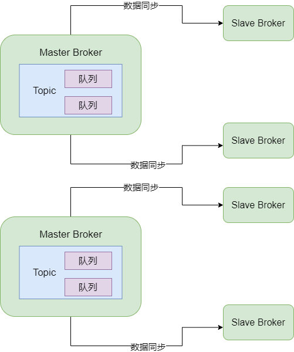
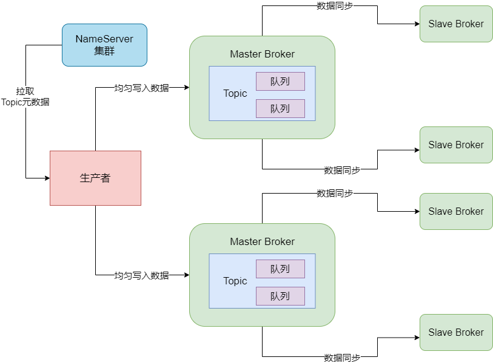
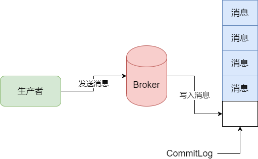
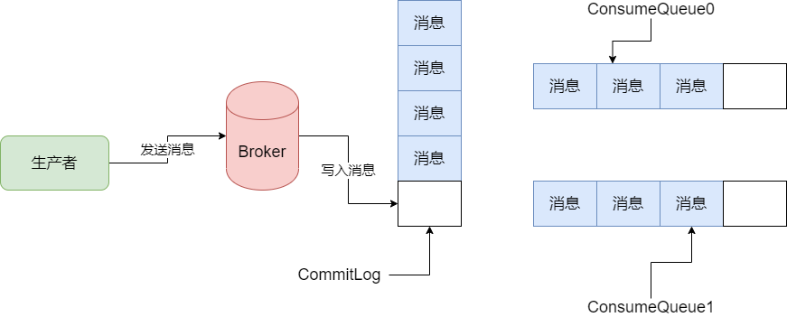
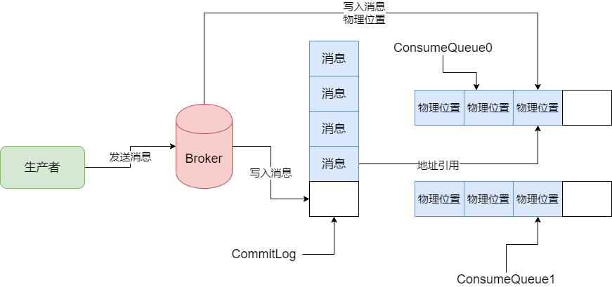

## RocketMQ 生产者工作原理

### MessageQueue

要清楚生产者的工作原理，就需要明白一个概念：MessageQueue。而要明白 MessageQueue 是什么，就必须把它跟 Topic 以及 Broker 综合起来看。

如果我们要使用 RocketMQ，要先部署一套 RocketMQ集群，在有了集群之后，就要根据你的业务去创建一些 Topic。比如说创建一个 "TopicOrderPaySuccess" 的 Topic 去存放订单支付成功的消息。像这些 Topic 就可以在 RocketMQ 可视化工作台里去创建，在里面就可以创建一个 Topic 出来，**在创建 Topic的时候需要制定一个很关键的参数，就是 MessageQueue**。

简单来说，就是要走指定你的 Topic 对应了多少个队列，也就是多少个 MessageQueue。

### Topic、MessageQueue 以及 Broker之间是什么关系

其实 Topic、MessageQueue 以及 Broker 之间是有关系的。比如你现在有一个 Topic，我们为它指定 4 个 MessageQueue，那么这个 Topic 的数据在 Broker 集群中是如何分布的？

其实，每个 Topic 的数据都是分布式存储在多个 Broker 中的，如图：

但是我们如何决定这个 Topic 的哪些数据放在这个 Broker 上，哪些数据放在另一个 Broker 上？所以在这里引入了 MessageQueue 的概念，本质上就是一个数据分片的机制。

在这个机制中，假设你的 Topic 有 1 万条数据，然后你的 Topic 有 4 个 MessageQueue，那么大致可以认为在每个 MessageQueue 中放入 2500 条数据。当然，这个不是绝对的，有可能有的 MessageQueue 的数据多，有的数据少，要根据你的消息写入 MessageQueue 的策略来定。

我们先假定在每个 MessageQueue 中会平均分配 Topic 的数据吧。那么，我们有 4 个 MessageQueue 平均分配了 Topic 的数据，这些 MessageQueue 放在哪里？当然是 Broker 上了。可能就是在 2 个 Broker 上，每个 Broker 放两个 MessageQueue。如图：

所以 MessageQueue 是 RocketMQ 中非常关键的一个数据分片机制，它通过 MessageQueue 将一个 Topic 的数据拆分成了很多个数据分片，然后再每个 Broker 机器上存储一些 MessageQueue。通过这个方法，就可以实现 Topic 数据的分布式存储。

### 生产者发送消息的时候写入哪个 MessageQueue

生产者在发送消息的时候，会写入哪个 MessageQueue 中？其实，生产者会跟 NameServer 进行通信获取 Topic 的路由数据。所以生产者从 NameServer 中就会知道，一个 Topic 有几个 MessageQueue，哪些 MessageQueue 在哪台机器上。

然后呢，我们暂时先认为生产者会均匀地把消息写入各个 MessageQueue。比如生产者发送出去了 20 条数据，那么 4 个 MessageQueue 就会每个写入 5 条数据。如图：

通过这个方法，就可以让生产者把写入请求分散给多个 Broker，让每个Broker 都均匀分摊到一定的写入请求压力。假设单个 Broker 可以抗每秒 7 万并发，那么两个 Broker 可以抗每秒 14 万并发，可以实现 RocketMQ 集群每秒 10万+ 超高并发的场景了。

另外通过这个方法，可以让一个 Topic 的数据分散在多个 MessageQueue 中，进而分散在多个 Broker 机器上，就可以实现 RocketMQ 集群分布式存储海量的消息数据了。

### 某个 Broker 出现故障 

如果某个 Broker 临时出现故障了，此时正在等待其它 Slave Broker 自动切换为 Master Broker，那么这个时候这一组 Broker 就没有 Master Broker 可以写入了。

如果还是按照之前的策略来均匀把数据写入各个 Broker 上的 MessageQueue，那么会导致你在一段时间内，每次访问到这个挂掉的 Master Broker 都会访问失败，这不是我们想要的。

对于这个问题。建议大家在 Producer 中开启一个开关，就是 `sendLatencyFaultEnable`。一旦打开了这个开关，那么它会有一个容错机制，例如如果某次访问一个 Broker 发现网络延迟有 500ms，然后还无法访问，那么就会自动回避访问这个 Broker 一段时间，比如接下来 300ms 内，就不会访问这个 Broker 了。

这样的话，就可以避免一个 Broker 故障之后，短时间内生产者频繁地发送消息到这个故障的 Broker 上，出现较多次数的异常。而是在一个 Broker 故障之后，自动回避一段时间不要访问这个 Broker，过段时间访问它。

## RocketMQ 如何持久化存储消息

首先我们要明确一点，Broker 数据存储是最重要的一个环节。实际上类似 RocketMQ，Kafka、RabbitMQ 的消息中间件系统，它们不只是让你写入消息和获取消息，它们本身最重要的是提供强大的数据存储能力，可以把亿万级的海量消息存储在自己的服务器的磁盘上。

这样的话，各种不同的系统从 MQ 中消费消息的时候，才可以从 MQ 服务器的磁盘中读取到自己需要的消息。否则如果 MQ 不在机器磁盘上存储大量的消息，都放在自己的内存里，一个是内存很可能放不下，另外一个是可能你机器重启，内存里的消息就会全部丢失了。

所以，**Broker 数据存储实际上才是一个 MQ 最核心的环节**。它决定生产者消息写入的吞吐量，决定了消息不能丢失，决定了消费者获取消息的吞吐量。所以，我们来说一下 Broker 的数据存储机制。

### CommitLog 消息顺序写入机制

当生产者的消息发送到一个 Broker 上的时候，它会把这个消息写入磁盘的一个日志文件，叫做 commitLog，直接顺序写入这个文件。

这个 CommitLog 文件是很多磁盘文件，每个文件限定最多 1GB，Broker 收到消息之后就直接追加写入这个文件的末尾，就跟上图一样。如果一个 CommitLog 写满了 1GB，就会创建一个新的 CommitLog 文件。

### MessageQueue 在数据存储中体现在哪

我们写入 Broker 的消息都是进入到 CommitLog 中去存储的，那么 MessageQueue 是体现在哪里的？其实在 Broker 中，对 Topic 下的每个 MessageQueue 都会有一系列的 ConsumeQueue 文件。

什么意思？就是在 Broker 的磁盘上，会有下面这种格式的一系列文件：

`$HOME/store/consumequeue/{topic}/{queueId}/{fileName}`

上面的那一串是什么意思？其实，每个 Topic 在这台 Broker 上都会有一些 MessageQueue，所以，{topic} 指代的就是某个 Topic，{queueId} 指代的就是某个 MessageQueue。然后对存储在这台 Broker 机器上的 Topic 下的一个 MessageQueue，它有很多的 ConsumeQueue 文件，这个 ConsumeQueue 文件里存储的是一条消息对应在 CommitLog 文件中的 offset 偏移量。

例如，有一个 Topic，它有 4 个 MessageQueue，然后在两台 Broker 机器上，每台 Broker 机器会存储两个 MessageQueue。此时假设生产者选择对其中一个 MessageQueue 写入一条消息，此时消息会发送到 Broker 上。然后 Broker 会把这个消息写入自己的 CommitLog 文件中。

如下图，我在图里加入了两个 ConsumeQueue，分别叫做 ConsumeQueue0 和 ConsumeQueue1，分别对应着 Topic 里的 MessageQueue0 和 MessageQueue1。

即，Topic 下的 MessageQueue0 和 MessageQueue1 就放在这个 Broker 机器上，而且它们每个 MessageQueue 目前在磁盘上对应了一个 ConsumeQueue。即 MessageQueue0 对应着 Broker 磁盘上的 ConsumeQueue0，MessageQueue1 对应着磁盘上的 ConsumeQueue1。

假设 Queue 的名字叫做 TopicOrderPaySuccess，那么此时在 Broker 磁盘上应该有如下两个路径的文件：

$HOME/store/consumequeue/TopicOrderPaySuccess/MessageQueue0/ConsumeQueue0 磁盘文件

$HOME/store/consumequeue/TopicOrderPaySuccess/MessageQueue1/ConsumeQueue1 磁盘文件

然后，当你的 Broker 收到一条消息写入 CommitLog 之后，它会同时将这条消息在 CommitLog 中的物理位置，也就是一个文件偏移量，就是一个 offset，写入到这条信息所属的 MessageQueue 对应的 ConsumeQueue 文件中去。

比如现在这条消息在生产者发送的时候是发送给 MessageQueue0 的，那么此时 Broker 就会将这条消息在 CommitLog 中 offset 偏移量，写入到 MessageQueue 对应的 ConsumeQueue0 中去。所以实际上，ConsumeQueue0 中存储的是一个一个消息在 CommitLog 文件中的物理位置，也就是 offset。

如下图，图里展示出来的是 ConsumeQueue 中的一个物理位置其实是对 CommitLog 文件中一个消息的引用。

实际上在 ConsumeQueue 中存储的每条数据不只是消息在 CommitLog 中的 offset 偏移量，还包含了消息的长度，以及 tag hashcode，一条数据是 20 个字节，每个 ConsumeQueue 文件保存 30万 条数据，大概每个文件是 5.72MB

所以 Topic 的每个 MessageQueue 都对应了 Broker 机器上的多个 ConsumeQueue 文件，保存了这个 MessageQueue 的所有消息在 CommitLog 文件中的物理位置，也就是偏移量。