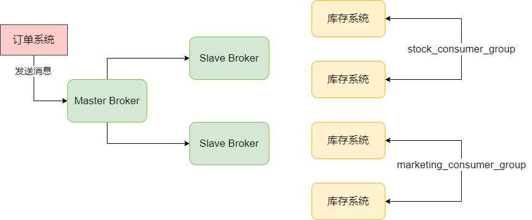
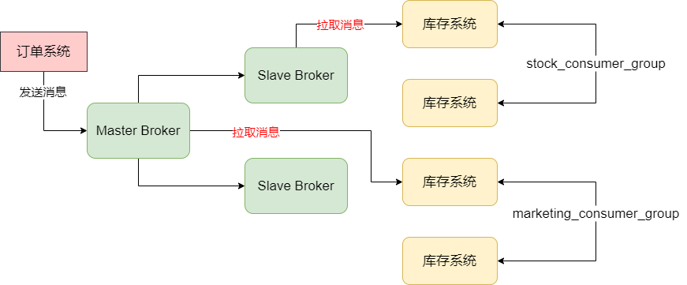
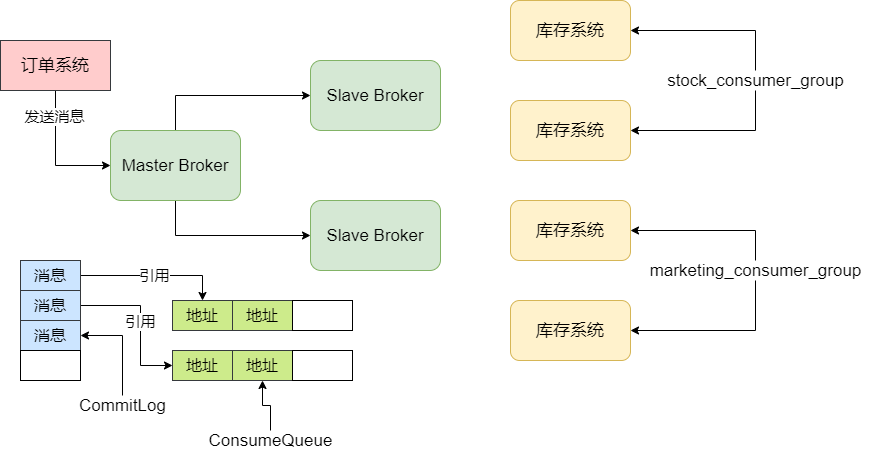
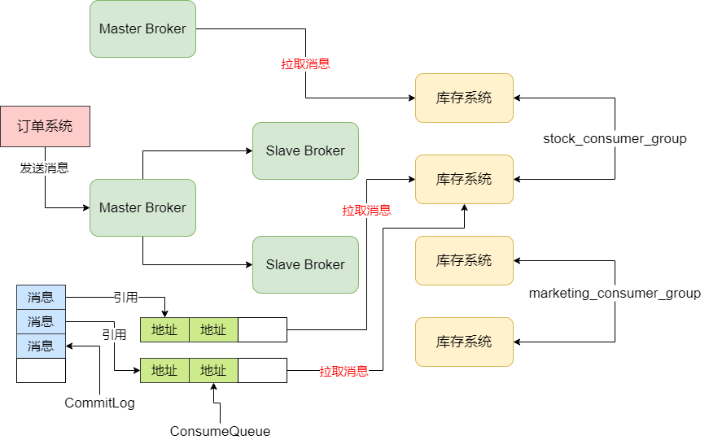
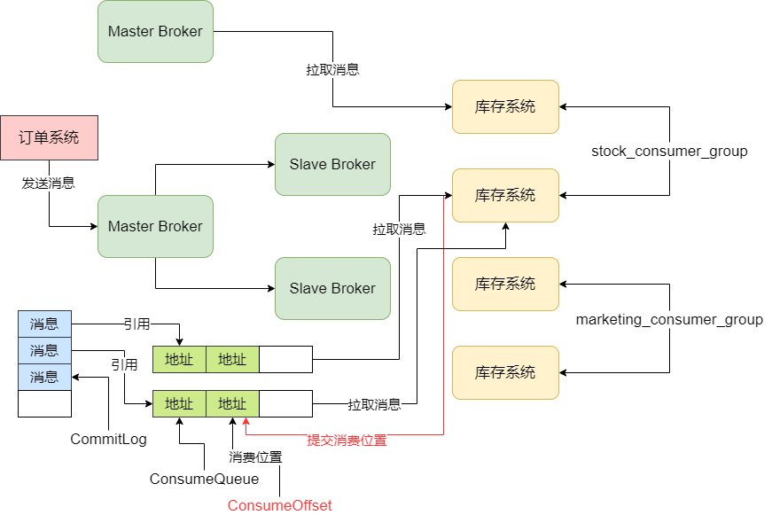
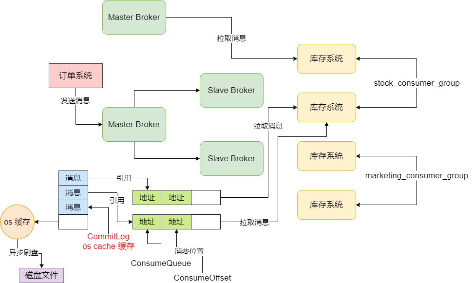

## 消费者如何获取消息处理以及进行 ACK

### 消费者组

首先，我们需要了解一个概念，就是消费者组。消费者组的意思，就是你给一组消费者起一个名字。比如我们有一个 Topic 叫 "TopicOrderPaySuccess"，然后假设有库存系统、积分系统、营销系统、仓储系统他们都要去消费这个 Topic 中的数据。此时我们应该给那四个系统分别起一个消费组的名字，比如： stock_consumer_group，marketing_consumer_group，credit_consumer_group，wms_consumer_group。


设置消费组的方式是在代码里进行的，如下：

```java
DefaultMQPushConsumer consumer = 
	new DefaultMQPushConsumer("stock_consumer_group")
```


比如说库存系统部署了 4 台机器，每台机器上的消费者组的名字都是 "stock_consumer_group"，那么这 4 台机器就同属于一个消费者组。以此类推，每个系统的几台机器都是属于各自的消费者组的。


然后跟大家说一下不同消费者之间的关系，假设库存系统和营销系统作为两个消费者组，都订阅了 "TopicOrderPaySuccess" 这个订单支付成功信息的 Topic，此时假设订单系统作为生产者发送了一条消息到这个 Topic。如图：




此时这条消息这么被消费呢？正常情况下，这条消息进入 Broker 之后，库存系统和营销系统作为两个消费组，每个组都会拉取到这条消息。也就是说这个订单支付成功的消息，库存系统会获取一条，营销系统也会获取到一条，他们都会获取到这条消息。


但是，库存系统这个消费组组里有两台机器，是两台机器都获取到这条消息，还是说只有一台机器会获取到这条消息？正常情况下，库存系统的两台机器只有一台会获取到这条消息，营销系统也是同理。如图：




这就是在消费的时候我们要注意的一点，不同的系统应该设置不同的消费组，如果不同的消费组订阅了同一个 Topic，对 Topic 里的一条消息，每个消费组都会获取到这条消息。


### 集群模式消费 VS 广播模式消费

接着，对于一个消费组而言，它获取到一条消息之后，如果消费组内部有多台机器，到底是只有一台机器可以获取到这个消息，还是每台机器都可以获取到这个消息。**这个就是集群模式和广播模式的区别**。


默认情况下都是集群模式，即一个消费组获取到一条消息，只会交给组内的一台机器去处理，不是每台机器都可以获取到这条消息的。但是我们可以通过如下设置来改变为广播模式：

```java
consumer.setMessageModel(MessageModel.BROADCASTING)
```


如果修改为广播模式，那么对于消费者组获取到的一条消息，组内每台机器都可以获取到这条消息。但是相对而言广播模式其实用的很少，常见基本上都是使用集群模式来进行消费的。


### 重温 MessageQueue、CommitLog、ConsumeQueue 之间的联系

接着我们来看一下 MessageQueue 与消费者的关系。通过之前的文章我们知道，一个 Topic 在创建的时候我们是要设置它有多少个 MessageQueue 的，而且我们也知道，在 Broker 上 MessageQueue 是如何跟 ConsumeQueue 对应起来的。


根据之前的文章，我们大致可以如此理解，Topic 中的多个 MessageQueue 会分散在多个 Broker 上，每个 Broker 机器上，一个 MessageQueue 就对应了一个 ConsumeQueue，当然在物理磁盘上其实是对应了多个 ConsumeQueue 文件的，但是我们也大致理解为一一对应的关系。


但是对于一个 Broker 机器而言，存储在它上面的所有 Topic 以及 MessageQueue 的消息数据都是写入一个统一的 CommitLog 的，然后对于 Topic 的MessageQueue 而言，就是通过各个 ConsumeQueue 文件来存储属于 MessageQueue 的消息在 CommitLog 文件中的物理位置，就是一个 offset 偏移量。如图：




### MessageQueue 与消费者的关系

对于一个 Topic 上的多个 MessageQueue，是如何由一个消费者中的多台机器来进行消费的？其实这里的源码实现细节较为复杂，我们可以简单理解为，它会均匀的将 MessageQueue 分配给消费者的多台机器来消费。


例如，假设我们的 "TopicOrderPaySuccess" 里有 4 个 MessageQueue，这 4 个 MessageQueue 分布在两个 Master Broker 上，每个 Master Broker 上有 2 个 MessageQueue。然后库存系统作为一个消费者组里有两台机器，那么正常情况下，当然最好的就是让这两台机器每个都负责 2 个 MessageQueue 的消费了。


比如库存系统的 机器01 从 Master Broker01 上消费 2 个 MessageQueue，然后库存系统的 机器02 从 Master Broker02 上消费 2 个 MessageQueue，这就就把消费的负载均摊到两台 Maser Broker 上去了。




所以你大致可以认为一个 Topic 的多个 MessageQueue 会均匀分摊给消费组内的多个机器去消费，这里的一个原则就是：**一个 MessageQueue 只能被一个消费者机器去处理，但是一台消费者机器可以负责多个 MessageQueue 的消息处理**。


### Push 模式 VS Pull 模式

我们已经知道了一个消费组内的多台机器是分别负责一部分 MessageQueue 的消费的，那么既然如此，每台机器就必须去连接到对应的 Broker，尝试消费里面的 MessageQueue 对应的消息。此时就涉及到两种消费模式了，一个是 Push，一个是 Pull。实际上，这两个消费模式本质是一样的，都是消费者机器主动发送请求到 Broker 机器去拉取一批消息下来。


Push 消费模式本质也是基于这种消费者主动拉取到的模式来实现的，只不过它的名字叫 Push 而已，意思是 Broker 会尽可能实时的把新消息交给消费者机器来进行处理，它的消息时效性会更好。一般我们使用 RocketMQ 的时候，消费模式通常都是基于它的 Push 模式来做的，因为 Pull 模式的代码写起来更加的复杂和繁琐，而且 Push 模式底层是基于消息拉取的方式来做的，只不过时效性更好而已。


Push 模式的实现思路简单说一下：当消费者发送请求到 Broker 去拉取消息的时候，如果有新的消息可以消费那么就会立马返回一批消息到消费机器去处理，处理完之后会接着立刻发送请求到 Broker 机器去拉取下一批消息。所以消费机器在 Push 模式下会处理完一批消息，立马发起请求拉取下一批消息，消息处理的时效性非常好，看起来就跟 Broker 一直不停地推送消息到消费者一样。


另外 Push 模式下有一个**请求挂起**和**长轮询**的机制，也简单说一下。当你的请求发送到 Broker，结果发现没有新的消息给你处理的时候，就会让请求线程挂起，默认是挂起 15秒，然后这个期间它会有后台线程每隔一会就去检查一下是否有新的消息给你。另外如果在这个挂起过程中，如果有新的消息到达了会主动唤醒挂起的线程，然后把消费返回给你。


### Broker 如何将消息读取出来返回给消费机器

Broker 在收到消费机器的拉取请求之后，如何将消息读取出来返回给消费机器？其实这里涉及到两个概念，分别是 **ConsumeQueue** 和 **CommitLog**。


假设一个消费者机器发送了拉取请求到 Broker 了，它说这次要拉取 MessageQueue0 中的消息，然后我之前都没拉取过消息，所以就从这个 MessageQueue0 中的第一条消息开始拉取就好了。于是，Broker 就会找到 MessageQueue0 对应的 ConsumeQueue0，从里面找到第一条消息的 offset。


接着 Broker 就需要根据 ConsumeQueue0 中找打的第一条消息的地址，去 CommitLog 中根据这个 offset 地址去读取这条消息的数据，然后把这条消息的数据返回给消费者机器。


所以其实消费信息的时候，本质上就是根据你要消费的 MessageQueue 以及开始消费的位置，去找到对应的 ConsumeQueue 读取里面对应位置的消息在 CommitLog 中的物理 offset 偏移量，然后到 CommitLog 中根据 offset 读取消息数据，返回给消费者机器。


### 消费者机器处理消息、进行 ACK 以及提交消费进度

接着消费者机器拉取到一批消息之后，就会将这批消息回调我们注册的一个函数，如下面：

```java
consumer.registerMessageListener(new MessageListenerConcurrently() {
	@Override
	public ConsumeConcurrentlyStatus consumeMessage(
				List<MessageExt> msgs, ConsumeConcurrentlyContext context) {
		// 处理信息
        // 标记改消息已经被成功消费
        return ConsumerConcurrentlyStatus.CONSUME_SUCCESS;
	} 
})
```


当我们处理完这批消息之后，消费者机器就会提交我们目前的一个消费进度到 Broker 上，然后 Broker 就会存储我们的消费进度。


比如我们现在对 ConsumeQueue0 的消费进度假设就是在 offset = 1 的位置，那么它会记录下来一个 ConsumeOffset 的东西去标记我们的消费进度，如图：




那么下次这个消费组想要再次拉取这个 ConsumeQueue 的消息，就可以从 Broker 记录的消费位置开始拉取，不用重头开始拉取了。


### 消费组中出现机器宕机或者机器扩容

最后，如果消费组中出现机器宕机或者扩容机器的情况，会怎么处理？


这个时候会进入一个 rebalance 的环节，也就是重新给各个消费机器分配它们要处理的 MessageQueue。


例如现在 机器01 负责 MessageQueue0 和 Message1，机器02 负责 MessageQueue2 和 MessageQueue3，现在 机器02 宕机了，那么 机器01 就会接管 机器02 之前负责的 MessageQueue2 和 MessageQueue3；或者如果此时消费组加入了一台 机器03，此时就可以把 机器02 之前负责的 MessageQueue3 转移给 机器03，然后 机器02 就只负责一个 MessageQueue2 的消费了。这就是负载重平衡的概念。


## 消费者根据什么策略从 Master 或 Slave 上拉取消息

Broker 实现高可用架构的时候是有主从之分的，消费者消费消息，可以从 Master Broker 拉取，也可以从 Slave Broker 拉取，具体是要看机器负载来定。所以，到底什么时候从 Master Broker 拉取，什么时候从 Slave Broker 拉取？


我们先来简单回顾一下，之前我们对 Broker 的读写分离架构师怎样描述的。之前说过，刚开始消费者都是连接到 Master Broker 机器去拉取消息，然后如果 Master Broker 机器觉得自己负载比较高，就会告诉消费者机器，下次可以从 Slave Broker 机器去拉取。


### CommitLog 基于 os cache 提升写性能

上面我们说过，拉取消息的时候必然会先读取 ConsumeQueue 文件，这个 ConsumeQueue 文件的读取时如何优化的？要搞明白这个，就要回顾一下之前说过的 CommitLog 文件写入的优化原理，其实本质就是基于 os cache 来进行优化的。也就是说，Broker 收到一条消息，会写入 CommitLog 文件，但是会先把 CommitLog 文件中的数据写入 os cache（操作系统管理的缓存）中去，然后 os 自己有后台线程，过一段时间会异步把 os cache 缓存中的 CommitLog 文件的数据刷入磁盘中去。




就是依靠这个**写入 CommitLog 时先进入 os cache 缓存，而不是直接进入磁盘的机制**，就可以实现 Broker 写 CommitLog 文件的性能是内存写级别的，这才能实现 Broker 超高的消息接入吞吐量。


### ConsumeQueue 文件也是基于 os cache 的

接下来一个关键的问题，就是 ConsumeQueue 会被大量的消费者发送的请求给高并发地读取，所以 ConsumeQueue 文件的读操作是非常频繁的，而且同时会极大地影响到消费者进行消息拉取的性能和消费吞吐量。


所以实际上 Broker 对 ConsumeQueue 文件同样也是基于 os cache 来进行优化的。即，对于 Broker 机器的磁盘上的大量 ConsumeQueue 文件，在写入的时候也都是优先进入 os cache 中的。而且 os 自己有一个优化机制，就是读取一个磁盘文件的时候，它会自动把磁盘文件的一些数据缓存到 os cache 中。而且 ConsumeQueue 文件主要是存放消息的 offset，所以每个文件很小，30万 条消息的 offset 就只有 5.72MB 而已。所以实际上 ConsumeQueue 文件们不占多多少磁盘空间，它们整体数据量很小，几乎可以被 os 缓存在内存 cache 里。


所以实际上消费者拉取消息的时候，第一步大量地频繁读取 ConsumeQueue 文件，几乎可以说就是跟读内存里的数据的性能是一样的，通过这个就可以保证数据消费的高性能以及高吞吐。


### CommitLog 是基于 os  cache + 磁盘一起读取的

接下来看第二个关键的问题，在进行消息拉取的时候，先读 os cache 里的少量 ConsumeQueue 的数据，这个性能是极高的，然后第二步就是根据你读取到的 offset 去 CommitLog 里读取消息的完整数据了。所以，这个从 CommitLog 里读取消息完整数据是如何读取的？是从 os cache 里读取？还是从磁盘里读取？


答案是，两者都有。因为 CommitLog 是用来存放消息的完整数据的，所以容量是很大的，毕竟它一个文件就要 1GB，所以整体完全有可能多达几个 TB。这么多数据，不可能都放在 os cache 里。因为 os cache 用的也是机器的内存，一般多也就是几十个 GB 而已，何况 Broker 自身的 JVM 也要用一些内存，留给 os cache 的内存只是一部分而已，比如 10GB ~ 20GB。所以 os cache 对于 CommitLog 而言，无法把它全部数据放在里面给你读取的。


即，os cache 对于 CommitLog 而言，主要是提升文件写入性能，当你不停地写入的时候，很多最新写入的数据都会先停留在 os cache 里，比如这可能有 10GB ~ 20GB 的数据。之后 os 会自动把 cache 里的比较旧的数据刷入磁盘里，腾出来空间给更新写入的数据放在 os cache 里，所以大部分数据可能多达几个 TB 都是在磁盘上的。


所以，当你拉取消息的时候，可以轻松从 os cache 里读取少量的 ConsumeQueue 文件里的 offset，这个性能是极高的，但是当你去 CommitLog 文件里读取完整消息数据的时候，会有两种情况：


- 如果你读取的是那种刚刚写入 CommitLog 的数据，那么大概率它们还停留在 os cache 中，此时你可以顺利地直接从 os cache 里读取 CommitLog 中的数据，这个就是内存读取，性能是很高的。

- 你读取的是比较早之前写入 CommitLog 的数据，那些数据早就被刷入磁盘了，已经不再 os cache 里了，那么此时你就只能从磁盘上的文件读取了，这个性能是比较差一些的。


### 什么时候从 os cache 读？什么时候从磁盘读

如果你的消费者机器一直快速地在拉取和消费处理，紧紧地跟上了生产者写入 Broker 的消息速率，那么你每次拉取几乎都是在拉取最近人家刚写入 CommitLog 的数据，那几乎都在 os cache 里。但是如果 Broker 的负载很高，导致你拉取消息的速度很慢，或者是你自己的消费者机器拉取到一批消息之后处理的性能很低，处理的速度很慢，这都会导致你跟不上生产者的写入速率。


比如人家到写入 10万 条数据了，而你才拉取了 2万 条数据，此时有 5万 条最新的数据是在 os cache 里，有 3万 条你还没拉取的数据是在磁盘里，那么后续当你再拉取的时候，必然很大概率是从磁盘里读取早就刷入磁盘的 3万 条数据。


接着之前再 os cache 里的 5万 条数据可能又被刷入磁盘了，取而代之的是更新的几万条数据在 os cache 里，然后你再次拉取的时候，又会从磁盘里读取刷入磁盘里的 5万 条数据，相当你每次都在从磁盘里读取数据了。


### Master Broker 什么时候会让你从 Slave Broker 拉取数据

那到底什么时候 Master Broker 会让你从 Slave Broker 拉取数据？假设此时你的 Broker 里已经写入了 10万 条数据，但是你仅仅拉取了 2万 条数据，下次你拉取的时候，是从第 2万 零 1 条数据开始继续往后拉，也就是说，此时你有 8万 条数据是没有拉取的。


然后 Broker 自己是知道机器上当前的整体物理内存有多大的，而且它知道自己可用的最大空间占里面的比例，它是知道自己的消息最多可以在内存里放多少的。比如它知道它最多在内存里存放 5万 条消息而已。然后这个时候你过来拉取消息，它发现你还有 8万 条消息没有拉取，这个 8万 条消息它发现是大于最多存放的 5万 条消息的，那么此时就说明，肯定有 3万 条消息目前是在磁盘上的，不在 os cache 内存里。


所以经过上述判断，会发现此时你很大概率会从磁盘里加载 3万 条消息出来，他会认为，出现这种情况，很可能是因为自己作为 Master Broker 负载太高，导致没法及时把消息给你，所以你落后的进度比较多。这个时候，它会告诉你，我这次给你从磁盘里读取 3万 条消息，但是下次你还是从 Slave Broker 去拉取吧。


以上就是对这个关键问题的解答，本质是对你当前没有拉取消息的数量和大小，以及最多可以存放在 os cache 内存的消息的大小，如果你没拉取的消息超过了最大能使用的内存的量，那么说明你后续会频繁从磁盘加载数据，此时就让你从 Slave Broker 去加载数据了。


