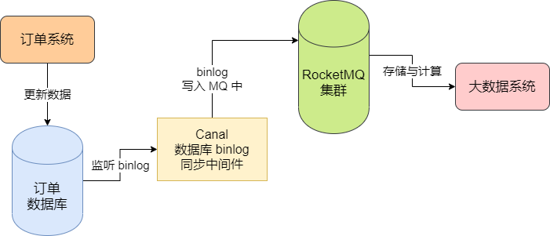
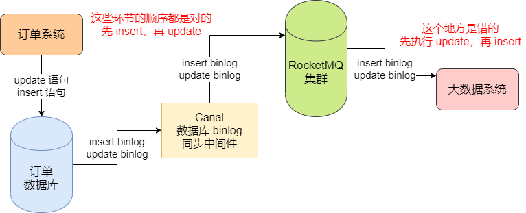
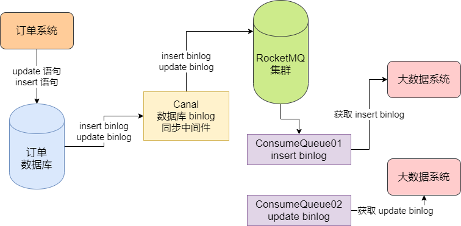
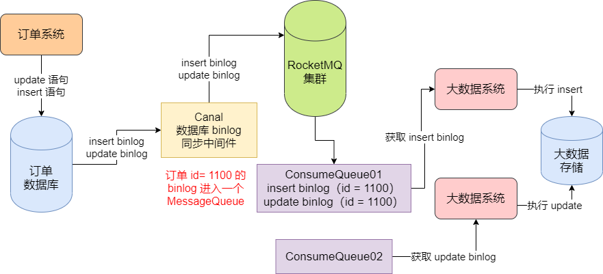
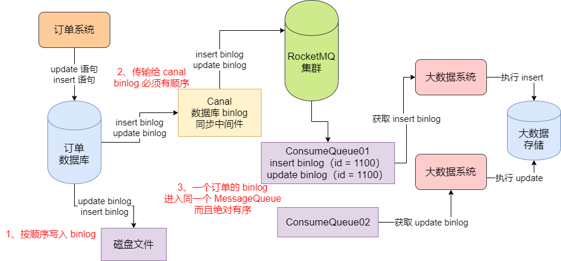
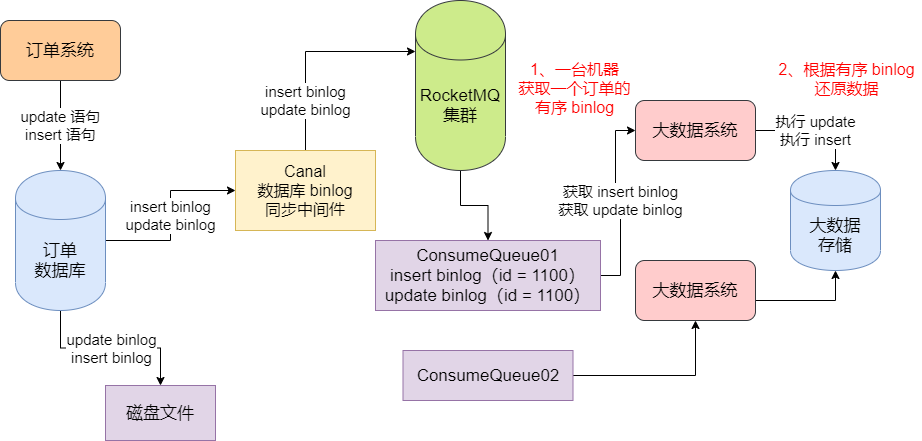

## 案例分析

大数据团队需要获取订单数据库中的全部数据，然后将订单数据保存一份在自己的大数据存储系统中，比如 HDFS、Hive、HBASE 等。接着基于大数据技术对这些数据进行计算。


如果让大数据系统自己跑负责的大 SQL 在订单系统的数据库上来出一些数据报表，是会严重影响订单系统的性能的，所有采用了基于 canal 这样的中间件去监听订单数据库的 binlog，就是一些增删改查的日志，然后把这些 binlog 发送到 MQ 里去。接着大数据系统自己从 MQ 里获取 binlog，落地到自己的大数据存储中去，然后对自己的存储中的数据进行计算得到数据报表即可。如图：




### 大数据团队遇到的问题：数据指标错误

这个方案运行一段时间后遇到了一些奇怪的问题。他们通过这个方案计算出来的数据报表，被发现很多数据指标都是错误的。于是他们就展开了排查，在对自己的大数据存储中的订单数据与订单数据库中的订单数据进行了一次比对之后，发现他们那儿的一些订单数据是不对的。比如在订单数据库中一个订单的字段 A 的值是 100，结果在大数据存储中的一个订单的字段 A 的值是 0


如果两边的订单数据的字段值不一致的话，必然导致最终计算出来的数据报表的指标是错误的。


### 订单数据库的 binlog 消息乱序

针对这个问题，在系统中打印了很多的日志，观察了几天，发现订单数据库的 binlog 在通过 MQ 同步的过程中，出现了奇怪的消息乱序的现象。


比如订单系统在更新订单数据库的时候，有两条 SQL 语句：

```mysql
insert into order values(xx, 0);
update order set xxvalue = 100 where id = xxx;
```


就是先插入一条数据，刚开始它一个字段的值是 0，接着更新它的一个字段的值是 100。然后这两条SQL 语句是对应是两个 binlog，也就是两个更新日志，一个 binlog 是 insert 语句的，一个 binlog 是 update 语句的，这个 binlog 会进入到 MQ 中去，然后大数据系统从 MQ 获取出来 binlog 的时候，居然是先获取出来了 update 语句的 binlog，然后再获取了 insert 语句的 binlog。


即，这个时候会先执行更新操作，但是此时数据根本不存在，没法进行更新，接着执行插入操作，也就是插入一条字段值为 0 的订单数据进去，最后大数据存储中的订单记录的字段值就是0




正是这个消息乱序的原因，导致了大数据存储中的数据都错乱了。


### 基于 MQ 来传输数据为什么会出现消息乱序

这个原因很简单。我们之前讲过，可以给每个 Topic 指定多个 MessageQueue，然后你写入消息的时候，其实是会把消息均匀分发给不同的 MessageQueue 的。


比如我们在写入 binlog 到 MQ 的时候，可能会把 insert binlog 写入到一个 MessageQueue 里去，update binlog 写入到另外一个 MessageQueue 里去。


接着大数据系统在获取 binlog 的时候，可能会部署多台机器组成一个 Consumer Group，对于 Consumer Group 中的每台机器都会负责消费一部分 MessageQueue 的消息，所以可能一台机器上 ConsumeQueue01 中获取 insert binlog，一台机器从 ConsumeQueue02 中获取 update binlog。




上图中，是两台机器上的大数据系统并行地去获取 binlog，所以完全有可能是其中一个大数据系统先获取到了 update binlog 去执行，此时存储中没有数据，自然是没法更新的。然后另外一个大数据系统再获取到 insert binlog 去执行插入操作，最终导入只有一个字段值为 0 的订单数据。


### 消息乱序

实际上，在使用 MQ 的时候出现消息乱序是非常正常的一个问题，因为我们原本有顺序的消息，完全有可能分发到不同的 MessageQueue 中去，然后不同的机器上部署的 Consumer 可能会用混乱的顺序从不同的 MessageQueue 里获取消息然后处理。所以在实际使用 MQ 的时候，我们必须要考虑到这个问题。


## 解决消息乱序问题

上面我们分析了订单数据库同步过程中的消息乱序问题产生的根本原因，最关键的是，属于同一个订单的 binlog 进入不同的 MessageQueue，进而导致一个订单的 binlog 被不同机器上的 Consumer 来获取和处理。


### 让属于同一个订单的 binlog 进入一个 MessageQueue

所以要解决这个消息乱序的问题，就得想办法让一个订单的 binlog 进入到一个 MessageQueue 里去。


举个例子，比如对一个订单，我们先后执行了 insert、update 两条 SQL 语句，也对对应了 2 个 binlog。那么我们就要想办法让这个订单的 2 个 binlog 都直接进入到 Topic 下的一个 MessageQueue 里去。我们可以怎么做？可以根据订单 id 来进行判断，我们可以往 MQ 里发送 binlog 的时候，根据订单 id 来判断一下，如果订单 id 相同，你必须保证它进入同一个 MessageQueue


我们可以采用取模的方法。比如有一个订单 id 是 1100，那么他可能有 2 个 binlog，对着两个 binlog，我们用订单 id = 1100 对 MessageQueue 的数量进行取模，比如 MessageQueue 一共有 15 个，那么此时 1100 对 15 取模，就是 5。即，凡是订单 id = 1100 的binlog，都应该进入位置为 5 的 MessageQueue 中去。


通过这个方法，我们就可以让一个订单的 binlog 都按照顺序进入到一个 MessageQueue 中去。如图：




### 获取 binlog 的时候也要有序

接着，只要一个订单的 binlog 都进入一个 MessageQueue 就搞定这个问题了吗？显示不是的，我么要考虑一个问题，就是我们的 MySQL 的数据库的 binlog 是有顺序的。


比如，订单系统对订单数据执行两条 SQL，先是 insert 语句，然后是 update 语句，那么此时 MySQL 数据库自己必然是在磁盘文件里按照顺序写入 insert 语句的 binlog，然后写入 update 语句的 binlog。当我们从 MySQL 数据中获取它的 binlog 的时候，此时也必须是按照 binlog 的顺序来获取的，也就是说比如 Canal 作为一个中间件从 MySQL 那里监听和获取 binlog，那么当 binlog 传输到 Cancel 的时候，也必然是有先后顺序的


接着我们将 binlog 发送给 MQ 的时候，必须将一个订单的 binlog 都发送到一个 MessageQueue 里去，而且发送过去的时候，也必须是严格按照顺序来发送的。只有这样，最终才能让一个订单的 binlog 进入同一个 MessageQueue，而且还是有序的。如图：




### Consumer 有序处理一个订单的 binlog

接着，一个 Consumer 可以处理多个 MessageQueue 的消息，但是一个 MessageQueue 只能交给一个 Consumer 来进行处理，所以一个订单的 binlog 只会有序地交给一个 Consumer 来进行处理。如图：




### 消息处理失败

这样就万事大吉了吗？绝对不是，这样说过，在 Consumer 处理消息的时候，可能会因为底层存储挂了导致消息处理失败，此时可以返回 `RECONSUME_LATER` 状态，然后 Broker 会过一会自动给我们重试。但是这个方案是绝对不可以用在我们的有序消息中的。因为如果你的 consumer 获取到订单的一个 insert binlog，结果处理失败了，此时返回 `RECONSUME_LATER`，那么这条消息会进入重试队列，过一会才会交给你重试。


但是此时 Broker 会直接把下一条消息，也就是订单的 update binlog 交给你处理，此时万一你执行成功了，就根本没有数据可以更新。又会出现消息乱序的问题。


所以对于有序消息的方案中，如果你遇到消息处理失败的场景，就必须返回 `SUSPEND_CURRENT_QUEUE_A_MOMENT` 这个状态，意思是先等一会，一会再继续处理这批消息，而不能把这批消息放入重试队列去，然后直接处理下一批消息。


### 有序消息方案与其他消息方案的结合

如果你一定要求消息是有序的，那么必须得用上述的有序消息方案，同时对这个方案，如果你要确保消息不丢失，那么可以和消息零丢失方案结合起来。如果你要避免消息重复处理，还需要在消费者那里处理消息的时候，去看一下，消息如果已经存在就不能重复插入等等。


同时还需要设计自己的消息处理失败的方案，也就是不能让消息进入重试队列，而是暂停等待一会，继续处理这批消息。


## RocketMQ 的顺序消息机制的伪代码实现

首先要实现消息顺序，必须让一个订单的 binlog 都进入一个 MessageQueue 中，此时我们可以写如下的代码：

```java
SendResult sendResult = producer.send(
	message,
	new MessageQueueSelector() {
        
		@Override
		public MessageQueue select(
				List<MessageQueue> mqs,
				Message msg, Object arg) {
            
			Long orderId = (Long) arg;	// 根据订单id选择发送queue
			long index = id % mqs.size();	// 用订单id对MessageQueue 数量取模
			return mqs.get((int) index);	//返回一个MessageQueue
		}
	}, 
	orderId	//这里传入订单id
);
```


上面代码中，我们看到关键因素有两个，一个是发送消息的时候传入一个 MessageQueueSelector，在里面你要根据订单 id 和 MessageQueue 数量去选择这个订单 id 的数据进入哪个 MessageQueue。同时在发送消息的时候除了带上消息自己以外，还要带上订单 id，然后 MessageQueueSelector 就会根据订单 id 去选择一个 MessageQueue 发送过去，这样的话，就可以保证一个订单的多个 binlog 都会进入一个 MessageQueue 中去。


### 消费者如何保证按顺序来获取一个 MessageQueue 中的消息

接着，就是消费者如何按照顺序，来获取一个 MessageQueue 中的消息。

```java
consumer.registerMessageListener(
	new MessageListenerOrderly() {
	
		@Override
		public ConsumeOrderlyStatus consumeMessage(
				List<MessageExt> msgs,
				ConsumeOrderlyContext context) {
				
			context.setAutoCommit(true);
			try {
				for(MessageExt msg : msgs) {
					// 对有序的消息进行处理
				}
				return ConsumerOrderlyStatus.SUCCESS;
			}catch(Exception e) {
				// 如果消息处理有问题
				// 返回一个状态，让它暂停一会再继续处理这批消息
				return SUSPEND_CURRENT_QUEUE_A_MOMENT;
			}
		}
	}
);
```


在上面的代码中，有一个点要注意一下。我们使用的是 `MessageListenerOrderly` 这个东西，它里面有 Orderly 这个名词，也就是说，Consumer 会对每一个 ConsumeQueue，都仅仅用一个线程来处理其中的消息。


比如对 ConsumeQueue01 中的订单 id = 1100 的多个 binlog，会交给一个线程来按照 binlog 顺序依次处理。否则如果 ConsumeQueue01 中的订单 id = 1100 的多个 binlog 交给 Consumer 的多个线程来处理的话，那还是会有消息打乱的问题。


### 基于 RocketMQ 的数据过滤机制，提升订单数据库同步的处理效率

我们讲完了消息顺序方案，现在我们基于订单数据库同步的这个场景，来简单看一下如何对混杂在一起的数据进行过滤的方案。


我们都知道，一个数据库可能包含很多表的数据，比如订单数据库，它里面除了订单信息表以外，可能还包含很多其他的表。所以我们在进行数据库 binlog 同步的时候，很可能是把一个数据库里所有表的 binlog 都推送到 MQ 里去的。


所以在 MQ 的某个 Topic 中，可能是混杂了订单数据的几个甚至十几个表的 binlog 数据，不一定仅仅包含我们想要的表的 binlog 数据。


### 处理不关注的表 binlog，是很浪费时间的

此时假设我们的大数据系统仅仅关注订单数据库中的表 A 的 binlog，并不关注其它表的 binlog，那么大数据系统可能需要在获取到所有表的 binlog 之后，对每一条 binlog 判断一下，是否是表 A 的binlog？如果不是表 A 的binlog，就直接丢弃不处理；如果是表 A 的binlog，才会去进行处理。


但是这样，必然会导致大数据系统处理很多不关注的表的 binlog，也会很浪费时间，降低效率。


### 发送消息的时候，给消息设置 tag 和属性

针对这个问题你，我们可以采用 RocketMQ 支持的**数据过滤**机制，来让大数据系统仅仅关注它想要的表的 binlog 数据即可。


我们在发送消息的时候，可以给消息设置 tag 和属性，如下：

```java
Message msg = new Message(
	"TopicOrderDbData",	// 这是我们订单数据库写入的 Topic
	"TableA",	// 这是这条数据的 tab，可以是表的名字
	("binlog").getBytes(RemotingHelper.DEFAULT_CHARSET)	// 这是一条 binlog 数据
);

// 我们可以给一条消息设置一些属性
msg.putUserProperty("a", 10);
msg.putUserProperty("b", "abc");
```


上面的代码清晰地展示了我们发送消息的时候，其实是可以给消息设置 tag、属性等多个附加的消息的。


### 消费数据的时候根据 tag 和属性进行过滤

接着我们可以在消费的时候根据 tag 和 属性进行过滤，比如我们可以通过下面的代码去指定，我们只要 tag = TableA 和 tag = TableB 的数据。

```java
consumer.subscribe("TopicOrderDbData", "TableA || TableB");
```


或者我们也可以通过下面的语法去指定，我们要根据每条消息的属性的值进行过滤，此时可以支持一些语法，比如：

```java
consumer.subscribe("TopicOrderDbData", 
				MessageSelector.bySql("a > 5 AND b = 'abc'"));
```


RocketMQ 还是支持比较丰富的数据过滤语法的，如下：

- 数值比较，比如：>，>=，<，<=，BETWEEN，=

- 字符比较，比如：=，<>，IN

- IS NULL 或者 IS NOT NULL

- 逻辑符号 AND，OR，NOT

- 数值，比如：123，3.1415

- 字符，比如：'abc'，必须用单引号包裹起来

- NULL，特殊的常量

- 布尔值，TRUE 或 FLASE


### 基于数据过滤减轻 Consumer 负担

在使用 MQ 的时候，如果 MQ 里混杂了大量的数据，可能 Consumer 仅仅对其中一部分数据感兴趣，此时可以在 Consumer 端使用 tag 等数据过滤语法，过滤出自己感兴趣的数据来消费。

