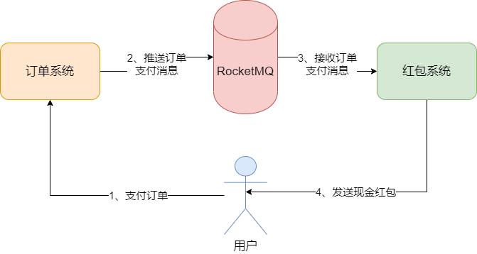
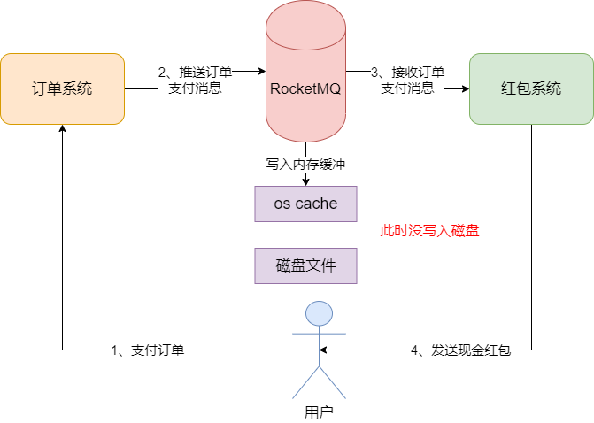
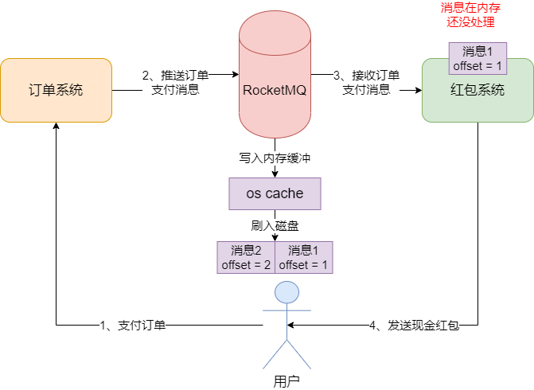
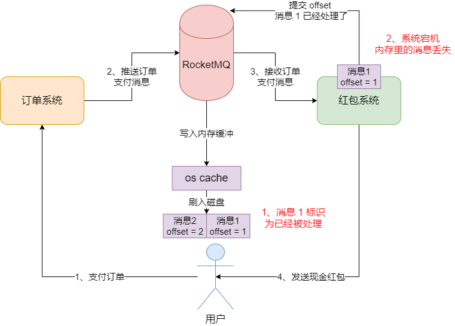
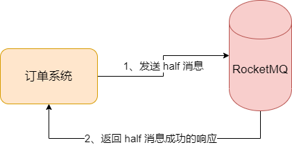
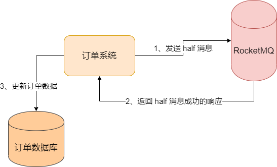
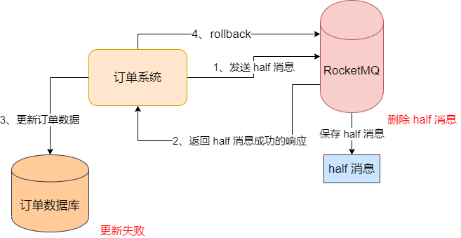
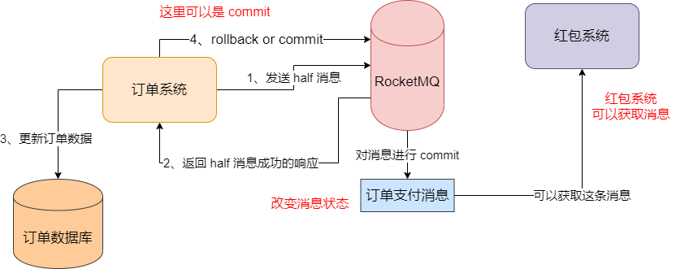
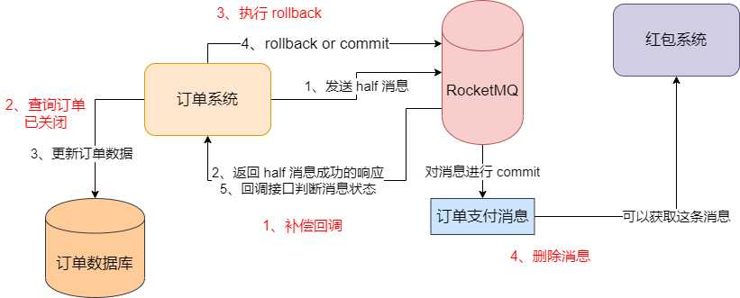

## 示例背景

在一个电商系统中，按照规则在支付之后可以拿到一个现金红包的，但是在支付了一个订单之后，却没有收到这个现金红包。这是怎么回事？

经过一通排查，找了系统中打印的很多日志之后，发现了一个奇怪的现象。按理来说，订单系统在完成支付之后，会推送一条消息到 RocketMQ 里去，然后红包系统会从 RocketMQ 里接收那条消息去给用户发现金红包：如图：

但是从订单系统和红包系统当天那个时间段的日志来看，只看到了订单系统有推送消息到 RocketMQ 的日志，但是并没有看到红包系统从 RocketMQ 中接收消息以及发现金红包的日志。

大家推测可能问题就出在这，有可能支付订单系统在传输的过程中丢失了，导致现金红包没有派发出去。

### 订单系统推送消息到 MQ 的过程会丢失消息

首先，订单系统在接收到订单支付成功的通知之后，会去推动一条订单支付成功的消息到 MQ 的，那么这个过程中，会出现丢失消息的问题吗？当然有可能。例如，订单系统在推送消息到 RocketMQ 的过程中，是通过网络去进行传输的，但是这个时候恰巧网络发送了抖动，也就是网络突然出了问题，导致这次网络通信失败了，于是这个消息就没有成功投递给 MQ。

除此之外，还有其他情况。例如 MQ 的确收到消息了，但是它的网络通信模块的代码出现了异常，可能是它内部的网络通信的 bug，导致消息没成功处理；或者是你在写消息到 RocketMQ 的过程中，刚好遇到了某个 Leader Broker 自身故障，其他的 Follower Broker 正在尝试切换为 Leader Broker，这个过程中也可能有异常等等。

因为我们在使用任何一个 MQ 的时候，无论是 RocketMQ、还是 RabbitMQ 或者 Kafka，都要明确一点：不一定你发送消息出去就一定会成功，有可能就会失败，此时你的代码里可能会抛出异常，也可能不会抛出异常，这都不好说，要具体看什么原因导致的消息推送失败。

### 消息到达 MQ 后，MQ 自己丢失信息

接下来，假设我们的订单系统成功地把消息写入了 MQ，此时我们可以认为你写成功了，此时消息有可能丢失吗？这也是有可能的。通过之前的 RocketMQ 的底层原理的分析，我们知道一点，就是你的消息写入 MQ 之后，其实 MQ 可能仅仅把这个消息给写入 page cache 里，也就是操作系统自己管理的一个缓冲区，这本质也是内存。如图：

可能你认为写成功了一个消息，但是此时仅仅进入了 os cache，还没有写入磁盘。然后这个时候，假如出现了 Broker 机器的崩溃，机器宕机了，是不是 os cache 内存中的数据就没了？

### 消息进入磁盘，真的万无一失吗

之前说过，Broker 把消息写入 os cache 之后，其实操作系统自己在一段不太确定的时间之后，它自己是会把数据从内存刷入磁盘文件里的。假设我们写入 MQ 的一条消息已经稳稳进入 Broker 所在机器的磁盘文件里了，这个时候数据一定不会丢失吗？

答案是不，因为如果你的磁盘出现故障，你上面的存储的数据还是会丢失。之前就有互联网公司把数据存储在服务器的磁盘上，但是因为没有做完善的冗余备份，结果机器磁盘故障导致公司运营几年的核心数据没了。所以如果消息进入 Broker 机器的磁盘之后，赶上机器刚好磁盘坏了，可能上面的消息也就都丢失了。

### 红包系统拿到消息，就不会丢失吗

接着，假设红包系统这个时候顺利从 MQ 里拿到了一条消息，然后它就能安稳地把现金红包发出去吗？这也是未必的，要解释这个问题，就需要牵扯到消息的 offset 这个概念了。

之前已经在底层原理分析的部分解释了 MQ 底层的存储结构，包括消息的 offset 的概念，说白了，offset 就是代表了一个消息的标识，代表了它的位置。

假设现在有两个消息，offset 分别为 1 和 2，现在我们假设红包系统已经获取到了消息 1 了，然后消息 1 此时就在它的内存里，正准备运行代码去派发现金红包，但是要注意，此时还没发红包。如图：

默认情况下，MQ 的消费者有可能会自动提交已经消费的 offset，如果此时你还没处理这个消息派发红包的情况下，MQ 的消费者可能直接给你提交这个消息 1 的 offset 到 Broker 去了，标识为你已经成功处理了这个消息。接着恰巧在这个时候，我们的红包系统突然宕机了，或者是可能在派发红包的时候更新数据库失败了，总之就是它突然故障了，然后此时内存里的消息 1 必然丢失了，而且红包也没发出去。

### 总结

红包为什么没发出去？原因有很多，比如订单系统推送消息到 MQ 就失败了，压根就没推送出去；或者是消息确实推送到 MQ 了，但是结果 MQ 自己机器故障，把消息搞丢了；或者是红包系统拿到了消息，但是它把消息搞丢了，红包也没来得及发。

## 发送消息零丢失方案：RocketMQ 的事务消息

我们明确了消息在基于 MQ 传输的过程中可能丢失的几个地方，那么我们就要一步一步考虑如何去解决各个环节丢失信息的问题。

首先要解决的第一个问题，就是订单系统推送消息到 MQ 的过程中，可能消息就丢失了。在 RocketMQ 中，有一个非常牛逼的功能，就是**事务消息**功能。凭借这个事务级的消息机制，就可以让我们确保订单系统推送出去的消息一定会成功写入 MQ 里，不会半路就搞丢了。

### 发送 half 消息到 MQ 去，试探 MQ 是否正常

作为订单系统而言，假设它收到了一个订单支付成功的通知之后，它必然是需要在自己的订单数据库里做一些增删改操作的，比如更新订单状态之类的。可能有些人会认为，订单系统不就是在自己数据库里做一些增删改操作，然后直接发个消息到 MQ 去，让其他关注这个订单支付成功消息的系统从 MQ 获取消息做对应的处理就行了么？

其实并不会这么简单。在基于 RocketMQ 的事务消息机制中，我们先让订单系统发送一条 `half` 消息到 MQ 去。这个 half 消息本质就是一个订单支付成功的消息，只不过你可以理解为这个 half 消息的状态是 half 状态，这个时候红包系统是看不见这个 half 消息的。然后我们去等待接收这个 half 消息写入成功的响应通知。如图：

发送这个 half 消息有什么用？假设你二话不说就让订单系统直接做了本地的数据库操作，比如订单状态都更新为了已完成，然后你再发送消息给 MQ，结果报出一堆异常，发现 MQ 挂了。这个时候，会导致你没法通过消息通知到红包系统去派发红包，那用户一定会发现自己订单支付了，结果红包没收到。

所以，这里我们第一件事，不是先让订单系统做一些增删改操作，而是先发一个 half 消息给 MQ 以及收到它的成功的相应，初步先跟 MQ 做个联系和沟通。

### half 消息写入失败

如果 half 消息写入失败，例如 MQ 挂了，或者网络故障了，总之你现在没法跟 MQ 通信了。这个时候你的订单系统就应该执行一系列回滚操作，比如对一个订单状态做一个更新，让状态变成 “关闭交易”，同时通知支付系统自动进行退款，这才是正确的做法。

因为你订单虽然支付了，但是派发红包、发送优惠券之类的后续操作是无法执行的，所以此时必须把钱款退还给用户，说交易失败了。

### half 消息成功之后，订单系统完成自己的任务

接着，如果你的 half 消息写成功了，这个时候你的订单系统就应该在自己的本地数据库里执行一些增删改操作了，因为一旦 half 消息写成功了，就说明 MQ 肯定已经收到这条消息了，MQ 还活着，而且目前你是可以跟 MQ 正常沟通的。

### 订单系统的本地事务执行失败

接着上面的情况，如果订单更新自己的数据库失败了怎么办？比如订单系统的数据当时也有网络异常，或者数据库挂了等等。这个时候也简单，就是让订单系统发送一个 `rollback` 请求给 MQ 就可以了。意思是说，你可以把之前我发送给你的 half 消息给删除掉了，因为我自己出现问题了，已经没办法跟你继续后续的流程了。

当然你发送 `rollback` 请求给 MQ 删除那个 half 消息之后，你的订单系统就必须走后续的回退流程了，就是通知支付系统退款。当然这里可能还有一些订单系统自己的高可用降级的机制需要考虑，比如数据库无法更新了，此时你可能需要在机器本地磁盘文件里写入订单支付失败的记录，然后你可以开一个后台线程在 MySQL 数据库恢复之后，把订单状态更新为 “已关闭”。

### 订单完成本地事务之后

如果订单系统成功完成了本地的事务操作，此时你就可以发送一个 `commit` 请求给 MQ，要求让 MQ 对之前的 half 消息进行 commit 操作，让红包系统可以看见这个订单支付成功消息。

之前我们说过，half 消息实际就是订单支付成功的消息，只不过它的状态是 half，红包系统是看不见它的，没法获取这条消息，必须等到订单系统指定 commit 请求，消息比 commit 之后，红包系统才可以看到和获取这条消息进行后续操作。

### half 消息发送成功，但没有收到响应

大致的事务流程是讲完了。但是接着我们进行比较严谨的分析。如果我们把 half 消息发送给 MQ，MQ 给保存下来了，但是 MQ 返回给我们的响应我们没收到呢？此时会发生什么？

这个时候我们没收到响应，有可能是网络超时报错，或者是其他的异常错误，这个时候订单系统会误以为是发送 half 消息到 MQ 失败，订单系统会直接执行退款流程，订单状态也会标记为 “已关闭”。

但这个时候 MQ 已经存储下来一条 half 消息了，那这个消息怎么处理？其实 RocketMQ 这里有一个补偿流程，它会去扫描自己处于 half 状态的消息，如果我们一直没有对这个消息执行 commit/half 操作，超过了一定的时间，它就会回调你的订单系统的一个接口。

它会询问这个消息是打算 commit 还是 rollback，这个时候订单系统就得去查一下数据库，查询订单的状态，发现状态是 “已关闭”，就得发送 rollback 请求给 MQ 去删除之前那个 half 消息了。

### rollback 或者 commit 发送失败

如果订单系统是收到 half 消息写入成功的相应了，同时尝试对自己的数据库更新了，然后根据失败或者成功去执行了 rollback 或者 commit 请求，发送给 MQ 了，结果因为网络故障，导致 rollback 或者 commit 请求发送失败了。这时候要怎么处理？

其他也简单，因为 MQ 里的消息一直是 half 状态，所以说它过了一定的超时时间会发现这个 half 消息有问题，它会回调你的订单系统的接口，此时你要判断一下，这个订单的状态如果更新为了 “已完成”，那你就得再次执行 commit 请求，反之则再次执行 rollback 请求。

本质这个 MQ 的回调就是一个补偿机制，如果你的 half 消息响应没收到，或者 rollback、commit 请求没发送成功，它都会来找你询问 half 消息后续如何处理。

如果订单系统收到了 half 消息写入成功的相应了，同时尝试对自己的数据库更新了，然后根据失败或者成功去执行了 rollback 或者 commit 请求，发送给 MQ 了。但 MQ 在这个时候挂掉了，导致 rollback 或者 commit 请求发送失败。如果是这种情况，那就等 MQ 自己重启了，重启之后它会扫描 half 消息，然后还是通过上面说到的补偿机制，去回调你的接口。

### 总结

上面的流程意义是什么？其实，如果你的 MQ 有问题或者网络有问题，half 消息根本都发布出去，此时 half 消息肯定是失败的，那么订单系统就不会执行后续流程了。

如果 half 消息发送出去了，但是 half 消息的响应没收到，然后执行了退款流程，那 MQ 会有补偿机制来回调你询问要 commit 还是 rollback，此时你选择 rollback 删除消息就可以了，不会执行后续流程。

如果订单系统收到 half 消息响应了，但是订单系统自己更新数据库失败了，那他它也不会执行后续流程了。如果它更新数据库成功了，订单状态是 “已完成”，此时就会发送 commit 请求给 MQ，一旦消息 commit 了，那么可以保证红包系统可以收到这个消息。

而且即使你 commit 请求发送失败了，MQ 也会有补偿机制，回调你接口让你判断是否重新发送 commit 请求。

总之，就是你的订单系统只要成功了，那么必然要保证 MQ 里的消息是 commit 了，可以让红包系统看到它。

