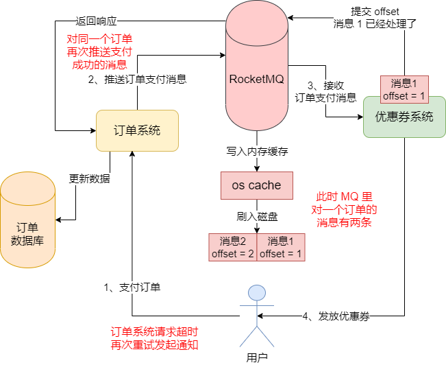
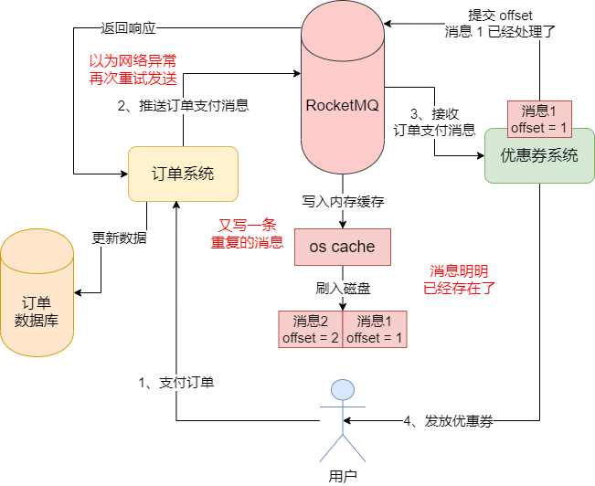
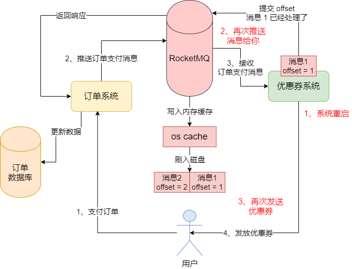
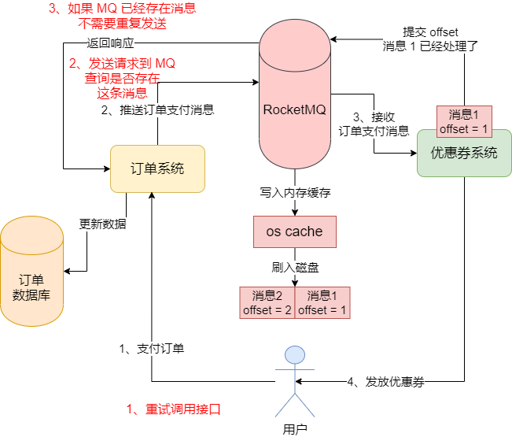
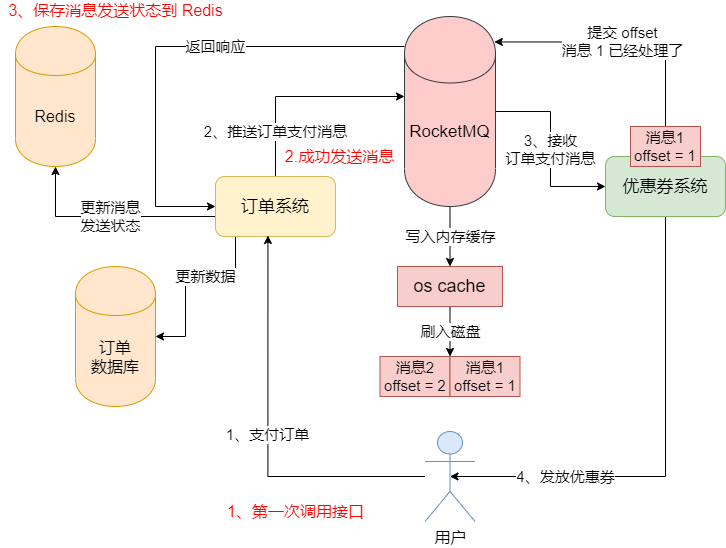
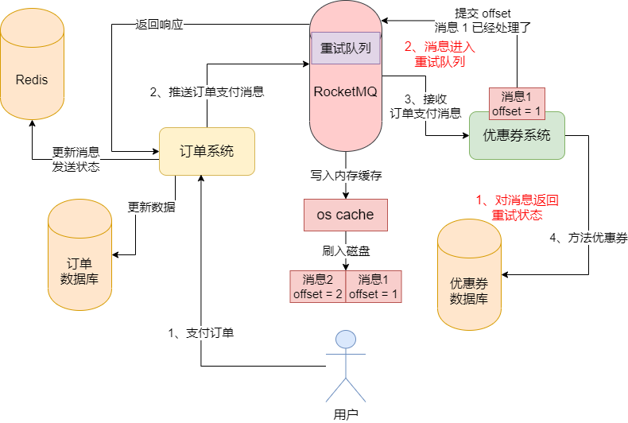

## 背景示例

今天客户给技术团队反馈了一个问题，说是有用户在支付一个订单之后，一下子收到了多个优惠券，本来按照规则只应该有一个优惠券的。也就是说，我们给用户重复发放了一个优惠券


### 优惠券系统重复消费了一条消息

目前订单系统已经跟各个系统进行了解耦，也就是说当订单支付成功之后，会发送一条消息到 MQ 里去，然后红包系统从里面获取消息派发红包，优惠券系统从里面获取消息派发优惠券，其他系统也是同理。


通过查看日志发现，优惠券系统对同一个订单支付成功的消息处理了两次，就导致给用户重复发放了两张优惠券。为什么优惠券会对同一个消息重复处理两次？


### 订单系统发送消息到 MQ 的时候会重复吗

首先，我们的订单系统在收到一个支付成功的通知之后，它在发送消息到 MQ 的时候，会重发把一个消息发送两次吗？这是有可能的。


首先，假设用户在支付成功之后，我们的订单系统收到了一个支付成功的通知，接着它就向 MQ 发送了一条订单支付成功的消息。但是可能因为不知道什么原因，你的订单系统处理的速度有点慢。然后可能因为你的订单系统处理的速度有点慢，这就导致支付系统跟你订单系统之间的请求出现了超时，此时有可能支付系统再次重试调用了你订单系统的接口去通知了，然后你的订单系统这个时候可能有一次推送了一条消息到 MQ 里去，相当于是一个订单支付成功的消息，你重复推送了两次到 MQ。


此时相当于是 MQ 里就会对一个订单的支付成功消息，总共有两条。




如果订单系统重复推送了两次支付成功消息的 MQ，MQ 里对一个订单有两条重复的支付成功消息，优惠券必然会消费到一个订单的两条重复的支付成功消息，也会针对这个订单用户重复地派发两个优惠券。


因此，如果出现了接口超时等问题，可能会导致上游的支付系统重试调用订单系统的接口，进而导致订单系统对一个消息重复发送两条到 MQ 里去。


### 订单系统自己重复发送消息

假设支付系统没有对一个订单重复调用你的订单系统的接口，而是你订单系统自己可能就重复发送消息到 MQ 里去。假设我们的订单系统为了保证消息一定能投递到 MQ 里去，因此采用了重试的代码，如下面的代码片段，如果发现 MQ 发送有异常，则会进行几次重试。

```java
try {
	// 执行订单本地事务
	orderService.finishOrderPay();
	// 发送消息到 MQ 去
	producer.sendMessage();
}catch(Exception e) {
	// 如果发送消息失败了，进行重试
	for(int i = 0; i < 3; i++) {
		// 重试发送消息
	}
	// 如果多次充实发送消息之后，还是不行，回滚本地订单事务
	orderService.rollbackOrderPay();
}
```


但是这种重试的方式 ，其实是一把双刃剑，因为正是这个重试可能导致消息重复发送。我们来考虑一个情况，假设你发送一条消息到 MQ 了，其实 MQ 是已经收到这条消息了，结果 MQ 返回响应给你的时候，网络有问题了超时了，就是你没能及时收到 MQ 返回给你的响应。但是，此时 MQ 里其实是已经有你发送过去的消息了，只不过它返回给你的响应没能给到你而已。


这个时候，你的代码里可能会发现一个网络超时的异常，然后你就会进行重试再次发送这个消息到 MQ 去，然后 MQ 会收到一条一模一样的消息，进而导致你的消息重复发送了。




所以这种重试代码大家在使用的时候要小心，因为它还是有一定的概率会导致你重发消息的。


### 优惠券系统重复消费一条消息

接着我们继续，即使你没有重复发送消息到 MQ，哪怕 MQ 里就一条消息，优惠券系统也有可能会重复进行消费。


假设你的优惠券系统拿到一条订单支付成功的消息，然后都已经进行处理了，也就是说都已经对这个订单发了一张优惠券了，这个时候它应该返回一个 `CONSUME_SUCCESS` 的状态，然后提交消费进度 offset 到 broker 的。


但是，你刚发完优惠券，还没来得及提交消息 offset 到 broker，优惠券系统就进行了一次重启，这是因为你没提交这条消息的 offset 给 broker，broker 并不知道你已经处理了这条消息，然后优惠券系统重启之后，broker 就会再次把这条消息交给你，让你再一次进行处理，然后你会再一次发送一张优惠券，导致重复发送了两次优惠券。



### 消息重复问题

实际上，对类似优惠券系统这样的业务系统，一般会频繁地更新代码，可能每隔几天就需要重启一次系统进行代码的更新。所以你重启优惠券系统的时候，可能有一批消息刚处理完，还没来得及提交 offset 给 broker，然后你重启之后就会再一次重复处理这批数据，这种情况是比较常见的。


另外就是对于系统之间的调用，有的时候出现超时和重试的情况也是很常见的，所以你负责发消息到 MQ 的系统，很可能时不时地出现一次超时，然后被别人重试调用你的接口，你可能会重复发送一条消息到 MQ 里去，这也是很常见的。


## 引入幂等性机制

要解决上述问题，我们就要先引入一个概念，叫做幂等性机制。这个幂等性机制，就是用来避免对同一个请求或者同一条消息进行重复处理的机制。幂等，就是比如你有一个接口，然后如果别人对一次请求重试了多次，来调用你的接口，你必须保证自己系统的数据是正常的，不能多出来一些重复的数据，这就是幂等性的意思。


### 发送消息到 MQ 的时候如何保证幂等性

当我们的订单系统发送消息到 MQ 的时候需要保证幂等性吗？订单系统的接口有可能被重复调用导致发送重复的消息到 MQ 去，也可能有重试机制导致发送重复的消息到 MQ。那我们应该怎样避免这种情况？


### 业务判断法

业务判断法。也就是说你的订单系统必须要知道自己到底是否发送过消息到 MQ 去，消息到底是否已经在 MQ 里了。


例如，当支付系统重试调用你的订单系统的接口时，你需要发送一个请求到 MQ 去，查询一下当前 MQ 里是否存在针对这个订单的支付消息？如果 MQ 告诉你，针对 id = 1000 这个订单的支付成功消息，MQ  已经有了，那么订单系统可以不要再次发送这条消息到 MQ 去了。




这个业务判断法的核心在于，你的消息肯定是存在于 MQ 里的，到底发没发送过，只有 MQ 知道，如果没发送过这个消息，MQ 肯定没有这个消息，如果发送过这个消息，MQ 里就有这个消息。


所以当你的订单系统的接口被重试调用的时候，你这个接口上来就应该发送请求到 MQ 里查询一下，如果在 MQ 中已经存在，那就不再重复发送消息了。


### 基于 Redis 缓存的幂等性机制

第二种方法，就是状态判断法。


这个方法的核心在于，你需要引入一个 Redis 缓存来存储你是否发送过消息的状态，如果你成功发送了一个消息到 MQ 里去，你得在 Redis 缓存里写一条数据，标记这个消息已经发送过。




那么当你的订单接口被重读调用的时候，你只要根据订单 id 去 Redis 缓存里查询一下，这个订单的支付消息是否已经发送给 MQ 了，如果发送过了，就别再次发送了。


其实两种幂等性机制都是很常用的，但是，基于 Redis 的状态判断法，有可能没办法完全做到幂等性。例如，你的支付系统发送请求给订单系统，然后已经发送消息到 MQ 去了，但是此时订单系统突然崩溃了，没来得及把消息发送的状态写入 Redis。这个时候如果你的订单系统在其他机器上部署了，或者是它重启了，那么这个时候订单系统被重试调用的时候，它去找 Redis 查询消息发送状态，会以为消息没发送过，然后会再次发送重复消息到 MQ 去。


### 有没有必要在订单系统环节保证消息不重复发送

在我们这个场景中，如果在订单系统要保证消息不重复发送，上面讲的两种方案，其实都不是太好。因为 RocketMQ 虽然是支持你查询某个消息是否存在，但是在这个环节你直接从 MQ 查询消息是没这个必要的，它的性能也不是太好，会影响你的接口的性能。


另外基于 Redis 的消息发送状态的方案，在极端情况下还是没法 100% 保证幂等性，所以也不是特别好的一个方案。所以在这里建议是不用在这个环节保证幂等性，也就是我们可以默许它可能会发送重复的消息到 MQ 里去。


### 优惠券系统如何保证消息处理的幂等性

接着我们来看优惠券系统假设会拿到重复的消息，那么如何保证消息处理的幂等性？这个就比较简单了，直接基于业务判断法就可以了，因为优惠券每次拿到一条消息后会给用户发一张优惠券，实际上核心就是在数据库里给用户插入一条优惠券记录。


那么如果优惠券系统从 MQ 那里拿到一个订单的两条重复支付成功消息，这个时候它只要先去优惠券数据库中查询一下，比如对订单 id = 1000 的订单，是否已经发放过优惠券了，如果有的话，就不要重复发券了。通过这个业务判断的方法，就可以简单高效地避免消息的重复处理了。


### MQ 消息幂等性的方案总结

一般来说，对于 MQ 的重复消息问题而言，我们往 MQ 里重复发送一些消息其实还是可以接收的，因为 MQ 里有许多条重复消息，它不会对系统的核心数据直接造成影响，但是我们关键要保证的，是你从 MQ 里获取消息进行处理的时候，必须保证消息不能重复处理。


要保证消息的幂等性，优先推荐的其实还是业务判断法，直接根据你的数据存储中的记录来判断这个消息是否已经处理过，如果处理过，就不需要再处理了。因为，基于 Redis 的消息发送状态的方案，在一些极端情况下还是无法保证幂等性的。


## 死信队列解决数据库宕机问题

上述我们已经分析和解决了 MQ 实践使用过程中可能存在的消息丢失问题和消息重复问题，现在假设我们可以基本确保 MQ 的消息不丢失，同时不会对消息进行重复处理，在正常流程下，基本没啥问题。


假设我们的 MQ 使用过程中都没问题，但是如果我们的优惠券系统的数据库宕机了呢？这个时候，就会导致我们从 MQ 里获取到消息之后是没办法进行处理的。现在我们对这个实际的生产场景进行分析。


### 数据库宕机的时候，可以返回 CONSUME_SUCCESS 吗

我们看下面的代码片段，可以看到，我们注册了一个监听器回调函数，当 Consumer 获取到消息之后，就会交给我们的函数来处理。

```java
consumer.registerMessageListener(new MessageListenerConcurrently() {
	public ConsumeConcurrentlyStatus consumeMessage(List<MessageExt> msgs, 
										ConsumeConcurrentlyContext context) {
													
		// 在这里对获取到的 msgs 订单消息进行处理
		// 比如增加积分，发送优惠券，通知发货等等
		return ConsumeConcurrentlyStatus.CONSUME_SUCCESS;
	}
})
```


上述代码返回 CONSUME_SUCCESS，那么 Consumer 就知道这批消息处理完成了，就会提交这批消息的 offset 到 broker 去，然后下次就会继续从 broker 获取下一批消息来处理。


但是如果此时我们在上面的回调函数中，对一批消息发优惠券的时候，因为数据库宕机了，导致优惠券发放逻辑无法完成，此时我们还能返回 CONSUME_SUCCESS 状态码？如果你返回的话，下一次就会处理下一批消息，但是这批消息其实没处理成功，此时必然导致这批消息就丢失了。


### 消息处理有异常，可以返回 RECONSUME_LATER 状态

实际上如果我们因为数据库宕机等问题，对这批消息的处理是异常的，此时没法处理这批消息，我们就应该返回一个 `RECONSUME_LATER` 状态。它的意思是，我现在没法完成这批消息的处理，你稍后过段时间再次给我这批消息让我重试一下。


所以，我们应该改成如下的代码：

```java
consumer.registerMessageListener(new MessageListenerConcurrently() {
	public ConsumeConcurrentlyStatus consumeMessage(List<MessageExt> msgs, 
										ConsumeConcurrentlyContext context) {
		
        try {
			// 在这里对获取到的 msgs 订单消息进行处理
			// 比如增加积分，发送优惠券，通知发货等等
			return ConsumeConcurrentlyStatus.CONSUME_SUCCESS;
		} catch(Exception e) {
			// 如果因为数据库宕机等问题，对消息处理失败了
			// 此时返回一个稍后重试消费的状态
			return ConsumeConcurrentlyStatus.RECONSUME_LATER;
		}
	}
})
```


### RocketMQ 是如何让你进行消费重试的

RocketMQ 在收到你返回的 `RECONSUME_LATER` 状态之后，是如何让你进行消费重试的？简单说，RocketMQ 会有一个针对你这个 ConsumerGroup 的重试队列。如果你返回了 `RECONSUME_LATER` 状态，它会把你这批消息放到你这个消费组的重试队列中去。


比如你的消费组的名称是 "VoucherConsumerGroup"，意思是优惠券系统的消费组，那么它会有一个 "%RETRY%VoucherConsumerGroup" 这个名字的重试队列。如图：




然后过一段时间之后，重试队列中的消息会再次发送给我们，让我们进行处理。如果再次失败，又返回了 `RECONSUME_LATER`，那么会再过一段时间让我们来处理，默认最多是重试 16 次。每次重试之间的间隔时间是不一样的，这个间隔时间可以进行如下配置：


```
messageDelayLevel = 1s 5s 10s 30s 1m 2m 3m 4m 5m 6m 7m 8m 9m 10m 20m 30m 1h 2h
```


上面这段配置的意思是，第一次重试是 1秒 后，第二次重试是 5秒 后，第三次重试是 10秒 后，第四次重试是 30秒 后，第五次重试是 1分钟 后，以此类推，最多重试 16 次。


### 连续重试 16 次还是无法处理消息

如果在 16次 重试范围内消息处理成功了，自然没问题，但是如果你对一批消息重试了 16 次还是无法成功处理，这个时候就需要另外一个队列了，叫**死信队列**。所谓的死信队列，就是死掉的消息就放进这个队列里。


什么是死掉的消息？就是一批消息交给你处理，你重试了 16 次还是一直没处理成功，就不要继续重试这批消息了，你就认为他们死掉了就可以了。然后这批消息就会自动进入死信队列。死信队列的名字是 "%DLQ%VoucherConsumerGroup"。我们在 RocketMQ 的管理后台上是可以看到的。如图：


那么我们对死信队列中的消息我们怎么处理？其实这个就看你的使用场景了，比如我们可以专门开一个后台线程，就是订阅 "%DLQ%VoucherConsumerGroup" 这个队列，对死信队列中的消息，还是一直不停地重试。


### 总结

这一次我们搞清楚了另外一个生产环境下的问题，就是消费者底层的一些依赖可能有故障，比如数据库宕机，缓存宕机之类的，此时就就没办法完成消息的处理了，那么可以通过一些返回状态去让消息进入 RocketMQ 自带的重试队列，如果反复重试还是不行，可以让消息进入 RocketMQ 自带的死信队列，后续针对死信队列中的消息进行单独的处理就可以了。