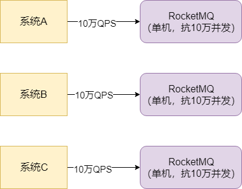
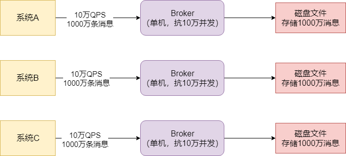
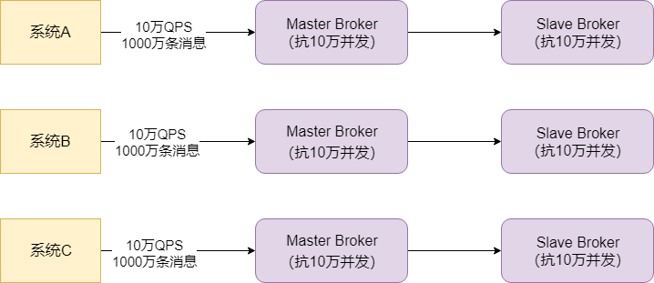
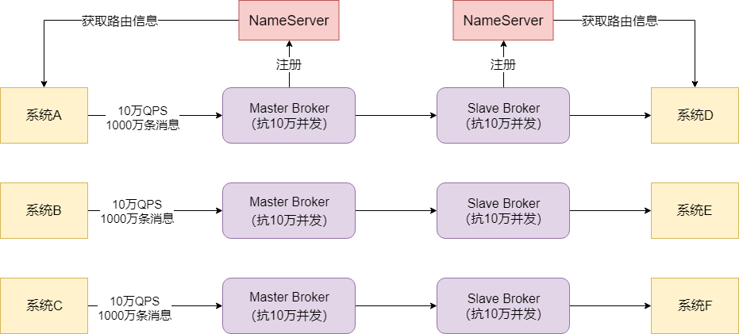
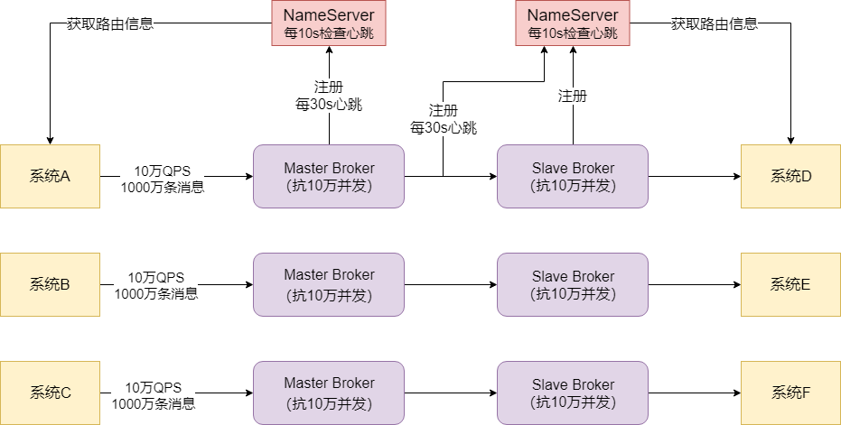

## MQ集群化部署以支撑高并发访问

​		假设RocketMQ部署在一台机器上，即使这个机器的配置很高，但一般来说一台机器也就是支撑10万+的并发访问。如果这个时候，有大量的系统都要往RocketMQ里高并发的写入消息，可能达到每秒几十万请求，这个时候就要将RocketMQ进行集群化部署，部署在多台机器上。假设每台机器能抗10万并发，只要让几十万请求分散到多台机器上接可以了。

### MQ存储海量消息

​		一般情况下，MQ收到的大量消息并不是立马会被所有的消费方获取过去消费，所以MQ一般都得把消息在自己本地磁盘存储起来，然后等到消费方去处理。这样，MQ就得存储大量的消息，可能是几百万条，甚至几亿条，这么多的消息在一台机器上是没法存储的，那RocketMQ是如何处理的？

​		其实发送消息到MQ 的系统会把消息分散发送给多台不同的机器，假设有一万条消息，分散发送给10台机器，可能每台机器就是接收到1000条消息。

​		其次，每台机器上部署的RocketMQ进程一般称之为Broker，每个Broker都会接收到不同的消息，然后就会把这批消息存储在自己本地的磁盘文件里。

### 高可用保障

​		如果某一台Broker宕机了，导致RocketMQ里一部分的消息没了，这就会导致MQ的不可靠和不可用。而RocketMQ的解决思路就是**Broker主从架构以及多副本策略**。

​		简单来说，Broker有Master和Slave两种角色：

​		Master Broker收到消息之后会同步给Slave Broker，这样Slave Broker上就能有一模一样的一份副本数据。这个时候如果任何一个Master Broker出现故障，还有一个Slave Broker上有一份数据副本，可以保证数据不丢失，还能继续对外提供服务，保证了MQ 的可靠性和高可用性。

## 数据路由：消息中间件路由中心

​		对于系统来说，要发送消息到MQ去，还要从MQ里消费信息，因此需要解决一个问题：大家怎么知道有哪些Broker？怎么知道要连接哪一台Broker上去发送和接收消息？RocketMQ为了解决这个问题，有一个`NameServer`的概念。它也是独立部署在几台机器上，然后所有的Broker都会把自己注册到NameServer上去，NameServer就知道集群里有哪些Broker了。

​		对于我们系统而言，如果它要发送消息到Broker，会找NameServer去获取路由信息，就是集群里有哪些Broker等信息；如果系统要从Broker获取消息，也会找NameServer获取路由信息，去找到对应的Broker获取消息。

### NameServer的集群化部署

​		NameServer集群化部署的一个主要原因，就是**高可用性**。NameServer是集群里非常关键的一个角色，它要管理Broker信息，别人都要通过它才知道跟哪个Broker通信，如果NameServer就部署一台机器的话，一旦NameServer宕机了，就会导致RocketMQ集群出现故障。所以通常来说，NameServer一定会多机器部署，实现一个集群，起到高可用的效果。

### Broker挂了，NameServer如何感知

​		一个Broker启动之后向NameServer注册了，每个NameServer都知道集群里有这么一台Broker的存在了，然后各个系统从NameServer也拉取到了一台信息，知道集群里有这么一台Broker，但如果这台Broker挂了之后，NameServer要如何感知？

​		这个问题的解决靠的就是Broker跟NameServer之间的心跳机制，Broker会每隔30s给所有的NameServer发送心跳，告诉每隔NameServer自己还活着，每次NameServer收到一个Broker的心跳，就可以更新一下它的最近一次心跳的时间，然后每隔10s运行一个任务，去检查各个Broker最近的一次心跳时间，如果某个Broker超过120s都没发送心跳了，那么就认为这个Broker已经挂掉了。

