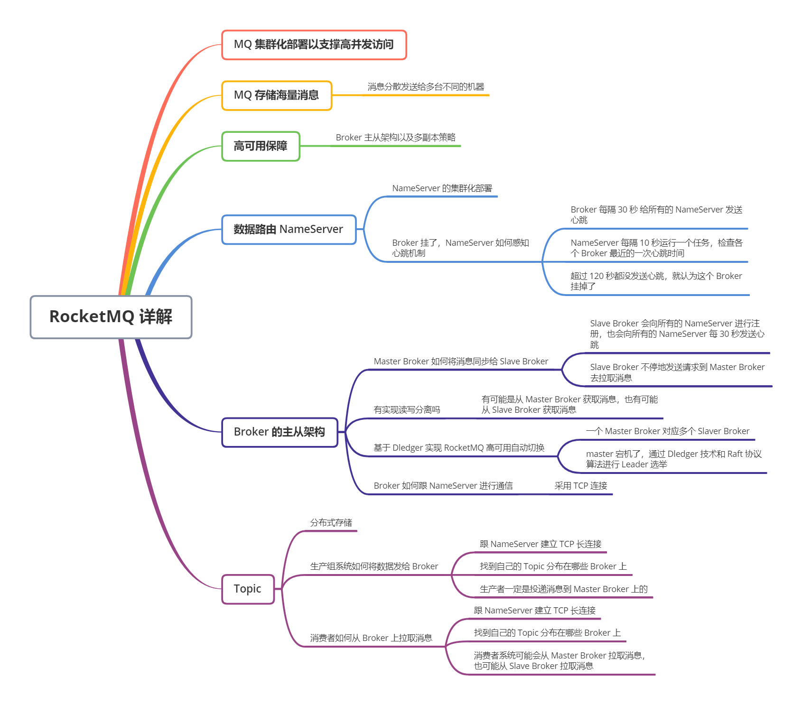
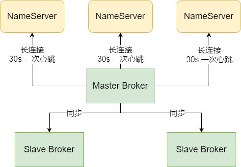
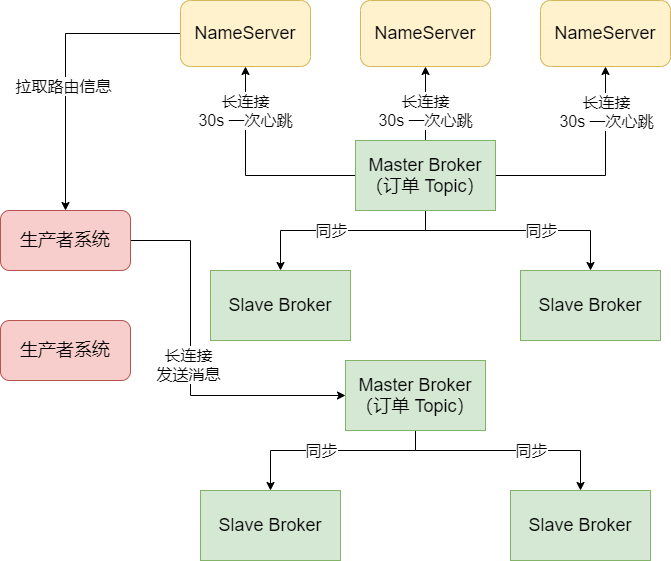
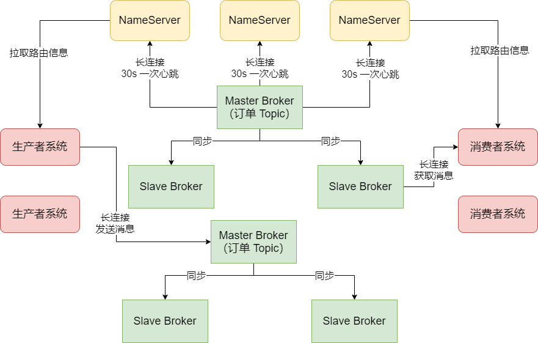

## MQ 集群化部署以支撑高并发访问

假设 RocketMQ 部署在一台机器上，即使这个机器的配置很高，但一般来说一台机器也就是支撑 10万+ 的并发访问。如果这个时候，有大量的系统都要往 RocketMQ 里高并发的写入消息，可能达到每秒几十万请求，这个时候就要将 RocketMQ 进行集群化部署，部署在多台机器上。假设每台机器能抗 10 万并发，只要让几十万请求分散到多台机器上接可以了。

### MQ 存储海量消息

一般情况下，MQ 收到的大量消息并不是立马会被所有的消费方获取过去消费，所以 MQ 一般都得把消息在自己本地磁盘存储起来，然后等到消费方去处理。这样，MQ 就得存储大量的消息，可能是几百万条，甚至几亿条，这么多的消息在一台机器上是没法存储的，那 RocketMQ 是如何处理的？

其实发送消息到 MQ 的系统会把消息分散发送给多台不同的机器，假设有一万条消息，分散发送给 10 台机器，可能每台机器就是接收到 1000 条消息。

其次，每台机器上部署的 RocketMQ 进程一般称之为 Broker，每个 Broker 都会接收到不同的消息，然后就会把这批消息存储在自己本地的磁盘文件里。

### 高可用保障

如果某一台 Broker 宕机了，导致 RocketMQ 里一部分的消息没了，这就会导致 MQ 的不可靠和不可用。而RocketMQ的解决思路就是 **Broker 主从架构以及多副本策略**。

简单来说，Broker 有 Master 和 Slave 两种角色：

Master Broker 收到消息之后会同步给Slave Broker，这样 Slave Broker 上就能有一模一样的一份副本数据。这个时候如果任何一个 Master Broker 出现故障，还有一个Slave Broker上有一份数据副本，可以保证数据不丢失，还能继续对外提供服务，保证了 MQ 的可靠性和高可用性。

## 数据路由：消息中间件路由中心

对于系统来说，要发送消息到 MQ 去，还要从 MQ 里消费信息，因此需要解决一个问题：大家怎么知道有哪些 Broker？怎么知道要连接哪一台 Broker 上去发送和接收消息？RocketMQ 为了解决这个问题，有一个 `NameServer` 的概念。它也是独立部署在几台机器上，然后所有的 Broker 都会把自己注册到 NameServer 上去，NameServer 就知道集群里有哪些Broker了。

对于我们系统而言，如果它要发送消息到 Broker，会找 NameServer 去获取路由信息，就是集群里有哪些 Broker 等信息；如果系统要从 Broker 获取消息，也会找 NameServer 获取路由信息，去找到对应的 Broker 获取消息。

### NameServer 的集群化部署

NameServer 集群化部署的一个主要原因，就是**高可用性**。NameServer 是集群里非常关键的一个角色，它要管理 Broker 信息，别人都要通过它才知道跟哪个 Broker 通信，如果 NameServer 就部署一台机器的话，一旦 NameServer 宕机了，就会导致 RocketMQ 集群出现故障。所以通常来说，NameServer 一定会多机器部署，实现一个集群，起到高可用的效果。

### Broker挂了，NameServer 如何感知

一个 Broker 启动之后向 NameServer 注册了，每个 NameServer 都知道集群里有这么一台 Broker 的存在了，然后各个系统从 NameServer 也拉取到了一台信息，知道集群里有这么一台 Broker，但如果这台 Broker 挂了之后，NameServer 要如何感知？

这个问题的解决靠的就是 Broker 跟 NameServer 之间的心跳机制，Broker 会每隔 30s 给所有的 NameServer 发送心跳，告诉每个 NameServer 自己还活着，每次 NameServer 收到一个 Broker 的心跳，就可以更新一下它的最近一次心跳的时间，然后每隔 10s 运行一个任务，去检查各个 Broker 最近的一次心跳时间，如果某个 Broker 超过 120s 都没发送心跳了，那么就认为这个 Broker 已经挂掉了。

## Broker 的主从架构

### Master Broker 如何将消息同步给 Slave Broker

一般情况下，为了保证 MQ 的数据不丢失且具备一定的高可用性，所以一般都是将 Broker 部署成 Master-Slave 模式的，也就是一个 Master Broker 对应一个 Slave Broker。然后 Master 需要在接收的到消息之后，将数据同步给 Slave，这样一旦 Master Broker 挂了，还有 Slave 上有一份数据。需要注意的是，**Slave Broker 也会向所有的 NameServer 进行注册，也会向所有的 NameServer 每 30s 发送心跳**。

那么，Master Broker 是如何将消息同步给 Slave Broker 的？答案是 RocketMQ 自身的 Master-Slave 模式采取的是 Slave Broker 不停地发送请求到 Master Broker 去拉取消息。即我们要明白一点，就是 RocketMQ 自身的 Master-Slave 模式采取的是 **Pull 模式**拉取消息。如图：

### RocketMQ 有实现读写分离吗

既然 Master Broker 主要是接收系统的消息写入，然后会同步给 Slave Broker，那么 Slave Broker 也应该有一份一样的数据。所以，作为消费者的系统在获取消息的时候，是从 Master Broker 获取的？还是从 Slave Broker 获取的？

其实都不是，答案是：**有可能是从 Master Broker 获取消息，也有可能从 Slave Broker 获取消息**。作为消费者的系统在获取消息的时候会先发送请求到 Master Broker 上去，请求获取一批消息，此时 Master Broker 是会返回一批消息给消费者系统的。

然后 Master Broker 在返回消息给消费者系统的时候，会根据当时 Master Broker 的负载情况和 Slave Broker 的同步情况，向消费者建议下一次拉取消息的时候是从 Master Broker 拉取还是从 Slave Broker 拉取。

例如，要是这个时候 Master Broker 负载很重，本身要抗 10 万写并发了，你还要从它这里拉取信息，增加负担，那肯定是不合适的。此时 Master Broker 就会建议你从 Slave Broker 去拉取消息。又或者，本身这个时候 Master Broker 上都已经写入了 100 万条数据了，但是Slave Broker 不知道啥原因，才同步了 96 万条数据，落后了整整 4 万条消息的同步，这个时候你作为消费者系统可能都已经获取到 96 万条数据了，那么下次还是只能从 Master Broker 去拉取消息。因为 Slave Broker 同步太慢了，导致你没法从它那里获取更新的消息了。

所以这一切都会有 Master Broker 根据情况来决定，如图：

总结一下就是：在写入消息的时候，通常来说肯定是选择 Master Broker 去写入的，但是在拉取消息的时候，有可能从 Master Broker 获取，也可能从 Slave Broker 去获取，一切都根据当时的情况来定。

### Slave Broker 挂掉了会有什么影响

如果 Slave Broker 挂掉了，那么会对这个系统**有一点影响，但是影响并不大**。因为消息写入全部是发送到 Master Broker 的，然后消息获取也可以走 Master Broker，只不过有一些消息获取可能是从 Slave Broker 去走的。

所以如果 Slave Broker 挂了，那么此时无论消息写入还是拉取，还是可以继续从 Master Broker 去走，对整体运行不影响。只不过少了 Slave Broker，会导致所有读写压力都集中在 Master Broker 上。

### Master Broker 挂掉了会有什么影响

如果 Master Broker 挂掉了，这个时候对消息的写入和获取都有一定的影响。但是，Slave Broker 也是跟 Master Broker 一样有一份数据在的，只不过 Slave Broker 上的数据可能有部分没来得及从 Master Broker 同步。但是此时RocketMQ 可以实现直接自动将 Slave Broker 切换为 Master Broker 吗？

在 RocketMQ 4.5 版本之前，是不能的。所以在这种情况下，如果 Master Broker 宕机了，这是就得手动做一些运维操作，把 Slave Broker 重新修改一些配置，重启机器给调整为 Master Broker，这有点麻烦，而且会导致中间一段时间不可用。所以这种 Master-Slave 模式**不是彻底的高可用模式，它没法实现自动把 Slave 切换为 Master**。

### 基于 Dledger 实现 RocketMQ 高可用自动切换

在 RocketMQ 4.5 之后，这种情况得到看改变，因为 RocketMQ 支持了一种新的机制，叫做 Dledger。简单来说，把 Dledger 融入 RocketMQ 之后，就可以让一个 Master Broker 对应多个 Slaver Broker，也就是一份数据可以有多份副本，比如一个 Master Broker 对应两个 Slave Broker。然后依然会在 Master 和 Slave 之间进行数据同步。

此时一旦 Master Broker 宕机了，就可以在多个 Slave 中，通过 Dledger 技术和 Raft 协议算法进行 leader 选举，直接将一个 Slave Broker 选举为新的 Master Broker，然后这个新的 Master Broker 就可以对外提供服务了。

这个过程也许只要 10 秒或者几十秒的时间就可以完成，这样的话，就可以实现 Master Broker 挂掉之后，自动从多个 Slave Broker 中选举出来一个新的 Master Broker，继续对外服务，一切都是自动的。

所以，我们在设计 RocketMQ 生成部署架构的时候，可以采用基于 Dledger 的部署方式，这样可以让 RocketMQ 做到自动切换故障了。

### Broker 如何跟 NameServer 进行通信

上面说过，Broker 会每隔 30 秒发送心跳到所有的 NameServer 上去，然后每个 NameServer 都会每隔 10s 检查一次有没有哪个 Broker 超过 120s 没发送心跳。如果有，就认为那个 Broker 已经宕机了，从路由信息里要摘除这个 Broker。

那么 Broker 和 NameServer 是如何进行通信的呢？在 RocketMQ 的实现中，Broker 和 NameServer 之间的通信是采用 **TCP 长连接**进行通信的。也就是说，Broker 会跟每个 NameServer 都建立一个 TCP 长连接，然后定时通过 TCP 长连接发送心跳请求过去。

所以各个 NameServer 就是通过跟 Broker 建立好的长连接不断收到心跳包，然后定时检查 Broker 有没有 120s 都没发送心跳包，来判定集群里各个 Broker 到底挂掉了没有。

## MQ 的核心数据模型：Topic

生产者和消费者都会往 MQ 里写入消息和获取消息，但是，MQ 中的数据模型是什么？你投递出去的消息在逻辑上到底是放到哪去的？

这就涉及到一个概念，这个就是 MQ 中的核心数据模型：`Topic`。这个 Topic，表达的意思就是一个**数据集合**的意思。举个例子，现在你的订单系统都是进入这个 "topic_order_info" 里面去的，如果你的仓储系统要获取订单消息，那么它可以指定从 "topic_order_info" 这里面去获取消息，获取出来得都是它想要的订单消息。

总结起来就是，Topic 其实就是一个数据集合的意思，不同类型的数据你得放到不同的 Topic 里去。要是你有一些商品数据要发送到 MQ 里，你就应该创建一个 Topic 叫做 "topic_product_info"，代表里面都是商品数据，那些想要从 MQ 里获取商品数据的系统就可以从 "topic_product_info" 里获取了。

所以，你的系统如果要往 MQ 里写入信息或者获取信息，首先就得创建一些 Topic，作为数据集合存放不同类型的消息。

### Topic 怎么在 Broker 集群里存储

那我们创建的那些 Topic 是怎么存储在 Broker 集群里的？这就体现出一个分布式存储的概念了。

如果我们有一个订单 Topic，可能订单系统每天都会往里面投递几百万条数据，然后这些数据在 MQ 的集群上还得保留几天，那么最终可能会有几千万的数据量，这还只是一个 Topic。如果有多个 Topic，并且里面都有大量的数据，最终加起来的总和也许就是一个惊人的数字，而这么大的数据本身是不太可能存放在一台机器上的。这个时候，就需要**分布式存储**了。

我们可以在创建 Topic 的时候指定让它里面的数据分散存储在多台 Broker 机器上，比如一个 Topic 里有 1000 万条数据，此时有 2 台Broker，那么可以让每台 Broker 都放 500 万条数据。这样就可以把一个 Topic 代表的数据集合分布式存储在多台机器上了。

另外很重要的一件事是，每个 Broker 在进行定时的心跳汇报给 NameServer 的时候，都会告诉 NameServer 自己当前的数据情况，比如有哪些 Topic 的哪些数据在自己这里，这些信息都是属于路由信息的一部分。

### 生产者系统如何将消息发送给 Broker

接下来，生产者系统是如何将消息发送到 Broker 上的？

我们在上面说过，在发送消息之前，得有一个 Topic，然后在发送消息的时候你得指定你要发送到哪个 Topic 里面去。既然你知道你要发送的 Topic，那么就可以跟 NameServer 建立一个 TCP 长连接，然后定时从它那里拉取到最新的路由信息，包括集群里有哪些 Broker，集群里有哪些 Topic，每个 Topic 都存储在哪些 Broker上。

然后生产者系统就可以通过路有信息找到自己要投递的 Topic 分布在哪几台 Broker 上。此时可以根据负载均衡算法，从里面选择一台 Broker机器出来。比如 round robine 轮询算法，或者 hash 算法等等。然后选择一台 Broker 之后，就可以跟那个 Broker 也建立一个 TCP 长连接，然后通过长连接向 Broker 发送消息即可。

这里要注意的一点是，生产者一定是投递消息到 Master Broker 的，然后 Master Broker 会同步数据给它的 Slave Brokers，实现一份数据多份副本，保证 Master 故障的时候数据不丢失，而且可以自动把 Slave 切换为 Master 提供服务。

### 消费者如何从 Broker 上拉取消息

消费者系统跟生产者原理是类似的。它们也会跟 NameServer 建立长连接，然后拉取路由消息，接着找到自己要获取的 Topic 在哪几台 Broker 上，就可以跟 Broker 建立长连接，从里面拉取消息了。

这里要注意的一点是，消费者系统可能会从 Master Broker 拉取消息，也可能从 Slave Broker 拉取消息。一切都看具体情况。

