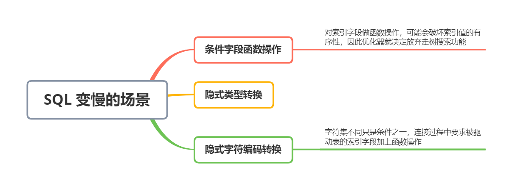
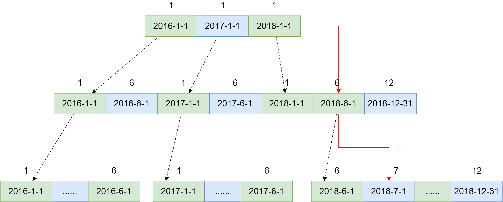
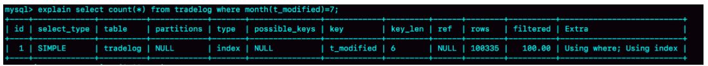
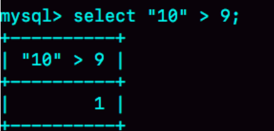
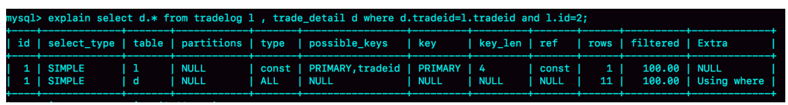
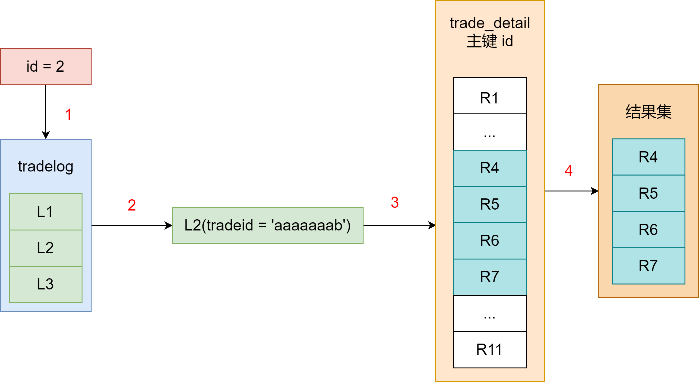
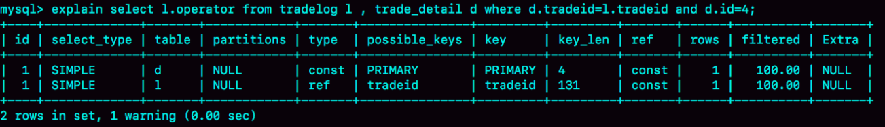
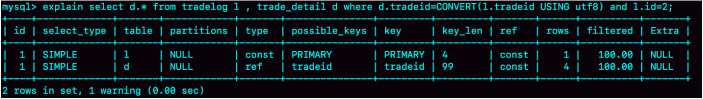

在 MySQL 中，有很多看上去逻辑相同，但性能确差异巨大的 SQL 语句。对这些语句使用不当的话，就会导致这个数据库的压力变大


### 条件字段函数操作


假设你维护了一个交易系统，其中交易记录表 tradelog 包含交易流水号（tradeid）、交易员 id（opeartor）、交易时间（t_modified）等字段。为了方便描述，我们先忽略其他字段


```mysql
CREATE TABLE `tradelog` (
  `id` int(11) NOT NULL,
  `tradeid` varchar(32) DEFAULT NULL,
  `operator` int(11) DEFAULT NULL,
  `t_modified` datetime DEFAULT NULL,
  PRIMARY KEY (`id`),
  KEY `tradeid` (`tradeid`),
  KEY `t_modified` (`t_modified`)
) ENGINE=InnoDB DEFAULT CHARSET=utf8mb4;
```


假设，现在已经记录了从 2016 年初到 2018 年底的所有数据，有一个需求时，要统计发生在所有年份中的交易记录总数。你的 SQL 语句可能会这么写：


```mysql
select count(*) from tradelog where month(t_modified) = 7
```


由于 t_modified 字段上有索引，于是你就很放心地在生产库中执行了这条语句，但却发现了执行了特别久才返回结果。网上可能说：如果对字段做了函数计算，就用不了索引了


为什么条件是 where t_modified = '2018-7-1' 的时候可以用上索引，而改成 where month(t_modified) = 7 的时候就不行了？


先看一下 t_modified 索引的示意图，方框上面的数字就是 month() 函数对应的值





如果你的 SQL 语句用的是 `where t_modified = '2018-7-1'` 的话，引擎就会按照上面的红色箭头的路线，快速定位到 t_modified = '2018-7-1' 需要的结果


实际上，**B+ 数提供的这个快速定位能力，来源于同一层兄弟节点的有序性**


但是，如果计算 month() 函数的话，你会看到传入 7 的时候，在数的第一层就不知道该怎么办了。也就是说，**对索引字段做函数操作，可能会破坏索引值的有序性，因此优化器就决定放弃做数搜索功能**


需要注意的是，优化器并不是要放弃使用这个索引


在这里例子里，放弃了树搜索功能，优化器可以选择遍历主键索引，也可以选择遍历索引 t_modified，优化器对比索引大小后，索引 t_modified 更小，遍历这个索引比遍历主键索引来得更快。因此还是最终选择索引 t_modified


我们使用 `explain` 命令，看一下这条 SQL 语句的执行结果





key = 't_modified' 表示的是，使用了 t_modified 这个索引；我在测试表数据中插入了  10 万行数据，rows = 100335，说明这条语句扫描了整个索引的所有值；Extra 字段的 Using index，表示的是使用了覆盖索引


即，由于在 t_modified 字段加了 month() 函数操作，导致了全索引扫描。为了能够用上索引的快速定位能力，我们就要把 SQL 语句改成基于字段本身的范围查询。如下，优化器就能用上 t_modified 索引的快速定位能力了


```mysql
select count(*) from tradelog where
     (t_modified >= '2016-7-1' and t_modified<'2016-8-1') or
     (t_modified >= '2017-7-1' and t_modified<'2017-8-1') or 
     (t_modified >= '2018-7-1' and t_modified<'2018-8-1');
```


到这我们就清楚了，由于加了 month() 函数操作，MySQL 无法再使用索引快速定位功能，而只能使用全索引扫描


不过优化器在这个问题上确实有「偷懒」行为，即使是对于不改变有序性的函数，也不会考虑使用索引。比如，对于 `select * from tradelog where id + 1 = 10000` 这个 SQL 语句，这个加 1 操作并不会改变有序性，但是 MySQL 优化器还是不能用 id 索引快速定位到 9999 这一行。所以，需要你在写 SQL 语句的时候，手动改写成 where id = 10000 - 1 才可以


### 隐式类型转换


先看下面这条 SQL：


```mysql
select * from tradelog where tradeid = 110717
```


交易编号 tradeid 这个字段上，本来就有索引，但是 explain 的结果缺显示，这条语句需要全表扫描。我们发现，tradeid 的字段类型是 varchar(32)，而输入的参数却是整型，所以需要做类型转换


那么，这里就有两个问题：


1. 数据类型转换的规则是什么？
2. 为什么有数据类型转换，就需要走全索引扫描


先看第一个问题，数据库里面类型那么多，这种数据类型转换规则更多，我记不住，怎么办？


这里有一个简单的方法，看 `select '10' > 9` 的结果：


1. 如果规则是「将字符串转成数字」，那么就是做数字比较，结果应该是 1
2. 如果规则是「将数字转成字符串」，那么就是做字符串比较，结果应该是 0


如下图：





从上图我们知道 MySQL 里的转换规则了：在 MySQL 中，字符串和数字作比较的话，是将字符串转换成数字


这时，再看看这个全表扫描的语句：


```mysql
select * from tradelog where tradeid = 110717
```


就知道对于优化器来说，这个语句相当于


```mysql
select * from tradelog where CAST(tradeid AS signed int) = 110717
```


即，这条语句触发了我们上面说到的规则：对索引字段做函数操作，优化器会放弃走树搜索功能


### 隐式字符编码转换


假设系统你还有另外一个表 `trade_detail`，用于记录交易的操作细节。为了便于量化分析和复现，我往交易日志表 tradelog 和交易详情表 trade_detail 这两个表里插入一些数据


```mysql
CREATE TABLE `trade_detail` (
  `id` int(11) NOT NULL,
  `tradeid` varchar(32) DEFAULT NULL,
  `trade_step` int(11) DEFAULT NULL, /*操作步骤*/
  `step_info` varchar(32) DEFAULT NULL, /*步骤信息*/
  PRIMARY KEY (`id`),
  KEY `tradeid` (`tradeid`)
) ENGINE=InnoDB DEFAULT CHARSET=utf8;

insert into tradelog values(1, 'aaaaaaaa', 1000, now());
insert into tradelog values(2, 'aaaaaaab', 1000, now());
insert into tradelog values(3, 'aaaaaaac', 1000, now());

insert into trade_detail values(1, 'aaaaaaaa', 1, 'add');
insert into trade_detail values(2, 'aaaaaaaa', 2, 'update');
insert into trade_detail values(3, 'aaaaaaaa', 3, 'commit');
insert into trade_detail values(4, 'aaaaaaab', 1, 'add');
insert into trade_detail values(5, 'aaaaaaab', 2, 'update');
insert into trade_detail values(6, 'aaaaaaab', 3, 'update again');
insert into trade_detail values(7, 'aaaaaaab', 4, 'commit');
insert into trade_detail values(8, 'aaaaaaac', 1, 'add');
insert into trade_detail values(9, 'aaaaaaac', 2, 'update');
insert into trade_detail values(10, 'aaaaaaac', 3, 'update again');
insert into trade_detail values(11, 'aaaaaaac', 4, 'commit');
```


这时候，如果要查询 id = 2 的交易的所有操作步骤信息，SQL 语句可以这么写：


```mysql
select d.* from tradelog l,trade_detail d where d.tradeid = l.tradelog and l.id = 2
```





我们一起来看下这个结果：


1. 第一行显示优化器会现在交易记录表 tradelog 上查到 id = 2 的行，这个步骤用上了主键索引。rows = 1 表示只扫描一行
2. 第二行 key = NULL，表示没有用上交易详情表 trade_detail 上的 tradeid 索引，进行了全表扫描


着这个执行计划里，是从 tradelog 表中取 tradeid 字段，再去 trade_detail 表里查询匹配字段。因此，我们把 tradelog 成为驱动表，把 trade_detail 成为驱动表，把 tradeid 成为关联字段


explain 结果的执行流程如下：




.

图中：


1. 第 1 步，是根据 id 在 tradelog 表里找到 L2 这一行
2. 第 2 步，是从 L2 中取出 tradeid 字段的值
3. 第 3 步，是根据 tradeid 值到 trade_detail 表中查找条件匹配的行。explain 的结果里面第二行的 key = NULL 表示的是，这个过程是通过遍历主键索引的方式，一个一个地判断 tradeid 的值是否匹配


到这里，你会发现第 3 步不符合我们的预期。因为表 trade_detail 你 tradeid 字段是有索引的，我们本来是希望通过 tradeid 索引能够快速定位到等值的行。但，这里并没有


这里直接告诉你答案，**因为这个表的字符集不同，一个是 UTF8，一个是 utf8mb4，所以做表连接查询的时候用不上关联字段的索引。**


但，为什么字符集不同就用不上索引呢？


我们说问题是出在执行步骤的第 3 步，如果单独把这一步改成 SQL 语句的话，那就是：


```mysql
select * from trade_detail where tradeid = $L2.tradeid.value
```


其中，`$L2.tradeid.value` 的字符集是 utf8mb4


参照前面的而两个例子，你肯定就想到，字符集 utf8mb4 是 utf8 的超集，所以当这两个类型的字符串在做比较的时候，MySQL 内部操作是，先把 utf8 字符串转成 utf8mb4 字符集，再做比较


这个设定很好理解，utf8mb4 是 utf8 的超集。类似地，在程序设计语言里面，做自动类型转换的时候，为了避免数据在转换过程中由于截断导致数据错误，也都是「按数据长度增加的方向进行转换的」


因此，在执行上面这个语句的时候，需要将被驱动数据表里的字段一个个地转换成 utf8mb4，再跟 L2 做比较。即，实际上这个语句等同下面的写法：


```mysql
select * from trade_detail where CONVERT(tradeid USING utf8mb4) = $L2.tradeid.value
```


这就触发了我们上面说到的原则：对索引字段做函数操作，优化器会放弃走索引的功能


这里我们明确了，**字符集不同只是条件之一，连接过程中要求在被驱动表的索引字段加上函数操作**，是直接导致对被驱动表做全表扫描的原因


作为对比验证，我们「查找 trade_detail 表里 id = 4 的操作，对应的操作者是谁」，再来看下这个语句和它的执行计划


```mysql
SELECT l.operator FROM tradelog l,trade_detail d WHERE d.tradeid = l.tradeid AND d.id = 4
```





这个语句里 trade_detail 表成了驱动表，但是 explain 结果的第二行显示，这次的查询操作用上了被驱动表 tradelog 里的索引 (tradeid)，扫描行数是 1


这也是两个 tradeid 字段的 join 操作，为什么这次能用上被驱动表的 tradeid 索引呢？


假设驱动表 trade_detail 里 id = 4 的行记为 R4，那么在连接的时候（上面执行流程图的第 3 步），被驱动表 tradelog 上执行的就是类似这样的 SQL 语句


```mysql
SELECT operator FROM tradelog WHERE tradeid = $R4.tradeid.value
```


这时候 `$R4.tradeid.value` 的字符集是 utf8，按照字符集转换规则，要转成 utf8mb4，所以这个过程就被改写成：


```mysql
SELECT operator FROM tradelog WHERE tradeid = CONVERT(R4.tradeid.value USING utf8mb4)
```


你看，这里的 CONVERT 函数是加在输入参数上的，这样就可以用上被驱动表的 tradeid 索引


理解了原理，就可以用来指导操作了。如果要优化语句


```mysql
SELECT d.* FROM tradelog l, trade_detail d WEHRE d.tradeid = l.tradeid AND l.id = 2
```


的执行过程，有两种做法：


1、比较常见的优化方法是，把 trade_detail 表上的 tradeid 字段的字符集也改成 utf8mb4，这样就没有字符集转换的问题了


```mysql
alter table trade_detail modify tradeid varchar(32) CHARACTER SET utf8mb4 default null
```


2、如果能够修改字段的字符集的话，是最好不过的。但如果数据量比较大，或者业务上暂时不能做这个 DDL 的话，那就只能采用修改 SQL 语句的方法了


```mysql
SELECT d.* FROM tradelog l, trade_detail d WHERE d.tradeid = CONVERT(l.tradeid USING utf8) AND l.id = 2
```





这里，主动把 l.tradeid 转成 utf8，就避免了被驱动表上的字符编码转换，从 explain 结果可以看到，这次索引走对了


### 小结


上面举的三个例子，其实是在说同一件事儿，即：**对索引字段做函数操作，可能会破坏索引值的有序性，因此优化器就决定放弃走树搜索功能**