所谓执行计划，无非就是先访问哪个表，用哪个索引还是全表扫描，拿到数据之后如何去聚簇索引回表，是否要基于临时磁盘文件做分组聚合或者排序。

在 MySQL 中，只要使用 `Explain` 命令，就可以拿到这个 SQL 语句的执行计划，例如：`explain select * from table`。拿到的执行计划可能是类似下面的东西：

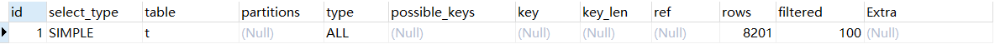

如上图，我们可以看到 `id`、`select_type`、`table`、`partitions`、`type` 之类的数据。

如果是一个简单的单表查询，可能这里就只有一条数据，也就是代表了它是打算如何访问这一个表而已。但是如果你的 SQL 语句极为复杂，可能这里会有很多条数据，因为一个复杂的 SQL 语句的执行是要拆分为很多步骤的，比如先访问表 A，接着弄一个排序，再来一个分组聚合，再访问表 B，接着搞一个连接，类似这样

接着，我们来看看执行计划里包含的各个字段都是什么意思。

首先是 `id`，每个 SELECT 都会对应一个 id，说穿了，就是一个复杂的 SQL 里可能会有很多个 SELECT，也可能包含多条执行计划，每一条执行计划都会有一个唯一的 id

`select_type`，说的是一条执行计划对应的查询是个什么类型。`table` 就是表名，意思是要查询哪个表，`partitions` 是表分区的概念。而 `type` 就比较关键了，针对当前这个表的访问方法，这个我们之前都讲过很多，比如 const、ref、range、index、all 之类的，分别代表了使用聚簇索引、二级索引、全表扫描之类的访问方式

`possible_keys` 也很关键，它是跟 `type` 结合起来的，意思是说你 type 确定使用方式了，那么有哪些索引是可供选择，可以使用的呢？这都会放这里。`key` 就是在 `possible_keys` 里实际选择的那个索引，而 `key_len` 就是索引的长度。

`ref` 就是使用某个字段的索引进行等值匹配搜索的时候，跟索引列进行等值匹配的那个目标值的一些信息。`rows` 是预估通过索引或者别的方式访问这个表的时候，大概可能会读取多少条数据。`filtered`，就是经过搜索条件过滤之后的剩余数据的百分比

## 示例

首先我们先看这么一条简单的 SQL：`EXPLAIN SELECT * FROM t1`，此时它的执行计划如下：

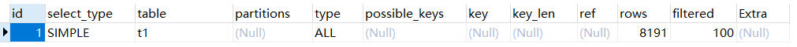

我们来分析上面的执行计划。首先是 id，它的值为 1，我们先不管。select_type 是 SIMPLE，顾名思义，这个表的查询类型是很普通的。table 是 t1，即表名是 t1。type 是 all，这就是我们之前提到的多种访问方式之一，all 就是全表扫描。你完全没加任何 where 条件，就只能是全表扫描了。这里直接会扫描表的聚簇索引的叶子结点，按顺序扫描过去拿到表里全部数据

rows 是 8191，说明全表扫描会扫描这个表的 8191 条数据，说明这个表里有 8191 条数据，此时你全表扫描会全部扫描出来。filtered 是 100%，你没有任何 where 过滤条件，所以直接筛选出来的数据就是表里数据的 100% 占比

接着看另一个 SQL 语句的执行计划：`EXPLAIN SELECT * FROM t1 JOIN t2`。这是一个典型的多表关联语句，这种关联语句，实际上会选择一个表先查询出来数据，接着遍历每一条数据去另外一个表里查询可以关联在一起的数据，然后关联起来，它的执行计划如下：

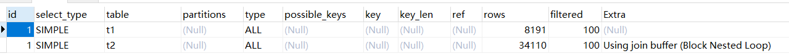

这是一个多表关联的执行计划。它的执行分为了两条，也就是会访问两个表。它先用全表扫描方位表 t1，接着用全表扫描访问表 t2，因为它这种多表关联方式，基本上是笛卡尔积的效果。t1 表的每条数据都会去 t2 表全部扫描所有的 34110 条数据，跟 t2 表的每一条数据都会做关联，而且 extra 里说了是 `Nested Loop`，也就是嵌套循环的访问方式

另外上面两条执行计划的 id 都是 1，是一样的，实际上一般来说，在执行计划里，一个 SELECT 会对应一个 id，因为这两条计划对应的是一个 SELECT 语句，所以它们两的 id 都是 1，是一样的。如果你要是有一个子查询，有另外一个 SELECT，那么另外一个 SELECT 子查询对应的执行计划的 id 就可能是 2 了

接着我们看一个包含子查询的 SQL 语句执行计划：`EXPLAIN SELECT * FROM t1 WHERE x1 IN ( SELECT x1 FROM t1 ) OR x3 = 'xxx'`。这个 SQL 就稍微有一点复杂了，因为主 SELECT 语句的 WHERE 条件是依赖于一个子查询的，而且除此之外还有一个自己的 WHERE 筛选条件。它的执行计划如下：

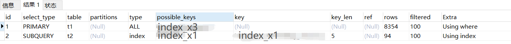

我们分析一下上面的执行计划。首先，第一条执行计划的 id 是 1，第二条执行计划的 id 是 2。因为这个 SQL 里又两个 SELECT，主查询的 SELECT 的执行计划的 id 就是 1，子查询 SELECT 的执行计划的 id 就是 2

另外，第一条执行计划里，`select_type` 是 `PRIMARY`，不是 SIMPLE 了，说明第一个执行计划的查询类型是主查询的意思。对主查询而言，它有一个条件是 `x3 = 'xxx'`，所以它的 possible_keys 里包含了 index_x3，就是 x3 字段的索引，但是它的 key 实际是 NULL，而且 type 是 ALL，所以说它最后没选择用 x3 字段的索引，而是选择了全表扫描

为什么？可能它通过成本分析发现，使用 x3 字段的索引扫描 xxx 这个值，几乎就跟全表扫描差不多，所以最后就选择还不如直接全表扫描呢

接着第二条执行计划，它的 `select_type` 是 `SUBQUERY`，即子查询。子查询针对的是 t2 这个表，当然子查询本身就是一个全表查询，但是相对主查询而言，会使用 x1 in 这个筛选条件，它这里 type 是 index，说明使用了扫描 index_x1 这个 x1 字段的二级索引的方式，直接扫描 x1 字段的二级索引，来跟子查询的结果集作对比

接着看另外一个 `union` 的 SQL 语句：EXPLAIN SELECT * FROM t1 UNION SELECT * FROM t2

两个 SELECT 对应两个 id，就是分别从 t1 表和 t2 表里进行全表扫描。接着第三条执行计划，其实 `union` 字句默认的作用是把两个结果集合并起来还会进行去重，所以第三条执行计划干的是去重的活儿。

所以上面它的 table 是 `<union 1, 2>`，就是一个临时表的表名，而且它的 extra 里，有一个 using temporary，也就是使用临时表的意思，它就是把结果集放到临时表里进行去重的。当然，如果你使用 `union all`，那么就不会进行去重了。

## 执行计划中的 id、select_type

SQL 执行计划里有一个 id 的概念，这个 id 是什么意思？简单说，有一个 SELECT 子句就会对应一个 id，如果有多个 SELECT 就会对应多个 id，但是往往有时候一个 SELECT 子句涉及到了多个表，所以会对应多条执行计划，此时可能多条执行计划的 id 是一样的。

接着是 select_type，select_type 之前我们已经看过几种，有 SIMPLE 的，还有 primary 和 subquery 的，那么这些 select_type 是什么意思？还有哪几种 select_type？

一般如果单表查询或者是多表连接查询，它们的 select_type 都是 SIMPLE，这个大家也都看到过了，意思就是简单的查询。如果是 union 语句的话，就类似于 `select * from t1 union select * from t2`，那么会对应两条执行计划，第一条执行计划是针对 t1 表的，select_type 是 PRIMARY，第二条执行计划是针对 t2 表的，select_type 是 UNION，这就是出现 UNION 语句的时候，它们就不一样了。

在使用 UNION 语句的时候，会有第三条执行计划。这个第三条执行计划意思是针对两个查询的结果依托一个临时表进行去重，这个第三条执行计划的 select_type 就是 `union_result`

另外，如果 SQL 里有子查询，类似于 `SELECT * FROM t1 WHERE x1 IN (SELECT x1 FROM t2) OR x3 = 'xxx'`，此时也会有两条执行计划，第一条执行计划的 select_type 是 PRIMARY，第二条执行计划的 select_type 是 SUBQUERY。

## 复杂的示例

接着我们看一下复杂的 SQL 语句：`EXPLAIN SELECT * FROM t1 WHERE x1 IN (SELECT x1 FROM t2 WHERE x1 = 'xxx' UNION SELECT x1 FROM t1 WHERE x1 = 'xxx')`。它有一个外层查询，还有一个内存子查询，子查询里还有两个 SELECT 语句进行 UNION 操作，它的执行计划如下：

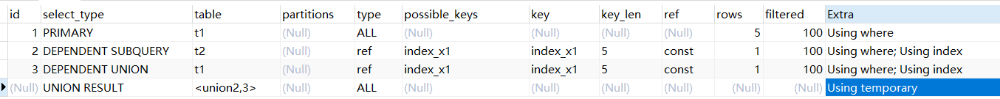

第一个执行计划是针对 t1 表查询的外层循环，select_type 就是 PRIMARY，因为这里涉及到了子查询，所以外层查询的 select_type 就是 PRIMARY

第二个查询计划是子查询里针对 t2 表的那个查询语句，它的 select_type 是 `DEPENDENT SUBQUERY`，第三个执行计划是子查询里针对 t1 表的另一个查询语句，select_type 就是 `DEPENDENT_UNION`，因为第三个执行计划是在执行 union 后的查询，第四个执行计划的 select_type 就是 `UNION RESULT`，因为在执行子查询里两个结果集的合并以及去重

接着看另一个复杂的 SQL 语句：`EXPLAIN SELECT * FROM (SELECT x1, count(*) as cnt FROM t1 GROUP BY X1) AS _t1 WHERE cnt > 10`。它是 FROM 自己后跟了一个子查询，在子查询里是根据 x1 字段进行分组然后进行 count 聚合操作，也就是统计出来 x1 这个字段的每个值的个数，然后在外层则是针对这个内层查询的结果集进行查询通过 where 条件来进行过滤。执行计划如下：

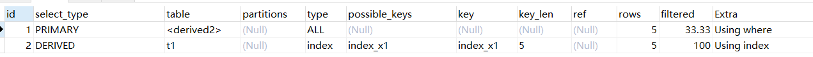

上面的执行计划中，我们主要看第二条。它的 select_type 是 `derived`，意思是，针对子查询执行后的结果集会物化为一个内部临时表，然后外层查询是针对这个临时的物化表执行的。它这里执行分组聚合的时候，是使用 `index_x1` 这个索引进行的，type 是 index，意思是扫描了 index_x1 这个索引树的所有叶子节点，把 x1 相同值的个数都统计出来

然后外层的第一个执行计划，select_type 是 PRIMARY，针对的 table 是 `<derived2>`，就是针对一个子查询结果集物化形成的临时表，它是直接针对这个物化临时表进行全表扫描根据 where 条件进行筛选的

## 执行计划之 select_type 和 type

首先是 select_type，它不是很关键，它主要是代表了大 SQL 里的不同的 SELECT 代表了一个什么角色，比如有的 SELECT 是 PRIMARY 查询，有的是 UNION，有的是 SUBQUERY

但这个 type 就比较关键了，因为它直接决定了对某个表是如何从里面查询数据的，包括了 const、ref、range、index、all 这几种方式，分别是根据主键/唯一索引查询，根据二级索引查询，对二级索引进行全索引扫描，对聚簇索引进行全表扫描

首先，假设是这样的一个语句：`SELECT * FROM t1 WHERE id = 110` 这样的 SQL，直接根据主键进行等值匹配查询，那执行计划里的 type 就会是 `const`，意思是极为快速的。因为主键是不会重复的，这个值一匹配，在一个索引树里跳转查询，基本上几次磁盘 IO 就可以定位到了

接着这样一个 SQL：`SELECT * FROM t1 INNER JOIN t2 ON t1.id = t2.id`，这里是通过两个表的 id 进行关联查询的，此时它的执行计划如下：

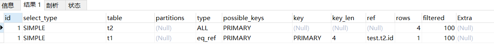

这个执行计划里，它针对 t1 表是一个全表扫描，这是必然的，因为关联的时候会先查询一个驱动表，这里就是 t1，它没什么 where 筛选条件，自然只能是全表扫描查出来所有的数据了

接着针对 t2 表的查询 type 是 eq_ref，而且使用了 PRIMARY 主键。即，针对 t1 表全表扫描获取到的每条数据，都会去 t2 表里基于主键进行等值匹配，此时会在 t2 表里的聚簇索引里根据主键值进行快速查找，所以在连接查询时，针对被驱动表如果基于主键进行等值匹配，那么它的查询方式就是 `eq_ref`

而如果是正常基于某个二级索引进行等值匹配的时候，type 就会是 `ref`，而如果基于二级索引查询的时候允许值为 null，那么查询方式就会是 `ref_or_null`。另外，有一些特殊场景下对单表查询可能会基于多个索引提取数据后进行合并，此时查询方式会是 `index_merge` 这种

而查询方式时 `range` 的话就是基于二级索引进行范围查询，查询方式是 `index` 的时候是直接扫描二级索引的叶子节点，也就是扫描索引里的每条数据，最后如果是 all 的话就是全表扫描，也就是对聚簇索引的叶子节点扫描每条数据

## 执行计划之其他字段

接着我们看 `possible_keys`，顾名思义，其实就是针对一个表进行查询的时候有哪些潜在可以使用的索引。比如你有两个索引，一个是 KEY(x1, x2, x3)，一个是 KEY(x1, x2, x4)，此时在 where 条件里要根据 x1 和 x2 两个字段进行查询，此时上面两个索引都可以使用的，那要使用哪个呢？

此时就需要通过成本优化方法，有估算两个索引进行查询的成本，看使用哪个索引的成本更低，那么就选择用那个索引。最终选择的索引，就是执行计划里的 `key` 这个字段的值了。

而 `key_len`，其实就是当你在 key 里选择使用某个索引之后，那个索引里的最大值的长度是多少，这个就是给你一个参考，大概知道那个索引里的值最大值能有多长，就这么个意思。

而执行计划里的 `ref` 也相对会关键一些。当你的查询方式是索引等值匹配的时候，比如 const、ref、eq_ref、ref_or_null 这些方式的时候这些方式的时候，此时执行计划的 ref 字段告诉你的就是：你跟索引列等值匹配的是什么？是等值匹配一个常量值，还是等值匹配另外一个字段的值？

例如这样的一个 SQL 语句：EXPLAIN SELECT * FROM t1 WHERE x1 = 'xxx'。执行计划如下：

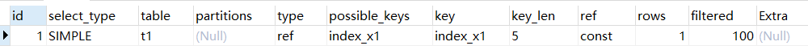

如上图，针对 t1 表的查询，type 是 ref 方式，也就是说基于普通的二级索引进行等值匹配，然后 possible_key 只有一个，就是 index_x1，针对 x1 字段建立的一个索引，而实际使用的索引也是 index_x1

然后 key_len 是 5，意思是 index_x1 这个索引里的 x1 字段最大值的长度就是 5 个字节。而比较关键的是 ref 字段，它的意思是，既然你是针对某个二级索引进行等值匹配的，那么跟 index_x1 进行等值匹配的是什么？是一个常量或者是别的字段？这里的 ref 的值是 const，是使用一个常量值跟 index_x1 索引里的值进行等值匹配的

如果是这样的 SQL 语句：EXPLAIN SELECT * FROM t1 INNER JOIN t2 ON t1.id = t2.id 此时执行计划里的 ref 肯定不是 const，因为你跟 t1 表的 id 字段等值匹配的是另一个表的 id 字段，此时 ref 的值就是那个字段的名称了，如下：

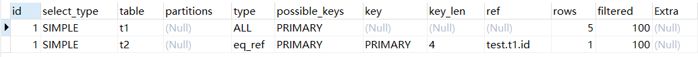

如图，针对 t1 表作为驱动表执行一个全表扫描，接着针对 t1 表里每条数据都会去 t2 表根据 t2 表的主键执行等值匹配，所以第二个执行计划的 type 是 eq_ref，意思是被驱动表基于主键进行等值匹配，而且使用的是 PRIMARY，就是使用了 t2 表的主键

至于 ref，意思是，谁跟 t2 表的聚簇索引里的主键值进行等值匹配？是 test 这个库的 t1 表的 id 字段，这里跟 t2 表的主键进行等值匹配的是 t1 表的主键 id 字段，所以 ref 这里显示的很清楚了

最后简单说下 `rows` 和 `filtered`。这个 rows，就是说你使用指定的查询方式，会查出多少条数据，而 filtered 意思是，在查询方式查出来的这波数据里再用上其他的不在索引范围里的查询条件，又会过滤出百分之几的数据

比如 SQL 语句：EXPLAIN SELECT * FROM t1 WHERE x1 > 'xxx' AND x2 = 'xxx' 它只有一个 x1 字段建了索引，x2 字段是没有索引的，执行计划如下：

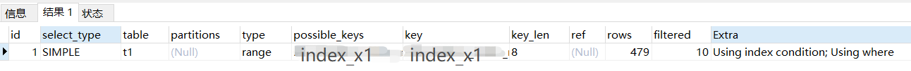

如上图，针对 t1 表的查询方式是 range，也就是基于索引进行范围查询，用的索引是 index_x1，也就是 x1 字段的索引，然后基于 x1 > 'xxx' 这个条件通过 index_x1 索引查询出来的数据大概是 479 条，接着会针对 479 条数据再基于 where 条件里的其他条件，即 x2 = 'xxx' 进行过滤

这个 filtered 是 10，意思是估算基于 x2 = 'xxx' 条件过滤的数据大概是 10%，即最终查出来的数据大概是 479 * 10% = 48 条左右

## 执行计划之 extra

接着我们看 extra 字段代表什么。其实，除了 extra 字段以外的其他内容，最多就是告诉你 SQL 里的每个表是如何查询的，用了哪个索引，查出来了多少数据，但是很多时候，往往针对一个表可不是那么简单的。因为除了基于索引查询数据，可能同时还得基于 where 条件里的其他过滤条件去筛选数据，此时还会筛选出来一些数据

这个 extra 里的信息可能会非常多，我们不可能都讲一遍。主要将一些平时常见的，比较有用的 extra 信息。例如 SQL ：EXPLAIN SELECT x1 FROM t1 WHERE x1 = 'xxx' 它的执行计划如下：

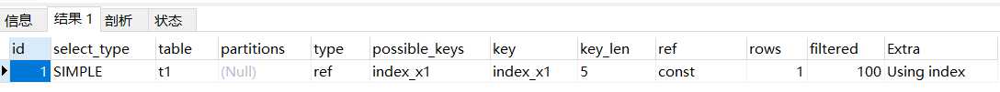

我们看一下这个执行计划。首先它是访问了 t1 表，使用的是 ref 访问方法，也就是基于二级索引去找，找的是 index_x1 这个索引，这个索引的最大长度是 5 个字节，查找的目标是一个 const 代表的常量值，通过索引可以查出来 1 条数据，经过其他条件筛选，最终剩下数据是 100%

接着看 extra 的信息，是 Using index。就是说这次查询，仅仅涉及到了一个二级索引，不需要回表，因为它仅仅是查出来了 x1 这个字段，直接从 index_x1 索引里查就行了。如果没有回表操作，仅仅在二级索引里执行，那么 extra 会告诉你是 `Using index`

如果 SQL 语句是：SELECT * FROM t1 WHERE x1 > 'xxx' AND x1 LIKE '%xxx'。此时它会先在二级索引 index_x1 里查找，查找出来的结构还会额外地跟 x1 LIKE '%xxx' 条件做对比，如果满足条件的才会被筛选出来。这种情况下，extra 显示的是 `Using index condition`

接着讲一个最常见的 extra 信息：**Using where**。这个一般是见于你直接针对一个表扫描，没用到索引，然后 where 里好几个条件，就会告诉你 Using where。或者是你用了索引去查找，但是除了索引之外，还需要其他的字段进行筛选，也会告诉你 Using where

比如 SQL 语句：EXPLAIN SELECT * FROM t1 WHERE x2 = 'xxx'。这里的 x2 是没有建立索引的，此时它的执行计划如下：

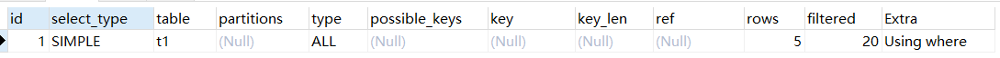

这里针对 t1 表进行查询，用的是全表扫描方式，没有使用任何索引。然后全表扫描，扫出来的是 5 条数据，这个时候 extra 是 Using where，意思是，它对每条数据都用了 WHERE x2 = 'xxx' 进行筛选。最终 filtered 告诉你，你过滤出了 20% 的数据

如果你的 where 条件里有一个条件是针对索引列查询的，有一个列是普通列的筛选，类似这样的 SQL 语句：EXPLAIN SELECT * FROM t1 WHERE x1 = 'xxx' AND X2 = 'xxx'。执行计划如下：

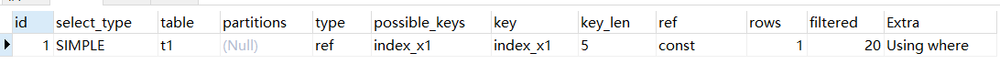

这里针对 t1 表去查询，先通过 ref 方式直接在 index_x1 索引里查找，是跟 const 代表的常量值去查找，然后查出来了 1 条数据，接着再用 Using where 代表的方式，去使用 AND x2 = 'xxx' 条件进行筛选，筛选后的数据比例是 20%

另外，在多表关联的时候，有的时候你的关联条件并不是索引，此时就会用一种叫做 **join buffer** 的内存技术来提升关联的性能，例如：EXPLAIN SELECT * FROM t1 INNER JOIN t2 ON t1.x2 = t2.x2。它们的连接条件 x2 是没有索引的，执行计划如下：

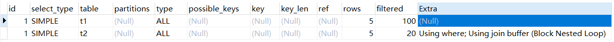

因为要执行 join，那么肯定先得查询 t1 表的数据，此时是对 t1 表直接全表查询，查出来 5 条数据。接着就是对每条数据的 x2 字段的值，跑到 t2 表里去对应的数据，进行关联。但是此时因为 t2 表也没法根据索引来查，也是属于全表扫描，所以每次都得对 t2 表全表扫描一下。根据 extra 提示的 Using where，就是根据 t1 表每条数据的 x2 字段去 t2 表查找对应的数据了，然后此时会用 join buffer 技术，在内存里做一些特殊优化，减少 t2 表的全表扫描次数

接着看 `Using fileSort`。一般，我们在 SQL 语句里进行排序的时候，如果排序字段是有索引的，那么其实是直接可以从索引里按照顺序去查找数据的。例如：EXPLAIN SELECT * FROM t1 ORDER BY x1 LIMIT 10 这就是一个排序后再分页的语句，执行计划如下：

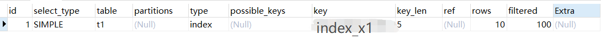

这个 SQL 语句，它是用了 index 方式访问的，意思是直接扫描了二级索引，而且实际使用的索引也是 index_x1，本质上来说，它就是在 index_x1 索引里，按照顺序找你 LIMIT 10 要求的 10 条数据而已。所以大家看到返回的数据是 10 条，也没别的过滤条件，所以 filtered 是 100%，也就是 10 条数据都返回了

但是如果我们排序的时候没有用到索引，此时就会基于内存或者磁盘文件来排序。大部分时候都得基于磁盘文件来排序，比如 EXPLAIN SELECT * FROM t1 ORDER BY x2 LIMT 10。x2 是没有索引的，执行计划如下：

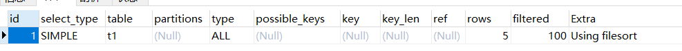

SQL 很明确，它基于 x2 字段来排序，是没法直接根据有序的索引去找数据的，只能把所有数据写入一个临时的磁盘文件，基于排序算法在磁盘文件里按照 x2 字段的值完成排序，然后在按照 LIMIT 10 的要求取出来头 10 条数据。这种把表全数据放磁盘文件排序的做法是相当糟糕的，性能会极差

最后，我们用 group by、union、distinct 之类的语法的时候，你要是没法直接利用索引来进行分组聚合，那么它直接会基于临时表来完成，也会有大量的磁盘操作，性能也是极地的。比如这个 SQL ：EXPLAIN SELECT x2, COUNT(*) AS amount FROM t1 GROUP BY x2 这里的 x2 是没有索引的，它的执行计划如下：

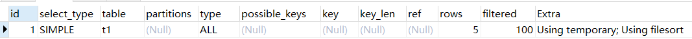

这个 SQL 里只能去全表数据放到临时表里做大量的磁盘文件操作，然后才能完成对 x2 字段的不同的值去分组，分组完了以后对不同 x2 的值的分组做聚合操作，这个过程也是相当耗时的

**所有，未来在 SQL 调优的时候，核心就是分析执行计划里哪些地方出现了全表扫描，或者扫描数据过大，尽可能通过合理优化索引保证执行计划每个步骤都可以基于索引执行，避免扫描过多的数据**

