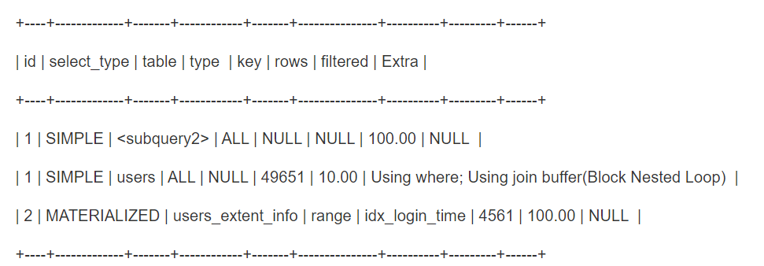

## 案例背景

有一个系统是专门通过各种条件筛选出大量的用户，接着对那些用户去推动一些消息的。可能是推送一些促销活动的消息，或者是告诉你有一个特价商品的消息。总之，就是通过一些条件筛选出大量的用户，接着针对这些用户做出有一些推送。这个过程，比较耗时的是筛选用户的这个过程


因为用户是日活百万级的，注册用户是千万级的，而且如果没有进行分表分库的话，那么这个数据库里的用户表可能就一张，单表里是上千万的用户数据。


现在对筛选用户的 SQL 做一个简化，这个 SQL 经过简化看起来是这样的：

`SELECT id, name FROM users WHERE id IN (SELECT user_id FROM users_extent_info WHERE latest_login_time < xxxx)`


解释上面的 SQL 语句，一般存储用户数据的表会分为两张表，一个表用来存储用户的核心数据，比如 id、name、手机号之类的信息，也就是上面 SQL 语句里的 users 表。另外一个表可能会存储用户的一些扩展信息，比如家庭住址、兴趣爱好、最近一次登录时间之类的，就是上面的 users_extent_info 表


所以上面的 SQL 语句的意思就很明显了，有一个子查询，里面针对用户的扩展信息表，即 users_extent_info 查询了一下最近一次登录时间小于某个时间点的用户，然后给他们发送一些 push，无论哪种场景，这个 SQL 都是适用的


然后外层的查询里，直接用了 id IN 字句去查询 id 在子查询结果范围里的 users 表的所有数据，此时这个 SQL 往往一下子会查出来很多数据，可能几千、几万、几十万都有可能，所以一般运行这类 SQL 之前，都会先跑一个 count 聚合函数，看看有多少条，比如下面这样：

`SELECT COUNT(id) FROM users WHERE id IN (SELECT user_id FROM users_extent_info WHERE latest_login_time < xxxx)`


然后内存里做一个小批量多批次读取数据的操作，比如判断如果在 1000 条以内，那么就一下子读取出来，如果超过 1000 条，可以通过 LIMIT 语句，每次就从这个结果集里查 1000 条数据，查 1000 条就做一次批量 push，再查下一波 1000 条。


这就是这个案例的一个完整的业务背景和讲解，那么当时产生的问题是什么？就是在千万级数据量的大表场景下，上面的 SQL 直接轻松跑出来耗时几十秒的速度，所以，这个 SQL 不优化是不行的


## 执行计划

接着我们来分析 `SELECT COUNT(id) FROM users WHERE id IN (SELECT user_id FROM user_extent_info WHERE latest_login_time < xxxx)` 的执行计划。不过要提醒一点，不同的 MySQL 版本的执行计划可能不一样，不同数据量也可能不一样，所以同样的 SQL 在不同的 MySQL 版本下跑，可能执行计划都不一样


执行计划不一样没关系，重点是执行计划分析的思路，以及如何从执行计划里看出性能问题所在，最后就是如何进行调优，重点是这个过程，没法还原出来执行计划，也是没关系的。它的执行计划如下：




从上面的执行计划，可以清晰看到这条 SQL 语句的一个执行过程。首先，针对子查询，是执行计划里的第三行实现的，它表明，针对 users_extent_info，使用了 idx_login_time 这个索引，做了 range 类型的索引范围扫描，查出来 4561 条数据，没有做其它的额外筛选，所以 filtered 是 100%


接着它这里的 `MATERIALIZED`，表明了这里把子查询的 4561 条数据代表的结果集进行了物化，物化成了一个临时表，这个临时表物化，是把 4561 条数据临时落到磁盘文件里去的，这个过程其实就挺慢的


然后第二条执行计划表明，接着就是对 users 表做了一个全表扫描，在全表扫描的时候扫出了 49651 条数据，同时注意 `extra` 字段，显示了一个 **Using join buffer** 的信息，这个表明，此处在执行 join 操作


接着看执行计划里的第一条，这里它是针对子查询产出的一个物化临时表，也就是 `<subquery2>`，做了一个全表查询，把里面的数据都扫描一遍，那为什么要对这个临时表进行全表扫描呢？原因就是让 users 表的每一条数据，都要去跟物化临时表里的数据进行 join，所以针对 users 表里的每一条数据，只能是全表扫描一遍物化临时表，找找物化临时表里哪条数据是跟它匹配的，才能筛选出一条结果


第二条执行计划的全表扫描的结果表明是一共扫到了 49651 条数据，但是全表扫描的过程中，因为去跟物化临时表执行了一个 join 操作，而物化临时表就 4561 条数据，所以最终第二条执行计划的 filtered 显示的是 10%，即，从 users 表里筛选出了 4000 多条数据


## SQL 优化

上面说过，执行过程就是先执行了子查询查出来 4561 条数据，物化成了一个临时表，接着它对 users 主表做了一个全表扫描，扫描的过程中把每一条数据都放到物化临时表里去做全表扫描，本质在做 join 的事情


这里为什么会跑这么慢呢？首先它对子查询的结果做了一次物化临时表，落地磁盘了，接着它会全表扫描了 users 表的所有数据，每一条数据居然跑到一个没有索引的物化临时表里再做一次全表扫描找匹配数据。这个过程里，对 users 表的全表扫描是耗时的，对 users 表的每一条数据跑到物化临时表里做全表扫描，也是耗时的。所以这个过程是非常慢的，几乎没有用到索引


为什么会出现一个全表扫描 users 表，然后跟物化临时表做 join，join 的时候还要全表扫描物化临时表的过程？这里说一个技巧，就是在执行上述 SQL 的 EXPLAIN 命令，看到执行计划，可以执行一下 **show warning** 命令。这个 show warning 命令此时显示出来的内容如下：

```
/* select#1 */ select count(`d2.`users`.`user_id``) AS `COUNT(users.user_id)`
from `d2`.`users` `users` semi join xxxx .....（下面省略一大段内容）
```


大家关注的应该是这里的 **semi join** 这个关键字。这里就显而易见了，MySQL 在这里，生成执行计划的时候，自动就把一个普通的 IN 子句，“优化” 成了基于 semi join 来进行 IN + 子查询的操作，这个 semi join 是什么意思？


简单来说，对 users 表不是全表扫描了么？对 users 表里每一条数据，去物化临时表全表扫描做 semi join，不需要把 users 表里的数据真的跟物化临时表里的数据 join 上。只要 users 表里的一条数据，在物化临时表里可以找到匹配的数据，那么 users 表里的数据就会返回，这就叫 semi join，它是用来筛选的


所以慢，也就慢在这里。既然知道了是 semi join 和物化临时表导致的问题，应该如何优化？先做一个小实验，执行 `SET optimizer_switch = 'semijoin = off'`，就是关闭掉半连接优化，此时执行 EXPLAIN 命令看一下此时的执行计划，发现此时会恢复为一个正常的状态。


就是有一个 `SUBQUERY` 的子查询，基于 range 方式去扫描索引搜索出 4561 条数据，接着有一个 PRIMARY 类型的主查询，直接是基于 id 这个 PRIMARY 主键聚簇索引去执行的搜索，然后再把这个 SQL 语句真实跑一下看看，发现性能一下子提升了几十倍


到此真相大白了，其实反而是它自动执行的 semi join 半连接优化，给咱们导致了问题，一旦禁止掉 semi join 自动优化，用正常的方式让它基于索引去执行，性能是很可观的


当然，在生产环境下不能随意更改这些设置的，所以后来想了一个办法，多种办法尝试去修改 SQL 语句的写法，在不影响它语义的情况下，尽可能去改变 SQL 语句的结构和格式，最终尝试出了一个写法，如下：

```mysql
SELECT COUNT(id) FROM users 
WHERE (id IN (SELECT user_id FROM users_extent_info WHERE latest_login_time < xxxx) OR id IN (SELECT user_id FROM users_extent_info WHERE latest_login_time < -1))
```


上述写法中，WHRE 语句的 OR 后面的第二个条件，是不可能成立的，因为没有数据的 latest_login_time 是小于 -1 的，所以那时不会影响 SQL 语义的，但是我们发现改变了 SQL 的写法之后，执行计划也随之改变。


它并没有再进行 semi join 优化了，而是正常地用了子查询，主查询也是基于索引去执行