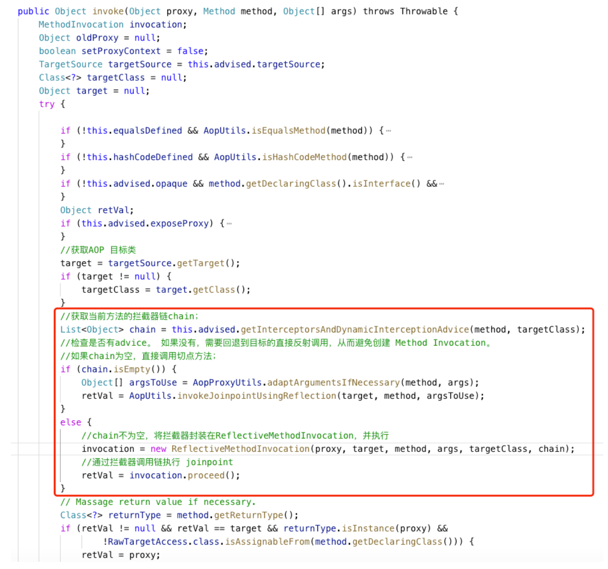
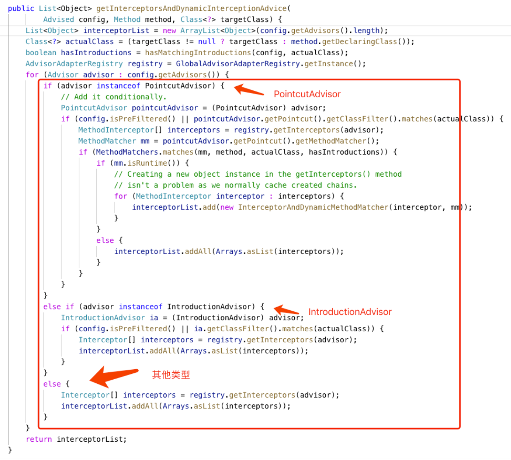
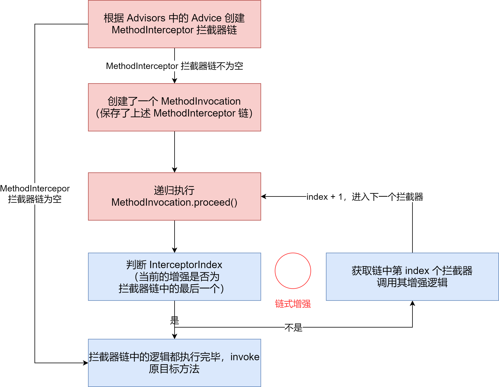
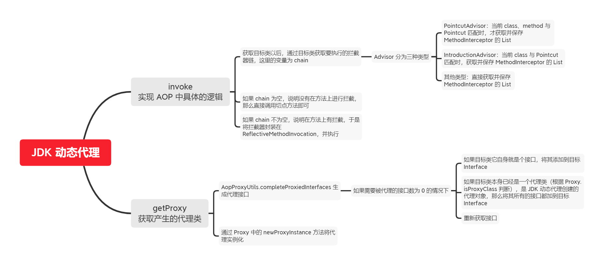
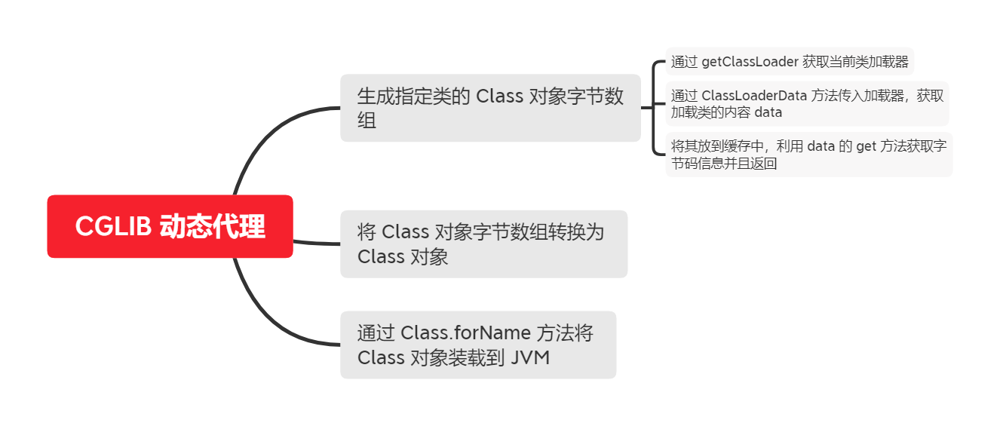

## JDK 动态代理源码分析


接着我们通过源码分析介绍 Spring AOP JDK 动态代理实现的原理。内容包括：


- **invoke**：实现 AOP 中具体的逻辑
- **getProxy**：获取产生的代理类


### invoke：实现 AOP 中具体的逻辑


JDK 中的 AOP 的实现是基于 java.lang.reflect 包中 `Proxy` 和 `InvocationHandler` 两个接口来实现的。对于 InvocationHandler 的创建，需要我们重写三个方法：


- 构造函数：将目标代理对象传入
- invoke：实现 AOP 中具体的逻辑
- getProxy：获取产生的代理类


而在 Spring 框架中，JDK 方式的代理也是实现了上述过程


**JDK 动态代理时通过 `proxyFactory.getProxy` 获取代理的**，如下，通过 `createAopProxy()` 生成对应的 ProxyFactory，然后在调用其中的 getProxy 方法


```java
public Object getProxy() {
    return this.createAopProxy().getProxy();
}
```


`createAopProxy` 中决定的实现类为 `JdkDynamicAopProxy`，如下面代码所示，它实现了 `AopProxy` 和 `InvocationHandler`


```java
final class JdkDynamicAopProxy implements AopProxy, InvocationHandler, Serializable
```


由于我们会调用 `InvocationHandler`，并且 override 其中的 invoke 方法，然后通过 `InvocationHandler` 中的 getProxy 方法获取代理类，通过对代理类调用 `process` 方法执行 AOP 的相关操作


我们先来看看 override 的 invoke 方法的源码，如下图所示，在 invoke 方法中我们需要关注红框标注的部分：


- 在获取目标类以后，通过目标类获取要执行方法的拦截器链，这里的变量为 chain
- 如果 chain 为空，说明没有在方法上进行拦截，那么直接调用切点方法就行了
- 如果 chain 不为空，说明在方法上有拦截，于是将拦截器封装在 `ReflectiveMethodInvocation`，并执行，这部分也是 AOP 需要关注的





上面通过了 `getInterceptorsAndDynamicInterceptionAdvice` 获取目标类执行方法的拦截器链 chain，这里对 `getInterceptorsAndDynamicInterceptionAdvice` 进行解析，如下图，依旧关注红框的部分：


收到获取此方法的拦截器链，依然将 Advisor 分为三种类型：


- PointcutAdvisor：当前 class、method 与 Pointcut 匹配时，才获取并保存 MethodInterceptor 的 List
- IntroductionAdvisor：当前 class 与 Pointcut 匹配时，获取并保存 MethodInterceptor 的 List
- 其他类型：直接获取并保存 MethodInterceptor 的 List





从上图可以知道，处理 PointcutAdvisor 类型的时候会用到 getInterceptors 方法获取 MethodInterceptor 的数组类型，这里看看 getInterceptors 内部的实现是如何的


如下，使用 `advisor.getAdvice()` 获取 Advice。假设注解 Advisor 以 @Before 注解形式存在，那么此时得到的 Advice 应该是 AspectJMethodBeforeAdvice，进入的是 `interceptors.add(adapter.getInterceptor(advisor))` 这行代码，将 AspectJMethodBeforeAdvice 包装成 MethodInterceptor 类型，并返回


```java
public MethodInterceptor[] getInterceptors(Advisor advisor) throws UnknownAdviceTypeException {
    List<MethodInterceptor> interceptors = new ArrayList(3);
    Advice advice = advisor.getAdvice();
    if (advice instanceof MethodInterceptor) {
        interceptors.add((MethodInterceptor)advice);
    }

    Iterator var4 = this.adapters.iterator();

    while(var4.hasNext()) {
        AdvisorAdapter adapter = (AdvisorAdapter)var4.next();
        if (adapter.supportsAdvice(advice)) {
            interceptors.add(adapter.getInterceptor(advisor));
        }
    }

    if (interceptors.isEmpty()) {
        throw new UnknownAdviceTypeException(advisor.getAdvice());
    } else {
        return (MethodInterceptor[])interceptors.toArray(new MethodInterceptor[0]);
    }
}
```


上面说的是如何获取方法拦截链 chain，接下来看看拦截链为空和不为空的情况。拦截链为空，如下代码所示，表示当前的 Method 并没有 Advice 逻辑需要增强


```java
Object[] argsToUse = AopProxyUtils.adaptArgumentsIfNecessary(method, args);
retVal = AopUtils.invokeJoinpointUsingReflection(target, method, argsToUse);
```


拦截链不为空，如图 4 所示，需要创建 `ReflectiveMethodInvocation` 对象。如下：


```java
protected ReflectiveMethodInvocation(Object proxy, @Nullable Object target, Method method, @Nullable Object[] arguments, @Nullable Class<?> targetClass, List<Object> interceptorsAndDynamicMethodMatchers) {
    this.proxy = proxy;
    this.target = target;
    this.targetClass = targetClass;
    this.method = BridgeMethodResolver.findBridgedMethod(method);
    this.arguments = AopProxyUtils.adaptArgumentsIfNecessary(method, arguments);
    this.interceptorsAndDynamicMethodMatchers = interceptorsAndDynamicMethodMatchers;
}
```


有了 ReflectiveMethodInvocation 对象就要通过 `proceed` 方法对拦截链上的拦截器进行递归执行，也是一种对当前 Method 的链式增强。如下，proceed 方法中会在拦截链上通过 `currentInterceptorIndex` 获取一个拦截器，然后对其进行动态代理方法的匹配，如果匹配通过了，执行拦截器中的方法，否则跳过该拦截器，执行拦截器链上的下一个拦截器


如果是一个拦截器，就通过静态的方式执行，不用执行其中的嵌入方法


```java
public Object proceed() throws Throwable {
    if (this.currentInterceptorIndex == this.interceptorsAndDynamicMethodMatchers.size() - 1) {
        return this.invokeJoinpoint();
    } else {
        // currentInterceptorIndex 用来递归执行 MethodInvocation.proceed，从而进入到下一个拦截器
        Object interceptorOrInterceptionAdvice = this.interceptorsAndDynamicMethodMatchers.get(++this.currentInterceptorIndex);
        if (interceptorOrInterceptionAdvice instanceof InterceptorAndDynamicMethodMatcher) {
            // 进行动态代理方法的匹配，如果匹配上了执行加入拦截器以后的方法，否则跳过拦截器执行下一个拦截器链的拦截器
            InterceptorAndDynamicMethodMatcher dm = (InterceptorAndDynamicMethodMatcher)interceptorOrInterceptionAdvice;
            Class<?> targetClass = this.targetClass != null ? this.targetClass : this.method.getDeclaringClass();
            // 如果动态匹配失败，跳过拦截器到拦截链的下一个拦截器
            return dm.methodMatcher.matches(this.method, targetClass, this.arguments) ? dm.interceptor.invoke(this) : this.proceed();
        } else {
			// 只是一个拦截器就通过静态的方式执行，不用执行其中嵌入的方法
            return ((MethodInterceptor)interceptorOrInterceptionAdvice).invoke(this);
        }
    }
}
```


在 `proceed` 方法中无论是否匹配上动态代理方法都会运行 invoke。这里以前置增强为例，实现类为 MethodBeforeAdviceInterceptor。如下，在 invoke 方法中执行 advice 的 before 方法实现增强内容


```java
public class MethodBeforeAdviceInterceptor implements MethodInterceptor, BeforeAdvice, Serializable {
    private final MethodBeforeAdvice advice;

    public MethodBeforeAdviceInterceptor(MethodBeforeAdvice advice) {
        Assert.notNull(advice, "Advice must not be null");
        this.advice = advice;
    }

    public Object invoke(MethodInvocation mi) throws Throwable {
        this.advice.before(mi.getMethod(), mi.getArguments(), mi.getThis());
        return mi.proceed();
    }
}
```


这里把 JDK 的链式增强做一个总结。如下图，首先根据 `Advisor` 中的 Advice 创建 MethodInterceptor 拦截器链，这个链中保存对目标类对应方法的所有增强，这些增强以拦截器链的方式放到拦截器链中。然后创建 MethodInvocation 用来保存上述的 MethodInterceptor 拦截器链


接着执行 MethodInvocation.proceed 的递归方法，在方法中通过 IterceptorIndex 对拦截器链上的拦截器进行遍历。在拦截器链中的逻辑都执行完毕了，通过 invoke 执行目标类的原方法





### getProxy：获取产生的代理类


接着我们看通过 getProxy 获取代理对原方法和增强方法执行的过程。如下所示，getProxy 接收 ClassLoader 作为参数，方法体中调用了 AopProxyUtils 的 completeProxiedInterfaces 生成代理接口，然后通过 Proxy 中的 `newProxyInstance` 方法将代理实例化


```java
public Object getProxy(@Nullable ClassLoader classLoader) {
    if (logger.isTraceEnabled()) {
        logger.trace("Creating JDK dynamic proxy: " + this.advised.getTargetSource());
    }

    Class<?>[] proxiedInterfaces = AopProxyUtils.completeProxiedInterfaces(this.advised, true);
    this.findDefinedEqualsAndHashCodeMethods(proxiedInterfaces);
    return Proxy.newProxyInstance(classLoader, proxiedInterfaces, this);
}
```


我们看看 getProxy 中调用的 `completeProxiedInterfaces` 方法，该方法体中获取 AdvisedSupport 代理配置中目标类中需要被代理的接口


在当前目标类中，如果需要被代理的接口数为0 的情况下，做如下处理：


- 如果目标类它自身就是个接口，将其加到目标 Interface
- 如果目标类本身已经是一个代理类（根据 Proxy.isProxyClass 判断），是 JDK 动态代理创建的代理对象，那么将其所有的接口都加到目标 Interface
- 重新获取目标接口


`addSpringProxy`、`addAdvised` 用于判断目标类是否是特殊接口：SpringProxy、Advised。一般情况下两个 boolean 都是 true


将目标代理类、SpringProxy、Advised 三个接口填入 proxiedInterfaces 中，返回此数组


```java
static Class<?>[] completeProxiedInterfaces(AdvisedSupport advised, boolean decoratingProxy) {
    Class<?>[] specifiedInterfaces = advised.getProxiedInterfaces();
    if (specifiedInterfaces.length == 0) {
        Class<?> targetClass = advised.getTargetClass();
        if (targetClass != null) {
            if (targetClass.isInterface()) {
                advised.setInterfaces(new Class[]{targetClass});
            } else if (Proxy.isProxyClass(targetClass)) {
                advised.setInterfaces(targetClass.getInterfaces());
            }

            specifiedInterfaces = advised.getProxiedInterfaces();
        }
    }

    boolean addSpringProxy = !advised.isInterfaceProxied(SpringProxy.class);
    boolean addAdvised = !advised.isOpaque() && !advised.isInterfaceProxied(Advised.class);
    boolean addDecoratingProxy = decoratingProxy && !advised.isInterfaceProxied(DecoratingProxy.class);
    int nonUserIfcCount = 0;
    if (addSpringProxy) {
        ++nonUserIfcCount;
    }

    if (addAdvised) {
        ++nonUserIfcCount;
    }

    if (addDecoratingProxy) {
        ++nonUserIfcCount;
    }

    Class<?>[] proxiedInterfaces = new Class[specifiedInterfaces.length + nonUserIfcCount];
    System.arraycopy(specifiedInterfaces, 0, proxiedInterfaces, 0, specifiedInterfaces.length);
    int index = specifiedInterfaces.length;
    if (addSpringProxy) {
        proxiedInterfaces[index] = SpringProxy.class;
        ++index;
    }

    if (addAdvised) {
        proxiedInterfaces[index] = Advised.class;
        ++index;
    }

    if (addDecoratingProxy) {
        proxiedInterfaces[index] = DecoratingProxy.class;
    }

    return proxiedInterfaces;
}
```


### 总结




## CGLIB 动态代理源码分析


CGLIB 是通过字节码增强处理器框架 **ASM**，来生成字节码并装载到 JVM。和 JDK 代理基于接口实现方式不同，CGLIB 没有局限于接口，采用的是生成子类的方式。这个子类本质上就是一个 Class 对象，即，原来是执行原有的 Class，CGLIB 会通过字节码增强的方式，在字节码的层面生成一个子类去继承需要增强的类，在子类中加入需要增强的方法，让这个子类代替原有的类，完成增强的操作


我们将 CGLIB 生成 Class 对象分为三个步骤：


1. 生成指定类的 Class 对象字节数组
2. 将 Class 对象字节数组转换为 Class 对象
3. 通过 Class.forName 方法将 Class 对象装载到 JVM


### 生成指定类的 Class 对象字节数组


如下，在创建 Enhance 对象会调用 create 方法从而生成超类的子类。深入到 create 方法内部可以看到，先通过 getClassLoader 获取当前类加载器，通过 AbstractClassGenerator 中的 ClassLoaderData 方法传入到加载器，获取加载类的内容 data。并且将其放到缓存中，接下来利用 data 中的 get 方法获取字节码信息并且返回


```java
protected Object create(Object key) {
    try {
        // 获取当前类加载器，应用类加载器
        ClassLoader loader = this.getClassLoader();
        Map<ClassLoader, AbstractClassGenerator.ClassLoaderData> cache = CACHE;
        AbstractClassGenerator.ClassLoaderData data = (AbstractClassGenerator.ClassLoaderData)cache.get(loader);
        if (data == null) {
            Class var5 = AbstractClassGenerator.class;
            synchronized(AbstractClassGenerator.class) {
                cache = CACHE;
                data = (AbstractClassGenerator.ClassLoaderData)cache.get(loader);
                if (data == null) {
                    Map<ClassLoader, AbstractClassGenerator.ClassLoaderData> newCache = new WeakHashMap(cache);
                    // 创建 AbstractClassGenerator
                    data = new AbstractClassGenerator.ClassLoaderData(loader);
                    newCache.put(loader, data);
                    CACHE = newCache;
                }
            }
        }

        this.key = key;
        // 调用 get 方法获取字节码，如果没有字节码，则会创建字节码
        Object obj = data.get(this, this.getUseCache());
        return obj instanceof Class ? this.firstInstance((Class)obj) : this.nextInstance(obj);
    } catch (Error | RuntimeException var9) {
        throw var9;
    } catch (Exception var10) {
        throw new CodeGenerationException(var10);
    }
}
```


顺着 data 中的 get 方法查看代码，get 中会判断是否开启缓存，如果没有使用缓存就调用 `generate` 方法，否则直接从缓存中获取对象。这里的缓存可以通过 enhancer.setUserCache 方法设置，默认为 true


```java
public Object get(AbstractClassGenerator gen, boolean useCache) {
    // 判断是否开启缓存，可直接设置：enhancer.setUserCache(false); 默认为 true
    if (!useCache) {
        return gen.generate(this);
    } else {
        Object cachedValue = this.generatedClasses.get(gen);
        return gen.unwrapCachedValue(cachedValue);
    }
}
```


继续跟进 generate方法中传入 data 作为参数，生成对应的代理类名称，然后通过类加载器和类名称尝试加载类。如果之前没有生成对应的字节码，那么创建字节码。接着通过生成字节码的策略生成字节码，当前对象即为 `Enhancer` 对象，字节数组的形式


```java
protected Class generate(AbstractClassGenerator.ClassLoaderData data) {
    Object save = CURRENT.get();
    CURRENT.set(this);

    Class var8;
    try {
        ClassLoader classLoader = data.getClassLoader();
        if (classLoader == null) {
            throw new IllegalStateException("ClassLoader is null while trying to define class " + this.getClassName() + ". It seems that the loader has been expired from a weak reference somehow. Please file an issue at cglib's issue tracker.");
        }

        String className;
        // 生成代理类名称
        synchronized(classLoader) {
            className = this.generateClassName(data.getUniqueNamePredicate());
            data.reserveName(className);
            this.setClassName(className);
        }

        Class gen;
        // 这里通过应用类加载器和类名称尝试加载，如果加载不到，才开始创建字节码
        if (this.attemptLoad) {
            try {
                gen = classLoader.loadClass(this.getClassName());
                Class var23 = gen;
                return var23;
            } catch (ClassNotFoundException var19) {
            }
        }
		// 通过生成策略创建字节码，当前对象即为 Enhancer 对象，字节数组形式
        byte[] b = this.strategy.generate(this);
        className = ClassNameReader.getClassName(new ClassReader(b));
        ProtectionDomain protectionDomain = this.getProtectionDomain();
        synchronized(classLoader) {
            // 将字节码加载到 JVM 内存，同时会触发代理对象初始化
            gen = ReflectUtils.defineClass(className, b, classLoader, protectionDomain, this.contextClass);
        }

        var8 = gen;
    } catch (Error | RuntimeException var20) {
        throw var20;
    } catch (Exception var21) {
        throw new CodeGenerationException(var21);
    } finally {
        CURRENT.set(save);
    }

    return var8;
}
```


我们看 `getClassName` 方法中时如何生成代理类名称的。由下可以看出，生成字节码文件的规则：**真实类路径 + 来源（EnhancerByCGLIB）+ key 的 hash 值的 16 进制**


```java
public String getClassName(String prefix, String source, Object key, Predicate names) {
    if (prefix == null) {
        prefix = "org.springframework.cglib.empty.Object";
    } else if (prefix.startsWith("java")) {
        prefix = "$" + prefix;
    }
	// 拼接类路径
    String base = prefix + "$$" + source.substring(source.lastIndexOf(46) + 1) + this.getTag() + "$$" + Integer.toHexString(STRESS_HASH_CODE ? 0 : key.hashCode());
    String attempt = base;

    for(int var7 = 2; names.evaluate(attempt); attempt = base + "_" + var7++) {
    }

    return attempt;
}
```


生成文件的结果入好像如下所示：


com.example.cglib.RealService$$EnhancerByCGLIB$$a9ba5c5e


具体生成的字节码的方式就是和通过 asm 的工具类 DefaultGeneratorStrategy 来生成，另外提供了一个 DebuggingClassWriter 来写入到指定目录，默认的目录为空，所以生成的代理类只存在于内存中


### 将 Class 对象字节数组转换为 Class 对象


通过上面的源代码分析已经生成了 Class 对象字节数组，接下来就要将这个字节数组转换成 Class 对象。跟进 ReflectUtils.defineClass 继续看，如下，方法 defineClass 传入了 byte[] b，这个 b 的数组中存放的就是字节数组。通过 new object 将字节数组赋值给 args，然后通过 DEFINE_CLASS.invoke 方法将字节数组转化为 Class 对象


```java
public static Class defineClass(String className, byte[] b, ClassLoader loader, ProtectionDomain protectionDomain, Class<?> contextClass) throws Exception {
    Class c = null;
    Lookup lookup;

    if (c == null && classLoaderDefineClassMethod != null) {
        if (protectionDomain == null) {
            protectionDomain = PROTECTION_DOMAIN;
        }
		// 其中 b 为 cglib 生成的字节数组
        Object[] args = new Object[]{className, b, 0, b.length, protectionDomain};

        try {
            if (!classLoaderDefineClassMethod.isAccessible()) {
                classLoaderDefineClassMethod.setAccessible(true);
            }

            c = (Class)classLoaderDefineClassMethod.invoke(loader, args);
        } catch (InvocationTargetException var10) {
            throw new CodeGenerationException(var10.getTargetException());
        } catch (Throwable var11) {
            if (!var11.getClass().getName().endsWith("InaccessibleObjectException")) {
                throw new CodeGenerationException(var11);
            }
        }
    }

    if (c == null) {
        throw new CodeGenerationException(THROWABLE);
    } else {
    	// 正式加载到 JVM 内存
        Class.forName(className, true, loader);
        return c;
    }
}
```


通过 Class.forName 方法将 Class 对象装载到 JVM


从上面的代码可以知道，在 defineClass 的最后调用了 `Class.forName` 方法传入 className 以及加载器，将 Class 对象装载到 JVM 中以供使用。以后这个 Class 对象就代替了源 Class 对象，完成 AOP 增强的操作


### 总结


