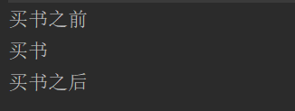
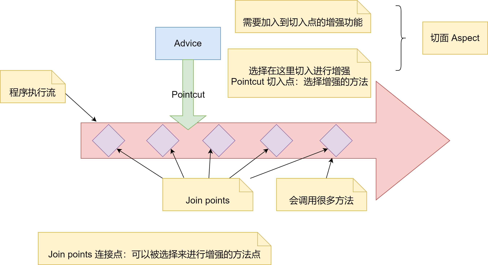
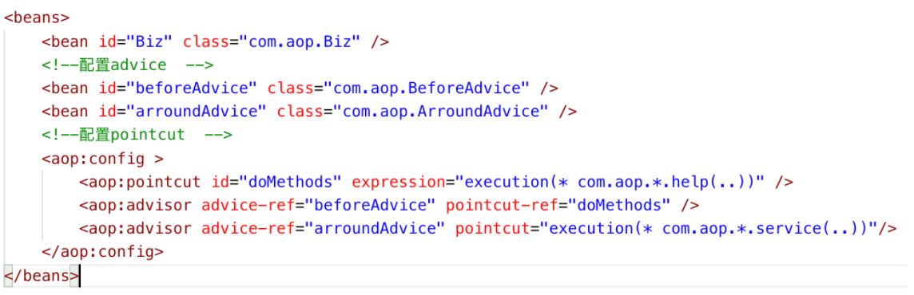
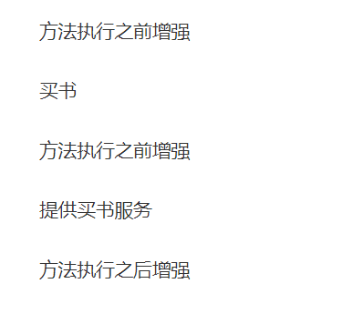

AOP 框架有很多种，Spring 中的 AOP 是通过动态代理实现的。**JDK 动态代理只在运行期，目标类加载后，为借口动态生成代理类，将切面织入代理类中**


这里通过一个例子来讲解 JDK 动态代理的原理。如下，定义一个 Service 接口，其中有一个 help 方法。用 ServiceImpl 去实现 Service 借口，在 help 方法中实现「打印买书」的输出。这个 ServiceImpl 就是我们要代理的目标类


```java
public interface Service {
    public void help();
}
public class ServiceImpl implements Service {
    
    @Override
    public void help() {
        System.out.println("买书");
    }
}
```


接下来实现代理类，如下，DynamicProxy 作为动态代理类实现了 `InvocationHandler` 接口。其中定义了 Service 的接口作为代理类 DynamicProxy 构造方法的输入参数。在 Override 的 invoke 方法中通过参数 Method 来代理要执行的代理类中的方法。method.invoke 的输入参数为目标类 Service


`method.invoke` 是用来执行代理类中的 help 方法，如果这个假设成立的话，在这个方法前面执行的 `System.out.println("买书之前")`，会在「买书」方法之前执行；同理，`System.out.println("买书之后")` 会在「买书」方法之后执行


```java
public class DynamicProxy implements InvocationHandler {
    // 代理的真是对象
    private Object service;
    
    // 构造方法，给代理的真是对象复制
    public DynamicProxy(Object service) {
        this.service = service;
    }
    
    @Override 
  	public Object invoke(Object object, Method method, Object[] args) throws Throwable{
        // 真实方法之前执行
        System.out.println("买书之前");
        // 调用真实方法
        method.invoke(service, args);
        // 真实方法之后执行
        System.out.println("买书之后");
        
        return null;
    }
}
```


接着我们测试一下 JDK 的代理类是否工作，如下，在 main 方法中通过 `Proxy` 的 `newProxyInstance` 方法传入 ClassLoader 的类加载器，同时传入 Service 的接口，以及代理类 DynamicProxy（以 InvocationHandler 的形式）。然后执行代理类的 help 方法


```java
public class Client {
    
  public static void main(String[] args) {
        // 要代理的真实对象
        Service service = new ServiceImpl();
        // 要代理哪个真实对象，就将该对象传进去，最后是通过该真实对象来调用其方法
        InvocationHandler handler = new DynamicProxy(service);
        // 添加以下几段代码，就可以将代理生成的字节码保存起来
        Service serviceProxy = (Service) Proxy.newProxyInstance(service.getClass().getClassLoader(),
                service.getClass().getInterfaces(), handler);
        serviceProxy.help();
    }
}
```


执行上图代码之后，会发现如下输出，表明在调用 ServiceImpl 类的时候，虽然只执行了其中的 help 方法，该方法输出为「买书」。但同时通过代理类 DynamicProxy 的织入方式，把「买书之前」和「买书之后」两端代码放在了 help 方法的前后，完成面线切面的织入。





CGLIB（Code Generation Library）是一个开源项目，是一个强大的，高性能，高质量的 Code 生成类库，**它可以在运行期扩展 Java 类与实现 Java 接口。其原理是在运行期间，通过「字节码的方式在目标类生成的子类中织入对应的代码完成代理」**


如下代码，定义一个 Biz 的目标类，里面有一个 help 方法打印「买书」。接着定义一个 `BizInterceptor` 作为代理类，实现了 `MethodInterceptor` 的接口，并且 Override intercept 方法


介绍一下 `intercept` 方法的参数，Object 是生成的子类对象，Method 是要代理目标类的方法，Object[] 是参数，MethodProxy 子类生成的代理方法。通过 `methodProxy.invokeSuper` 方法执行生成子类的代理方法，第一个输入是目标类生成的子类，第二个输入是参数，该方法就是调用目标类 biz 中的 help方法


最后就是执行测试类的方法了，在 main 函数中 new 一个 `enhancer`，通过 `setSuperclass` 指定目标类，通过 `setCallback` 方法指定代理类，最后使用通过 `create` 方法生成 Biz 类的实例，并且执行对应的 help 方法


```java
public class Biz {

    public void help() {
        System.out.println("买书");
    }
}

public class BizInterceptor implements MethodInterceptor {

    /**
     *
     * @param o 生成的子类对象
     * @param method 要代理目标类的方法
     * @param objects 参数
     * @param methodProxy 子类生成的代理方法
     * @return
     * @throws Throwable
     */
    @Override
    public Object intercept(Object o, Method method, Object[] objects, MethodProxy methodProxy) throws Throwable {
        System.out.println("买书之前");
        methodProxy.invokeSuper(o, objects);
        System.out.println("买书之后");
        return null;
    }
}

public class BizCglibClient {

    public static void main(String[] args) {
        Enhancer enhancer = new Enhancer();
        enhancer.setSuperclass(Biz.class);
        enhancer.setCallback(new BizInterceptor());
        Biz biz = (Biz) enhancer.create();
        biz.help();
    }
}
```


执行结果如下：


## Aspect、Join Points、Pointcuts 和 Advice 语法


Aspect、Join Points、Pointcuts 以及 Advice，这些都属于 Spring AOP 的核心概念，Spring AOP 是通过这些概念的组合完成代码的织入工作的


如下图，这张图将 Spring AOP 的概念进行了整体描述。先从向右的箭头说起，这个箭头包含了一些小方块，我们称之为 Join Points，它是可以用来进行增强的方法点。例如上面 Service 类中的 help 方法，说白了就是对什么方法进行增强


Join Points 往上看，有一个向下的箭头，上面标注这 Pointcut，我们称之为切入点。切入点是告诉我们在方法的什么位置进行增强，比如在方法执行之强增强，还是执行之后增强。Advice 是最上面的方块，它表示需要增强的功能。例如上面例子中在「买书」的前面和后面都加入了「买书之前」和「买书之后」的打印语句


这里的「买书之前」和「买书之后」就是增强功能，例如我们如果需要编写日志也可以放在这个增强方法里面完成。最后，**Advice 和 Pointcut 的组合就是切面 Aspect**





### Spring AOP 举例


上面那个图对于那几个概念还是有点抽象，我们通过一个例子来说明


如下代码，Biz 类作为需要增强的目标类，其中包括 help 方法打印出 「买书」，service 方法打印出「提供买书服务」。假设对这两个方法进行增强，那么这两个方法就是 **Join Points**


```java
public class Biz {

    public void help() {
        System.out.println("买书");
    }
    
    public void service() {
        System.out.println("提供买书服务");
    }
}
```


上面描述了目标类和 Pointcuts 也就是需要增强的方法，接着我们看具体的增强内容，也就是 `Advice`。如下，这里定义了两个类 BeforeAdvice、ArroundAdvice 分别实现 MethodBeforeAdvice 和 MethodInterceptor


其中 BeforeAdvice 类中 Override 了 before 方法，就是在方法执行之前运行 before 方法中的内容。再看 ArroundAdvice 类实现了 MethodInterceptor 类并且 Override 了 invoke 方法。通过 invocation.proceed() 调用代理的方法，并且在该方法执行的前后加上了「方法执行之前增强」和「方法执行之后增强」的打印语句


```java
public class BeforeAdvice implements MethodBeforeAdvice {
    @Override
    public void before(Method method, Object[] objects, Object o) throws Throwable {
        System.out.println("方法执行执行增强");
    }
}

public class ArroundAdvice implements MethodInterceptor {
    @Override
    public Object invoke(MethodInvocation invocation) throws Throwable {
        System.out.println("方法执行之前增强");
        Object ret = invocation.proceed();
        System.out.println("方法执行之后增强");
        return ret;
    }
}
```


有了 Join points 和 advice 的定义，再来看在什么地方进行增强。我们在 advice 的定义中包含了方法执行之前和前后皆有的 advice，这里通过配置文件看看他们是如何与目标类以及 Advice 进行关联的


如下图，在 bean 的定义中，定义目标类 Biz，同时也定义了对应 advice 类，包括：BeforeAdvice 好 arroundAdvice。在 `aop:config` 节点中定义了第一个 Pointcut，id 为 `doMethods`，在 expression 中定义了这个 Pointcut 的执行范围，显示是可以用于对应 namespace 中的 help 方法的


在 advisor 节点中定义了 BeforeAdvice，在 `pointcut-ref` 中引用了 doMethod 的 pointcut，也就是说对于所有 namespace 在 `com.aop.*` 的类中使用 help 方法的时候，会使用 beforeAdvice 的增强方法，也就是在 help 方法之前加入增强代码。


同理，定义另一个 advisor 节点，使用了 arroundAdvice 增强方法，针对所有的 namespace 为 `com.aop.*` 的类中方法为 service 进行增强，增强的方法遵循 arroundAdvice 中描述的：在方法执行执行和之后都插入打印语句





完成配置以后，再看测试代码，如下，首先引入配置的 xml 文件，如果获取 Biz 类的实例，并且调用 help 和 service 方法


```java
public static void main(String[] args) {
    ApplicationContext context = new GenericXmlApplicationContext(
            "classpath:com/aop/application.xml");

    Biz biz = context.getBean(Biz.class);
    biz.help();
    biz.service();
}
```


执行测试代码之后显示如下内容，由于「买书」使用了 BeforeAdvice 的增强方法，因此在执行help方法打印出「买书」之前会先打印出「方法执行之前增强」。同样，「提供买书服务」使用了 ArroundAdvice 的环绕增强方法，因此在执行 service 方法的时候，会在「提供买书服务」前面和后面分别加入「方法执行之前增强」和「方法执行之后增强」的打印语句。


