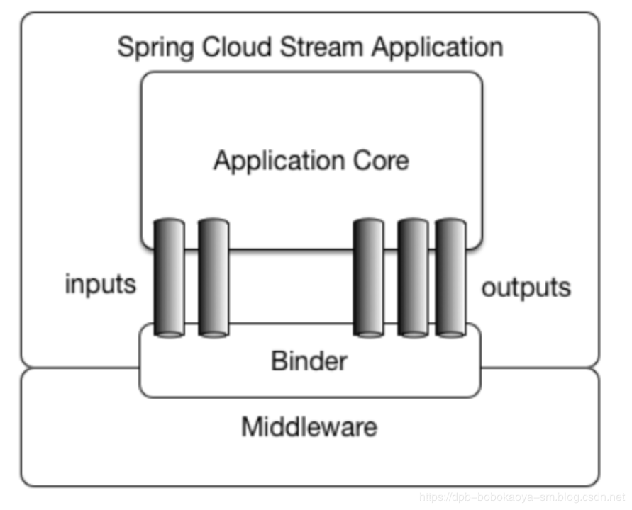
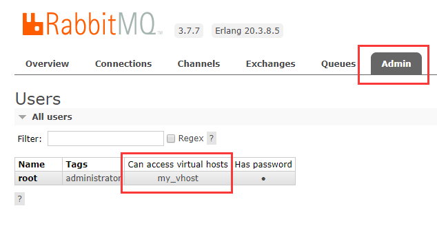
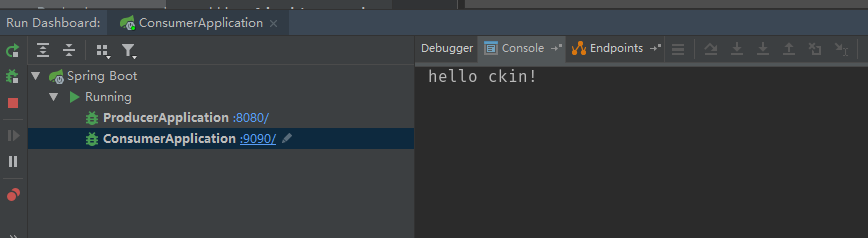
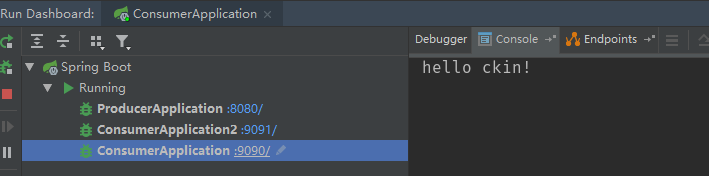
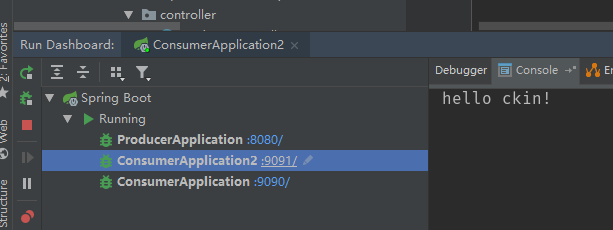

## Spring Cloud Stream

​		官方定义Spring Cloud Stream是一个构建**消息驱动**微服务的框架。应用程序通过**inputs**或者**outputs**来与Spring Cloud Stream中**binder**交互，通过我们来配置binding，而Spring Cloud Stream的binder负责与消息中间件交互。所以，我们只需要搞清楚如何与Spring Cloud Stream交互就可以方便使用消息驱动的方式。它通过使用Spring Integration来连接消息中间件以实现消息事件驱动。Spring Cloud Stream为一些供应商的消息中间件产品提供了个性化的自动化配置实现，引用了**发布-订阅、消费组、分区**的三个概念。目前支持市场上主流的多个消息中间件。

### 发布/订阅

​		简单的讲就是一种生产者、消费者模式。发布者是生产，将输出发布到数据中心，订阅者是消费者，订阅自己感兴趣的数据。当有数据到达数据中心，就把数据发送给对应的订阅者。

### 消费组

​		直观的理解就是一群消费者一起处理消息。需要注意的是：每个发动到消费组的数据，仅有消费组中的一个消费者处理。

### 分区

​		类比于消费组，分区是将数据分区。例如，某个应用有多个实例，都绑定到同一个数据中心，也就是不同实例都将数据发布到同一个数据中心。分区就是将数据中心的数据再细分成不同的区。为什么需要分区？因为即使是同一个应用，不同实例发布的数据类型可能不同，也希望这些数据由不同的消费者处理。这就需要，消费者可以仅订阅一个数据中心的部分数据，这就需要分区这个东西了。

## Stream解决了什么问题

​		Stream解决了开发人员无感知地使用消息中间件的问题，因为Stream对消息中间件的进一步封装，可以做到代码层面对中间件的无感知，甚至于动态的切换中间件（rabbitMQ切换为Kafka），使得微服务开发的高度解耦，服务可以关注更多自己的业务流程。结构图如下：



| 组成            | 说明                                                         |
| --------------- | ------------------------------------------------------------ |
| Middleware      | 中间件，支持市场上多种主流的MQ中间件                         |
| Binder          | Binder是应用与消息中间件之间的封装。通过Binder可以很方便地连接中间件，可以动态地改变消息类型（对应于Kafka的topic，RabbitMQ的exchange），这些都可以通过配置文件来实现 |
| @Input          | 注解标识输入通道，通过该输入通道接收到的信息进入应用程序     |
| @Output         | 注解标识输出通道，发布的消息将通过该通道离开应用程序         |
| @StreamListener | 监听队列，用于消费者队列的消息接收                           |
| @EnableBinding  | 指信道channel和exchange绑定在一起                            |

## 消息驱动入门案例

​		现在通过一个入门案例来演示通过stream整合RabbitMQ来实现消息的异步通信的效果。首先是先安装部署RabbitMQ，具体方法自行百度。我这边是用docker安装的RabbitMQ，参考的是这篇文章：[Docker 安装部署RabbitMQ](https://www.jianshu.com/p/14ffe0f3db94)。

​		RabbitMQ安装好之后，就开始我们的代码了。首先先创建SpringCloud的一个父工程，然后在父工程下面新建两个服务：

- cloud-stream-producer-rabbitmq：作为一个发布者，将消息推动到RabbitMQ
- cloud-stream-consumer-rabbitmq：消费者消费信息

​        首先是添加依赖，其中最主要的是spring cloud stream的RabbitMQ依赖，还有就是为了使用spring cloud stream，我们还要引入spring cloud依赖，整个pom文件如下：

```xml
<?xml version="1.0" encoding="UTF-8"?>
<project xmlns="http://maven.apache.org/POM/4.0.0" xmlns:xsi="http://www.w3.org/2001/XMLSchema-instance"
         xsi:schemaLocation="http://maven.apache.org/POM/4.0.0 https://maven.apache.org/xsd/maven-4.0.0.xsd">
    <modelVersion>4.0.0</modelVersion>
    <packaging>pom</packaging>
    <modules>
        <module>cloud-stream-producer-rabbitmq</module>
        <module>cloud-stream-consumer-rabbitmq</module>
    </modules>
    <parent>
        <groupId>org.springframework.boot</groupId>
        <artifactId>spring-boot-starter-parent</artifactId>
        <version>2.1.5.RELEASE</version>
        <relativePath/> <!-- lookup parent from repository -->
    </parent>
    <groupId>com.springcloudstream</groupId>
    <artifactId>rabbitmqdemo</artifactId>
    <version>0.0.1-SNAPSHOT</version>
    <name>rabbitmqdemo</name>
    <description>Demo project for Spring Boot</description>

    <properties>
        <java.version>1.8</java.version>
        <spring-cloud.version>Greenwich.SR1</spring-cloud.version>
    </properties>

    <dependencies>
        <dependency>
            <groupId>org.springframework.boot</groupId>
            <artifactId>spring-boot-starter-web</artifactId>
        </dependency>

        <dependency>
            <groupId>org.springframework.cloud</groupId>
            <artifactId>spring-cloud-starter-stream-rabbit</artifactId>
        </dependency>

        <dependency>
            <groupId>org.springframework.cloud</groupId>
            <artifactId>spring-cloud-stream-test-support</artifactId>
            <scope>test</scope>
        </dependency>

    </dependencies>

    <dependencyManagement>
        <dependencies>
            <dependency>
                <groupId>org.springframework.cloud</groupId>
                <artifactId>spring-cloud-dependencies</artifactId>
                <version>${spring-cloud.version}</version>
                <type>pom</type>
                <scope>import</scope>
            </dependency>
        </dependencies>
    </dependencyManagement>

    <build>
        <plugins>
            <plugin>
                <groupId>org.springframework.boot</groupId>
                <artifactId>spring-boot-maven-plugin</artifactId>
            </plugin>
        </plugins>
    </build>

</project>
```

### 创建生产者

​		如前所述，将消息从发布者传递到队列的整个过程是通过通道Channel完成的，因此，我们创建一个HelloBinding接口，其中包含我们自定义的消息信道`greetingChannel`。

```java
public interface HelloBinding {

    @Output("greetingChannel")
    MessageChannel greeting();
}
```

​		因为这个是要发布消息的，所以我们使用`@Output`注解，方法名可以是我们想要的任何名称，当然，我们可以在一个接口中有多个Channel（通道）。

​		现在，我们创建一个Controller，它将消息推动到这个Channel（通道）

```java
@RestController
public class ProducerController {

    private MessageChannel greet;

    public ProducerController(HelloBinding binding) {
        greet = binding.greeting();
    }

    @GetMapping("/greet/{name}")
    public void publish(@PathVariable String name) {
        String greeting = "hello " + name + "!";
        Message<String> msg = MessageBuilder.withPayload(greeting).build();
        this.greet.send(msg);
    }
}
```

​		上面我们创建了一个`ProducerController`类，它有一个MessageChannel类型的属性，这是我们通过我们前面声明的方法在构造函数中初始化的。然后，我们有一个简单的Restful接口， 它接收`PathVariable`的`name`，并使用`MessageBuilder`创建一个`String`类型的消息。最后，我们使用`MessageChannel`上的`.send()`方法来发布消息。 

​		 现在,我们将在的主类中添加`@EnableBinding`注解，传入`HelloBinding`告诉`Spring`加载。 

```java
@EnableBinding(HelloBinding.class)
@SpringBootApplication
public class ProducerApplication {

    public static void main(String[] args) {
        SpringApplication.run(ProducerApplication.class, args);
    }
}
```

​		最后，我们必须告诉Spring如何连接到RabbitMQ，并将`greetingChannel`连接到一可用的消费这。而这些都是在`application.properties`配置文件中定义的。

```properties
spring.rabbitmq.addresses=47.105.176.129
spring.rabbitmq.username=root
spring.rabbitmq.password=xxx
spring.rabbitmq.port=5672
spring.rabbitmq.virtual-host=my_vhost
spring.rabbitmq.publisher-confirms=true
spring.cloud.stream.bindings.greetingChannel.destination=greetings

server.port=8080
```

​		其中，`spring.cloud.stream.bindings.greetingChannel.destination`的意思是`greetingChannel`这个通道的目的地，类似于Kafka的Topic和RabbitMQ的队列的概念 。后面的消费者也是通过这个去配置消费者去相同的Channel中取数据。另外一个配置`spring.rabbitmq.virtual-host`，是配置当前用户的权限，这个我们可以通过RabbitMQ的管理界面去确定这个配置的内容：



### 创建消费者

​		现在，我们需要监听之前创建的通道`greetingChannel`。让我们创建一个绑定，为了区分，消费者的Channel我们命名为`helloChannel`。

```java
public interface HelloBinding {

    String GERRTING = "helloChannel";

    @Input(GERRTING)
    SubscribableChannel greeting();
}
```

​		与生产者绑定的两个非常明显的区别。因为我们是要消费信息，所以我们使用`SubscribableChannel`和`@Input`标识它为消费者。消息推送将被推送到这里。

​		现在，我们创建处理数据的方法：

```java
@EnableBinding(HelloBinding.class)
public class HelloListener {

    @StreamListener(target = HelloBinding.GERRTING)
    public void processHelloChannelGreeting(String msg) {
        System.out.println(msg);
    }
}
```

​		在这里，我们创建一个`HelloListener`类，在`processHelloChannelGreeting`方法上添加`@StreamListener`注解，这个方法需要一个字符串作为参数。我们还在类添加`@EnableBinding`启用了`HelloBinding`。

​		注意，我们在这里使用`@EnableBinding`，而不是主类，我们的主类，其实是没有任何修改的：

```java
@SpringBootApplication
public class ConsumerApplication {
    public static void main(String[] args) {
        SpringApplication.run(ConsumerApplication.class, args);
    }
}
```

​		最后，我们修改消费者的配置文件：

```properties
spring.rabbitmq.addresses=47.105.176.129
spring.rabbitmq.username=root
spring.rabbitmq.password=xxx
spring.rabbitmq.port=5672
spring.rabbitmq.virtual-host=my_vhost
spring.rabbitmq.publisher-confirms=true
spring.cloud.stream.bindings.helloChannel.destination=greetings

server.port=9090
```

​		其中，`spring.cloud.stream.bindings.helloChannel.destination`的意思是helloChannel这个通道的目的地是`greetings`，这个跟生产者是一样的，从而让消费者指向了跟生产者一样的目的地。

### 测试

​		我们同时启动生产者和消费者，通过浏览器或postman访问` http://localhost:8080/greet/ckin`来生产消息，可以在打印台中看到看到消息内容：



​		现在我们启动另一个消费者服务。端口号为9091，当我们点击生产者的REST端点生产消息时，我们看到两个消费者都收到了消息：





​		如果我们只想让一个消费者消费一条消息的话，我们可以在`application.properties`中创建一个消费者组。消费者的文件如下：

```properties
spring.cloud.stream.bindings.greetingChannel.group = greetings-group
```

​		相关代码已上传到[github](https://github.com/GD-CKING/demo/tree/master/springcloudstreamdemo)，需要的可以去下载。

## 参考资料

[Spring Cloud Stream入门介绍](https://juejin.im/post/5d15dd296fb9a07eff009be6)

[消息驱动式微服务：Spring Cloud Stream & RabbitMQ](https://juejin.im/post/5d2201346fb9a07ee4638512)

