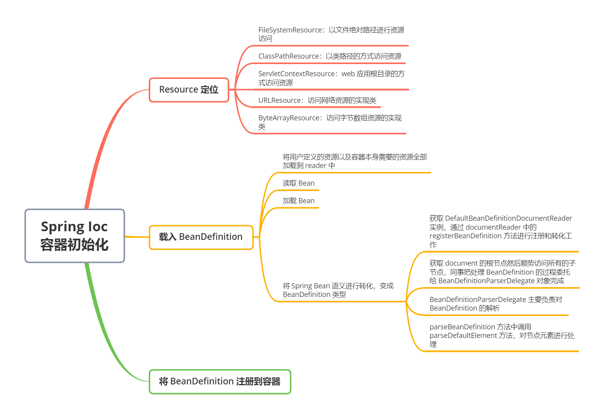
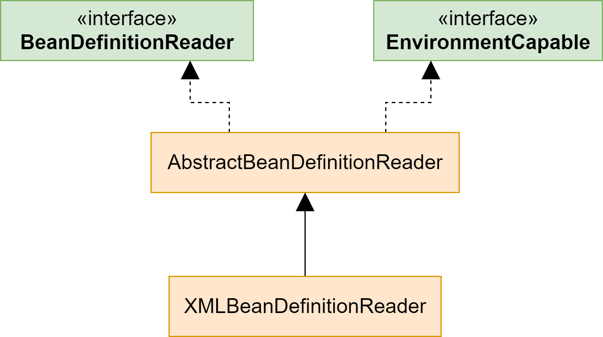

## 思维导图




## Ioc 是如何工作的

如下代码所示，通过 ApplicationContext 创建 Spring 容器，该容器会读取配置文件 `/beans.xml`，并统一管理由该文件中定义好的 bean 实例对象，如果要获取某个 bean 实例，使用 `getBean` 方法就行。假设将 User 配置在 `beans.xml` 文件中，之后不需要使用 new User() 的方式创建实例，而是通过 ApplicationContext 容器来获取 User 的实例


```java
ApplicationContext appContext = new ClassPathXmlApplicationContext("/beans.xml");
User p = (User) appContext.getBean("user");
```


下面就来看一下创建 IoC 容器经历的几个阶段：Resource 定位、载入 BeanDefinition、将 BeanDefinition 注册到容器


## Resource 定位

Resource 是 Spring 用于封装 I/O 操作的接口。在创建 Spring 容器时，回去访问 XML 配置文件，还可以通过文件类型、二进制流、URL 等方式访问资源。这些都可以理解为 Resource


- **FileSystemResource**：以文件绝对路径进行资源访问
- **ClassPathResource**：以类路径的方式访问资源
- **ServletContextResource**：web 应用根目录的方式访问资源
- **URLResource**：访问网络资源的实现类
- **ByteArrayResource**：访问字节数组资源的实现类


那么这些类型在 Spring 中时如何访问的呢？Spring 提供了 ResourceLoader 接口用于实现不同的 Resource 加载策略，该接口的实例对象中可以获取一个 resource 对象。如下所示，在 ResourceLoader 接口中只定义了两个方法：


```java
public interface ResourceLoader {
	// 通过提供的资源 location 参数获取 Resource 实例
    Resource getResource(String location);

	// 获取 ClassLoader，通过 ClassLoader 可将资源载入 JVM
    @Nullable
    ClassLoader getClassLoader();
}
```


注意，ApplicationContext 的所有实现类都实现 ResourceLoader 接口，因此可以直接调用 getResource（参数）获取 Resource 对象。不同的 ApplicationContext 实现类使用 getResource 方法取得的资源类型不同。例如：


1. FileSystemXMLApplicationContext.getResource 获取的就是 FileSystemResource 实例
2. ClassPathXMLApplicationContext.getResource 获取的就是 ClassPathResource 实例
3. XmlWebApplicationContext.getResource 获取的就是 ClassPathResource 实例


另外像不需要通过 xml 直接使用注解 `@Configuration` 方式加载资源的 AnnotationConfigApplicationContext 等等


在资源定位过程完成以后，就为资源文件中的 bean 的载入创造了 I/O 操作的条件，如何读取资源中的数据将会在下一步介绍的 BeanDefinition 的载入过程中描述


## 载入 BeanDefinition

BeanDefinition 是一个数据结构，BeanDefinition 的根据 resource 对象中的 bean 来生成的。bean 会在 Spring IoC 容器内部以 BeanDefinition 的形式存在，**IoC 容器对 bean 的管理和依赖注入的实现是通过操作 BeanDefinition 来完成的。BeanDefinition 就是 Bean 在 IoC 容器中的存在形式**


由于 Spring 的配置文件主要是 XML 格式，一般而言会使用到 AbstractXMLApplicationContext 类进行文件的读取。如下所示，该类定义了一个名为 `loadBeanDefitions(DefaultListableBeanFactory beanFactory)`  的方法用于获取 BeanDefinition


```java
// 该方法属于 AbstractXMLApplicationContext 类
protected void loadBeanDefinitions(DefaultListableBeanFactory beanFactory) throws BeansException, IOException {
    XmlBeanDefinitionReader beanDefinitionReader = new XmlBeanDefinitionReader(beanFactory);
    beanDefinitionReader.setEnvironment(this.getEnvironment());
    beanDefinitionReader.setResourceLoader(this);
    beanDefinitionReader.setEntityResolver(new ResourceEntityResolver(this));
    this.initBeanDefinitionReader(beanDefinitionReader);
    // 用于获取 BeanDefinition
    this.loadBeanDefinitions(beanDefinitionReader);
}
```


接下来以 XMLBeanDefinitionReader 对象载入 BeanDefinition 为例。如下代码，调用 loadBeanDefinitions 方法传入对象，分别加载 configResources（定位到的资源位置）和 configLocation（本地配置文件的位置），也就是**将用户定义的资源以及容器本身需要的资源全部加载到 reader 中**


```java
// 该方法属于 AbstractXMLApplicationContext 类
protected void loadBeanDefinitions(XmlBeanDefinitionReader reader) throws BeansException, IOException {
    // 获取所有定位到的 resource 资源位置（用户定义）
    Resource[] configResources = this.getConfigResources();
    if (configResources != null) {
        // 载入 resources
        reader.loadBeanDefinitions(configResources);
    }

    // 获取所有本地配置文件的位置（容易自身）
    String[] configLocations = this.getConfigLocations();
    if (configLocations != null) {
        // 载入 resources
        reader.loadBeanDefinitions(configLocations);
    }

}
```


顺着看 reader 中的 loadBeanDefinitions 方法，该方法 override 了 AbstractBeanDefinitionReader 类，父接口的 BeanDefinitionReader。方法体中，将所有资源全部加载，并且交给 AbstractBeanDefinitionReader 的实现子类处理这些 resource


```java
// 该方法属于 AbstractBeanDefinitionReader 类，父接口 BeanDefinitionReader
public int loadBeanDefinitions(Resource... resources) throws BeanDefinitionStoreException {
    Assert.notNull(resources, "Resource array must not be null");
    int count = 0;
    Resource[] var3 = resources;
    int var4 = resources.length;

    for(int var5 = 0; var5 < var4; ++var5) {
        Resource resource = var3[var5];
        // 将所有资源全部加载，交给 AbstractBeanDefinitionReader 的实现子类处理这些 resource
        count += this.loadBeanDefinitions((Resource)resource);
    }

    return count;
}
```


如下所示，BeanDefinitionReader 接口定义了 int loadBeanDefinitions(Resource resource) 方法


```java
int loadBeanDefinitions(Resource var1) throws BeanDefinitionStoreException;

int loadBeanDefinitions(Resource... var1) throws BeanDefinitionStoreException;
```


此时回到 XMLBeanDefinitionReader 上来，它主要针对 XML 方式的 Bean 进行读取，XMLBeanDefinitionReader 主要是实现了 AbstractBeanDefinitionReader 抽象类，而该类继承于 BeanDefinitionReader，主要实现的方法也是来自于 BeanDefinitionReader 的 loadBeanDefinitions(Resource) 方法





如下代码所示，读取 Bean 之后就是加载 Bean 的过程，XMLBeanDefinitionReader 中的 `doLoadBeanDefinitions` 方法主要来处理加载 Bean 的工作。首先对资源进行验证，然后从资源对象中加载了 Document 对象，使用了 documentLoader 中的 loadDocument 方法，然后跟上 registerBeanDefinitions 对文档对应的 resource 进行注册，也就是将 XML 文件中的 Bean 转换成容器中的 BeanDefinition


```java
protected int doLoadBeanDefinitions(InputSource inputSource, Resource resource) throws BeanDefinitionStoreException {
    try {
        // 从资源对象中加载 Document 对象。大致过程为：将 resource 资源文件的内容读入到 document 中
        // DocumentLoader 在容器读取 XML 文件过程中有着举足轻重的作用
        // XMLBeanDefinitionReader 实例化会创建一个 DefaultDocumentLoader 型的私有属性，继而调用 loadDocument 方法
        // inputSource -- 要加载的文档的输入源
        Document doc = this.doLoadDocument(inputSource, resource);
        
        // 将 document 文件的 bean 封装成 BeanDefinition，并注册到容器
        int count = this.registerBeanDefinitions(doc, resource);
        if (this.logger.isDebugEnabled()) {
            this.logger.debug("Loaded " + count + " bean definitions from " + resource);
        }

        return count;
    } catch ...(略) {
}
```


接着就是 `registerBeanDefinitions`方法了，**它主要对 Spring Bean 语义进行转化，变成 BeanDefinition 类型**。首先获取 DefaultBeanDefinitionDocumentReader 实例，然后获取容器中的 bean 数量，通过 documentReader 中的 registerBeanDefinitions 方法进行注册和转化工作


```java
// 属于 XMLBeanDefinitionReader 类
public int registerBeanDefinitions(Document doc, Resource resource) throws BeanDefinitionStoreException {
    // 获取到 DefaultBeanDefinitionDocumentReader 实例
    BeanDefinitionDocumentReader documentReader = this.createBeanDefinitionDocumentReader();
    // 获取容器中 bean 的数量
    int countBefore = this.getRegistry().getBeanDefinitionCount();
    documentReader.registerBeanDefinitions(doc, this.createReaderContext(resource));
    return this.getRegistry().getBeanDefinitionCount() - countBefore;
}
```


顺着上面的思路往下，在 DefaultBeanDefinitionDocumentReader 中的 registerBeanDefinitions 方法如下代码所示，其中获取 document 的根节点然后顺势访问所有的子节点。**同时把处理 BeanDefinition 的过程委托给 BeanDefinitionParserDelegate 对象来完成**


```java
protected void doRegisterBeanDefinitions(Element root) {
    BeanDefinitionParserDelegate parent = this.delegate;
    // 处理 BeanDefinition 的过程委托给 BeanDefinitionParserDelegate 实例对象来完成
    this.delegate = this.createDelegate(this.getReaderContext(), root, parent);
    if (this.delegate.isDefaultNamespace(root)) {
        String profileSpec = root.getAttribute("profile");
        if (StringUtils.hasText(profileSpec)) {
            String[] specifiedProfiles = StringUtils.tokenizeToStringArray(profileSpec, ",; ");
            if (!this.getReaderContext().getEnvironment().acceptsProfiles(specifiedProfiles)) {
                if (this.logger.isDebugEnabled()) {
                    this.logger.debug("Skipped XML bean definition file due to specified profiles [" + profileSpec + "] not matching: " + this.getReaderContext().getResource());
                }

                return;
            }
        }
    }

    this.preProcessXml(root);
    // 核心方法，代理
    this.parseBeanDefinitions(root, this.delegate);
    this.postProcessXml(root);
    this.delegate = parent;
}
```


**BeanDefinitionParserDelegate 类主要负责 BeanDefinition 的解析**。BeanDefinitionParserDelegate 代理类会完成对符合 Spring Bean 语义规则的处理，比如 <bean></bean>、<import></import>、<alias></alias> 等的监测。如下，就是 BeanDefinitionParserDelegate 代理类中的 parseBeanDefinitions 方法，用来对 XML 文件中的节点进行解析。通过遍历 import 标签节点调用 importBeanDefinitionResource 方法对其进行处理，然后接着对 Bean 节点调用 processBeanDefinition 对其处理


```java
protected void parseBeanDefinitions(Element root, BeanDefinitionParserDelegate delegate) {
    if (delegate.isDefaultNamespace(root)) {
        NodeList nl = root.getChildNodes();
		// 遍历所有节点，做对应解析工作
        // 如遍历到<import>标签节点就调用 importBeanDefinitionResource(ele)方法对其处理
        // 遍历到 <bean> 标签就调用 processBeanDefinition(ele, delegate) 方法对应处理
        for(int i = 0; i < nl.getLength(); ++i) {
            Node node = nl.item(i);
            if (node instanceof Element) {
                Element ele = (Element)node;
                if (delegate.isDefaultNamespace(ele)) {
                    this.parseDefaultElement(ele, delegate);
                } else {
                    // 对应用户自定义节点处理方法
                    delegate.parseCustomElement(ele);
                }
            }
        }
    } else {
        delegate.parseCustomElement(root);
    }

}
```


再看 parseBeanDefinitions 方法中调用的 parseDefaultElement 方法，顾名思义它是对节点元素进行处理的，从方法体的语句可以看出它对 import 标签、alias 便签、bean 标签进行了处理。每类便签对应不同的 BeanDefinition 的处理方法


```java
private void parseDefaultElement(Element ele, BeanDefinitionParserDelegate delegate) {
    // 解析 <import> 标签
    if (delegate.nodeNameEquals(ele, "import")) {
        this.importBeanDefinitionResource(ele);
    // 解析 <alias> 标签
    } else if (delegate.nodeNameEquals(ele, "alias")) {
        this.processAliasRegistration(ele);
    // 解析 <bean> 标签
    } else if (delegate.nodeNameEquals(ele, "bean")) {
        this.processBeanDefinition(ele, delegate);
    // 解析 <beans> 标签
    } else if (delegate.nodeNameEquals(ele, "beans")) {
        this.doRegisterBeanDefinitions(ele);
    }

}
```


在 `parseDefaultElement` 调用的众多方法中，我们选取 processBeanDefinition 方法给大家讲解。如下代码所示，该方法是用来处理 Bean 的。首先通过 delegate 的 parseBeanDefinitionElement 方法传入节点信息，获取该 Bean 对应的 name 和 alias。然后通过 BeanDefinitionReaderUtils 中的 registerBeanDefinition 方法对其进行容器注册，也就是将 Bean 实例注册到容器中进行管理。最后，发送注册事件


```java
protected void processBeanDefinition(Element ele, BeanDefinitionParserDelegate delegate) {
    // 该对象持有 BeanDefinition 的 name 和 alias，可以使用该对象完成 BeanDefinition 向容器的注册
    BeanDefinitionHolder bdHolder = delegate.parseBeanDefinitionElement(ele);
    if (bdHolder != null) {
        bdHolder = delegate.decorateBeanDefinitionIfRequired(ele, bdHolder);

        try {
            // 注册最终被修饰的 bean 实例，下文注册 BeanDefinition 到容器会讲解该方法
            BeanDefinitionReaderUtils.registerBeanDefinition(bdHolder, this.getReaderContext().getRegistry());
        } catch (BeanDefinitionStoreException var5) {
            this.getReaderContext().error("Failed to register bean definition with name '" + bdHolder.getBeanName() + "'", ele, var5);
        }

        this.getReaderContext().fireComponentRegistered(new BeanComponentDefinition(bdHolder));
    }

}
```


至此完成 BeanDefinition 的加载工作


## 将 BeanDefinition 注册到容器

在加载了 Bean 之后，就需要将其注册到容器中用心管理。如下代码，Bean 会被解析成 BeanDefinition 并与 BeanName、Alias 一同封装到 BeanDefinitionHolder 类中，之后 beanFactory.registerBeanDefinition(beanName, bdHolder.getBeanDefinition())，注册到 DefaultListableBeanFactory.BeanDefinitionMap 中。如果客户端需要获取 Bean 对象，Spring 容器会根据注册的 BeanDefinition 信息进行实例化


```java
public static void registerBeanDefinition(BeanDefinitionHolder definitionHolder, BeanDefinitionRegistry registry) throws BeanDefinitionStoreException {
    String beanName = definitionHolder.getBeanName();
    // 注册 BeanDefinition
    registry.registerBeanDefinition(beanName, definitionHolder.getBeanDefinition());
    
    // 如果有别名的话也注册进去
    String[] aliases = definitionHolder.getAliases();
    if (aliases != null) {
        String[] var4 = aliases;
        int var5 = aliases.length;

        for(int var6 = 0; var6 < var5; ++var6) {
            String alias = var4[var6];
            registry.registerAlias(beanName, alias);
        }
    }

}
```


DefaultListableBeanFactory 实现了上面调用 BeanDefaultRegistry 接口的 registerBeanDefinition(beanName, bdHolder.getBeanDefinition()) 方法。如下所示，这一部分的逻辑是向 DefaultListableBeanFactory 对象的 BeanDefinitionMap 中存放 beanDefinition，也就是说 BeanDefinition 都放在 BeanDefinitionMap 中进行管理。当初始化容器进行 bean 初始化时，在 bean 的生命周期分析里必然会在这个 beanDefinitionMap 中获取 beanDefinition 实例


```java
public void registerBeanDefinition(String beanName, BeanDefinition beanDefinition) throws BeanDefinitionStoreException {
    Assert.hasText(beanName, "Bean name must not be empty");
    Assert.notNull(beanDefinition, "BeanDefinition must not be null");
    if (beanDefinition instanceof AbstractBeanDefinition) {
        try {
            ((AbstractBeanDefinition)beanDefinition).validate();
        } catch (BeanDefinitionValidationException var8) {
            throw new BeanDefinitionStoreException(beanDefinition.getResourceDescription(), beanName, "Validation of bean definition failed", var8);
        }
    }

    // beanDefinitionMap 是个 ConcurrentHashMap 类型数据，用于存放 beanDefinition，它的 key 值是 beanName
    BeanDefinition existingDefinition = (BeanDefinition)this.beanDefinitionMap.get(beanName);
    if (existingDefinition != null) {
        if (!this.isAllowBeanDefinitionOverriding()) {
            throw new BeanDefinitionOverrideException(beanName, beanDefinition, existingDefinition);
        }

        if (existingDefinition.getRole() < beanDefinition.getRole()) {
            if (this.logger.isInfoEnabled()) {
                this.logger.info("Overriding user-defined bean definition for bean '" + beanName + "' with a framework-generated bean definition: replacing [" + existingDefinition + "] with [" + beanDefinition + "]");
            }
        } else if (!beanDefinition.equals(existingDefinition)) {
            if (this.logger.isDebugEnabled()) {
                this.logger.debug("Overriding bean definition for bean '" + beanName + "' with a different definition: replacing [" + existingDefinition + "] with [" + beanDefinition + "]");
            }
        } else if (this.logger.isTraceEnabled()) {
            this.logger.trace("Overriding bean definition for bean '" + beanName + "' with an equivalent definition: replacing [" + existingDefinition + "] with [" + beanDefinition + "]");
        }

        // 将获取到的 BeanDefinition 放入 Map 中，容器操作使用 bean 时通过这个 HashMap 找到具体的 BeanDefinition
        this.beanDefinitionMap.put(beanName, beanDefinition);
    } 

}
```