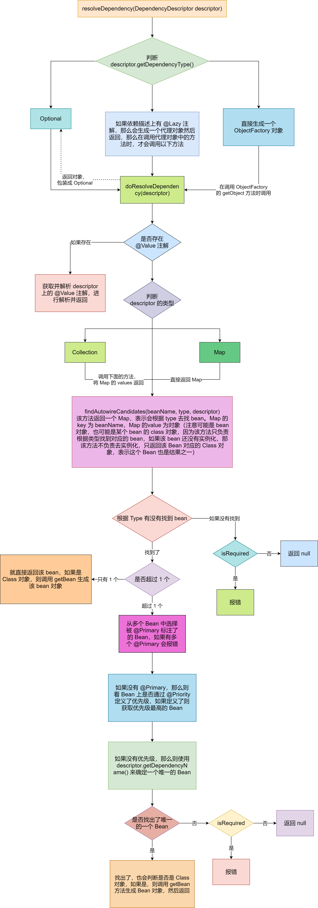

## Spring 的依赖注入方式


Spring 中主要有两种注入方式：


1. 手动注入
2. 自动注入


### 手动注入


在 XML 中定义 Bean 时，就是手动注入，因为是**程序员手动给某个属性指定了值**，如下：


```xml
<bean name="orderService" class="com.zhouyu.service.OrderService"/>

<bean name="userService" class="com.zhouyu.service.UserService">
   <property name="orderService" ref="orderService"/>
</bean>
```


上面是通过 **set 方法**进行注入的


```xml
<bean name="orderService" class="com.zhouyu.service.OrderService"/>

<bean name="userService" class="com.zhouyu.service.UserService">
   <constructor-arg index="0" ref="orderService"/>
</bean>
```


上面这种底层是通过**构造方法**进行注入


所以手动注入的底层也就是分为两种：


1. set 方法注入
2. 构造方法注入


### 自动注入


自动注入又分为两种：


1. XML 的 autowire 自动注入
2. @Autowired 注解的自动注入


#### XML 的 autowire 自动注入


在 XML 中，我们可以定义一个 Bean 时去指定这个 Bean 的自动注入模式：


1. byType
2. byName
3. constructor
4. default
5. no


比如：


```xml
<bean name="userService" class="com.zhouyu.service.UserService" autowire="byType">
</bean>
```


这么写，表示 Spring 会自动的给 userService 中所有属性自动赋值（**不需要**这个属性上有 @Autowired 注解，但需要这个属性有对应的 **set 方法**）


在创建 Bean 的过程中，在填充属性时，Spring 会去解析当前类，把当前类的所有方法都解析出来，Spring 会去解析每个方法得到对应的 PropertyDescriptor 对象，PropertyDescriptor 中有几个属性


1. **name：这个 name 并不是方法的名字，而是哪方法名字进行处理后的名字**
   - **如果方法名字以 "get" 开头，比如 "getXXX"，那么 name = XXX**
   - **如果方法名字以 "is" 开头，比如 "isXXX"，那么 name = XXX**
   - **如果方法名字以 "set" 开头，比如 "setXXX"，那么 name = XXX**
2. **readMethodRef：表示 get 方法的 Method 对象的引用**
3. **readMethodName：表示 get 方法的名字**
4. **writeMethodRef：表示 set 方法的 Method 对象的引用**
5. **writeMethodName：表示 set 方法的名字**
6. **propertyTypeRef：如果有 get 方法，那么对应的就是返回值的类型；如果是 set 方法，那么对应的就是 set 方法中唯一参数的类型** 


**get 方法的定义是**：方法参数个数为 0 个，并且方法名字以 "get" 开头或者名字以 "is" 开头并且方法的返回类型为 boolean


**set 方法的定义是**：方法参数个数为 1 个，并且方法名字以 "set" 开头并且方法返回类型为 void


所以，Spring 通过 byName 的自动填充属性时流程是：


1. 找到所有 set 方法所对应的 XXX 部分的名字
2. 根据 XXX 部分的名字去获取 bean


而 Spring 通过 byType 的自动填充属性时流程是：


1. 获取到 set 方法中的唯一参数的类型参数，并且根据该类型去容器中获取 bean
2. 如果找到多个，会报错


constructor 表示通过构造方法注入。如果是 constructor，那么久流可以不写 set 方法，当某个 bean 是通过构造方法注入时，Spring 利用构造方法的参数信息从 Spring 容器中去找 bean，找到 bean 之后作为参数传给构造方法，从而实例化得到一个 bean 对象，并完成属性赋值（属性赋值的代码得程序员来写）


另外两个：


1. no，表示关闭 autowire
2. default，表示默认值。我们演示的是某个 bean 的 autowire，但是也可以直接在 `<beans>` 标签中设置 autowire。如果设置了，那么 `<bean>` 标签中设置的 autowire 如果为 default，那么则会用 `<beans>` 标签中设置的 autowire


@Autowired 注解则相当于 XML 中的 autowire 属性的注解方式的替代。它提供了与 autowire 相同的功能，但是拥有更细粒度的控制和更广泛的适用性


XML 中的 autowire 控制的是整个 bean 的所有属性，而 @Autowired 注解是直接写在某个属性、某个 set 方法、某个构造方法。同时，@Autowired 注解还可以控制，哪些属性想被自动注入，哪些属性不想，这也是细粒度的控制


但是 @Autowired 无法区分 byType 和 byName，@Autowired 是先 byType，如果找到多个则 byName


所以 XML 的自动注入底层其实也就是：


1. set 方法注入
2. 构造方法注入


## @Autowired 注解的自动注入


@Autowired 注解，是 byType 和 byName 的结合。@Autowired 注解可以写在：


1. 属性上：先根据**属性类型**去找 Bean，如果找到多个再根据**属性名**确定一个
2. 构造方法上：先根据方法**参数类型**去找 Bean，如果找到多个再根据**参数名**确定一个
3. set 方法上：先根据方法**参数类型**去找 Bean，如果找到多个再根据**参数名**确定一个


### 寻找注入点


在创建一个 Bean 的过程中，Spring 会利用 AutowiredAnnotationBeanPostProcessor 的 `postProcessMergeBeanDefinition()` 找出注入点并缓存，找注入点的流程为：


1. 遍历当前类的所有属性字段 Field
2. 查看字段上是否存在 @Autowired、@Value、@Inject 中的其中任意一个，存在则认为该字段是一个注入点
3. 如果字段是 static，则不进行注入
4. 获取 @Autowired 的 required 属性的值
5. 将字段信息构造成一个 **AutowiredFieldElement 对象**，作为一个**注入点对象**添加到 currElements 集合中
6. 遍历当前类中所有 Method
7. 判断当前 Method 是否是**桥接方法**，如果是找到原方法
8. 查看方法上是否存在 @Autowired、@Value、@Inject 中的其中任意一个，存在则认为该字段是一个注入点
9. 如果方法是 static，则不进行注入
10. 获取 @Autowired 的 required 属性的值
11. 将方法信息构造成一个 **AutowiredMethodElement 对象**，作为一个**注入点对象**添加到 currElements 集合中
12. 遍历完当前类的字段和方法后，将**遍历父类**，直到没有父类
13. 最后将 currElements 集合封装成一个 InjectMetadata 对象，作为当前 Bean 对应的注入点集合对象，并缓存


### static 字段或方法为什么不支持


```java
@Component
@Scope("prototype")
public class OrderService {
}
```


```java
@Component
@Scope("prototype")
public class UserService {

   @Autowired
   private static OrderService orderService;

   public void test() {
      System.out.println("test123");
   }
}
```


如上代码，UserService 和 OrderService 都是原型 Bean，假设 Spring 支持 static 字段进行自动注入，那么现在调用两次


```java
UserService userService1 = (UserService) applicationContext.getBean("userService");
UserService userService2 = (UserService) applicationContext.getBean("userService");
```


此时 userService1 的 orderService 值还是它自己注入的值吗？不是。一旦 userService2 创建好了之后，static orderService 字段的值就发生了修改，从而出现 bug


### 桥接方法


```java
public interface UserInterface <T>{

   void setOrderService(T t);
}
```


```java
@Component
public class UserService implements UserInterface<OrderService> {

   private OrderService orderService;

   public void test() {
      System.out.println("test123");
   }

   @Override
   @Autowired
   public void setOrderService(OrderService orderService) {
      this.orderService = orderService;
   }
}
```


UserService 对应的字节码为：


```java
// class version 52.0 (52)
// access flags 0x21
// signature Ljava/lang/Object;Lcom/test/service/UserInterface<Lcom/test/service/OrderService;>;
// declaration: com/test/service/UserService implements com.test.service.UserInterface<com.test.service.OrderService>
public class com/test/service/UserService implements com/test/service/UserInterface {

  // compiled from: UserService.java

  @Lorg/springframework/stereotype/Component;()

  // access flags 0x2
  private Lcom/test/service/OrderService; orderService

  // access flags 0x1
  public <init>()V
   L0
    LINENUMBER 11 L0
    ALOAD 0
    INVOKESPECIAL java/lang/Object.<init> ()V
    RETURN
   L1
    LOCALVARIABLE this Lcom/test/service/UserService; L0 L1 0
    MAXSTACK = 1
    MAXLOCALS = 1

  // access flags 0x1
  public test()V
   L0
    LINENUMBER 16 L0
    GETSTATIC java/lang/System.out : Ljava/io/PrintStream;
    LDC "test123"
    INVOKEVIRTUAL java/io/PrintStream.println (Ljava/lang/String;)V
   L1
    LINENUMBER 17 L1
    RETURN
   L2
    LOCALVARIABLE this Lcom/test/service/UserService; L0 L2 0
    MAXSTACK = 2
    MAXLOCALS = 1

  // access flags 0x1
  public setOrderService(Lcom/test/service/OrderService;)V
  @Lorg/springframework/beans/factory/annotation/Autowired;()
   L0
    LINENUMBER 22 L0
    ALOAD 0
    ALOAD 1
    PUTFIELD com/test/service/UserService.orderService : Lcom/test/service/OrderService;
   L1
    LINENUMBER 23 L1
    RETURN
   L2
    LOCALVARIABLE this Lcom/test/service/UserService; L0 L2 0
    LOCALVARIABLE orderService Lcom/test/service/OrderService; L0 L2 1
    MAXSTACK = 2
    MAXLOCALS = 2

  // access flags 0x1041
  public synthetic bridge setOrderService(Ljava/lang/Object;)V
  @Lorg/springframework/beans/factory/annotation/Autowired;()
   L0
    LINENUMBER 10 L0
    ALOAD 0
    ALOAD 1
    CHECKCAST com/test/service/OrderService
    INVOKEVIRTUAL com/test/service/UserService.setOrderService (Lcom/test/service/OrderService;)V
    RETURN
   L1
    LOCALVARIABLE this Lcom/test/service/UserService; L0 L1 0
    MAXSTACK = 2
    MAXLOCALS = 2
}

```


可以看到在 UserService 的字节码中有两个 setOrderService 方法：


- public setOrderService(Lcom/test/service/OrderService;)V
-  public synthetic bridge setOrderService(Ljava/lang/Object;)V


并且都是存在 @Autowired 注解的。所以在 Spring 中需要处理这种情况，当遍历到桥接方法时，得找到原方法


### 注入点进行注入


Spring 在 AutowiredAnnotationBeanPostProcessor 的 **postProcessProperties()** 方法中，会遍历所找到的注入点依次进行注入


#### 字段注入


1. 遍历所有的 **AutowiredFieldElement 对象**
2. 将对应的字段封装为 **DependencyDescriptor 对象**
3. 调用 BeanFactory 的 resolveDependency() 方法，传入 **DependencyDescriptor 对象**，进行依赖查找，找到当前字段所匹配的 Bean 对象
4. 将 **DependencyDescriptor 对象**和所找到的**结果对象 beanName** 封装成一个 **ShortcutDependencyDescriptor 对象**作为缓存。例如如果当前 Bean 是原型 Bean，那么下次再来创建该 Bean 时，就可以直接拿缓存的结果对象 beanName 去 BeanFactory 中去拿 Bean 对象了，不用再次进行查找了
5. 利用反射将结果对象赋值给字段


#### Set 方法注入


1. 遍历所有的 **AutowiredMethodElement 对象**
2. 遍历将对应的方法的参数，将每个参数都封装成 **MethodParameter 对象**
3. 将 MethodParameter 对象封装为 DependencyDescriptor 对象
4. 调用 BeanFactory 的 resolveDependency() 方法，传入 **DependencyDescriptor 对象**，进行依赖查找，找到当前方法参数所匹配的 Bean 对象
5. 将 **DependencyDescriptor 对象**和所找到的**结果对象 beanName** 封装成一个 **ShortcutDependencyDescriptor 对象**作为缓存。例如如果当前 Bean 是原型 Bean，那么下次再来创建该 Bean 时，就可以直接拿缓存的结果对象 beanName 去 BeanFactory 中去拿 Bean 对象了，不用再次进行查找了
6. 利用反射将找到的所有结果对象传给当前方法，并执行


#### resolveDependency


该方法表示，传入一个依赖描述（DependencyDescriptor），该方法会根据该依赖描述从 BeanFactory 中找出对应的唯一的一个 Bean 对象。具体流程图如下：


