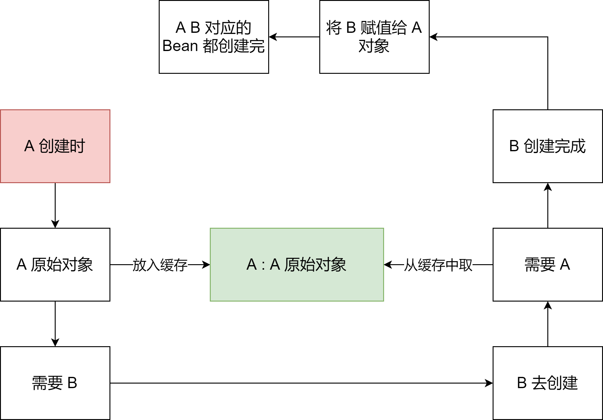
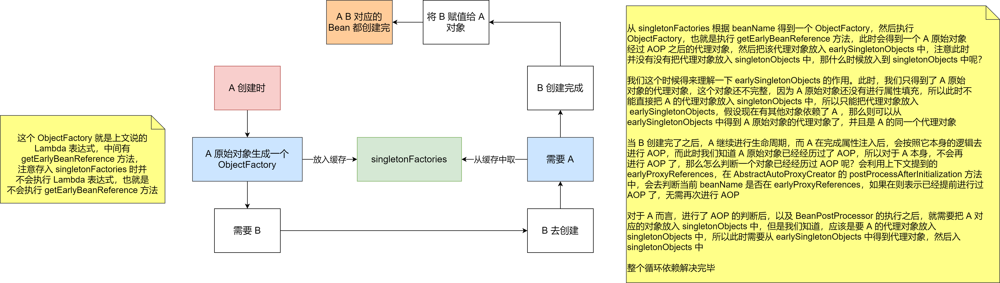

什么是循环依赖，就是 A 对象依赖了 B 对象，B 对象依赖了 A 对象。如下：


```java
// A 依赖了 B
class A {
    public B b;
}
// B 依赖了 A
class B {
    public A a;
}
```


如上，A 类中存在一个 B 类的 b 属性，所以，当 A 类生成了一个原始对象之后，就会去给 b 属性赋值，此时就会根据 b 属性的类型和属性名去 BeanFactory 中去获取  B 类所对应的单例 bean。如果此时 BeanFactory 中存在 B 对应的 Bean，那么直接拿来赋值给 b 属性；如果此时 BeanFactory 中不存在 B 对应的 Bean，则需要生成一个 B 对应的 Bean，然后赋值给 b 属性


如果是第二种情况，如果此时 B 类在 BeanFactory 中还没有生成对应的 Bean，那么就需要去生成，就会经过 B 的 Bean 的生命周期


那么在创建 B 类的 Bean 的过程中，如果 B 类中存在一个 A 类的 a 属性，那么在创建 B 的 Bean 的过程中就需要 A 类对应的 Bean。但是，触发 B 类 Bean 的创建条件是 A 类 Bean 在创建过程中的依赖注入，所以这里就出现了循环依赖。从而导致 A Bean 创建不出来，B Bean 也创建不出来


这个循环依赖的场景。在 Spring 中，通过某些机制帮开发者解决了部分循环依赖的问题，这个机制就是**三级缓存**


## 三级缓存


三级缓存是通用的叫法。一级缓存为：**singletonObjects**；二级缓存为：**earlySingletonObjects**；三级缓存为：**singletonFactories**


1. **singletonObjects** 中缓存的是已经经历了完整生命周期的 bean 对象
2. **earlySingletonObjects** 比 singletonObjects 多了一个 early，表示缓存的是早期的 bean 对象。表示 Bean 的生命周期还没有走完就把这个 Bean 放入了 earlySingletonObjects
3. **singletonFactories** 中缓存的是 ObjectFactory，表示对象工厂，表示用来创建早期 bean 对象的工厂


为什么缓存能解决循环依赖？之所以产生循环依赖，主要是：A 创建时 --> 需要 B --> B 去创建 --> 需要 A，从而产生了循环


那么如何打破这个循环，加个中间人（缓存）





A 的 Bean 在创建过程中，在进行依赖注入之前，先把 A 的原始 Bean 放入缓存（提早暴露，只要放到缓存了，其他 Bean 需要时就可以从缓存中拿了），放入缓存后，再进行依赖注入，此时 A 的 Bean 依赖了 B 的 Bean，如果 B 的 Bean 不存在，则需要创建 B 的 Bean，而创建 B 的 Bean 的过程和 A 一样，也是先创建一个 B 的原始对象，然后把 B 的原始对象暴露出来放入缓存中，然后再对 B 的原始对象依赖注入 A，此时能从缓存中拿到 A 的原始对象（只是原始对象，还不是最终的 Bean），B 的原始对象依赖注入完成了之后，B 的生命周期结束，那么 A 的生命周期也能结束


因为整个过程中，都只有一个 A 原始对象，所以对于 B 而言，就算在属性注入时，注入的是 A 原始对象，也没有关系，因为 A 原始对象在后续的生命周期中在堆中没有发生变化


从上面分析得知，只需要一个缓存就能解决循环依赖了，为什么 Spring 中还需要 **singletonFactories** 呢？


如果 A 的原始对象注入给 B 的属性之后，A 的原始对象进行了 AOP 产生了一个代理对象，此时就会出现，对于 A 而言，它的 Bean 对象其实应该是 AOP 之后的代理对象，而 B 的 a 属性对应的并不是 AOP 之后的代理对象，这就产生了冲突


**B 依赖的 A 和最终的 A 不是同一个对象**


AOP 就是通过一个 BeanPostProcessor 来实现的，这个 BeanPostProcessor 就是 AnnotationAwareAspectJAutoProxyCreator，它的父类是 AbstractAutoProxyCreator，而在 Spring 中利用的要么是 JDK 动态代理，要么 CGLib 的动态代理，所以如果给一个类中的某个方法设置了切面，那么这个类最终就要生成一个代理对象


一般过程就是：A 类 -->  生成一个普通对象 --> 属性注入 --> 基于切面生成一个代理对象 --> 把代理对象放入 singletonObjects 单例池中


而 AOP 可以说是 Spring 中除开 IOC 的另外一大功能，而循环依赖又是属于 IOC 范畴的，所以这两大功能想要并存，Spring 需要特殊处理，就是利用了第三级缓存 **singletonFactories**


首先，singletonFactories 中存的是某个 beanName 对应的 ObjectFactory，在 bean 的生命周期中，生成完原始对象后，就会构造一个 ObjectFactory 存入 singletonFactories 中。这个 ObjectFactory 是一个函数式接口，所以支持 Lambda 表达式：**() -> getEarlyBeanReference(beanName, mbd, bean)**


上面的 Lambda 表达式就是一个 ObjectFactory，执行该 Lambda 表达式就会去执行 getEarlyBeanReference 方法，如下：


```java
protected Object getEarlyBeanReference(String beanName, RootBeanDefinition mbd, Object bean) {
   Object exposedObject = bean;
   if (!mbd.isSynthetic() && hasInstantiationAwareBeanPostProcessors()) {
      for (SmartInstantiationAwareBeanPostProcessor bp : getBeanPostProcessorCache().smartInstantiationAware) {
         exposedObject = bp.getEarlyBeanReference(exposedObject, beanName);
      }
   }
   return exposedObject;
}
```


该方法会去执行 SmartInstantiationAwareBeanPostProcessor 中的 getEarlyBeanReference 方法，而这个接口下的实现类中只有两个类实现了这个方法，一个是 AbstractAutoProxyCreator，一个是 InstantiationAwareBeanPostProcessorAdapter，它的实现如下：


```java
// AbstractAutoProxyCreator
@Override
public Object getEarlyBeanReference(Object bean, String beanName) {
   Object cacheKey = getCacheKey(bean.getClass(), beanName);
   this.earlyProxyReferences.put(cacheKey, bean);
   return wrapIfNecessary(bean, beanName, cacheKey);
}
```


```java
// InstantiationAwareBeanPostProcessorAdapter
default Object getEarlyBeanReference(Object bean, String beanName) throws BeansException {
   return bean;
}
```


在整个 Sprin g中，默认就只有 AbstractAutoProxyCreator 真正意义上实现了 getEarlyBeanReference 方法，而该类就是用来进行 AOP 的。上文提到的 AnnotationAwareAspectJAutoProxyCreator 的父类就 AbstractAutoProxyCreator

那么 getEarlyBeanReference 方法到底在干什么？ 首先得到一个 cachekey，cachekey 就是 beanName。 然后把 beanName 和 bean（这是原始对象）存入 earlyProxyReferences中 调用 wrapIfNecessary 进行 AOP，得到一个代理对象

那么，什么时候会调用 getEarlyBeanReference 方法呢？回到循环依赖的场景中





**左边文字**：这个 ObjectFactory 就是上文说的 Lambda 表达式，中间有 getEarlyBeanReference 方法，注意存入 singletonFactories 时并不会执行 Lambda 表达式，也就是不会执行 getEarlyBeanReference 方法


右边文字：从 singletonFactories 根据 beanName 得到一个 ObjectFactory，然后执行 ObjectFactory，也就是执行getEarlyBeanReference 方法，此时会得到一个 A 原始对象经过 AOP 之后的代理对象，然后把该代理对象放入 earlySingletonObjects中，注意此时并没有没有把代理对象放入 singletonObjects 中，那什么时候放入到 singletonObjects 中呢？


我们这个时候得来理解一下 earlySingletonObjects 的作用。此时，我们只得到了 A 原始对象的代理对象，这个对象还不完整，因为 A 原始对象还没有进行属性填充，所以此时不能直接把 A 的代理对象放入 singletonObjects 中，所以只能把代理对象放入 earlySingletonObjects，假设现在有其他对象依赖了 A ，那么则可以从 earlySingletonObjects 中得到 A 原始对象的代理对象了，并且是 A 的同一个代理对象


当 B 创建完了之后，A 继续进行生命周期，而 A 在完成属性注入后，会按照它本身的逻辑去进行 AOP，而此时我们知道 A 原始对象已经经历过了 AOP，所以对于 A 本身，不会再进行 AOP 了，那么怎么判断一个对象已经经历过 AOP 呢？会利用上下文提到的earlyProxyReferences，在 AbstractAutoProxyCreator 的 postProcessAfterInitialization 方法中，会去判断当前 beanName 是否在 earlyProxyReferences，如果在则表示已经提前进行过 AOP 了，无需再次进行 AOP


对于 A 而言，进行了 AOP 的判断后，以及 BeanPostProcessor 的执行之后，就需要把 A 对应的对象放入 singletonObjects 中，但是我们知道，应该是要 A 的代理对象放入 singletonObjects 中，所以此时需要从 earlySingletonObjects 中得到代理对象，然后入singletonObjects 中


整个循环依赖解决完毕


## 总结


1. **singletonObjects**：缓存经过了**完整生命周期**的 bean
2. **earlySingletonObjects**：缓存**未经过完整生命周期的 bean**，如果某个 bean 出现了循环依赖，就会**提前**把这个暂时未经过完整生命周期的 bean 放入 earlySingletonObjects 中，这个 bean 如果要经过 AOP，那么就会把代理对象放入 earlySingletonObjects 中，否则就是把原始对象放入 earlySingletonObjects，但是不管怎么样，就算是代理对象，代理对象所代理的原始对象也是没有经过完整生命周期的，所以放入 earlySingletonObjects 我们就可以统一认为是**未经过完整生命周期的 bean**
3. **singletonFactories**：缓存的是一个 ObjectFactory，也就是一个 Lambda 表达式。在每个 Bean 的生成过程中，经过**实例化**得到一个原始对象后，都会提前基于原始对象暴露一个 Lambda 表达式，并保存到三级缓存中，这个 Lambda 表达式**可能用到，也可能用不到**，如果当前 bean 没有出现依赖循环，那么这个 Lambda 表达式没用，当前 bean 按照自己的生命周期正常执行，执行完后直接把当前 bean 放入 singletonObjects 中；如果当前 bean 在依赖注入时发现出现了依赖循环（当前正在创建的 bean 被其他 bean 依赖了），则从三级缓存中拿到 Lambda 表达式，并执行 Lambda 表达式得到一个对象，把得到的对象放入二级缓存（如果当前 Bean 需要 AOP，那么执行 Lambda 表达式，得到的就是对应的代理对象，如果无需 AOP，则直接得到一个原始对象）
4. 其实还要一个缓存，就是 **earlyProxyReferences**，它用来记录某个原始对象是否进行过 AOP 的

