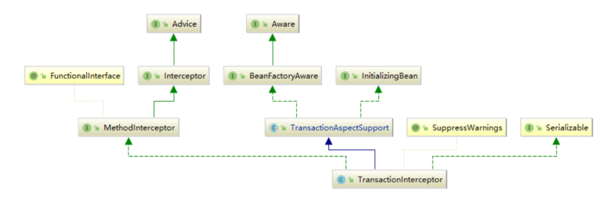
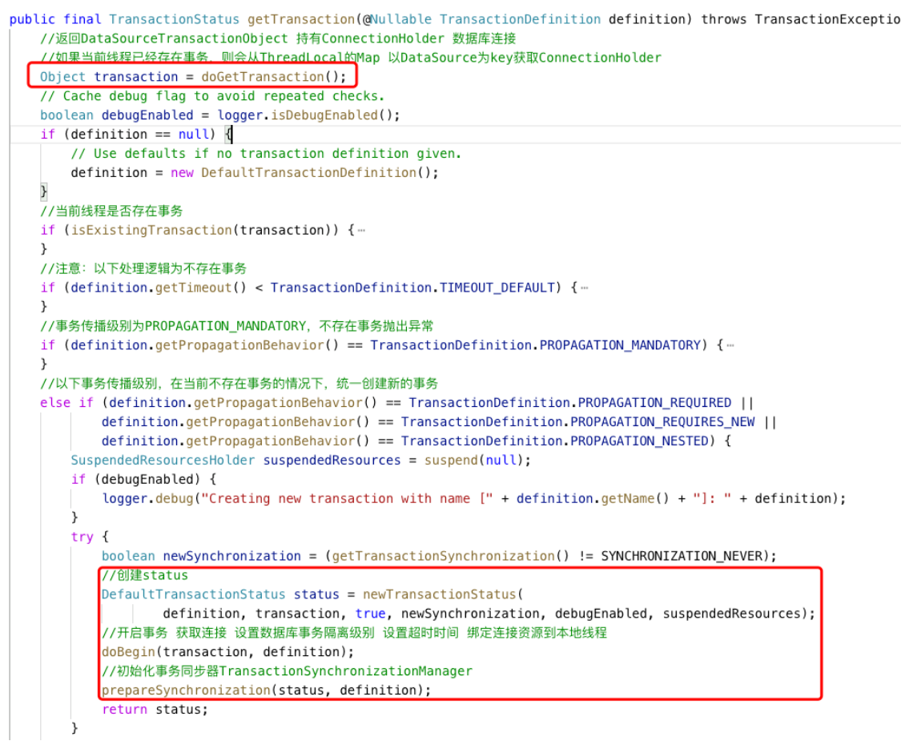
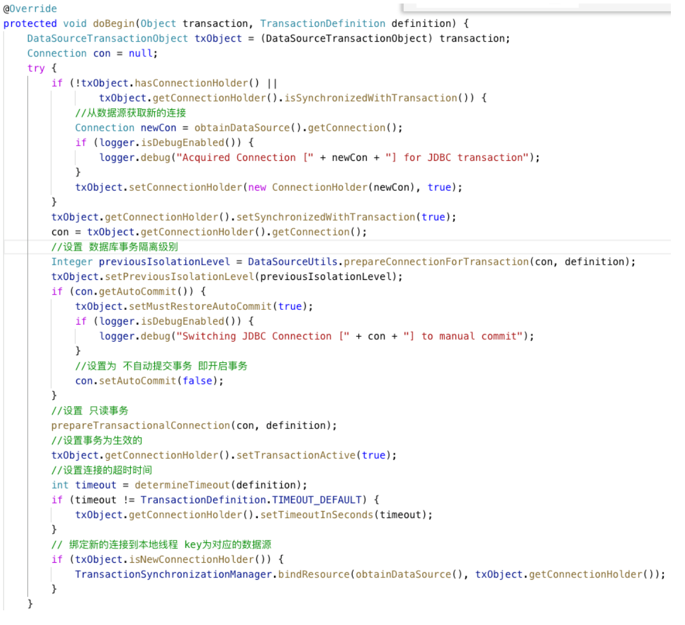
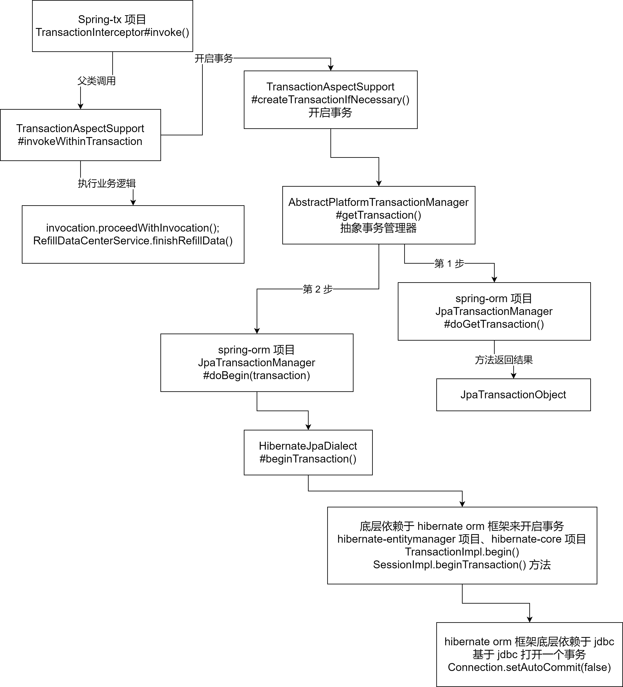
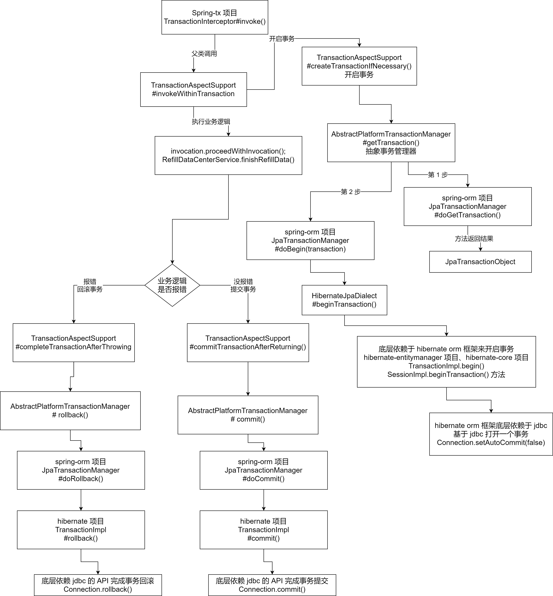

## 事务开启分析


Spring声明式事务是通过 AOP 增强实现的，所以现在分析 Spring 事务执行过程的时候离不开 AOP 拦截器执行链的描述，其中比较重要的拦截器就是 TransactionInterceptor 了





如下，在 TransactionInterceptor 中有一个重要的方法 `invoke`，其中会获取带来对象的类型，同时会调用父类 TransactionAspectSupport 的 `invokeWithintransaction` 方法传入拦截器执行的方法和目标类，从而返回连接点的执行结果


```java
/**
 * @param invocation 拦截器链的执行器，用于执行下一个拦截器
 * @return 返回连接点的执行结果
 * @throws Throwable
 */
@Nullable
public Object invoke(MethodInvocation invocation) throws Throwable {
    // 获取被代理对象的类类型
    Class<?> targetClass = invocation.getThis() != null ? AopUtils.getTargetClass(invocation.getThis()) : null;
    
    // 调用父类 TransactionAspectSupport 方法
    // 传入连接点对象，代理对象类类型，拦截器执行器 MethodInvocation 的 proceed() 方法引用
    return this.invokeWithinTransaction(invocation.getMethod(), targetClass, invocation::proceed);
}
```


接着到 `TransactionAspectSupport` 的 `invokeWithintransaction` 方法中去看看，如下，该方法传入连接点的方法对象，被代理的对象（用于执行方法）以及执行下一个的拦截器。


在方法体里面通过 `getTransactionAttributeSource` 方法获取事务注解属性源，再通过它获取事务注解属性对象，由事务注解属性对象产生事务管理器，**最后的目的是为了生成 `TransactionInfo` 的事务信息对象，通过这个对象执行并提交事务。**需要注意的是，生成对象的方法是 `createTransactionIfNecessary`


```java
/**
 * 执行事务逻辑
 *
 * @param method      连接点的方法对象
 * @param targetClass 被代理的对象，用于执行 method
 * @param invocation  用于执行下一个拦截器
 * @return
 * @throws Throwable
 */
@Nullable
protected Object invokeWithinTransaction(Method method, @Nullable Class<?> targetClass, TransactionAspectSupport.InvocationCallback invocation) throws Throwable {
    // 事务注解属性源，包含了保存 事务注解属性的缓存 如果为空不执行事务
    TransactionAttributeSource tas = this.getTransactionAttributeSource();
    // 事务注解属性对象
    TransactionAttribute txAttr = tas != null ? tas.getTransactionAttribute(method, targetClass) : null;
    // 事务管理器
    TransactionManager tm = this.determineTransactionManager(txAttr);
    PlatformTransactionManager ptm = this.asPlatformTransactionManager(tm);
    //获取连接点唯一标识字符串 com.example.UserService.insertUser
    String joinpointIdentification = this.methodIdentification(method, targetClass, txAttr);
    Object retVal;
    // 如果是本地事务执行逻辑
    if (txAttr == null || ptm instanceof CallbackPreferringPlatformTransactionManager) {

        // 创建事务对象并返回事务信息
        // TransactionInfo 事务信息对象 主要包含 TransactionStatus、TransactionAttribute、PlatformTransactionManager
        TransactionInfo txInfo = this.createTransactionIfNecessary(ptm, txAttr, joinpointIdentification);

        try {
            // 执行下一个拦截器，如果只有一个拦截器，那么下一个会执行连接点的方法
            retVal = invocation.proceedWithInvocation();
        } catch (Throwable ex) {
            // 事务回滚
            this.completeTransactionAfterThrowing(txInfo, var18);
            throw ex;
        } finally {
            // 清除事务信息
            this.cleanupTransactionInfo(txInfo);
        }

        // 提交事务
        this.commitTransactionAfterReturning(txInfo);
        return retVal;
    }
}
```


上面 `invokeWithintransaction` 方法中会将事务信息对象执行并提交，其中通过 `createTransactionIfNecessary` 产生这个事务信息对象，接下来看看这个对象的产生方法的代码。如下，该方法中通过传入的 `PlatformTransactionManager` 获取事务管理器，然后调用其中的 `getTransaction` 方法获取事务


```java
protected TransactionAspectSupport.TransactionInfo createTransactionIfNecessary(@Nullable PlatformTransactionManager tm, @Nullable TransactionAttribute txAttr, final String joinpointIdentification) {
    // 如果没有执行名称，则使用 joinpointIdentification，并且返回代理对象
    if (txAttr != null && ((TransactionAttribute)txAttr).getName() == null) {
        txAttr = new DelegatingTransactionAttribute((TransactionAttribute)txAttr) {
            public String getName() {
                return joinpointIdentification;
            }
        };
    }

    TransactionStatus status = null;
    // 事务属性不为 null
    if (txAttr != null) {
        // 事务管理器不为 null
        if (tm != null) {
            // 获取事务
            status = tm.getTransaction((TransactionDefinition)txAttr);
        } else if (this.logger.isDebugEnabled()) {
            this.logger.debug("Skipping transactional joinpoint [" + joinpointIdentification + "] because no transaction manager has been configured");
        }
    }
    // 创建并初始化 TransactionInfo
    return this.prepareTransactionInfo(tm, (TransactionAttribute)txAttr, joinpointIdentification, status);
}
```


`getTransaction` 的方法比较长，主要是根据事务的传播级别对事务进行处理，我们截取其中一段代码。如下，首先调用 `doGetTransaction` 方法获取 transaction 对象。然后，经过事务传播级别判断以后，生产 DefaultTransactionStatus 类型，同时 `doBegin` 方法开启事务、获取链接、设置数据库事务隔离级别等操作。最后，通过运行 `prepareSynchronization` 方法初始化事务同步器 `TransactionSynchronizationManager`





doBegin 的代码如下所示，它主要做了一下几个操作


- 通过 obtainDataSource 中的 getConnection 方法，从数据源获取新的连接
- 通过 prepareConnectionForTransaction 方法设置数据库事务隔离级别
- 通过 prepareTransactionConnection 设置只读事务
- 通过 getConnectionHolder 中的 setTransactionActive 方法设置事务为生效状态
- 通过 determineTimeout 方法设置连接超时时间





### 事务开启大图总结


上面通过对主要源码的分析了解了 Spring 事务开启的整个过程，这里通过一张大图梳理一下。如下图，我们从上往下看，TransactionInterceptor 作为事务拦截器，是本次课程的核心，通过其中的 `invoke` 方法开启事务。其中会调用父类 TransactionAspectSupport 中的 invokeWithinTransaction 方法


invokeWithinTransaction 这个方法有两个分支，左边是执行业务逻辑的方法，调用的是 invocation 中的processedWithinInvocation 完成的。右边的分支用来开启事务，会调用 TransactionAspectSupport 的 createTransactionIfNecessary 方法，其中会使用到事务管理器 PlatformTransactionManager 中的 getTransaction 方法获取事务


此时获取事务的操作有两个部分，第一步通过调用 JpaTransactionManager 中的 doGetTransaction 方法返回 JpaTransactionObject，第二步通过 JpaTransactionManager  中的 doBegin 方法调用 HibernateJpaDialect 中的beingTransaction 完成事务的开启





## 事务提交和回滚代码


我们启动了 Spring 的事务之后，如果事务顺利执行就会提交事务，否则会对事务进行回滚。在 `invokeWithinTransaction` 方法中 try catch 语句定义了执行拦截器和事务回滚的代码。其中事务回滚会调用 `completeTransactionAfterthrowing`，如果事务执行顺利就会调用 `commitTransactionAfterReturning`方法


在 `completeTransactionAfterThrowing` 方法内部主要处理异常情况下是否需要回滚。注意，方法内部会向上递归查找父类是否和 `Exception` 相同，如果相同进行回滚。其中下面的 `rollback` 方法，该方法是从事务消息对象中的 getTransactionManager 中获取的，传入了事务状态对象（getTransactionStatus 获取状态）


```java
protected void completeTransactionAfterThrowing(@Nullable TransactionAspectSupport.TransactionInfo txInfo, Throwable ex) {
    if (txInfo != null && txInfo.getTransactionStatus() != null) {
        if (this.logger.isTraceEnabled()) {
            this.logger.trace("Completing transaction for [" + txInfo.getJoinpointIdentification() + "] after exception: " + ex);
        }

        // 使用 RuleBasedTransactionAttribute 判断当前异常是否需要回滚 - 如果注解上定义了 @Transactional(rollbackFor = Exception.class)
        // 这里会使用 ex 向上递归查找父类是否和 Exception 是否相同，如果相同则进行回滚
        if (txInfo.transactionAttribute != null && txInfo.transactionAttribute.rollbackOn(ex)) {
            try {
                txInfo.getTransactionManager().rollback(txInfo.getTransactionStatus());
            } catch (TransactionSystemException var6) {
                this.logger.error("Application exception overridden by rollback exception", ex);
                var6.initApplicationException(ex);
                throw var6;
            } catch (Error | RuntimeException var7) {
                this.logger.error("Application exception overridden by rollback exception", ex);
                throw var7;
            }
        }
        // 否则执行提交
        else {
            // commit() 会判断通过手动设置回滚的操作，然后也会进行回滚
            try {
                txInfo.getTransactionManager().commit(txInfo.getTransactionStatus());
            } catch (TransactionSystemException var4) {
                this.logger.error("Application exception overridden by commit exception", ex);
                var4.initApplicationException(ex);
                throw var4;
            } catch (Error | RuntimeException var5) {
                this.logger.error("Application exception overridden by commit exception", ex);
                throw var5;
            }
        }
    }
}
```


由于此处使用了 TransactionManager，这里提一下，PlatformTransactionManager 继承自 TransactionManager 接口，AbstractPlatformTransactionManager 对 PlatformTransactionManager 进行了抽象，对方法进行了具体的实现。


如下，PlatformTransactionManager 继承了 TransactionManager 接口，其中也继承了创建事务并开启事务的方法 getTransaction、提交事务的方法 commit 以及回滚事务的方法 rollback


```java
public interface PlatformTransactionManager extends TransactionManager {
	// 创建一个事务并开启事务 
    TransactionStatus getTransaction(@Nullable TransactionDefinition definition) throws TransactionException;

	// 提交事务
    void commit(TransactionStatus definition) throws TransactionException;

	// 回滚事务
    void rollback(TransactionStatus definition) throws TransactionException;
}
```


看完了 Rollback 相关的方法再来看看 `commitTransactionAfterReturning`，如下，在方法体中通过 `getTransactionManager` 调用 commit 方法传入事务状态


```java
protected void commitTransactionAfterReturning(@Nullable TransactionAspectSupport.TransactionInfo txInfo) {
    if (txInfo != null && txInfo.getTransactionStatus() != null) {
        if (this.logger.isTraceEnabled()) {
            this.logger.trace("Completing transaction for [" + txInfo.getJoinpointIdentification() + "]");
        }

        txInfo.getTransactionManager().commit(txInfo.getTransactionStatus());
    }

}
```


如下，需要注意的是，在 `commit` 方法中会针对 `isLocalRollbackOnly` 进行判断，如果为 true 会执行 `processRollback` 方法进行手动回滚。同时还会通过 `shouldCommitOnGlobalRollbackOnly` 和 `isGlobalRollbackOnly` 判断进行 `processRollback` 的手动回滚


```java
public final void commit(TransactionStatus status) throws TransactionException {
    if (status.isCompleted()) {
        throw new IllegalTransactionStateException("Transaction is already completed - do not call commit or rollback more than once per transaction");
    } else {
        DefaultTransactionStatus defStatus = (DefaultTransactionStatus)status;
        // 如果这里执行了 TransactionInterceptor.currentTransactionStatus().setRollbackOnly();
        // 这里会判断为 true 并且进行回滚操作
        if (defStatus.isLocalRollbackOnly()) {
            if (defStatus.isDebug()) {
                this.logger.debug("Transactional code has requested rollback");
            }

            this.processRollback(defStatus, false);
        }
        // 通过 ConnectionHolder setRollbackOnly() 设置的回滚
        else if (!this.shouldCommitOnGlobalRollbackOnly() && defStatus.isGlobalRollbackOnly()) {
            if (defStatus.isDebug()) {
                this.logger.debug("Global transaction is marked as rollback-only but transactional code requested commit");
            }

            this.processRollback(defStatus, true);
        } else {
        	// 执行提交
            this.processCommit(defStatus);
        }
    }
}
```


### 总结提交回滚流程


我们用一张图梳理一下事务的提交和回滚流程。流程图从 TransactionInterceptor 开始，调用父类的 invokeWithinTransaction 方法业务逻辑，如果报错，走左边的逻辑调用 TransactionAspectSupport 中的 completeTransactionAfterThrowing，继续通过 AbstractPlatformTransactionManager 的 rollback 方法执行回滚操作


如果没有报错，调用 commitTransactionAfterReturning 方法，使用 AbstractPlatformTransactionManager 的 commit 方法进行提交操作。Rollback 和 commit 的后续操作会涉及到 JpaTransactionManager 类，这里不展开描述




