## 什么是依赖循环


> Spring IoC 容器会在运行时检测到「构造函数注入」循环依赖，并抛出 `BeanCurrentlyInCreationException`。所有要避免构造函数注入，可以使用 setter 注入替代


根据官方文档说明，Spring 会自动解决基于 `setter` 注入的依赖循环，当然我们工作中现在都使用 `@Autowired` 注解来注入属性。`@Autowired` 是通过反射进行赋值


我们通过常用的场景切入，看 Spring 是如何解决循环依赖的


```java
@Service
public class CircularServiceA {

    @Autowired
    private CircularServiceB circularServiceB;
}

@Service
public class CircularServiceB {

    @Autowired
    private CircularServiceC circularServiceC;
}

@Service
public class CircularServiceC {

    @Autowired
    private CircularServiceA circularServiceA;

}
```


这里有 A、B、C 三个类，可以看到发生了循环依赖：


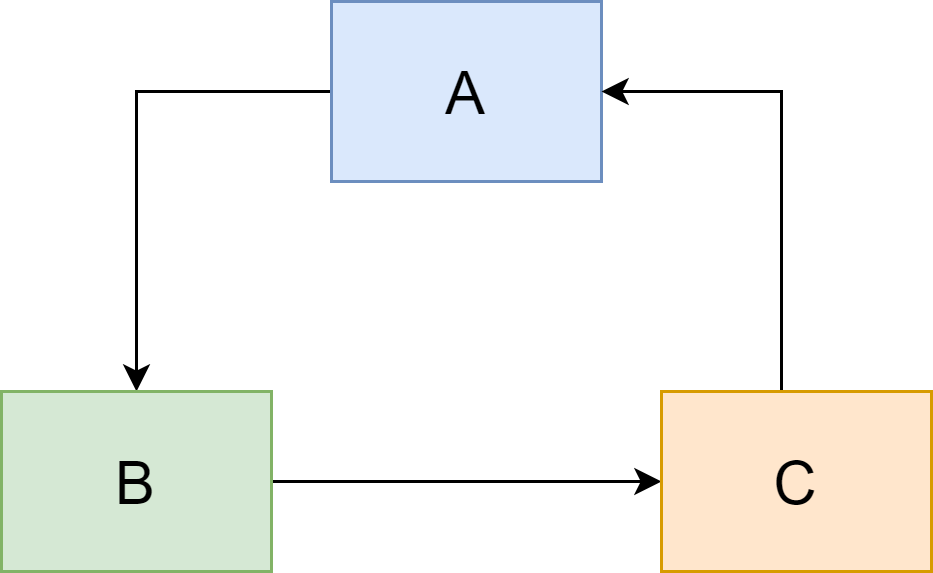


即使是发生了循环依赖，依然可以启动 OK，使用并没有任何影响


## Spring 是如何解决循环依赖的


在 Spring 的 Bean 的创建中，使用了三级缓存：


- **singletonObjects**：一级缓存。存储单例对象，Bean 已经实例化，初始化
- **earlySingletonObjects**：二级缓存。存储 singletonObject，这个 Bean 实例化了，还没有初始化
- **singletonFactories**：三级缓存。存储 singletonFactory


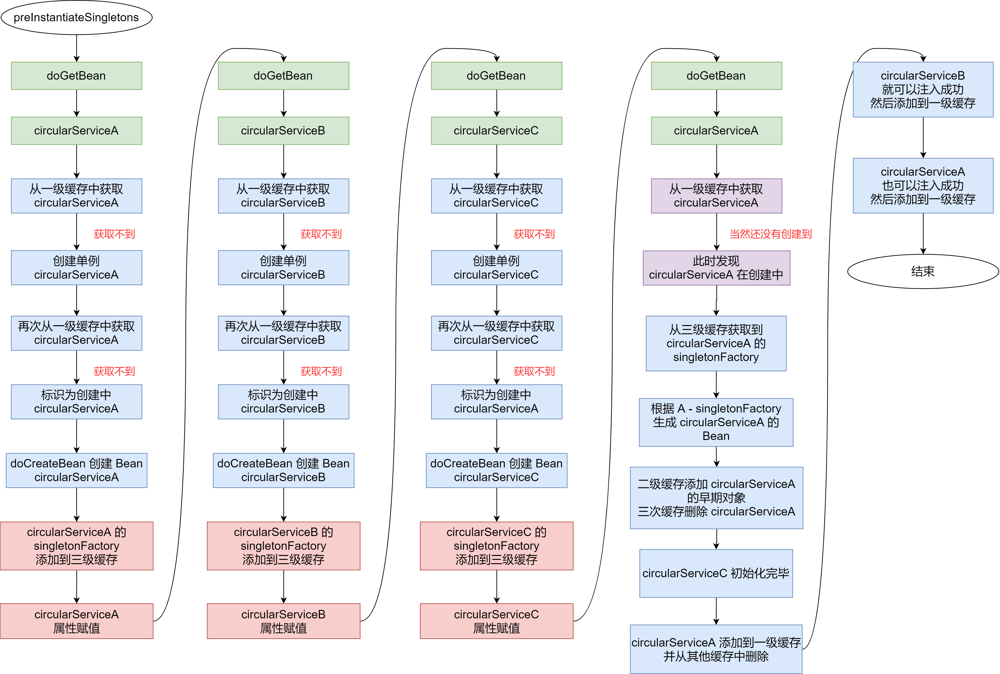


上面的图比较长，我们可以简化一下：


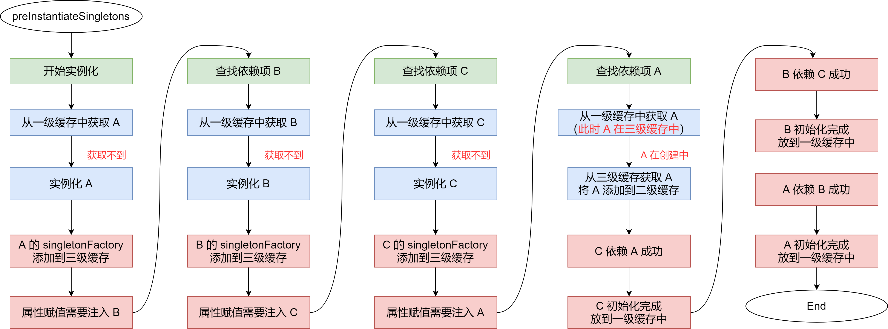


## 通过 Debug 来说明生成过程


从 `preInstantiateSingletons` 方法开始：添加断点 `beanName.equals("circularServiceA")`。启动 Debug


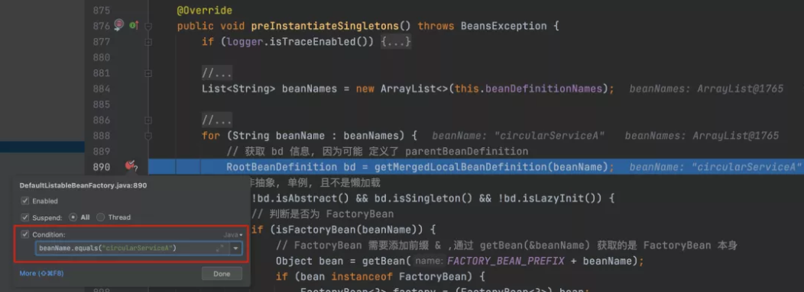


会从缓存中获取单例 Bean


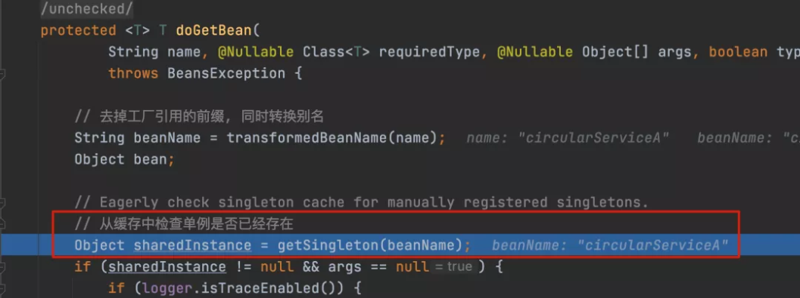


这里显然获取不到，继续执行，创建单例实例


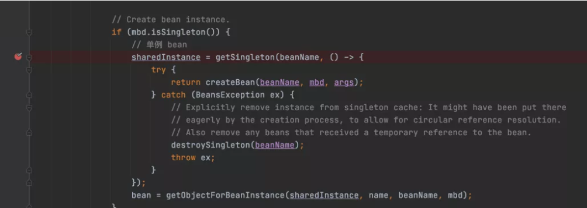


发现是单例再次获取


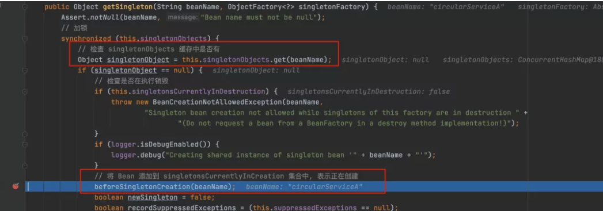


这里还会从一级缓存获取一次 `circularServiceA`，没有获取到，将 `circularServiceA` 添加到在创建的池子里面（singletonsCurrentlyInCreation 是一个 set 集合）


然后会调用工厂方法 `createBean(beanName, mbd, args)` 创建对象


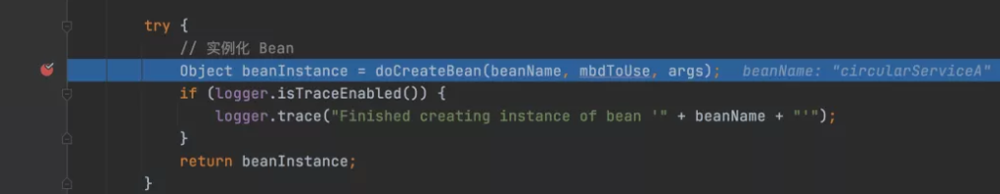


在 `createBean` 中去实例化 Bean


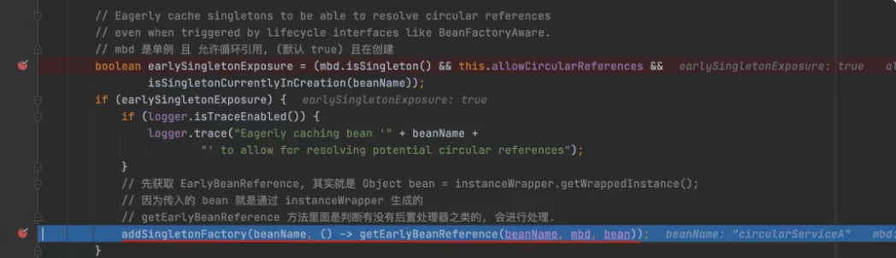


判断是否是循环引用，是的话需要添加到三级缓存中


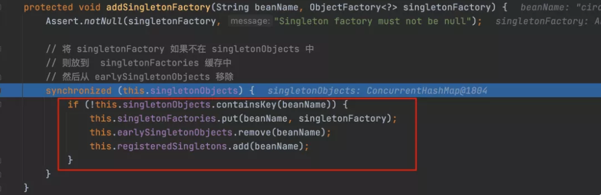


`circularServiceA` 不在一级缓存中，则将 `circularServiceA` 的 singletonFactory 添加到三级缓存（singletonFactories）中，同时从二级缓存中移除


到这一步为止，circularServiceA 已经在三级缓存中了


开始对 Bean 的属性进行赋值


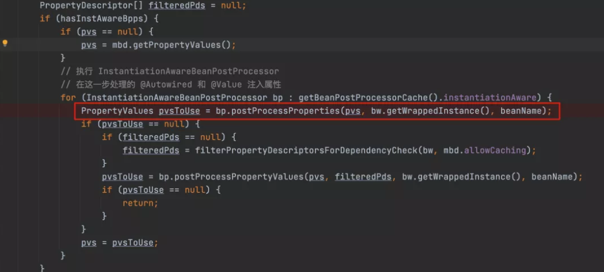


在 `populateBean` 方法中执行到


```java
PropertyValues pvsToUse = bp.postProcessProperties(pvs, bw.getWrappedInstance(), beanName);
```


就会对属性进行赋值


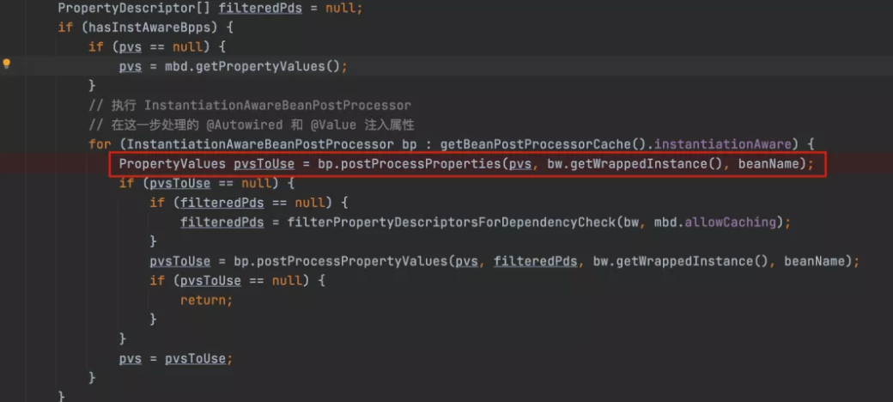


在 `inject` 方法中，回去解决相关依赖


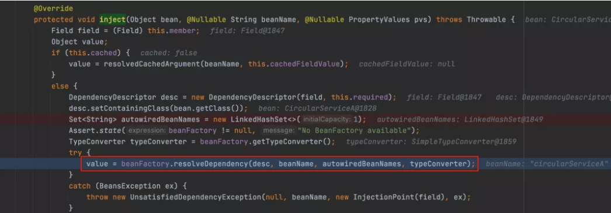


继续 Debug，发现解决依赖，最后发现其实又调用会 `beanFactory.getBean(beanName)`。不过这次创建的是 `circularServiceB`


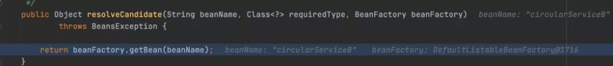


`circularServiceB` 的过程和 `circularServiceA` 的一样，也是创建了三级缓存，然后去创建 `circularServiceC` 


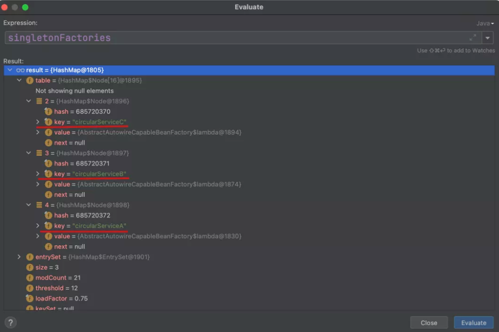


这时候三级缓存里面有他们三个的 `singetonFactory`


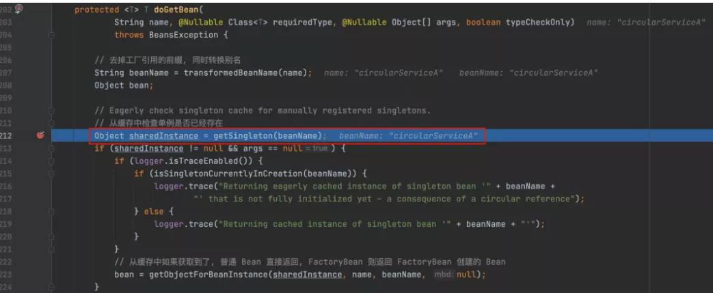


`circularServiceC` 也调用到 `doCreateBean` 方法去获取 `circularServiceA`，不过这次调用到 `Object sharedInstance = getSingleton(beanName)` 的时候，`circularServiceA` 已经存在了


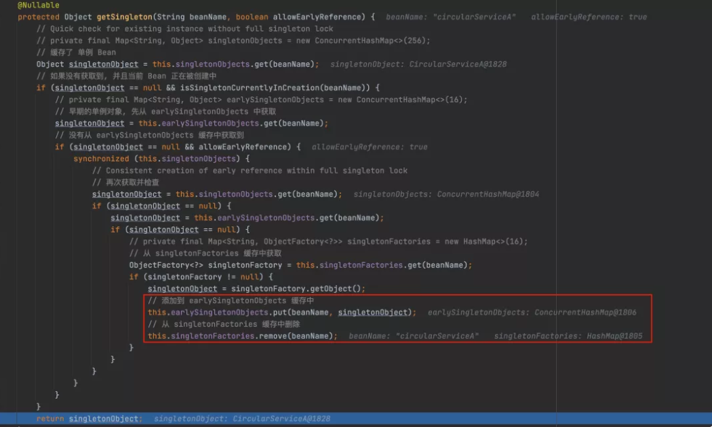


这次调用虽然没有从一级缓存（singletonObjects）中获取到 circularServiceA，但是 circularServiceA 在创建中，所以进入判断


在这里执行后，`circularServiceA` 从三级缓存升级到二级缓存


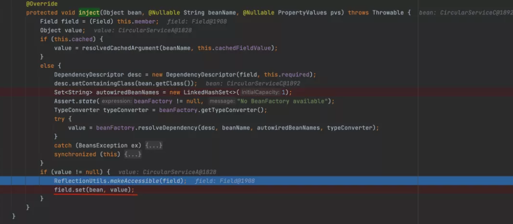


使用反射对 `circularServiceC` 中的 `circularServiceA` 进行赋值，此时 `circularServiceA` 是在耳机缓存中


那就比较好奇了，这时候 `circularServiceC` 里面的 `circularServiceA` 已经通过反射赋值，这个赋值给的是什么值？


看代码：


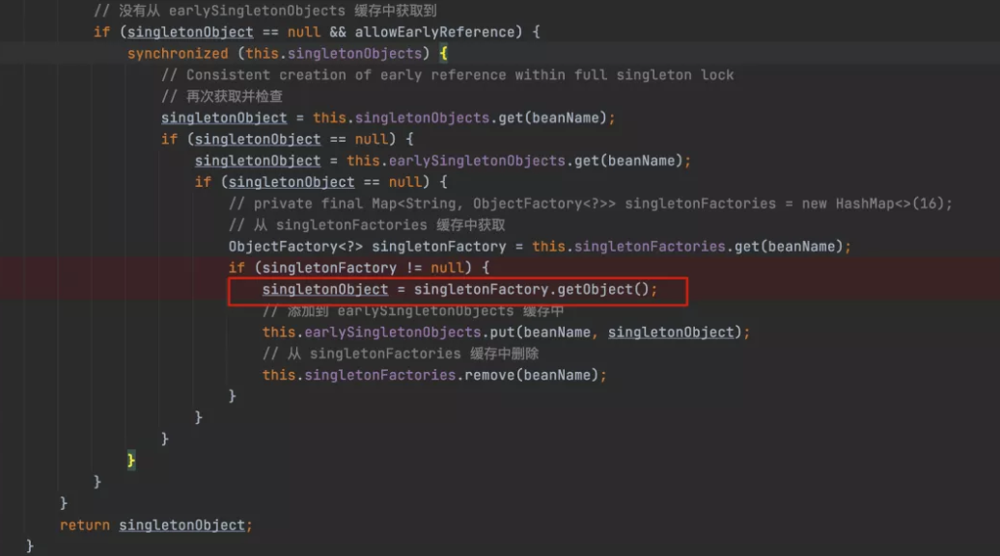


这块是从三级缓存（singletonFactories）中获取的 singletonObject，然后调用 `singletonObject = singletonFactory.getObject()` 获取的一个对象


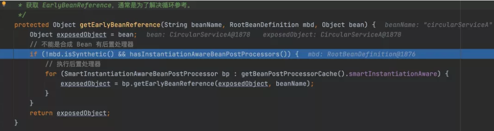


这里获取到的是 circularServiceA 的引用，注意，circularServiceA 这时候还没创建完成，只是引用，所以这里赋值的是 circularServiceA 的引用


到这里 `circularServiceC` 就创建完了


然后会将 C 添加到一级缓存和已注册列表中，同时从二级三级缓存中删除 C


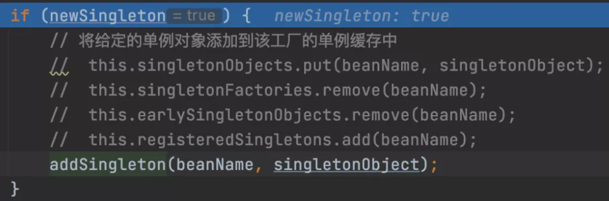


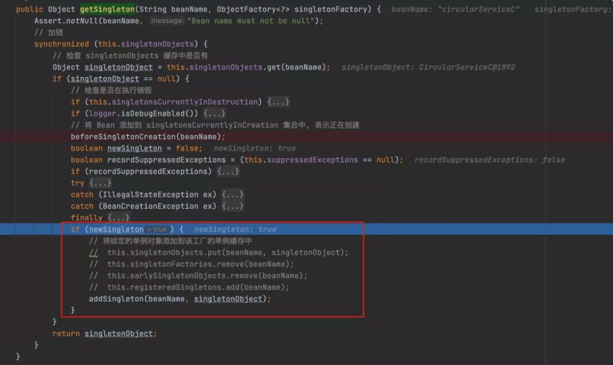


继续执行 B 和 A 的属性赋值以及后续的初始化流程


至此，循环依赖解决完毕


## 总结


Spring 使用三级缓存来解决循环依赖的问题，三级缓存分别是：


- **singletonObjects**：一级缓存。存储单例对象，Bean 已经实例化，初始化完成
- **earlySingletonObjects**：二级缓存。存储 singletonObject，这个 Bean 实例化了，还没有初始化
- **singletonFactories**：三级缓存，存储 singletonFactory


## 转载

[Spring 是如何解决循环依赖的？](https://mp.weixin.qq.com/s/UlUQ95gVt8I8wmVOEjn1aw)