## 什么是依赖循环


我们先回顾一下 Bean 的创建过程，在此之前，先看一下三级缓存的概念：


- singletonObjects：一级缓存。存储单例对象，Bean 已经实例化，初始化完成
- earlySingletonObjects：二级缓存。存储 singletonObject，这个 Bean 已经实例化，还没有初始化
- singletonFactories：三级缓存。存储 singletonFactory


### Bean 的创建过程


先看下面一段代码


```java
@Service
public class CircularServiceA {
    private String fieldA = "字段 A";
}
```


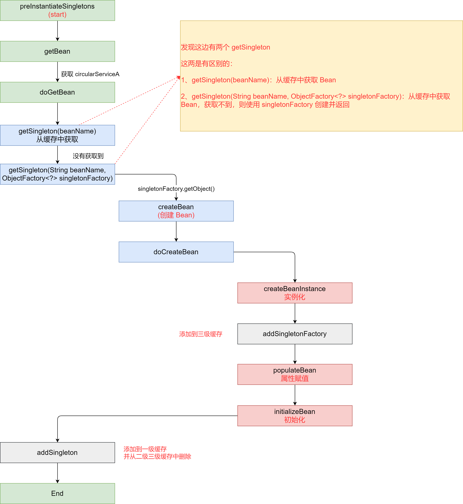


通过上面的流程，可以看出 Spring 在创建 Bean 的过程中重点是 `AbstractAutowireCapableBeanFactory` 中的以下三个步骤：


- **实例化 createBeanInstance**：其中实例化 Bean并对 Bean 进行赋值，像例子中的 `fieldA` 字段在这里就会赋值
- **属性注入 populateBean**：可以理解为对 Bean 里面的属性进行赋值（会依赖其他 Bean）
- **初始化 initializeBean**：执行初始化和 Bean 的后置处理器


> 实例化赋值依赖源码可以阅读：
>
> 
>
> BeanUtils.instantiateClass(constructorToUse)


### 如果要依赖其他 Bean 呢？


那如果 CircularServiceA 依赖了其他 Bean 呢？


```java
@Service
public class CircularServiceA {

    private String fieldA = "字段 A";

    @Autowired
    private CircularServiceB circularServiceB;

}
@Service
public class CircularServiceB {

}
```


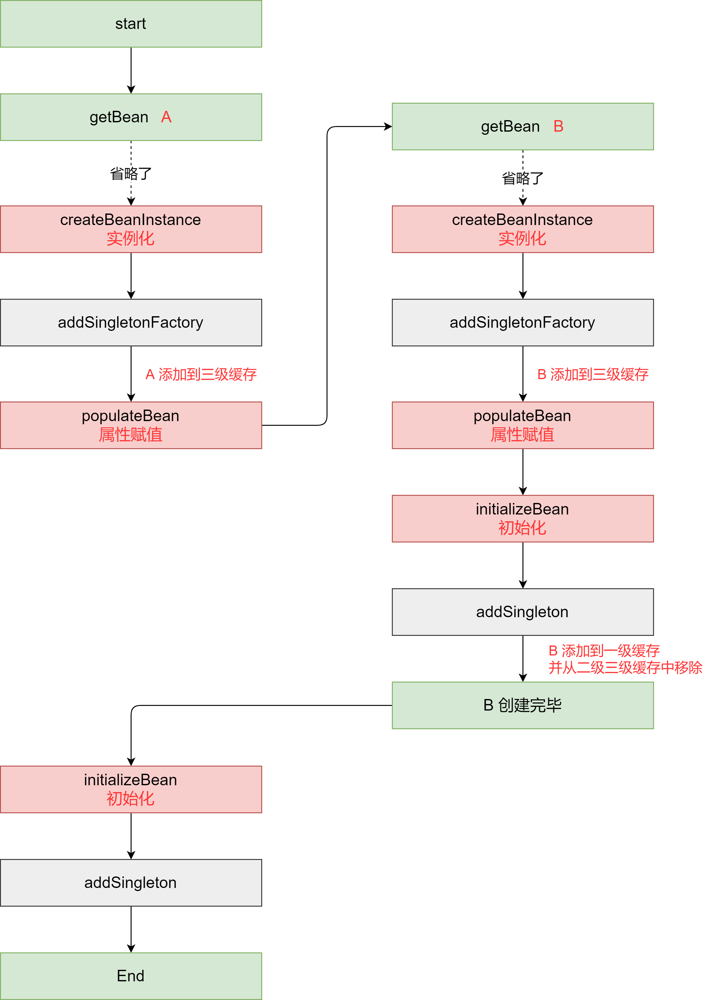


当 A 依赖了 B 的时候，在 `createBeanInstance` 这一步，并不会对 B 进行属性赋值。而是在 `populateBean` 这里查找依赖项，并创建 B


### 依赖循环下的创建过程


循环依赖的场景如下：


```java
@Service
public class CircularServiceA {

    private String fieldA = "字段 A";

    @Autowired
    private CircularServiceB circularServiceB;

}
@Service
public class CircularServiceB {
    @Autowired
    private CircularServiceA circularServiceA;
}
```


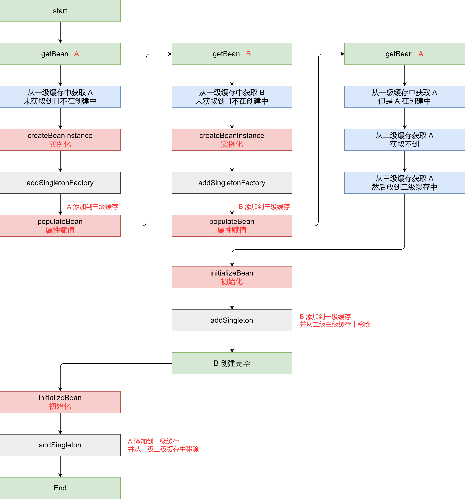


在 A 和 B 循环依赖的场景中：


> B `populateBean` 查找依赖项 A 的时候，从一级缓存中虽然未获取到 A，但是发现 A 在创建中。
>
> 此时，从三家缓存中获取 A 的 `singletonFactory` 调用工厂方法，创建 `getEarlyBeanReference` A 的早起引用并返回
>
> B 引用到 A，B 就可以初始化完毕，然后 A 同样也可以初始化完毕了


### 二级缓存能否解决依赖循环


通过上面的图，仔细分析一下，其实把二级缓存拿掉，在 B 尝试获取 A 的时候直接返回 A 的实例，是不是也是可以的？


答案是：可以的


但是为什么还是用三级缓存呢？


网上的很多资料说是和动态代理有关系，那就从动态代理的方面继续往下分析


## 动态代理


在 JavaConfig（配置类）上添加 `EnableAspectJAutoProxy` 注解，开启 AOP，通过 Debug 循序渐进看一看动态代理对循环依赖的影响


### 动态代理下，Bean 的创建过程


```java
@Service
public class CircularServiceA {
    private String fieldA = "字段 A";

    public void methodA() {

        System.out.println("方法 A 执行");

    }
}
@Aspect
@Component
public class AspectA {

    @Before("execution(public void com.liuzhihang.circular.CircularServiceA.methodA())")
    public void beforeA() {
        System.out.println("beforeA 执行");
    }
}
```


只有 A 的情况下，给 A 添加切面，开始 Debug


前面的流程都相同，在 `initializeBean` 开始出现差异，这一步需要初始化 Bean 并执行 Bean 的后置处理器


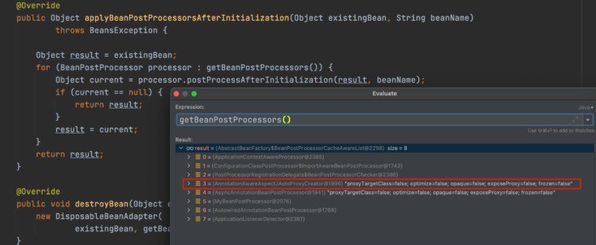


其中有一个处理器为：`AnnotationAwareAspectJAutoProxyCreator`，其实就是加的注解切面，会跳转到 AbstractAutoProxyCreator 类的 postProcessAfterInitialization 方法


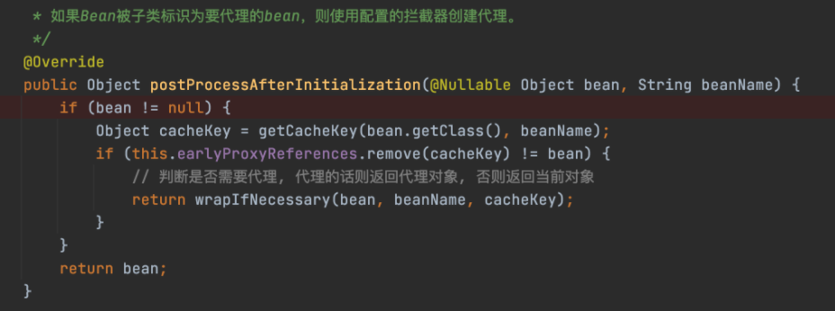


如图所示，`wrapIfNecessary` 方法会判断是否满足代理条件，是的话返回一个代理对象，否则返回当前 Bean


后续调用 `getProxy`、`createAopProxy` 等等，最终执行到下面一部分


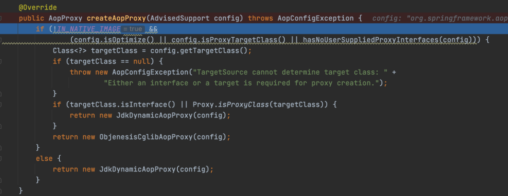


最终会执行到这里，AOP 代理相关的就不细看了


一路放行，知道 initializeBean 执行结束


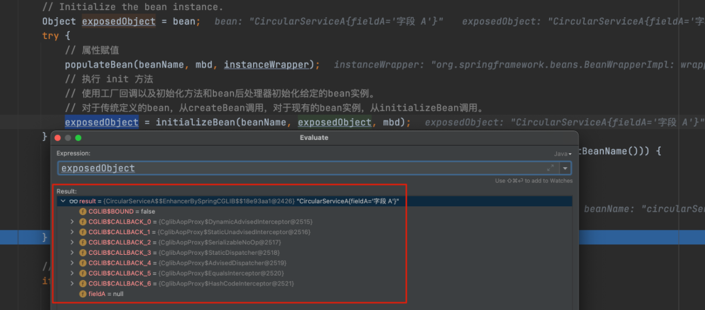


此时发现：A 被替换为代理对象


所以 doCreateBean 返回，以及后面放到一级缓存中的都是代理对象


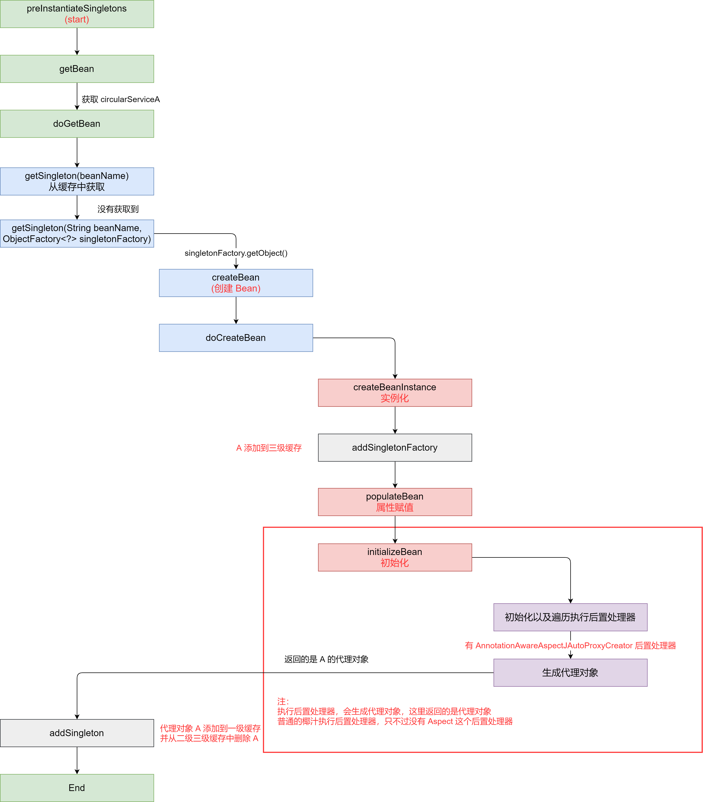


### 有循环依赖的动态代理


这一次把循环依赖打开：


```java
@Service
public class CircularServiceA {

    private String fieldA = "字段 A";

    @Autowired
    private CircularServiceB circularServiceB;

    public void methodA() {

        System.out.println("方法 A 执行");

    }
}
@Aspect
@Component
public class AspectA {

    @Before("execution(public void com.liuzhihang.circular.CircularServiceA.methodA())")
    public void beforeA() {

        System.out.println("beforeA 执行");

    }

}
@Service
public class CircularServiceB {

    @Autowired
    private CircularServiceA circularServiceA;

    public void methodB() {

    }
}
@Aspect
@Component
public class AspectB {

    @Before("execution(public void com.liuzhihang.circular.CircularServiceB.methodB())")
    public void beforeB() {

        System.out.println("beforeB 执行");

    }

}
```


开始 Debug，前面的一些流程，都和正常的没有什么区别。而唯一的区别在于，创建 B 的时候。需要从三级缓存获取 A


此时 `getSingleton` 方法中会调用：`singletonObject = singletonFactory.getoObject()`


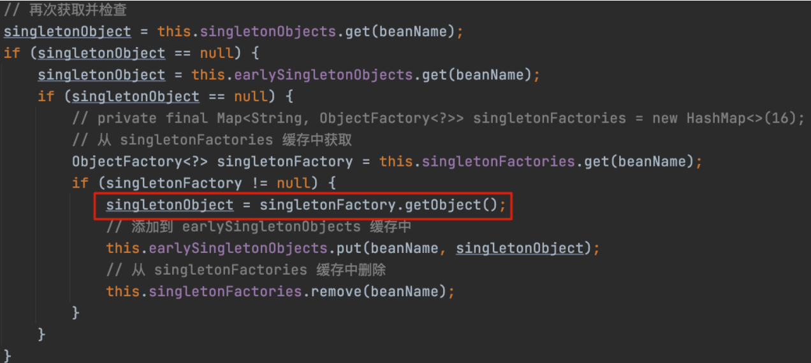


有时会比较疑惑 `singletonFactory.getObject()` 调用是哪里？


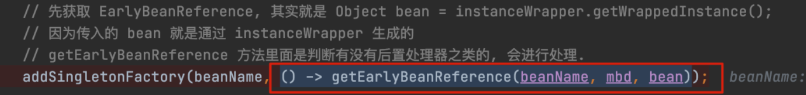


所以这一块调用的是 `getEarlyBeanReference`，开始遍历 `BeanPostProcess`


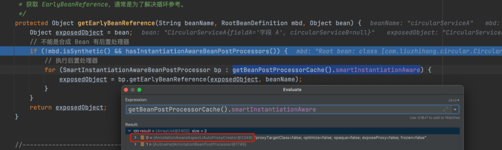


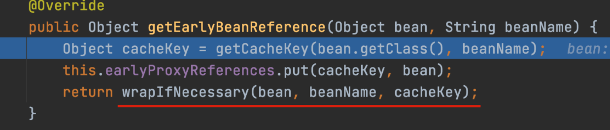


看到 `wrapIfNecessary` 就明白了，这块会获取一个**代理对象**


**也就是说此时返回，并放到二级缓存的是一个 A 的代理对象**


这样 B 就创建完毕了。


到 A 开始初始化并执行后置处理器了。因为 A 有代理，所以 A 也会执行到 `postProcessAfterInitialization` 这一部分


但是在执行 `wrapIfNecessary` 之前，会先判断代理对象缓存是否有 A 了


`this.earlyProxyReferences.remove(cacheKey) != bean`


但是这块获取到的是 A 的代理对象，肯定是 false。所以不会再生成一次 A 的代理对象


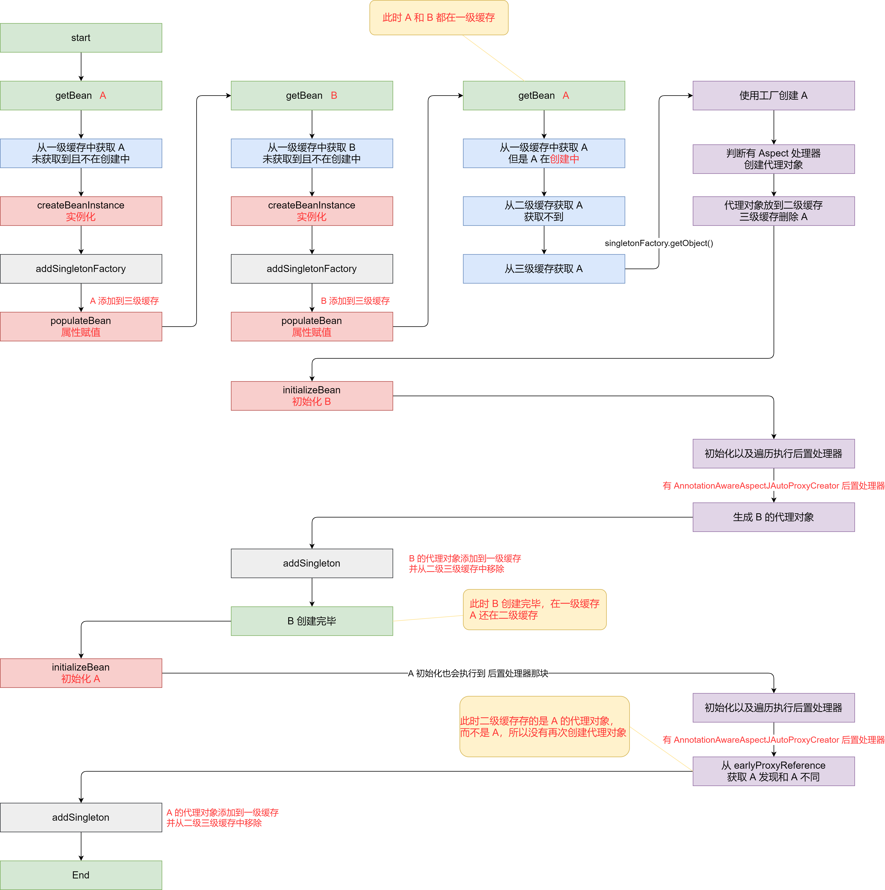


### 总结


可以看到，依赖循环下，有没有代理情况下的区别就在：`singletonObject = singletonFactory.getObject()`


在依赖循环发生的情况下 B 中的 A 复制时：


- 无代理：getObject 直接返回原来的 Bean
- 有代理：getObject 返回的是代理对象


**为什么要三级缓存？**


#### 假设去掉三级缓存


去掉三级缓存之后，Bean 直接创建 earlySingletonObjects，看着好像也可以。如果有代理的时候，在 earlySingletonObjects 直接放代理对象就行了


但是会导致一个问题：**在实例化阶段旧的执行后置处理器，判断有 AnnotationAwareAspectJAutoProxyCreator 并创建代理对象**。这么一想，是不是会对 Bean 的生命周期有影响？


同样，先创建 `singletonFactory` 的好处就是：**在真是需要实例化的时候，再使用 singletonFactory.getObject() 获取 Bean 或者 Bean 的代理。**相当于是延迟实例化


#### 假设去掉二级缓存


如果去掉了二级缓存，则需要在 `singletonFactory.getObject()` 阶段初始化完毕，并放到一级缓存中


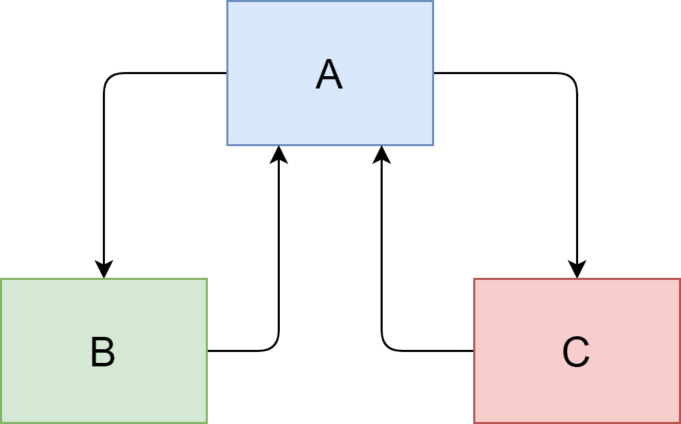


那么有一种场景，B 和 C 都依赖了 A


要知道在有代理的情况下，`singletonFactory.getObject()` 获取的是代理对象


而多次调用 `singletonFactory.getObject` 返回的代理对象时不同的，就会导致 B 和 C 依赖了不同的 A


那如果 A 获取到 B 之后直接放到一级缓存，然后 C 再获取呢？一级缓存存放的是已经初始化完毕的 Bean，要知道 A 依赖了 B 和 C，A 这时候还没初始化完毕呢

