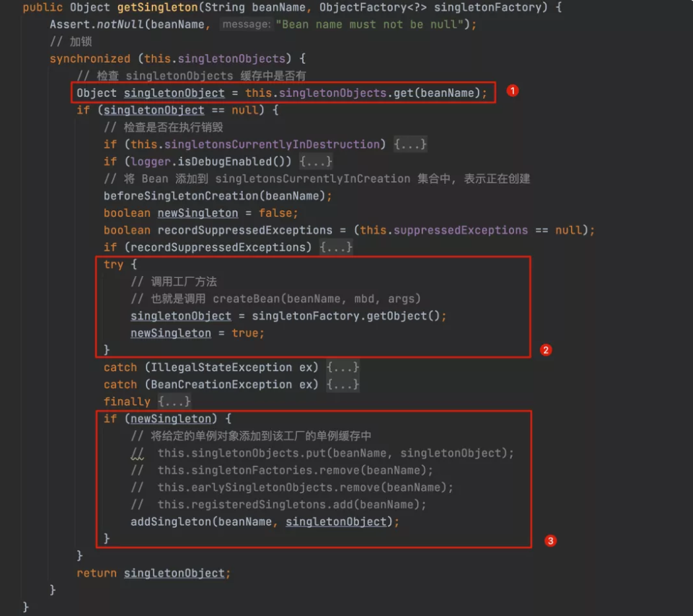
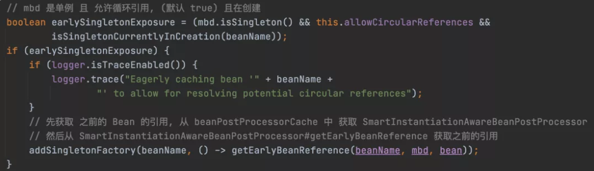
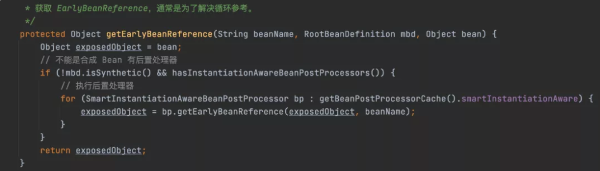
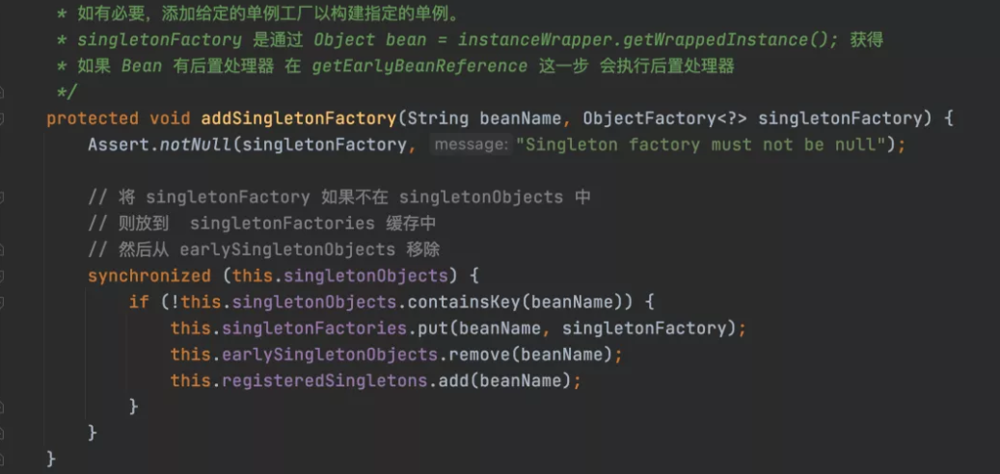
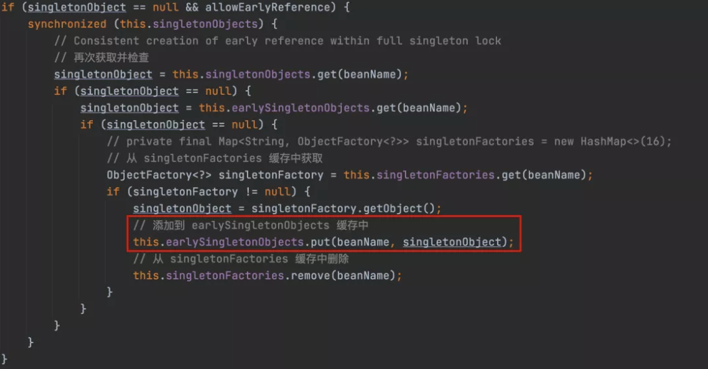
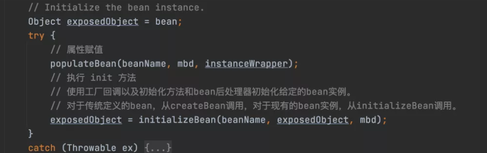
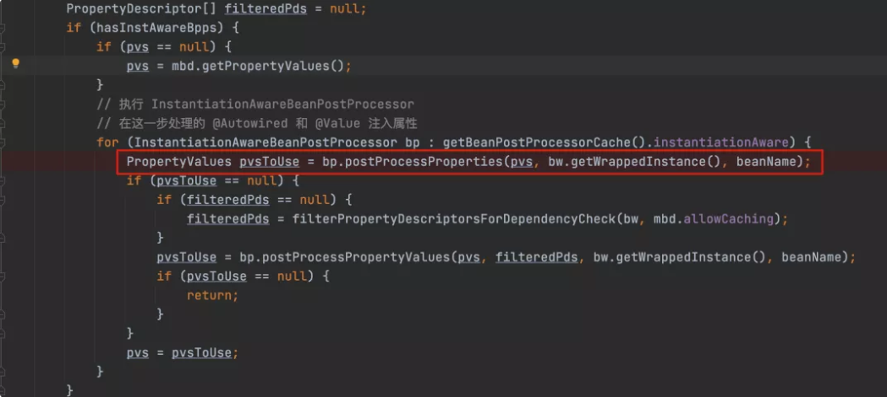
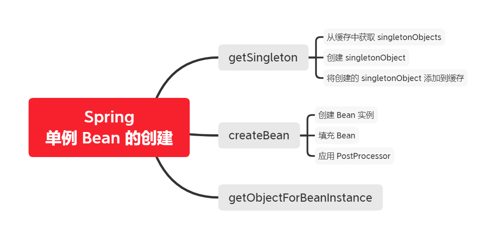
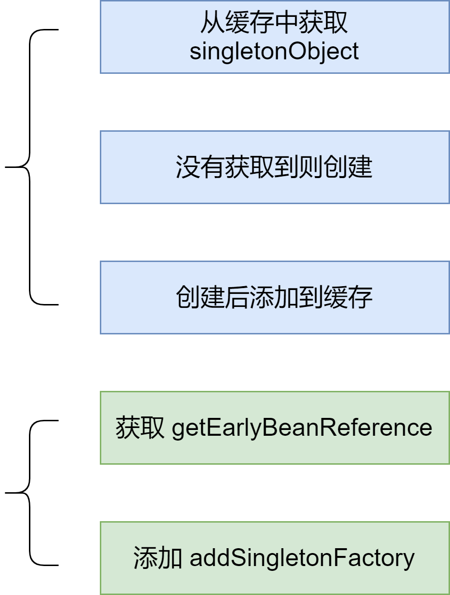

本文主要讲解单例 Bean 的创建过程。这里主要分为三个部分创建单例 Bean：


1. **getSingleton**
2. **createBean**
3. **getObjectForBeanInstance**


## getSingleton


我们先看一下 `getSingleton`的源码


```java
public Object getSingleton(String beanName, ObjectFactory<?> singletonFactory) {
    Assert.notNull(beanName, "Bean name must not be null");
    // 加锁
    synchronized (this.singletonObjects) {
        // 检查 singletonObjects 缓存中是否有
        Object singletonObject = this.singletonObjects.get(beanName);
        if (singletonObject == null) {
            // 检查是否在执行销毁
            if (this.singletonsCurrentlyInDestruction) {
                throw new BeanCreationNotAllowedException(beanName,
                        "Singleton bean creation not allowed while singletons of this factory are in destruction " +
                        "(Do not request a bean from a BeanFactory in a destroy method implementation!)");
            }
            if (logger.isDebugEnabled()) {
                logger.debug("Creating shared instance of singleton bean '" + beanName + "'");
            }
            // 将 Bean 添加到 singletonsCurrentlyInCreation 集合中, 表示正在创建
            beforeSingletonCreation(beanName);
            boolean newSingleton = false;
            boolean recordSuppressedExceptions = (this.suppressedExceptions == null);
            if (recordSuppressedExceptions) {
                this.suppressedExceptions = new LinkedHashSet<>();
            }
            try {
                // 调用工厂方法
                // 也就是调用 createBean(beanName, mbd, args)
                singletonObject = singletonFactory.getObject();
                newSingleton = true;
            }
            catch (IllegalStateException ex) {
                // Has the singleton object implicitly appeared in the meantime ->
                // if yes, proceed with it since the exception indicates that state.
                singletonObject = this.singletonObjects.get(beanName);
                if (singletonObject == null) {
                    throw ex;
                }
            }
            catch (BeanCreationException ex) {
                if (recordSuppressedExceptions) {
                    for (Exception suppressedException : this.suppressedExceptions) {
                        ex.addRelatedCause(suppressedException);
                    }
                }
                throw ex;
            }
            finally {
                if (recordSuppressedExceptions) {
                    this.suppressedExceptions = null;
                }
                // 创建成功, 从 singletonsCurrentlyInCreation 移除
                afterSingletonCreation(beanName);
            }
            if (newSingleton) {
                // 将给定的单例对象添加到该工厂的单例缓存中
                //  this.singletonObjects.put(beanName, singletonObject);
                //  this.singletonFactories.remove(beanName);
                //  this.earlySingletonObjects.remove(beanName);
                //  this.registeredSingletons.add(beanName);
                addSingleton(beanName, singletonObject);
            }
        }
        return singletonObject;
    }
}
```


上面的大概意思是：**返回以给定名称注册的（原始）单例对象，如果尚未注册，则创建并注册一个新对象**


这一块一共可以拆分为三部分来理解：





### 1、从 singletonObjects 缓存中获取


`singletonOjbects` 是什么？


```java
/** Cache of singleton objects: bean name to bean instance. */
private final Map<String, Object> singletonObjects = new ConcurrentHashMap<>(256);
```


`singletonObjects` 是一个 ConcurrentHashMap，用来缓存单例对象的实例


### 2、创建 singletonObject


如果从缓存中没有获取到 `singletonObject`，则创建新的对象


```java
singletonObject = singletonObjects.getOjbect();
```


这一步其实是调用外边的 `createBean(beanName, mbd, args)` 方法，这是一个工厂方法。通过 `createBean` 方法，会创建一个新的 `singletonObject` 


### 3、将创建的 singletonObject 添加到缓存中


```java
protected void addSingleton(String beanName, Object singletonObject) {
    synchronized (this.singletonObjects) {
        this.singletonObjects.put(beanName, singletonObject);
        this.singletonFactories.remove(beanName);
        this.earlySingletonObjects.remove(beanName);
        // 已经成功创建的单例
        this.registeredSingletons.add(beanName);
    }
}
```


这一步涉及到三个缓存，以及一个成功创建的单例列表


```java
/** Cache of singleton objects: bean name to bean instance. */
/** 缓存单例对象， K-V -> BeanName - Bean 实例 */
private final Map<String, Object> singletonObjects = new ConcurrentHashMap<>(256);

/** Cache of singleton factories: bean name to ObjectFactory. */
/** 缓存 Bean 工厂 */
private final Map<String, ObjectFactory<?>> singletonFactories = new HashMap<>(16);

/** Cache of early singleton objects: bean name to bean instance. */
/** 缓存早期单例对象 */
private final Map<String, Object> earlySingletonObjects = new ConcurrentHashMap<>(16);

/** Set of registered singletons, containing the bean names in registration order. */
/** 已注册的单例列表，按注册顺序保存 BeanName。 */
private final Set<String> registeredSingletons = new LinkedHashSet<>(256);
```


将创建的单例对象，添加到**单例缓存**中，同事将**工厂缓存**以及**早期单例对象缓存**中的对应对象删除


## createBean


我们看一下 `creaetBean` 的源码


```java
protected Object createBean(String beanName, RootBeanDefinition mbd, @Nullable Object[] args)
   throws BeanCreationException {

    if (logger.isTraceEnabled()) {
        logger.trace("Creating instance of bean '" + beanName + "'");
    }
    RootBeanDefinition mbdToUse = mbd;

    // Make sure bean class is actually resolved at this point, and
    // clone the bean definition in case of a dynamically resolved Class
    // which cannot be stored in the shared merged bean definition.
    // 获取真实的类型
    Class<?> resolvedClass = resolveBeanClass(mbd, beanName);
    if (resolvedClass != null && !mbd.hasBeanClass() && mbd.getBeanClassName() != null) {
        // 创建新的 mbd 防止 其他线程修改
        mbdToUse = new RootBeanDefinition(mbd);
        mbdToUse.setBeanClass(resolvedClass);
    }

    // Prepare method overrides.
    try {
        // 验证并准备为此bean定义的方法替代。 检查是否存在具有指定名称的方法。
        mbdToUse.prepareMethodOverrides();
    }
    catch (BeanDefinitionValidationException ex) {
        throw new BeanDefinitionStoreException(mbdToUse.getResourceDescription(),
                beanName, "Validation of method overrides failed", ex);
    }

    try {
        // Give BeanPostProcessors a chance to return a proxy instead of the target bean instance.
        // 应用实例化之前的后处理器，以解决指定的bean是否存在实例化快捷方式。
        // InstantiationAwareBeanPostProcessor 后置处理器 
        // postProcessBeforeInstantiation 方法可能会已经实例化 Bean
        Object bean = resolveBeforeInstantiation(beanName, mbdToUse);
        if (bean != null) {
            return bean;
        }
    }
    catch (Throwable ex) {
        throw new BeanCreationException(mbdToUse.getResourceDescription(), beanName,
                "BeanPostProcessor before instantiation of bean failed", ex);
    }

    try {
        // 实例化 Bean
        Object beanInstance = doCreateBean(beanName, mbdToUse, args);
        if (logger.isTraceEnabled()) {
            logger.trace("Finished creating instance of bean '" + beanName + "'");
        }
        return beanInstance;
    }
    catch (BeanCreationException | ImplicitlyAppearedSingletonException ex) {
        // A previously detected exception with proper bean creation context already,
        // or illegal singleton state to be communicated up to DefaultSingletonBeanRegistry.
        throw ex;
    }
    catch (Throwable ex) {
        throw new BeanCreationException(
                mbdToUse.getResourceDescription(), beanName, "Unexpected exception during bean creation", ex);
    }
}
```


这个方法涉及到：创建 Bean 实例、填充 Bean、应用 PostProcessor


其中实例化 Bean 是在 `doCreateBean` 中。现在重点看一下 `doCreateBean` 方法


```java
protected Object doCreateBean(String beanName, RootBeanDefinition mbd, @Nullable Object[] args)
   throws BeanCreationException {

    // Instantiate the bean.
    // Bean 的 对象包装
    BeanWrapper instanceWrapper = null;
    if (mbd.isSingleton()) {
        // 从缓存中获取
        instanceWrapper = this.factoryBeanInstanceCache.remove(beanName);
    }
    if (instanceWrapper == null) {
        // 缓存中获取不到则直接创建, 这里创建的 BeanInstance !!!
        instanceWrapper = createBeanInstance(beanName, mbd, args);
    }
    // 获取 Bean 实例以及类型
    Object bean = instanceWrapper.getWrappedInstance();
    Class<?> beanType = instanceWrapper.getWrappedClass();
    if (beanType != NullBean.class) {
        mbd.resolvedTargetType = beanType;
    }

    // Allow post-processors to modify the merged bean definition.
    synchronized (mbd.postProcessingLock) {
        if (!mbd.postProcessed) {
            try {
                // 如果允许修改 mbd
                // 调用 MergedBeanDefinitionPostProcessor 后置处理器的
                // postProcessMergedBeanDefinition(mbd, beanType, beanName);
                applyMergedBeanDefinitionPostProcessors(mbd, beanType, beanName);
            }
            catch (Throwable ex) {
                throw new BeanCreationException(mbd.getResourceDescription(), beanName,
                        "Post-processing of merged bean definition failed", ex);
            }
            mbd.postProcessed = true;
        }
    }

    // Eagerly cache singletons to be able to resolve circular references
    // even when triggered by lifecycle interfaces like BeanFactoryAware.
    // mbd 是单例 且 允许循环引用, (默认 true) 且在创建
    boolean earlySingletonExposure = (mbd.isSingleton() && this.allowCircularReferences &&
            isSingletonCurrentlyInCreation(beanName));
    if (earlySingletonExposure) {
        if (logger.isTraceEnabled()) {
            logger.trace("Eagerly caching bean '" + beanName +
                    "' to allow for resolving potential circular references");
        }
        // 先获取 之前的 Bean 的引用, 从 beanPostProcessorCache 中 获取 SmartInstantiationAwareBeanPostProcessor
        // 然后从 SmartInstantiationAwareBeanPostProcessor#getEarlyBeanReference 获取之前的引用
        addSingletonFactory(beanName, () -> getEarlyBeanReference(beanName, mbd, bean));
    }

    // Initialize the bean instance.
    Object exposedObject = bean;
    try {
        // 属性赋值
        populateBean(beanName, mbd, instanceWrapper);
        // 执行 init 方法
        exposedObject = initializeBean(beanName, exposedObject, mbd);
    }
    catch (Throwable ex) {
        if (ex instanceof BeanCreationException && beanName.equals(((BeanCreationException) ex).getBeanName())) {
            throw (BeanCreationException) ex;
        }
        else {
            throw new BeanCreationException(
                    mbd.getResourceDescription(), beanName, "Initialization of bean failed", ex);
        }
    }

    // 这里允许循环依赖
    if (earlySingletonExposure) {
        // 获取早期的 Bean, 如果没有循环依赖 则获取不到
        Object earlySingletonReference = getSingleton(beanName, false);

        // 有循环依赖
        if (earlySingletonReference != null) {
            // 创建的是不是同一个，可能会有代理对象
            if (exposedObject == bean) {
                exposedObject = earlySingletonReference;
            }
            else if (!this.allowRawInjectionDespiteWrapping && hasDependentBean(beanName)) {
                // 获取依赖的 Bean 并 循环放入到 actualDependentBeans
                String[] dependentBeans = getDependentBeans(beanName);
                Set<String> actualDependentBeans = new LinkedHashSet<>(dependentBeans.length);
                for (String dependentBean : dependentBeans) {
                    if (!removeSingletonIfCreatedForTypeCheckOnly(dependentBean)) {
                        actualDependentBeans.add(dependentBean);
                    }
                }
                if (!actualDependentBeans.isEmpty()) {
                    throw new BeanCurrentlyInCreationException(beanName,
                            "Bean with name '" + beanName + "' has been injected into other beans [" +
                            StringUtils.collectionToCommaDelimitedString(actualDependentBeans) +
                            "] in its raw version as part of a circular reference, but has eventually been " +
                            "wrapped. This means that said other beans do not use the final version of the " +
                            "bean. This is often the result of over-eager type matching - consider using " +
                            "'getBeanNamesForType' with the 'allowEagerInit' flag turned off, for example.");
                }
            }
        }
    }

    // Register bean as disposable.
    try {
        // 注册销毁方法
        registerDisposableBeanIfNecessary(beanName, bean, mbd);
    }
    catch (BeanDefinitionValidationException ex) {
        throw new BeanCreationException(
                mbd.getResourceDescription(), beanName, "Invalid destruction signature", ex);
    }

    return exposedObject;
}
```


同样是代码很长，分步骤阅读：





如果这个 Bean 是单例 Bean 且允许循环使用且在创建中，则说明有循环引用。则调用：


```java
addSingletonFactory(beanName, () -> getEarlyBeanReference(beanName, mbd, bean));
```


这一行代码涉及到两个方法，分别是 `getEarlyBeanReference` 和 `addSingletonFactory`。源码如下：


**• getEarlyBeanReference**





**• addSingletonFactory**





这一块可以看到将创建的一个单例对象的 `singletonFactory` 添加到了 `singletonFactories` 缓存中，同时将 `earlySingletonObjects` 缓存中的单例对象移除


那什么时候添加到 `earlySingletonObjects` 缓存中呢？





在这里将缓存从 `singletonFactories` 移到了 `earlySingletonObjects`


Spring 的 Bean 实例化的时候用到的三级缓存是：


- **singletonObjects**：一级缓存，存储单例对象。Bean 已经实例化，初始化完成
- **earlySingletonObjects**：二级缓存，存储 singletonObject，这个 Bean 实例化了，还没有初始化
- **singletonFactories**：三级缓存，存储 singletonFactory


**接着会初始化 Bean**。重点关注下面一部分：





**• populateBean**


对 Bean 的属性进行赋值


这块需要注意的是，在对属性进行赋值，发现依赖了其他 Bean，就会去先创建其他 Bean。我这边使用的注解 `@Autowired` 就会执行下面一部分：





在这里解析属性的时候，就会去创建内部依赖的 Bean


## getObjectForBeanInstance


获取给定的 bean 实例对象，如果是 FactoryBean，则为 bean 实例本身或其创建的对象


这一块逻辑相对比较简单，就是根据前面你创建的 beanInstance，判断其类型，从而创建 Bean 实例


## 总结







