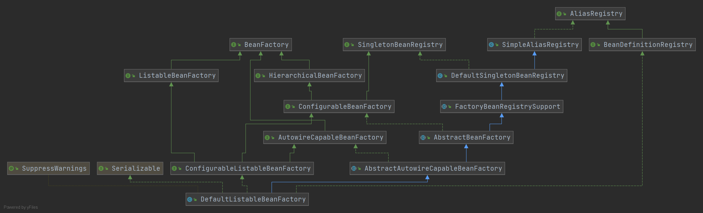
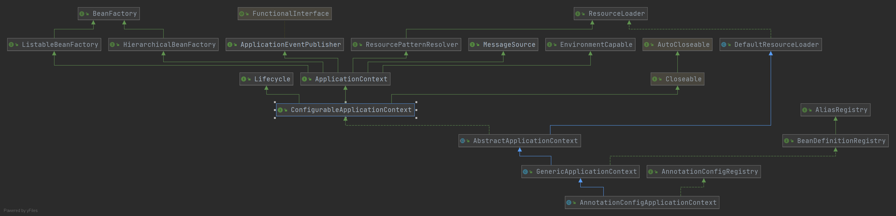
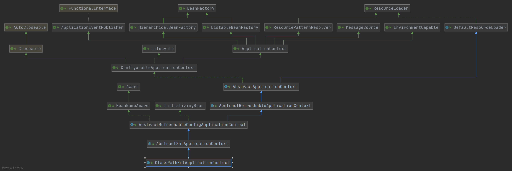

### BeanDefinition


BeanDefinition 表示 Bean 定义，BeanDefinition 中存在很多属性用来描述一个 Bean 的特点，比如：


- class，表示 Bean 类型
- scope，表示 Bean 作用域，单例或原型等
- lazyInit：表示 Bean 是否是懒加载
- initMethodName：表示 Bean 初始化要执行的方法
- destroyMethodName：表示 Bean 销毁时要执行的方法
- ......


在 Spring 中，我们经常会通过以下几种方式来定义 Bean：


1. XML 配置 Bean
2. @Bean
3. @Component（@Service，@Controller）


这些，我们可以称之为**声明式定义 Bean**


我们还可以**编程式定义 Bean**，那就是直接通过 BeanDefinition，比如：


```java
AnnotationConfigApplicationContext context = new AnnotationConfigApplicationContext(AppConfig.class);

// 生成一个BeanDefinition 对象，并设置beanClass为User.class，并注册到ApplicationContext中
AbstractBeanDefinition beanDefinition = BeanDefinitionBuilder.genericBeanDefinition().getBeanDefinition();
beanDefinition.setBeanClass(User.class);
context.registerBeanDefinition("user", beanDefinition);

System.out.println(context.getBean("user"));
```


我们还可以通过 BeanDefinition 设置一个 Bean 的其他属性


```java
// 设置作用域
beanDefinition.setScope("prototype");
// 设置初始化方法
beanDefinition.setInitMethodName("init");
// 设置懒加载
beanDefinition.setLazyInit(true);
```


和声明式、编程式事务类似，通过 <bean />，@Bean，@Component 等声明式方式所定义的 Bean，最终都会被 Spring 解析为对应的 BeanDefinition 对象，并放在 Spring 容器中


### BeanDefinitionReader


接着我们介绍几种在 Spring 源码中所提供的 BeanDefinition 读取器（BeanDefinitionReader），这些 BeanDefinitionReader 在我们使用 Spring 时用得少，但在 Spring 源码中用的多，相当于 Spring 源码的基础设施


#### AnnotatedBeanDefinitionReader


可以直接把某个类转换为 BeanDefinition，并且会解析该类上的注解，比如


```java
AnnotationConfigApplicationContext context = new AnnotationConfigApplicationContext(AppConfig.class);

AnnotatedBeanDefinitionReader annotatedBeanDefinitionReader = new AnnotatedBeanDefinitionReader(context);

// 将User.class解析为BeanDefinition
annotatedBeanDefinitionReader.register(User.class);

System.out.println(context.getBean("user"));
```


它能解析的注解是：@Conditional、@Scope、@Lazy、@Primary、@DependsOn、@Role、@Description


#### XMLBeanDefinitionReader


可以解析 <bean /> 标签


```java
AnnotationConfigApplicationContext context = new AnnotationConfigApplicationContext(AppConfig.class);

XmlBeanDefinitionReader xmlBeanDefinitionReader = new XmlBeanDefinitionReader(context);
int i = xmlBeanDefinitionReader.loadBeanDefinitions("spring.xml");

System.out.println(context.getBean("user"));
```


#### ClassPathBeanDefinitionScanner


ClassPathBeanDefinitionScanner 是扫描器，但是它的作用和 BeanDefinitionReader 类似，可以进行扫描，扫描某个包路径，对扫描到的类进行解析，比如，扫描到的类上如果存在 @Component 注解，那么就会把这个类解析为一个 BeanDefinition，比如：


```java
AnnotationConfigApplicationContext context = new AnnotationConfigApplicationContext();
context.refresh();

ClassPathBeanDefinitionScanner scanner = new ClassPathBeanDefinitionScanner(context);
scanner.scan("com.test");

System.out.println(context.getBean("userService"));
```


### BeanFactory


BeanFactory 表示 Bean 工厂，所以，BeanFactory 会负责创建 Bean，并且提供获取 Bean 的 API


而 ApplicationContext 是 BeanFactory 的一种，在 Spring 源码中，是这么定义的：


```java
public interface ApplicationContext extends EnvironmentCapable, ListableBeanFactory, HierarchicalBeanFactory,
      MessageSource, ApplicationEventPublisher, ResourcePatternResolver {
          
          ...
}
```


首先，在 Java 中，接口是可以**多继承**的，我们发现 ApplicationContext 继承了 ListableBeanFactory 和 HierarchicalBeanFactory，而 ListableBeanFactory 和 HierarchicalBeanFactory 都继承至 BeanFactory，所以我们可以认为 ApplicationContext 继承了 BeanFactory，相当于苹果继承了水果，宝马继承汽车一样，ApplicationContext 也是 BeanFactory 的一种，拥有 BeanFactory 支持的所有功能，不过 ApplicationContext 比 BeanFactory 更加强大，因为 ApplicationContext 还继承了其他接口，拥有其他功能


在 Spring 的源码实现中，当我们 new 一个 ApplicationContext 时，其底层会 new 一个 BeanFactory 出来，当使用 ApplicationContext 的某些方法时，比如 getBean()，底层调用的是 BeanFactory 的 getBean() 方法


在 Spring 源码中，BeanFactory 接口存在一个非常重要的实现类：**DefaultListableBeanFactory，也是非常核心的**。所以，我们可以直接来使用 DefaultListableBeanFactory，而不用使用 ApplicationContext 的某个实现类，比如


```java
DefaultListableBeanFactory beanFactory = new DefaultListableBeanFactory();

AbstractBeanDefinition beanDefinition = BeanDefinitionBuilder.genericBeanDefinition().getBeanDefinition();
beanDefinition.setBeanClass(User.class);

beanFactory.registerBeanDefinition("user", beanDefinition);

System.out.println(beanFactory.getBean("user"));
```


DefaultListableBeanFactory 是非常强大的，支持很多功能，可以通过查看 DefaultListableBeanFactory 的类继承实现结构来看





它实现了很多接口，表示它拥有很多功能：


1. AliasRegistry：支持别名功能，一个名字可以对应多个别名
2. BeanDefinitionRegistry：可以注册、保存、移除、获取某个 BeanDefinition
3. BeanFactory：Bean 工厂，可以根据某个 bean 的名字、或类型、或别名获取某个 Bean 对象
4. SingletonBeanRegistry：可以直接注册、获取某个**单例** Bean
5. SimpleAliasRegistry：它是一个类，实现了 AliasRegistry 接口中所定义的功能，支持别名功能
6. ListableBeanFactory：在 BeanFactory 的基础上，增加了其他功能，可以获取所有 BeanDefinition 的 beanNames，可以根据某个类型获取对应的 beanNames，可以根据某个类型获取 {类型 : 对应的 Bean} 的映射关系
7. HierarchicalBeanFactory：在 BeanFactory 的基础上，添加了获取父 BeanFactory 的功能
8. DefaultSingletonBeanRegistry：它是一个类，实现了 SingletonBeanRegistry 接口，拥有了直接注册、获取某个**单例** Bean 的功能
9. ConfigurableBeanFactory：在 HierarchicalBeanFactory 和 SingletonBeanRegistry 的基础上，添加了设置父 BeanFactory、类加载器（表示可以指定某个类加载器进行类的加载）、设置 Spring EL 表达式解析器（表示改 BeanFactory 可以解析 EL 表达式）、设置类型转化服务（表示该 BeanFactory 可以进行类型转化）、可以添加 BeanPostProcessor（表示改 BeanFactory 支持 Bean 的后置处理器），可以合并 BeanDefinition，可以销毁某个 Bean 等等功能
10. FactoryBeanRegistrySupport：支持了 FactoryBean 的功能
11. AutowireCapableBeanFactory：是直接继承了 BeanFactory，在 BeanFactory 的基础上，支持在创建 Bean 的过程中能对 Bean 进行自动装配
12. AbstractBeanFactory：实现了 ConfigurableBeanFactory 接口，继承了 FactoryBeanRegistrySupport，这个 BeanFactory 的功能已经很全面了，但是不能自动装配和获取 beanNames
13. ConfigurableListableBeanFactory：继承了 ListableBeanFactory、AutowireCapableBeanFactory、ConfigurableBeanFactory
14. AbstractAutowireCapableBeanFactory：继承了 AbstractBeanFactory，实现了 AutowireCapableBeanFactory，拥有了自动装配的功能
15. DefaultListableBeanFactory：继承了 AbstractAutowireCapableBeanFactory，实现了 ConfigurableListableBeanFactory 接口和 BeanDefinitionRegistry 接口，所以 DEfaultListableBeanFactory 的功能很强大


### ApplicationContext


ApplicationContext 是一个接口，实际上也是一个 BeanFactory，不过比 BeanFactory 更加强大，比如：


1. HierarchicalBeanFactory：拥有获取父 BeanFactory 的功能
2. ListableBeanFactory：拥有获取 beanNames 的功能
3. ResourcePatternResolver：资源加载器，可以一次性获取多个资源（文件资源等）
4. EnvironmentCapable：可以获取运行时环境（没有设置运行时环境功能）
5. ApplicationEventPublisher：拥有广播事件的功能（没有添加事件监听器的功能）
6. MessageSource：拥有国际化功能


我们先看看 ApplicationContext 两个比较重要的实现类：AnnotationConfigApplicationContext、ClassPathXMLApplicationContext


#### AnnotationConfigApplicationContext





1. ConfigurableApplicationContext：继承了 ApplicationContext 接口，增加了，添加事件监听器、添加 BeanFactoryPostProcessor、设置 Environment、获取 ConfigurableListableBeanFactory 等功能
2. AbstractApplicationContext：实现了 ConfigurableApplicationContext 接口
3. GenericApplicationContext：继承了 AbstractApplicationContext，实现了 BeanDefinitionRegistry 接口，拥有了所有 ApplicationContext 的功能，并且可以注册 BeanDefinition
4. AnnotationConfigRegistry：可以单独注册为某个类为 BeanDefinition（可以处理该类上的 **@Configuration** 注解，已经可以处理 **@Bean** 注解），同时可以扫描
5. AnnotationConfigApplicationContext：继承了 GenericApplicationContext，实现了 AnnotationConfigRegistry 接口，拥有了以上所有的功能


#### ClassPathXMLApplicationContext





它也是继承了 AbstractApplicationContext，但是相对于 AnnotationConfigApplicationContext 而言，功能没有 AnnotationConfigApplicationContext 强大，比如不能注册 BeanDefinition


#### 资源加载


ApplicationContext 还拥有资源加载的功能，比如，可以直接利用 ApplicationContext 获取某个文件的内容：


```java
AnnotationConfigApplicationContext context = new
AnnotationConfigApplicationContext(AppConfig.class);

Resource resource = context.getResource("file://D:\\IdeaProjects\\spring‐
framework\\luban\\src\\main\\java\\com\\luban\\entity\\User.java");
System.out.println(resource.contentLength());
```


你还可以：


```java
AnnotationConfigApplicationContext context = new
AnnotationConfigApplicationContext(AppConfig.class);

Resource resource = context.getResource("file://D:\\IdeaProjects\\spring‐framework‐
5.3.10\\tuling\\src\\main\\java\\com\\zhouyu\\service\\UserService.java");
System.out.println(resource.contentLength());
System.out.println(resource.getFilename());

Resource resource1 = context.getResource("https://www.baidu.com");
System.out.println(resource1.contentLength());
System.out.println(resource1.getURL());

Resource resource2 = context.getResource("classpath:spring.xml");
System.out.println(resource2.contentLength());
System.out.println(resource2.getURL());
```


还可以一次性获取多个：


```java
Resource[] resources = context.getResources("classpath:com/zhouyu/*.class");
for (Resource resource : resources) {
	System.out.println(resource.contentLength());
	System.out.println(resource.getFilename());
}
```


#### 获取运行时环境


```java
AnnotationConfigApplicationContext context = new
      AnnotationConfigApplicationContext(AppConfig.class);

Map<String, Object> systemEnvironment = context.getEnvironment().getSystemEnvironment();
System.out.println(systemEnvironment);

System.out.println("=======");

Map<String, Object> systemProperties = context.getEnvironment().getSystemProperties();
System.out.println(systemProperties);

System.out.println("=======");

MutablePropertySources propertySources = context.getEnvironment().getPropertySources();
System.out.println(propertySources);

System.out.println("=======");

System.out.println(context.getEnvironment().getProperty("NO_PROXY"));
System.out.println(context.getEnvironment().getProperty("sun.jnu.encoding"));
System.out.println(context.getEnvironment().getProperty("luban"));
```


注意，可以利用 `@PropertySource("classpath:spring.properties")` 来使得某个 properties 文件中的参数添加到运行时环境中


### 类型转化


在 Spring 源码中，有可能需要把 String 转换成其他类型，所以在 Spring 源码中提供了 一些技术来更方便的做对象的类型转换


#### PropertyEditor


这其实是 JDK 中提供的类型转化工具类


```java
public class StringToUserPropertyEditor extends PropertyEditorSupport implements PropertyEditor {

   @Override
   public void setAsText(String text) throws IllegalArgumentException {
      User user = new User();
      user.setName(text);
      this.setValue(user);
   }
}
```


```java
StringToUserPropertyEditor propertyEditor = new StringToUserPropertyEditor();
propertyEditor.setAsText("1");
User value = (User) propertyEditor.getValue();
System.out.println(value);
```


如何向 Spring 中注册 PropertyEditor：


```java
@Bean
public CustomEditorConfigurer customEditorConfigurer() {
   CustomEditorConfigurer customEditorConfigurer = new CustomEditorConfigurer();
   Map<Class<?>, Class<? extends PropertyEditor>> propertyEditorMap = new HashMap<>();

   // 表示StringToUserPropertyEditor可以将String转化为User类型，在Spring源码中，如果发现当前
   // 对象是String，而需要的类型是User，就会使用该PropertyEditor来做类型转化
   propertyEditorMap.put(User.class, StringToUserPropertyEditor.class);
   customEditorConfigurer.setCustomEditors(propertyEditorMap);
   return customEditorConfigurer;
}
```


假设现在有如下 Bean：


```java
@Component
public class UserService {

   @Value("123")
   private User user;

   public void test() {
      System.out.println(user.getName());
   }

}
```


那么 test 属性就能正常地完成赋值


#### ConversionService


Spring 中提供的类型转化服务，它比 PropertyEditor 更强大


```java
public class StringToUserConvert implements ConditionalGenericConverter {
   @Override
   public boolean matches(TypeDescriptor sourceType, TypeDescriptor targetType) {
      return sourceType.getType().equals(String.class) && targetType.getType().equals(User.class);
   }

   @Override
   public Set<ConvertiblePair> getConvertibleTypes() {
      return Collections.singleton(new ConvertiblePair(String.class, User.class));
   }

   @Override
   public Object convert(Object source, TypeDescriptor sourceType, TypeDescriptor targetType) {
      User user = new User();
      user.setName((String) source);
      return user;
   }
}
```


```java
DefaultConversionService conversionService = new DefaultConversionService();
conversionService.addConverter(new StringToUserConvert());
User valut = conversionService.convert("12", User.class);
System.out.println(valut.getName());
```


如何向 Spring 中注册 ConversionService


```java
@Bean
public ConversionServiceFactoryBean conversionService() {
   ConversionServiceFactoryBean conversionServiceFactoryBean = new ConversionServiceFactoryBean();
   conversionServiceFactoryBean.setConverters(Collections.singleton(new StringToUserConvert()));

   return conversionServiceFactoryBean;
}
```


#### TypeConverter


整合了 PropertyEditor 和 ConversionService 的功能，是 Spring 内部用的


```java
SimpleTypeConverter typeConverter = new SimpleTypeConverter();
typeConverter.registerCustomEditor(User.class, new StringToUserPropertyEditor());
// typeConverter.setConversionService(conversionService);
User value = typeConverter.convertIfNecessary("1", User.class);
System.out.println(value.getName());
```


### BeanPostProcessor


BeanPostProcessor 表示 Bean 的后置处理器，我们可以定义一个或多个 BeanPostProcessor，比如通过一点代码定义一个 BeanPostProcessor


```java
@Component
public class TestPostProcessor implements BeanPostProcessor {

   @Override
   public Object postProcessBeforeInitialization(Object bean, String beanName) throws BeansException {
      if("userService".equals(beanName)) {
         System.out.println("初始化前");
      }

      return bean;
   }

   @Override
   public Object postProcessAfterInitialization(Object bean, String beanName) throws BeansException {
      if("userService".equals(beanName)) {
         System.out.println("初始化后");
      }

      return bean;
   }
}
```


一个 BeanPostProcessor 可以在任意一个 Bean 的初始化之前和初始化之后去额外的做一些用户自定义的逻辑。当然，我们可以通过判断 beanName 来进行针对性处理（针对某个 bean，或某部分 Bean）


我们可以通过定义 BeanPostProcessor 来干涉 Spring 创建 Bean 的过程


### BeanFactoryPostProcessor


BeanFactoryPostProcessor 表示 Bean 工厂的后置处理器，其实和 BeanPostProcessor 类似，BeanPostProcessor 是干涉 Bean 的创建过程，BeanFactoryPostProcessor 是干涉 BeanFactory 的创建过程。比如，我们可以这样定义一个 BeanFactoryPostProcessor：


```java
@Component
public class TestBeanFactoryPostProcessor implements BeanFactoryPostProcessor {
   @Override
   public void postProcessBeanFactory(ConfigurableListableBeanFactory beanFactory) throws BeansException {
      System.out.println("加工BeanFactory");
   }
}
```


我们可以在 postProcessBeanFactory() 方法中对 BeanFactory 进行加工


### FactoryBean


上面提到，可以通过 BeanPostProcessor 来干涉 Spring 创建 Bean 的过程，但是如果我们想一个 Bean 完全由我们来创造，也是可以的，比如通过 FactoryBean


```java
@Component
public class TestFactoryBean implements FactoryBean<Object> {
   @Override
   public Object getObject() throws Exception {
      UserService userService = new UserService();

      return userService;
   }

   @Override
   public Class<?> getObjectType() {
      return UserService.class;
   }
}
```


通过上面的代码，我们创建了一个 UserService 对象，并且它将成为 Bean。但是通过这种方式创建出来的 UserService 的 Bean，**只会经历初始化后**，其他 Spring 的生命周期步骤是不会经过的，比如依赖注入


通过 Bean 也可以自己生成一个对象作为 Bean，那么和 FactoryBean 的区别是什么呢？区别很明显，@Bean 定义的 Bean 是会经过完整的 Bean 生命周期的


### ExcludeFilter 和 InCludeFilter


这两个 Filter 是 Spring 扫描过程中用来过滤的。ExcludeFilter 表示**排除过滤器**，IncludeFilter 表示**包含过滤器**


比如下面的配置，表示扫描 com.test.app 这个包下面的所有类，但是排除 UserService 类，也就是就算它上面有 @Component 注解也不会成为 Bean 


```java
@ComponentScan(value = "com.test.app",
      excludeFilters = {@ComponentScan.Filter(
            type = FilterType.ASSIGNABLE_TYPE,
            classes = UserService.class
      )})
public class AppConfig {
}
```


再比如下面的配置，就算 UserService 类上没有 @Component 注解，它也会被扫描成一个 Bean


```java
@ComponentScan(value = "com.test.app",
      includeFilters = {@ComponentScan.Filter(
            type = FilterType.ASSIGNABLE_TYPE,
            classes = UserService.class
      )})
public class AppConfig {
}
```


FilterType 分为：


1. ANNOTATION：表示是否包含某个注解
2. ASSIGNABLE_TYPE：表示是否是某个类
3. ASPECTJ：表示是否是符合某个 Aspectj 表达式
4. REGEX：表示是否符合某个正则表达式
5. CUSTOM：自定义


在 Spring 的扫描逻辑中，默认会添加一个 AnnotationTypeFilter 给 includeFilters，表示默认情况下 Spring 扫描过程中会认为类上有 @Component 注解的就是 Bean


### MetadataReader、ClassMetadata、AnnotationMetadata


在 Spring 中需要去解析类的信息，比如类名、类中的方法、类上的注解，这些都可以称为类的元数据，所以 Spring 中对类的元数据做了抽象，并提供了一些工具类


MetadataReader 表示类的元数据读取器，默认实现类为 SimpleMetadataReader，比如：


```java
public static void main(String[] args) throws IOException {

   SimpleMetadataReaderFactory simpleMetadataReaderFactory = new SimpleMetadataReaderFactory();

   // 构造一个MetadataReader
   MetadataReader metadataReader = simpleMetadataReaderFactory.getMetadataReader("com.luban.app.UserService");

   // 得到一个ClassMetadata，并获取了类名
   ClassMetadata classMetadata = metadataReader.getClassMetadata();

   System.out.println(classMetadata.getClassName());

   // 获取annotationMetadata，并获取类上的注解信息
   AnnotationMetadata annotationMetadata = metadataReader.getAnnotationMetadata();
   for (String annotationType : annotationMetadata.getAnnotationTypes()) {
      System.out.println(annotationType);
   }
}
```


需要注意的是，SimpleMetadataReader 去解析类时，使用的 ASM 技术


为什么要使用 ASM 技术，Spring 启动的时候需要去扫描，如果指定的包路径比较宽泛，那么扫描的类是非常多的，那如果在 Spring 启动时就把这些类全部加载进 JVM 了，这样不好，所以使用了 ASM 技术